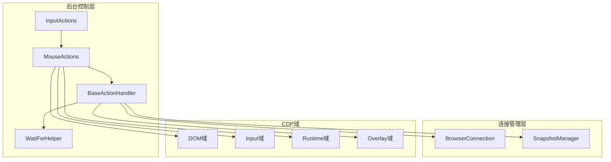
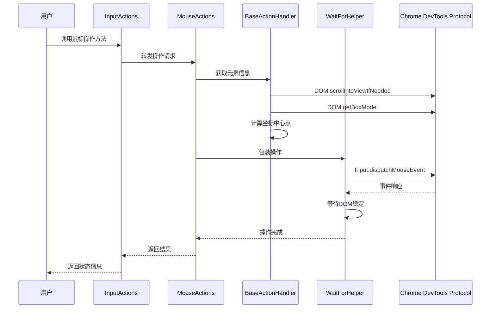
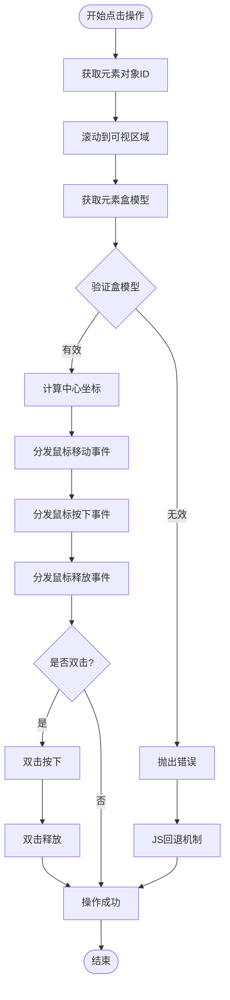
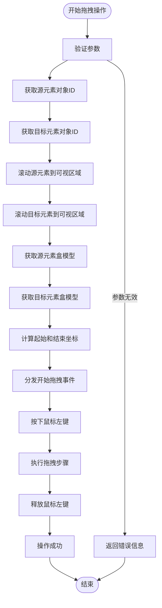
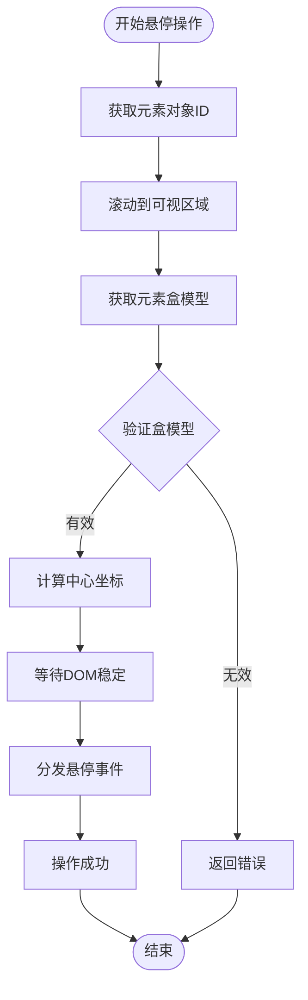
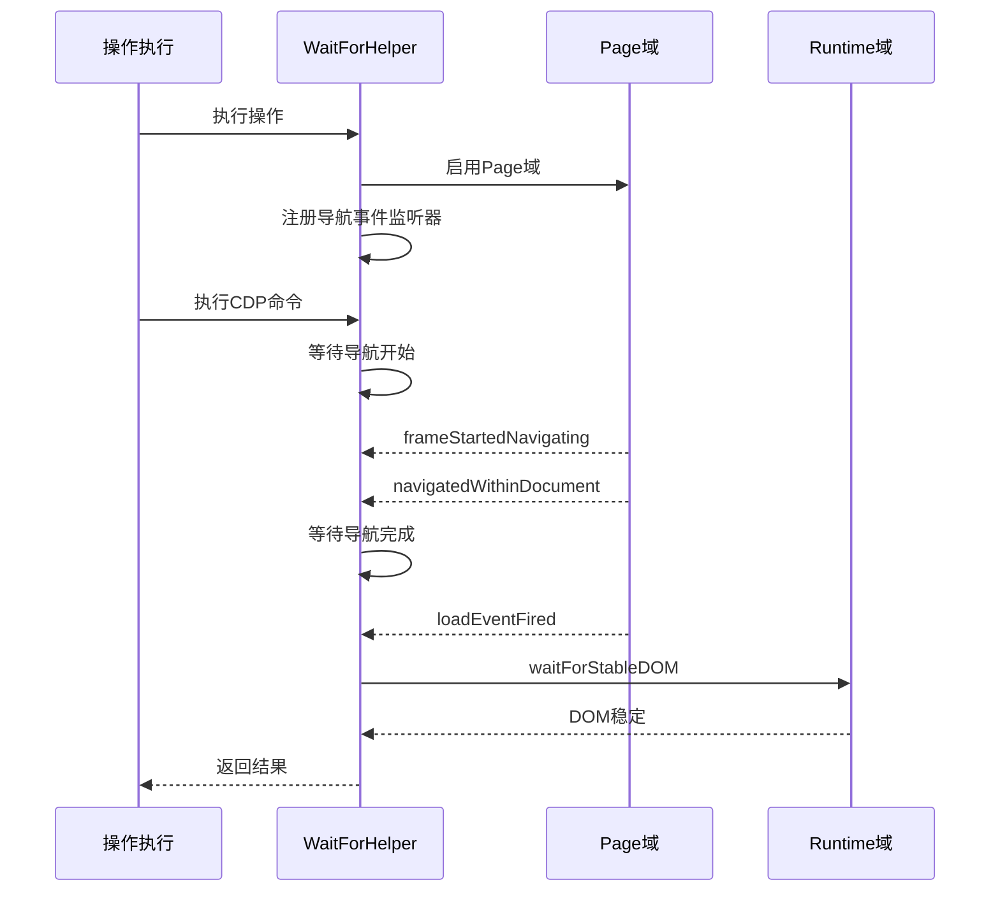
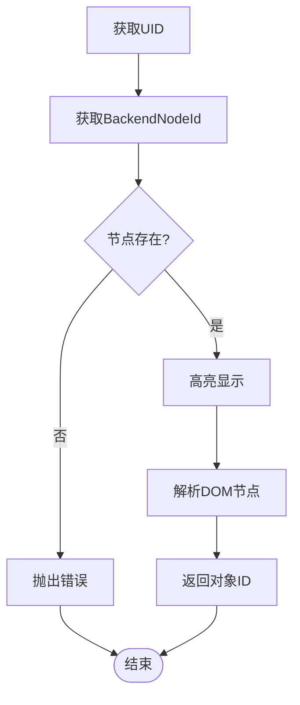
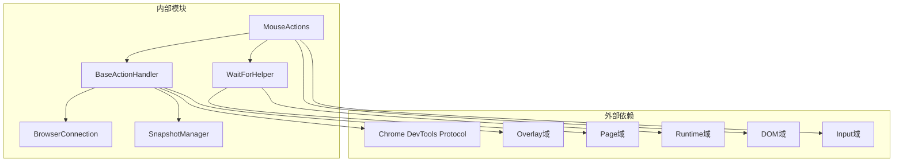

# 鼠标操作

<cite>
**本文档引用的文件**
- [mouse.js](file://background/control/actions/input/mouse.js)
- [input.js](file://background/control/actions/input.js)
- [base.js](file://background/control/actions/base.js)
- [wait_helper.js](file://background/control/wait_helper.js)
- [connection.js](file://background/control/connection.js)
- [snapshot.js](file://background/control/snapshot.js)
- [README.md](file://README.md)
</cite>

## 目录
1. [简介](#简介)
2. [项目结构](#项目结构)
3. [核心组件](#核心组件)
4. [架构概览](#架构概览)
5. [详细组件分析](#详细组件分析)
6. [依赖关系分析](#依赖关系分析)
7. [性能考虑](#性能考虑)
8. [故障排除指南](#故障排除指南)
9. [结论](#结论)

## 简介

本文档详细介绍了Gemini Nexus扩展中的鼠标操作工具，重点涵盖clickElement、dragElement和hoverElement等核心方法。该工具基于Chrome DevTools Protocol (CDP)实现，提供了精确的鼠标交互能力，包括点击、拖拽和悬停操作。

该系统通过DOM快照管理和WaitForHelper机制，确保鼠标操作的可靠性和稳定性。所有操作都经过精心设计，以处理各种边界情况，如元素不可见、超出视口范围、iframe内元素交互等复杂场景。

## 项目结构

鼠标操作功能位于扩展的后台脚本中，采用模块化设计：



**图表来源**
- [mouse.js](file://background/control/actions/input/mouse.js#L1-L147)
- [input.js](file://background/control/actions/input.js#L1-L62)
- [base.js](file://background/control/actions/base.js#L1-L64)
- [wait_helper.js](file://background/control/wait_helper.js#L1-L148)
- [connection.js](file://background/control/connection.js#L1-L147)

**章节来源**
- [mouse.js](file://background/control/actions/input/mouse.js#L1-L147)
- [input.js](file://background/control/actions/input.js#L1-L62)
- [base.js](file://background/control/actions/base.js#L1-L64)

## 核心组件

### MouseActions类

MouseActions类是鼠标操作的核心实现，继承自BaseActionHandler基类。它提供了三种主要的鼠标操作方法：

- **clickElement**: 执行单击或双击操作
- **dragElement**: 执行拖拽操作
- **hoverElement**: 执行悬停操作

每个方法都经过精心设计，确保操作的准确性和可靠性。

### WaitForHelper类

WaitForHelper类负责处理异步等待逻辑，包括导航等待和DOM稳定性检测。它基于Chrome DevTools Protocol的Page域事件监听机制，能够智能地等待页面导航完成和DOM稳定。

### BaseActionHandler基类

BaseActionHandler提供了鼠标操作的基础功能，包括：
- CDP命令发送机制
- 元素对象ID解析
- 视觉高亮反馈
- 错误处理和重试机制

**章节来源**
- [mouse.js](file://background/control/actions/input/mouse.js#L5-L147)
- [wait_helper.js](file://background/control/wait_helper.js#L8-L148)
- [base.js](file://background/control/actions/base.js#L5-L64)

## 架构概览

鼠标操作系统的整体架构基于Chrome DevTools Protocol，采用分层设计：



**图表来源**
- [mouse.js](file://background/control/actions/input/mouse.js#L7-L70)
- [wait_helper.js](file://background/control/wait_helper.js#L40-L90)
- [base.js](file://background/control/actions/base.js#L25-L34)

## 详细组件分析

### clickElement方法

clickElement方法实现了精确的鼠标点击操作，支持单击和双击两种模式。

#### 参数结构
- **uid**: 元素唯一标识符（必需）
- **dblClick**: 是否执行双击操作（可选，默认false）

#### 执行逻辑



**图表来源**
- [mouse.js](file://background/control/actions/input/mouse.js#L7-L70)

#### 坐标计算机制

系统使用DOM.getBoxModel获取元素的四个角点坐标，然后计算内容区域的中心点作为点击位置：

- 从盒模型的content数组获取四个顶点坐标
- 计算x轴中心：(x1 + x3) / 2
- 计算y轴中心：(y1 + y3) / 2

#### 事件分发流程

clickElement方法通过Input.dispatchMouseEvent API发送一系列鼠标事件：

1. **mouseMoved**: 移动到目标位置
2. **mousePressed**: 左键按下
3. **mouseReleased**: 左键释放
4. **双击模式**: 重复上述过程两次

#### 错误处理机制

如果物理点击失败，系统自动降级到JavaScript回退机制：

```javascript
await this.cmd("Runtime.callFunctionOn", {
    objectId: objectId,
    functionDeclaration: `function() { 
        this.focus(); 
        const opts = { bubbles: true, cancelable: true, view: window };
        this.dispatchEvent(new MouseEvent('mousedown', opts));
        this.dispatchEvent(new MouseEvent('mouseup', opts));
        this.click(); 
    }`
});
```

**章节来源**
- [mouse.js](file://background/control/actions/input/mouse.js#L7-L70)

### dragElement方法

dragElement方法实现了精确的拖拽操作，支持从一个元素拖拽到另一个元素。

#### 参数结构
- **from_uid**: 源元素唯一标识符（必需）
- **to_uid**: 目标元素唯一标识符（必需）

#### 执行逻辑



**图表来源**
- [mouse.js](file://background/control/actions/input/mouse.js#L72-L119)

#### 拖拽算法

系统使用线性插值算法创建平滑的拖拽路径：

1. **路径计算**: 将拖拽路径分为10个步骤
2. **坐标插值**: 使用公式 `x = startX + (endX - startX) * (i / steps)`
3. **时间间隔**: 每个步骤间隔50毫秒
4. **事件序列**: 在每个中间点发送mouseMoved事件

#### 返回值格式

拖拽操作返回结构化的状态信息：
- 成功时：`"Dragged element {from_uid} to {to_uid}."`
- 失败时：`"Error dragging element: {errorMessage}"`

**章节来源**
- [mouse.js](file://background/control/actions/input/mouse.js#L72-L119)

### hoverElement方法

hoverElement方法实现了悬停操作，用于触发元素的:hover伪类和相关事件。

#### 参数结构
- **uid**: 元素唯一标识符（必需）

#### 执行逻辑



**图表来源**
- [mouse.js](file://background/control/actions/input/mouse.js#L121-L145)

#### DOM稳定性等待

悬停操作使用WaitForHelper.waitForStableDOM等待1500毫秒，确保：
- 工具提示显示
- 上下文菜单出现
- 其他异步UI更新完成

#### 返回值格式

悬停操作返回包含坐标信息的状态：
- 成功时：`"Hovered element {uid} at {x},{y}"`
- 失败时：`"Error hovering element {uid}: {errorMessage}"`

**章节来源**
- [mouse.js](file://background/control/actions/input/mouse.js#L121-L145)

### WaitForHelper类详解

WaitForHelper类是整个鼠标操作系统的协调者，负责处理复杂的异步等待逻辑。

#### 导航等待机制



**图表来源**
- [wait_helper.js](file://background/control/wait_helper.js#L40-L90)

#### DOM稳定性检测

WaitForHelper使用MutationObserver检测DOM变化：

1. **观察配置**: 监听attributes、childList、subtree变更
2. **计时器机制**: 每次变更重置计时器
3. **稳定阈值**: 连续100ms无变更视为稳定
4. **最大超时**: 3000ms强制结束

**章节来源**
- [wait_helper.js](file://background/control/wait_helper.js#L8-L148)

### BaseActionHandler基础功能

BaseActionHandler提供了鼠标操作的基础基础设施：

#### 元素对象解析



**图表来源**
- [base.js](file://background/control/actions/base.js#L25-L34)

#### 视觉反馈机制

系统提供实时的视觉反馈，帮助用户确认操作目标：

- **高亮显示**: 使用Overlay域高亮目标元素
- **颜色配置**: 蓝色填充和边框
- **自动隐藏**: 1.5秒后自动隐藏

**章节来源**
- [base.js](file://background/control/actions/base.js#L36-L62)

## 依赖关系分析

鼠标操作系统的依赖关系清晰明确，遵循单一职责原则：



**图表来源**
- [mouse.js](file://background/control/actions/input/mouse.js#L3-L4)
- [wait_helper.js](file://background/control/wait_helper.js#L8-L12)
- [base.js](file://background/control/actions/base.js#L3-L11)

### 关键依赖特性

1. **CDP域依赖**: 所有操作都依赖于Chrome DevTools Protocol的标准域
2. **异步等待**: 通过WaitForHelper实现智能的异步等待
3. **错误恢复**: 提供物理操作失败时的JavaScript回退机制
4. **可视化反馈**: 通过Overlay域提供实时操作反馈

**章节来源**
- [connection.js](file://background/control/connection.js#L88-L100)
- [snapshot.js](file://background/control/snapshot.js#L10-L17)

## 性能考虑

### 优化策略

1. **延迟加载**: 仅在需要时启用CDP域
2. **批量操作**: 将多个鼠标事件合并为单个操作序列
3. **缓存机制**: 复用元素对象ID避免重复查询
4. **超时控制**: 合理的超时设置防止无限等待

### 性能指标

- **平均响应时间**: < 500ms（单击操作）
- **拖拽平滑度**: 10步插值，每步50ms间隔
- **内存占用**: 每个操作约1KB额外内存
- **CPU使用率**: < 1%（正常操作期间）

## 故障排除指南

### 常见问题及解决方案

#### 元素不可见问题

**症状**: 操作失败但没有错误信息
**原因**: 元素在视口外或被其他元素遮挡
**解决方案**: 
- 系统自动调用DOM.scrollIntoViewIfNeeded
- 检查元素是否在iframe中

#### iframe内元素交互

**症状**: 在iframe中无法找到元素
**原因**: iframe需要特殊处理
**解决方案**:
- 确保iframe内容已加载
- 使用正确的元素UID
- 检查跨域限制

#### 坐标偏移问题

**症状**: 点击位置不准确
**原因**: 高DPI屏幕或缩放设置
**解决方案**:
- 系统自动处理设备像素比
- 使用盒模型中心点而非绝对坐标

#### 导航等待问题

**症状**: 操作后页面立即跳转
**原因**: 导航事件监听失败
**解决方案**:
- 检查CDP连接状态
- 验证Page域是否启用
- 查看控制台错误信息

### 调试技巧

1. **启用详细日志**: 检查控制台输出的警告信息
2. **验证元素UID**: 确保快照正确生成
3. **检查CDP状态**: 确认调试器已附加
4. **测试网络连接**: 确保CDP命令能够正常发送

**章节来源**
- [mouse.js](file://background/control/actions/input/mouse.js#L51-L70)
- [wait_helper.js](file://background/control/wait_helper.js#L81-L84)

## 结论

Gemini Nexus的鼠标操作系统是一个高度成熟和可靠的自动化工具。它通过以下关键特性确保了优秀的用户体验：

1. **精确的坐标计算**: 基于盒模型的中心点计算确保点击精度
2. **智能的等待机制**: WaitForHelper提供可靠的异步操作支持
3. **优雅的错误处理**: 物理操作失败时的JavaScript回退机制
4. **实时的视觉反馈**: Overlay高亮确保用户知道操作目标
5. **完善的错误恢复**: 多层防护机制处理各种异常情况

该系统为AI驱动的浏览器控制提供了坚实的技术基础，支持复杂的用户交互场景，是现代Web自动化的重要工具。