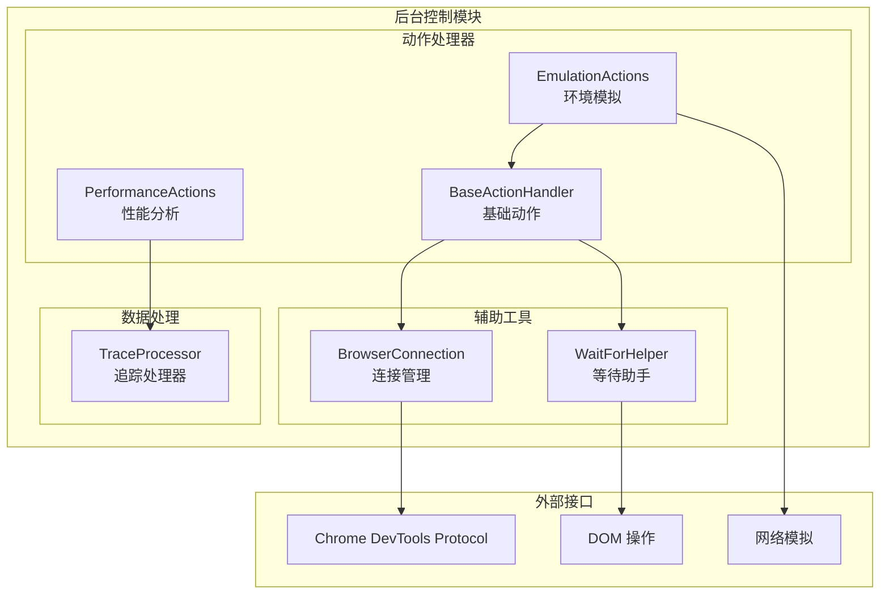
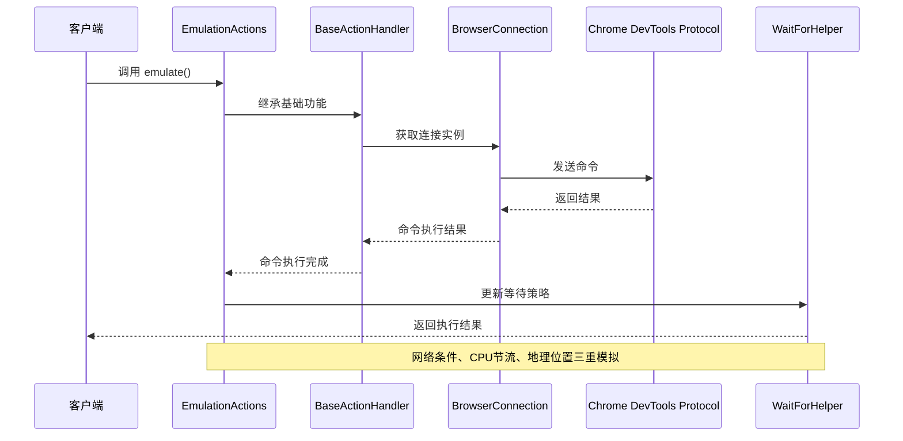
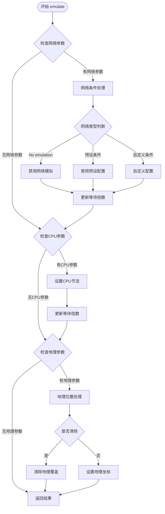
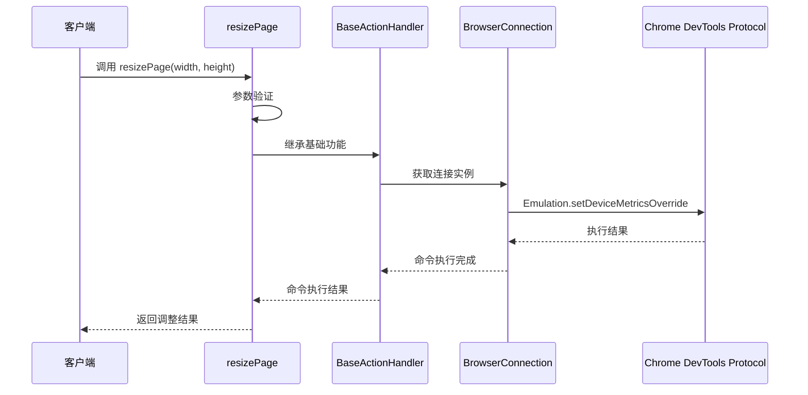
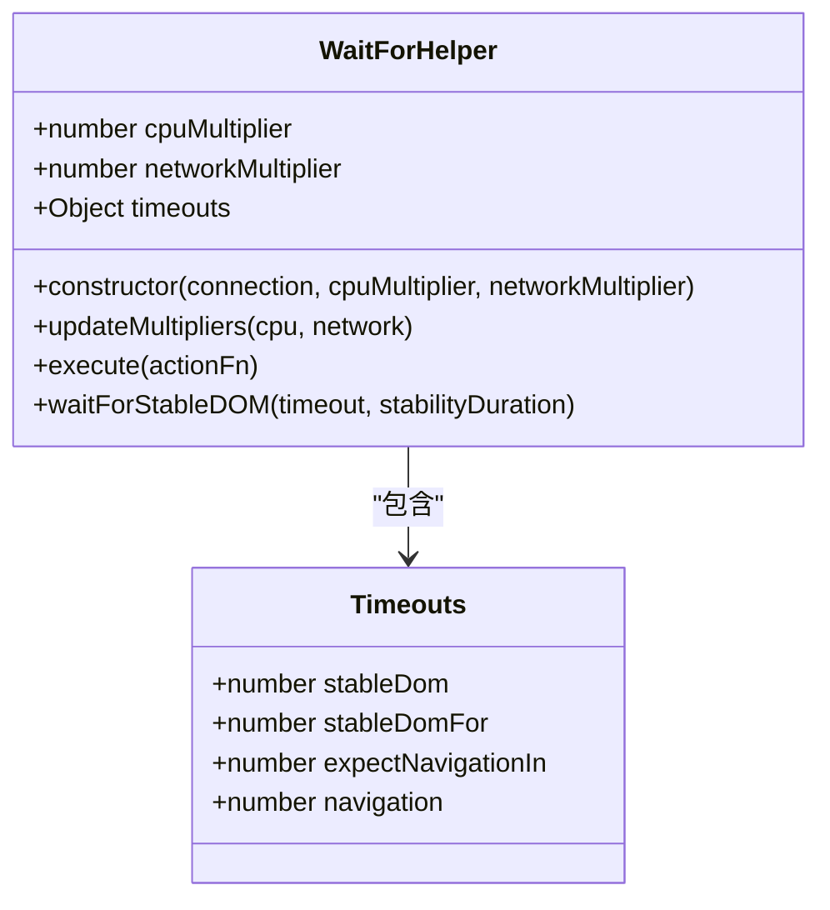
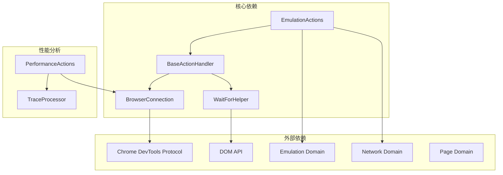

# 环境模拟工具

<cite>
**本文档引用的文件**
- [background/control/actions/emulation.js](file://background/control/actions/emulation.js)
- [background/control/wait_helper.js](file://background/control/wait_helper.js)
- [background/control/actions/base.js](file://background/control/actions/base.js)
- [background/control/connection.js](file://background/control/connection.js)
- [background/control/actions/performance.js](file://background/control/actions/performance.js)
- [background/lib/trace_processor.js](file://background/lib/trace_processor.js)
- [README.md](file://README.md)
</cite>

## 目录
1. [简介](#简介)
2. [项目结构](#项目结构)
3. [核心组件](#核心组件)
4. [架构概览](#架构概览)
5. [详细组件分析](#详细组件分析)
6. [依赖关系分析](#依赖关系分析)
7. [性能考量](#性能考量)
8. [故障排除指南](#故障排除指南)
9. [结论](#结论)
10. [附录](#附录)

## 简介

环境模拟工具是 Gemini Nexus Chrome 扩展中的一个关键调试功能模块，主要负责在网络条件模拟、CPU 节流和地理位置覆盖等方面为用户提供全面的浏览器环境模拟能力。该工具通过 Chrome DevTools Protocol (CDP) 实现对浏览器底层行为的精确控制，为性能测试、用户体验评估和跨设备兼容性验证提供了强大的技术支持。

本工具特别强调了两个核心 API：`emulate` 和 `resizePage`，它们分别实现了复杂的网络条件模拟和视口尺寸调整功能。通过这些功能，开发者可以在受控环境中重现各种真实世界的网络和设备条件，从而更好地评估应用在不同环境下的表现。

## 项目结构

环境模拟工具位于扩展的后台控制模块中，采用模块化设计，与其他核心组件紧密集成：



**图表来源**
- [background/control/actions/emulation.js](file://background/control/actions/emulation.js#L1-L82)
- [background/control/wait_helper.js](file://background/control/wait_helper.js#L1-L148)
- [background/control/actions/base.js](file://background/control/actions/base.js#L1-L64)

**章节来源**
- [README.md](file://README.md#L50-L66)

## 核心组件

环境模拟工具由多个相互协作的组件构成，每个组件都有明确的职责分工：

### EmulationActions 类
这是环境模拟功能的核心类，继承自基础动作处理器，提供了完整的环境模拟能力。它支持三种主要的模拟类型：网络条件模拟、CPU 节流和地理位置覆盖。

### WaitForHelper 类  
负责协调异步操作的执行时机，确保在执行浏览器动作后能够正确等待导航完成和 DOM 稳定。它通过超时倍数机制来适应不同的模拟条件。

### BaseActionHandler 基类
为所有动作处理器提供通用功能，包括命令发送、节点对象解析和视觉高亮等基础能力。

**章节来源**
- [background/control/actions/emulation.js](file://background/control/actions/emulation.js#L13-L82)
- [background/control/wait_helper.js](file://background/control/wait_helper.js#L8-L34)
- [background/control/actions/base.js](file://background/control/actions/base.js#L5-L34)

## 架构概览

环境模拟工具的整体架构体现了清晰的关注点分离和模块化设计：



**图表来源**
- [background/control/actions/emulation.js](file://background/control/actions/emulation.js#L14-L65)
- [background/control/actions/base.js](file://background/control/actions/base.js#L14-L16)
- [background/control/connection.js](file://background/control/connection.js#L121-L132)

该架构的关键特点包括：

1. **分层设计**：从基础连接管理到具体功能实现的清晰层次
2. **事件驱动**：通过 CDP 事件实现异步通信和状态同步
3. **超时管理**：动态调整等待时间以适应不同的模拟条件
4. **错误处理**：完善的异常捕获和用户友好的错误信息

## 详细组件分析

### EmulationActions 类详解

#### NETWORK_CONDITIONS 预设配置

环境模拟工具内置了五种标准的网络条件预设，每种都经过精心设计以模拟真实的网络环境：

| 预设名称 | 下载带宽 | 上传带宽 | 延迟(ms) | 使用场景 |
|---------|---------|---------|---------|----------|
| Offline | 0 bps | 0 bps | 0 ms | 离线状态测试 |
| Slow 3G | ~500 Kbps | ~500 Kbps | 2000 ms | 低质量移动网络 |
| Fast 3G | ~1.6 Mbps | ~750 Kbps | 562.5 ms | 高质量移动网络 |
| Slow 4G | ~1.6 Mbps | ~750 Kbps | 375 ms | 4G网络边缘 |
| Fast 4G | ~1.6 Mbps | ~750 Kbps | 150 ms | 稳定高速网络 |

这些预设值基于实际网络测试数据，能够准确模拟不同网络环境下的用户体验。

#### emulate 方法实现流程



**图表来源**
- [background/control/actions/emulation.js](file://background/control/actions/emulation.js#L14-L65)

#### resizePage 方法实现

resizePage 方法专门用于调整浏览器视口尺寸，支持响应式布局测试和移动端适配验证：



**图表来源**
- [background/control/actions/emulation.js](file://background/control/actions/emulation.js#L67-L81)

#### 参数验证逻辑

环境模拟工具实现了严格的参数验证机制：

1. **网络条件验证**：检查预设名称的有效性
2. **CPU节流验证**：确保节流倍率至少为1
3. **地理位置验证**：验证经纬度数值的有效性
4. **视口尺寸验证**：确保宽度和高度参数存在且有效

**章节来源**
- [background/control/actions/emulation.js](file://background/control/actions/emulation.js#L5-L11)
- [background/control/actions/emulation.js](file://background/control/actions/emulation.js#L14-L81)

### WaitForHelper 类详解

WaitForHelper 类是环境模拟工具的协调中心，负责管理所有异步操作的执行时机：

#### 超时倍数机制



**图表来源**
- [background/control/wait_helper.js](file://background/control/wait_helper.js#L8-L34)

超时倍数机制根据当前的模拟条件动态调整等待时间：

- **CPU节流影响**：DOM稳定等待时间按CPU倍数线性增长
- **网络延迟影响**：导航完成等待时间按网络倍数线性增长
- **默认值**：初始倍数均为1，表示正常条件下的等待时间

#### 异步操作协调

WaitForHelper 通过监听 CDP 事件来协调复杂的异步操作：

1. **导航检测**：监听页面导航开始和完成事件
2. **DOM稳定性**：使用 MutationObserver 监测 DOM 变化
3. **超时管理**：防止无限期等待，确保系统稳定性

**章节来源**
- [background/control/wait_helper.js](file://background/control/wait_helper.js#L19-L34)
- [background/control/wait_helper.js](file://background/control/wait_helper.js#L40-L90)

### BaseActionHandler 基础功能

BaseActionHandler 为所有动作处理器提供通用的基础能力：

#### 命令执行机制


**图表来源**
- [background/control/actions/base.js](file://background/control/actions/base.js#L14-L16)

#### 节点对象管理

BaseActionHandler 提供了完整的 DOM 节点管理功能：

1. **节点解析**：通过快照管理器获取节点后端 ID
2. **对象获取**：使用 DOM.resolveNode 获取 JavaScript 对象
3. **视觉反馈**：通过 Overlay 高亮显示目标元素

**章节来源**
- [background/control/actions/base.js](file://background/control/actions/base.js#L25-L34)

## 依赖关系分析

环境模拟工具的依赖关系体现了清晰的模块化设计：



**图表来源**
- [background/control/actions/emulation.js](file://background/control/actions/emulation.js#L3)
- [background/control/actions/base.js](file://background/control/actions/base.js#L3)
- [background/control/connection.js](file://background/control/connection.js#L8)

### 关键依赖关系

1. **EmulationActions 依赖 BaseActionHandler**：继承基础功能和命令执行机制
2. **BaseActionHandler 依赖 BrowserConnection**：通过连接管理器发送 CDP 命令
3. **WaitForHelper 依赖 BrowserConnection**：监听 CDP 事件并协调异步操作
4. **PerformanceActions 依赖 TraceProcessor**：处理性能追踪数据

**章节来源**
- [background/control/actions/emulation.js](file://background/control/actions/emulation.js#L3)
- [background/control/actions/base.js](file://background/control/actions/base.js#L3)
- [background/control/connection.js](file://background/control/connection.js#L3)

## 性能考量

环境模拟工具在设计时充分考虑了性能影响和资源消耗：

### 网络条件模拟的性能影响

不同的网络条件对系统性能有不同的影响程度：

- **Offline 模式**：完全阻断网络请求，CPU 占用最低
- **Slow 3G**：显著增加页面加载时间，可能影响用户体验
- **Fast 3G**：适度影响页面性能，平衡测试效果和效率
- **4G 网络**：对性能影响最小，接近真实用户环境

### CPU 节流的性能权衡

CPU 节流通过降低浏览器执行速度来模拟低端设备性能：

- **1x 节流**：不改变执行速度，仅启用等待策略
- **2x-5x 节流**：显著增加页面响应时间
- **更高倍数**：可能影响测试效率，需要谨慎使用

### 内存和资源管理

环境模拟工具在内存使用方面采取了优化措施：

1. **事件监听器管理**：及时清理不再使用的监听器
2. **连接状态跟踪**：避免重复建立连接
3. **超时保护**：防止长时间占用系统资源

## 故障排除指南

### 常见问题及解决方案

#### 网络模拟失败

**症状**：网络条件设置无效或出现错误

**可能原因**：
1. CDP 连接未正确建立
2. 网络域未启用
3. 权限限制导致命令执行失败

**解决步骤**：
1. 检查扩展权限设置
2. 确认目标页面允许调试
3. 重新建立 CDP 连接

#### 视口调整异常

**症状**：resizePage 调用返回错误

**可能原因**：
1. 缺少必要的参数
2. 数值格式不正确
3. 目标页面不支持设备度量覆盖

**解决步骤**：
1. 验证宽度和高度参数的有效性
2. 确保数值为正整数
3. 检查目标页面的兼容性

#### 等待超时问题

**症状**：操作长时间挂起或超时

**可能原因**：
1. 模拟条件过于严苛
2. 页面加载时间过长
3. DOM 稳定性检测失败

**解决步骤**：
1. 适当降低模拟强度
2. 检查网络连接状况
3. 简化页面复杂度

**章节来源**
- [background/control/actions/emulation.js](file://background/control/actions/emulation.js#L67-L81)
- [background/control/wait_helper.js](file://background/control/wait_helper.js#L81-L86)

## 结论

环境模拟工具为 Gemini Nexus 扩展提供了强大而灵活的调试能力。通过精确的网络条件模拟、CPU 节流控制和地理位置覆盖，开发者能够在受控环境中重现各种真实世界场景，从而更好地评估应用的性能表现和用户体验。

该工具的设计体现了现代前端开发的最佳实践：

1. **模块化设计**：清晰的功能分离和职责划分
2. **事件驱动架构**：基于 CDP 事件的异步通信机制
3. **性能优化**：动态超时管理和资源使用控制
4. **错误处理**：完善的异常捕获和用户友好提示

在未来的发展中，环境模拟工具可以进一步扩展以支持更多的模拟场景，如触摸设备模拟、电池状态模拟等，为开发者提供更全面的调试和测试能力。

## 附录

### 典型使用场景

#### 模拟慢速网络下的页面加载

```javascript
// 设置为慢速3G网络
await emulate({
    networkConditions: 'Slow 3G',
    cpuThrottlingRate: 2,
    geolocation: null
});

// 执行页面加载测试
await navigateTo('https://example.com');
```

#### 测试定位功能

```javascript
// 设置特定地理位置
await emulate({
    networkConditions: 'Fast 4G',
    geolocation: {
        latitude: 39.9042,
        longitude: 116.4074,
        accuracy: 10
    }
});

// 验证位置相关功能
await testLocationBasedFeatures();
```

#### 响应式布局适配

```javascript
// 测试移动端视口
await resizePage({
    width: 375,
    height: 667
});

// 验证移动端布局
await testResponsiveDesign();

// 恢复桌面视口
await resizePage({
    width: 1920,
    height: 1080
});
```

### 生产环境使用建议

虽然环境模拟工具主要用于开发和测试阶段，但在某些情况下也可以在生产环境中谨慎使用：

1. **性能监控**：定期模拟不同网络条件评估应用表现
2. **兼容性测试**：在部署前验证跨设备兼容性
3. **用户体验评估**：通过模拟真实用户环境改进产品体验

**注意事项**：
- 避免在生产环境中频繁使用高强度的模拟条件
- 注意模拟操作对用户体验的潜在影响
- 建立适当的监控和回滚机制