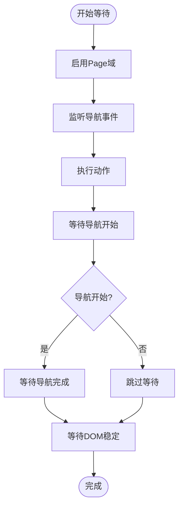

# 页面导航工具

<cite>
**本文档引用的文件**
- [navigation.js](file://background/control/actions/navigation.js)
- [wait_helper.js](file://background/control/wait_helper.js)
- [base.js](file://background/control/actions/base.js)
- [actions.js](file://background/control/actions.js)
- [control_manager.js](file://background/managers/control_manager.js)
- [connection.js](file://background/control/connection.js)
- [preamble.js](file://background/handlers/session/prompt/preamble.js)
</cite>

## 目录
1. [简介](#简介)
2. [项目结构](#项目结构)
3. [核心组件](#核心组件)
4. [架构概览](#架构概览)
5. [详细组件分析](#详细组件分析)
6. [依赖关系分析](#依赖关系分析)
7. [性能考虑](#性能考虑)
8. [故障排除指南](#故障排除指南)
9. [结论](#结论)

## 简介

页面导航工具是 Gemini Nexus Chrome 扩展中的核心功能模块，提供了完整的页面管理和导航控制能力。该工具集成了 Chrome 扩展 API 的强大功能，为 AI 驱动的浏览器自动化提供了统一的接口。

该工具主要包含以下核心功能：
- **navigatePage**: 支持 URL 跳转、前进、后退和刷新操作
- **newPage**: 创建新的浏览器标签页
- **closePage**: 关闭指定索引的页面
- **selectPage**: 切换到指定索引的页面

所有操作都通过 BrowserActions 代理类进行统一管理，并集成了 waitHelper 以确保操作的完整性和稳定性。

## 项目结构

页面导航工具位于扩展的后台控制模块中，采用分层架构设计：


**图表来源**
- [navigation.js](file://background/control/actions/navigation.js#L1-L61)
- [actions.js](file://background/control/actions.js#L1-L55)
- [wait_helper.js](file://background/control/wait_helper.js#L1-L148)

**章节来源**
- [navigation.js](file://background/control/actions/navigation.js#L1-L61)
- [actions.js](file://background/control/actions.js#L1-L55)

## 核心组件

### NavigationActions 类

NavigationActions 是页面导航功能的核心实现类，继承自 BaseActionHandler。它提供了四个主要的页面管理方法：

#### 主要特性
- **统一的错误处理**: 所有方法都包含完善的参数验证和错误处理
- **异步操作支持**: 使用 async/await 模式确保操作的原子性
- **Chrome API 集成**: 直接调用 chrome.tabs API 进行页面管理
- **等待机制**: 集成 waitHelper 确保操作完成后才返回结果

#### 继承关系


**图表来源**
- [base.js](file://background/control/actions/base.js#L1-L64)
- [navigation.js](file://background/control/actions/navigation.js#L1-L61)
- [actions.js](file://background/control/actions.js#L1-L55)

**章节来源**
- [navigation.js](file://background/control/actions/navigation.js#L5-L61)
- [base.js](file://background/control/actions/base.js#L5-L64)

## 架构概览

页面导航工具采用分层架构设计，确保了良好的模块化和可维护性：


**图表来源**
- [control_manager.js](file://background/managers/control_manager.js#L43-L157)
- [actions.js](file://background/control/actions.js#L25-L30)
- [navigation.js](file://background/control/actions/navigation.js#L6-L30)
- [wait_helper.js](file://background/control/wait_helper.js#L40-L90)

## 详细组件分析

### navigatePage 方法

navigatePage 方法支持多种导航操作类型，包括 URL 跳转、历史导航和页面刷新。

#### 方法签名
```javascript
async navigatePage({ url, type })
```

#### 参数说明
- **url** (可选): 目标 URL 地址
- **type** (可选): 导航类型，支持 'back'、'forward'、'reload'

#### 功能实现


**图表来源**
- [navigation.js](file://background/control/actions/navigation.js#L6-L30)
- [wait_helper.js](file://background/control/wait_helper.js#L40-L90)

#### 返回值
- 成功时返回操作描述字符串
- 失败时返回错误信息字符串

#### 错误处理
- 目标标签页未找到：返回 "Error: No target tab identified."
- 无效的导航参数：返回 "Error: Invalid navigation arguments."

**章节来源**
- [navigation.js](file://background/control/actions/navigation.js#L6-L30)

### newPage 方法

newPage 方法用于创建新的浏览器标签页，支持指定初始 URL。

#### 方法签名
```javascript
async newPage({ url })
```

#### 参数说明
- **url** (可选): 新页面的初始 URL，默认为 'about:blank'

#### 功能实现


**图表来源**
- [navigation.js](file://background/control/actions/navigation.js#L32-L36)

#### 返回值
- 返回包含新标签页 ID 和加载 URL 的描述信息

#### 错误处理
- 无参数验证，直接调用 Chrome API

**章节来源**
- [navigation.js](file://background/control/actions/navigation.js#L32-L36)

### closePage 方法

closePage 方法根据索引关闭指定的页面。

#### 方法签名
```javascript
async closePage({ index })
```

#### 参数说明
- **index** (必需): 要关闭页面的索引位置

#### 功能实现


**图表来源**
- [navigation.js](file://background/control/actions/navigation.js#L38-L46)

#### 返回值
- 成功时返回关闭页面的描述信息
- 失败时返回错误信息字符串

#### 错误处理
- 缺少索引参数：返回 "Error: 'index' is required."
- 索引超出范围：返回 "Error: Page index X not found."

**章节来源**
- [navigation.js](file://background/control/actions/navigation.js#L38-L46)

### selectPage 方法

selectPage 方法切换到指定索引的页面。

#### 方法签名
```javascript
async selectPage({ index })
```

#### 参数说明
- **index** (必需): 目标页面的索引位置

#### 功能实现


**图表来源**
- [navigation.js](file://background/control/actions/navigation.js#L53-L60)

#### 返回值
- 成功时返回页面切换的描述信息
- 失败时返回错误信息字符串

#### 错误处理
- 索引超出范围：返回 "Error: Index X not found."

**章节来源**
- [navigation.js](file://background/control/actions/navigation.js#L53-L60)

### BrowserActions 代理类

BrowserActions 提供了统一的代理接口，简化了页面导航功能的调用。

#### 代理方法


**图表来源**
- [actions.js](file://background/control/actions.js#L13-L31)

**章节来源**
- [actions.js](file://background/control/actions.js#L13-L31)

## 依赖关系分析

页面导航工具的依赖关系体现了清晰的分层架构：


**图表来源**
- [navigation.js](file://background/control/actions/navigation.js#L3)
- [wait_helper.js](file://background/control/wait_helper.js#L8)
- [base.js](file://background/control/actions/base.js#L3)
- [connection.js](file://background/control/connection.js#L8)

### 关键依赖关系

1. **NavigationActions → BaseActionHandler**: 继承基础功能
2. **BaseActionHandler → WaitForHelper**: 使用等待助手
3. **BaseActionHandler → BrowserConnection**: 管理浏览器连接
4. **BrowserActions → NavigationActions**: 代理导航功能
5. **BrowserControlManager → BrowserActions**: 管理器调用代理

**章节来源**
- [navigation.js](file://background/control/actions/navigation.js#L3)
- [base.js](file://background/control/actions/base.js#L3)
- [actions.js](file://background/control/actions.js#L18)

## 性能考虑

### 等待机制优化

WaitForHelper 实现了智能的等待策略，确保操作完成后再返回：

#### 时间配置
- **稳定DOM等待**: 3000ms × CPU倍数
- **DOM稳定持续时间**: 100ms × CPU倍数  
- **导航开始等待**: 200ms × CPU倍数
- **导航完成等待**: 15000ms × 网络倍数

#### DOM稳定性检测


**图表来源**
- [wait_helper.js](file://background/control/wait_helper.js#L40-L90)

**章节来源**
- [wait_helper.js](file://background/control/wait_helper.js#L19-L34)

### 错误处理策略

系统实现了多层次的错误处理机制：

1. **参数验证**: 在方法入口处进行参数检查
2. **Chrome API 异常**: 捕获并处理 Chrome 扩展 API 错误
3. **连接状态检查**: 确保调试器连接正常
4. **超时处理**: 防止无限等待

**章节来源**
- [navigation.js](file://background/control/actions/navigation.js#L38-L46)
- [wait_helper.js](file://background/control/wait_helper.js#L81-L86)

## 故障排除指南

### 常见问题及解决方案

#### 1. 目标标签页未找到
**症状**: 返回 "Error: No target tab identified."
**原因**: 当前没有活动标签页或受限 URL
**解决**: 确保有有效的活动标签页，避免在 chrome:// 等受限页面上操作

#### 2. 页面索引超出范围
**症状**: 返回 "Error: Page index X not found."
**原因**: 索引值大于等于页面总数
**解决**: 使用 `listPages()` 获取正确的页面索引

#### 3. 缺少必要参数
**症状**: 返回 "Error: 'index' is required."
**原因**: 调用 `closePage()` 或 `selectPage()` 时缺少 `index` 参数
**解决**: 确保传递正确的参数

#### 4. 导航失败
**症状**: 导航操作没有生效
**原因**: Chrome API 权限不足或页面加载超时
**解决**: 检查扩展权限，确认网络连接正常

### 调试技巧

1. **使用 listPages()**: 查看当前所有页面的状态和索引
2. **检查连接状态**: 确保 BrowserConnection 正常工作
3. **查看控制台日志**: 监听执行过程中的错误信息
4. **验证参数**: 确保传入的参数格式正确

**章节来源**
- [control_manager.js](file://background/managers/control_manager.js#L153-L156)
- [navigation.js](file://background/control/actions/navigation.js#L38-L46)

## 结论

页面导航工具为 Gemini Nexus 提供了强大而灵活的页面管理能力。通过精心设计的分层架构和完善的错误处理机制，该工具能够可靠地支持各种自动化场景。

### 主要优势

1. **统一接口**: 通过 BrowserActions 提供简洁的代理接口
2. **智能等待**: 集成 WaitForHelper 确保操作完成
3. **完整错误处理**: 全面的参数验证和异常捕获
4. **扩展性**: 易于添加新的页面管理功能
5. **性能优化**: 智能的等待策略和超时控制

### 应用场景

- **多页面自动化**: 同时管理多个标签页的生命周期
- **导航控制**: 精确控制页面的前进、后退和刷新
- **会话恢复**: 通过索引管理页面状态
- **测试自动化**: 支持复杂的页面操作序列

该工具为 AI 驱动的浏览器自动化提供了坚实的基础，是构建复杂自动化流程的重要组件。