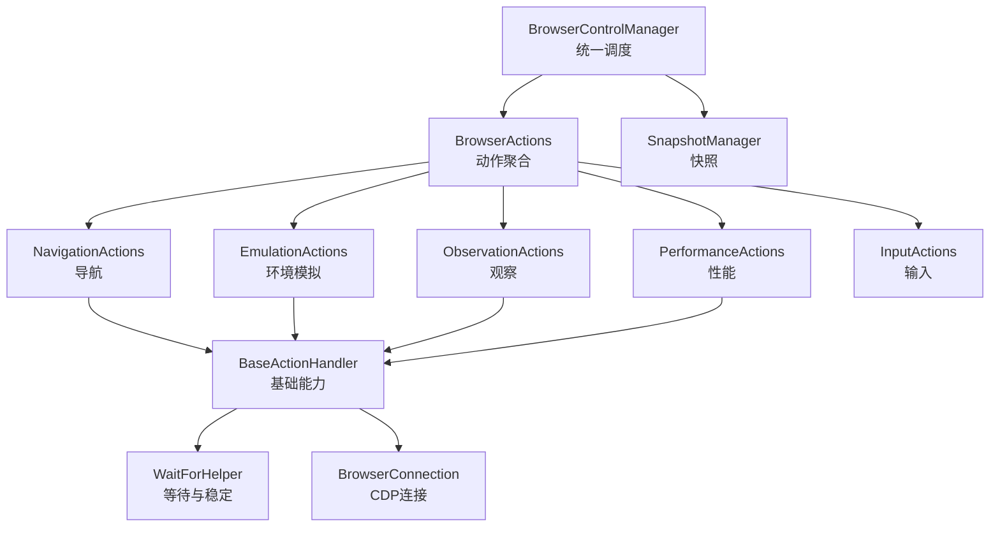
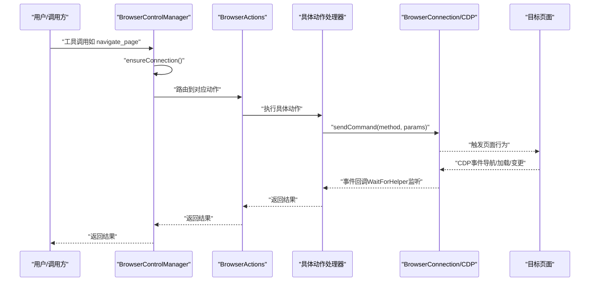
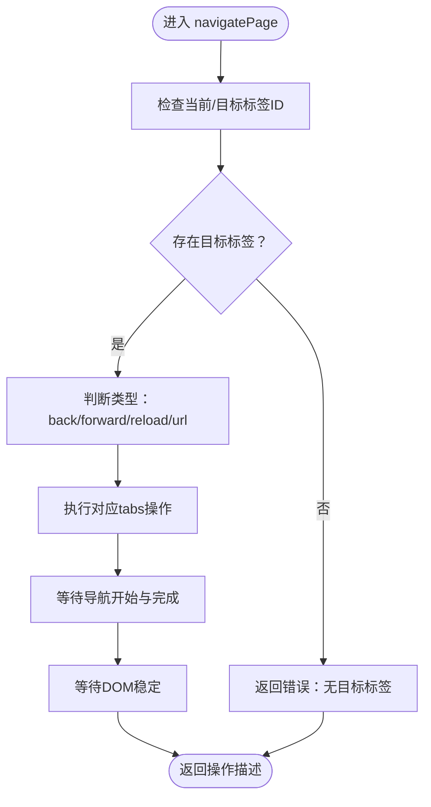
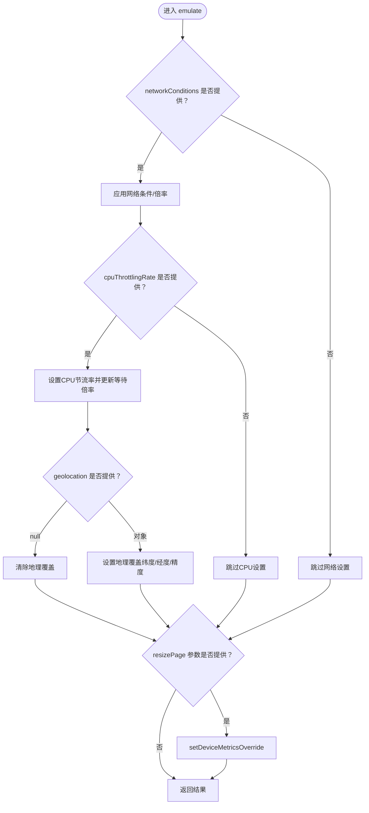
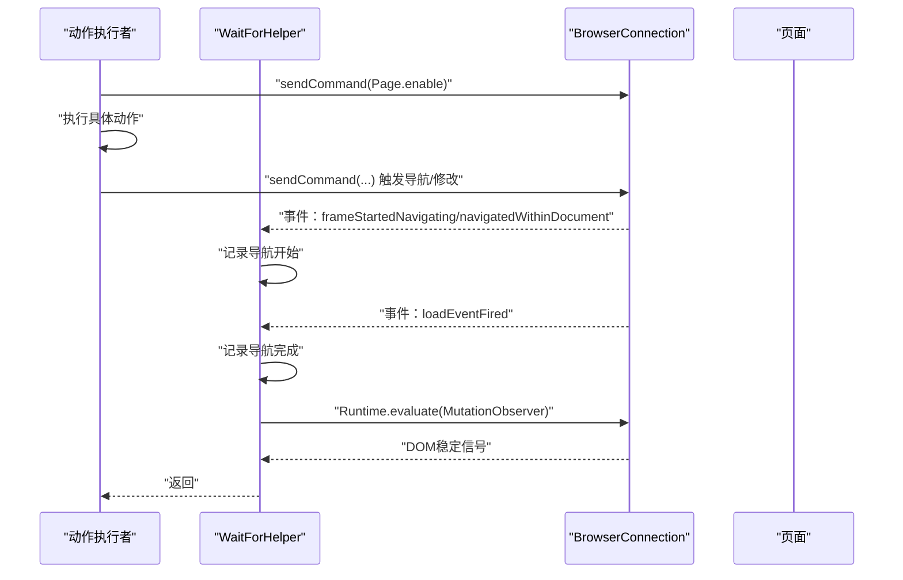
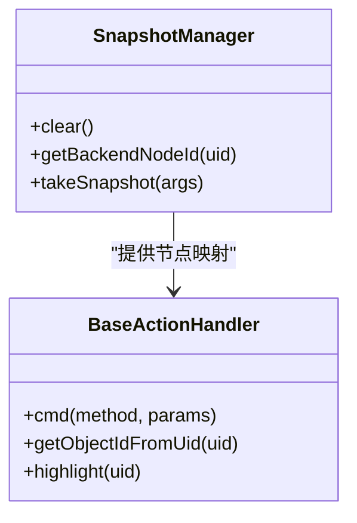
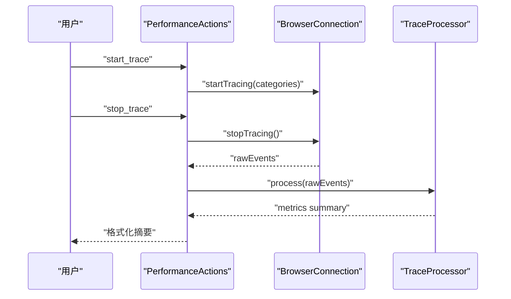
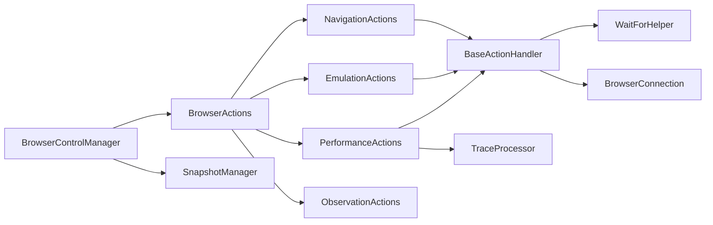

# 页面控制工具

<cite>
**本文档引用的文件**
- [navigation.js](file://background/control/actions/navigation.js)
- [emulation.js](file://background/control/actions/emulation.js)
- [actions.js](file://background/control/actions.js)
- [control_manager.js](file://background/managers/control_manager.js)
- [base.js](file://background/control/actions/base.js)
- [wait_helper.js](file://background/control/wait_helper.js)
- [connection.js](file://background/control/connection.js)
- [snapshot.js](file://background/control/snapshot.js)
- [performance.js](file://background/control/actions/performance.js)
- [trace_processor.js](file://background/lib/trace_processor.js)
</cite>

## 目录
1. [简介](#简介)
2. [项目结构](#项目结构)
3. [核心组件](#核心组件)
4. [架构总览](#架构总览)
5. [详细组件分析](#详细组件分析)
6. [依赖关系分析](#依赖关系分析)
7. [性能考量](#性能考量)
8. [故障排除指南](#故障排除指南)
9. [结论](#结论)
10. [附录](#附录)

## 简介
本文件为页面控制工具的详细参考文档，聚焦于导航与页面环境模拟能力。文档覆盖以下API：
- 导航类：navigatePage、newPage、closePage、selectPage、listPages
- 环境模拟类：emulate（网络条件、CPU节流、地理位置）、resizePage
- 并结合等待与稳定机制，确保自动化流程的可靠性与一致性

同时，文档解释了网络条件模拟、CPU节流、地理位置覆盖与视口调整的技术实现原理，并提供参数配置示例、性能影响分析与最佳实践建议，帮助在自动化场景中高效、稳定地使用这些工具。

## 项目结构
页面控制工具位于后台模块的控制层，采用分层设计：
- 控制层入口：BrowserControlManager 统一调度连接、快照与动作执行
- 动作聚合：BrowserActions 聚合导航、输入、观察、模拟、性能等子动作
- 具体动作：NavigationActions、EmulationActions 等分别处理对应领域
- 基础设施：BaseActionHandler 提供命令发送与节点对象解析；WaitForHelper 提供等待与DOM稳定；BrowserConnection 管理CDP连接与事件监听

图表来源
- [control_manager.js](file://background/managers/control_manager.js#L11-L159)
- [actions.js](file://background/control/actions.js#L13-L54)
- [base.js](file://background/control/actions/base.js#L5-L34)
- [connection.js](file://background/control/connection.js#L8-L26)
- [wait_helper.js](file://background/control/wait_helper.js#L8-L34)
- [snapshot.js](file://background/control/snapshot.js#L9-L17)

章节来源
- [control_manager.js](file://background/managers/control_manager.js#L11-L159)
- [actions.js](file://background/control/actions.js#L10-L54)

## 核心组件
- BrowserControlManager：负责确保连接、执行工具调用、路由到具体动作模块
- BrowserActions：动作门面，统一暴露导航、输入、观察、模拟、性能等接口
- NavigationActions：封装标签页导航、新建、关闭、选择与列表展示
- EmulationActions：封装网络条件、CPU节流、地理位置与视口调整
- BaseActionHandler：提供CDP命令发送、节点对象解析与高亮辅助
- WaitForHelper：基于CDP事件的导航等待与DOM稳定等待
- BrowserConnection：CDP连接管理、事件监听与域启用
- SnapshotManager：可访问性树快照生成与UID映射
- PerformanceActions：性能追踪与指标汇总

章节来源
- [control_manager.js](file://background/managers/control_manager.js#L11-L159)
- [actions.js](file://background/control/actions.js#L13-L54)
- [navigation.js](file://background/control/actions/navigation.js#L5-L61)
- [emulation.js](file://background/control/actions/emulation.js#L13-L82)
- [base.js](file://background/control/actions/base.js#L5-L63)
- [wait_helper.js](file://background/control/wait_helper.js#L8-L148)
- [connection.js](file://background/control/connection.js#L8-L147)
- [snapshot.js](file://background/control/snapshot.js#L9-L183)
- [performance.js](file://background/control/actions/performance.js#L6-L73)

## 架构总览
页面控制工具通过Chrome Debugger Protocol（CDP）与目标页面交互，结合等待与稳定机制，确保自动化操作的可靠性。整体流程如下：

图表来源
- [control_manager.js](file://background/managers/control_manager.js#L43-L157)
- [actions.js](file://background/control/actions.js#L25-L53)
- [connection.js](file://background/control/connection.js#L121-L132)
- [wait_helper.js](file://background/control/wait_helper.js#L40-L90)

## 详细组件分析

### 导航API详解
- navigatePage
  - 支持类型：back、forward、reload、指定URL跳转
  - 行为：根据当前或目标标签ID执行相应tabs操作；内部使用等待机制确保导航完成与DOM稳定
  - 返回：操作描述或错误信息
- newPage
  - 创建新标签页，默认about:blank，可指定URL
  - 返回：新标签页ID与加载URL
- closePage
  - 关闭指定索引的标签页（按当前窗口）
  - 返回：关闭结果或错误
- selectPage
  - 切换到指定索引的标签页
  - 返回：切换结果或错误
- listPages
  - 列出当前窗口所有标签页（索引、标题、URL）

图表来源
- [navigation.js](file://background/control/actions/navigation.js#L6-L30)
- [wait_helper.js](file://background/control/wait_helper.js#L40-L90)

章节来源
- [navigation.js](file://background/control/actions/navigation.js#L5-L61)
- [wait_helper.js](file://background/control/wait_helper.js#L40-L90)

### 环境模拟API详解
- emulate
  - 网络条件：支持预设档位（Offline、Slow 3G、Fast 3G、Slow 4G、Fast 4G），或“No emulation”
  - CPU节流：设置节流倍率（最小1）
  - 地理位置：设置经纬度与精度，或清除覆盖
  - 影响：自动更新等待超时的CPU/网络倍率，以适配真实性能表现
- resizePage
  - 设置视口宽高，移动端标志默认false，设备缩放因子默认1
  - 影响：改变页面布局与响应式行为

图表来源
- [emulation.js](file://background/control/actions/emulation.js#L14-L81)
- [wait_helper.js](file://background/control/wait_helper.js#L19-L34)

章节来源
- [emulation.js](file://background/control/actions/emulation.js#L13-L82)
- [wait_helper.js](file://background/control/wait_helper.js#L19-L34)

### 等待与稳定机制
- WaitForHelper
  - 更新CPU与网络倍率，动态调整等待超时
  - 监听Page域事件：导航开始、文档内导航、加载完成
  - 在动作执行后等待导航完成，并通过MutationObserver等待DOM稳定
- BrowserConnection
  - 管理CDP连接生命周期，启用Network、Log、Runtime、Page、Audits等域
  - 统一事件分发给监听器（如WaitForHelper）

图表来源
- [wait_helper.js](file://background/control/wait_helper.js#L40-L90)
- [connection.js](file://background/control/connection.js#L88-L100)

章节来源
- [wait_helper.js](file://background/control/wait_helper.js#L8-L148)
- [connection.js](file://background/control/connection.js#L8-L147)

### 快照与节点对象解析
- SnapshotManager
  - 启用DOM与Accessibility域，获取完整可访问性树
  - 生成带UID的文本化树，便于LLM理解与交互
  - 维护uid到backendNodeId的映射，用于后续交互
- BaseActionHandler
  - 通过DOM.resolveNode解析UID对应的对象ID
  - 支持Overlay高亮反馈

图表来源
- [snapshot.js](file://background/control/snapshot.js#L9-L183)
- [base.js](file://background/control/actions/base.js#L25-L34)

章节来源
- [snapshot.js](file://background/control/snapshot.js#L9-L183)
- [base.js](file://background/control/actions/base.js#L25-L34)

### 性能追踪与指标
- PerformanceActions
  - 启动/停止性能追踪，支持可选重载
  - 使用TraceProcessor提取关键指标（FCP、LCP、CLS、DOMContentLoaded、Load）
- TraceProcessor
  - 解析CDP事件，计算核心Web Vitals
  - 输出摘要与基础洞察提示

图表来源
- [performance.js](file://background/control/actions/performance.js#L13-L66)
- [trace_processor.js](file://background/lib/trace_processor.js#L10-L97)

章节来源
- [performance.js](file://background/control/actions/performance.js#L6-L73)
- [trace_processor.js](file://background/lib/trace_processor.js#L9-L97)

## 依赖关系分析
- 控制层依赖
  - BrowserControlManager 依赖 BrowserConnection、SnapshotManager、BrowserActions
  - BrowserActions 依赖各动作处理器与WaitForHelper
  - 动作处理器依赖 BaseActionHandler 与 BrowserConnection
- 等待与稳定
  - WaitForHelper 依赖 BrowserConnection 的事件监听与sendCommand
  - BaseActionHandler 依赖 SnapshotManager 的节点映射
- 性能追踪
  - PerformanceActions 依赖 BrowserConnection 的Tracing域与TraceProcessor

图表来源
- [control_manager.js](file://background/managers/control_manager.js#L11-L159)
- [actions.js](file://background/control/actions.js#L13-L54)
- [base.js](file://background/control/actions/base.js#L5-L34)
- [wait_helper.js](file://background/control/wait_helper.js#L8-L34)
- [connection.js](file://background/control/connection.js#L8-L26)
- [snapshot.js](file://background/control/snapshot.js#L9-L17)
- [performance.js](file://background/control/actions/performance.js#L6-L11)
- [trace_processor.js](file://background/lib/trace_processor.js#L9-L10)

章节来源
- [control_manager.js](file://background/managers/control_manager.js#L11-L159)
- [actions.js](file://background/control/actions.js#L13-L54)

## 性能考量
- 等待策略
  - CPU节流与网络延迟会放大等待超时，WaitForHelper自动按倍率调整
  - 导航等待包含“预期导航时间”和“最大导航时间”，避免无限等待
  - DOM稳定等待通过MutationObserver检测，具备最大安全超时
- 网络条件
  - 不同档位的吞吐量与延迟差异显著，建议在测试环境中按需选择
  - “No emulation”将恢复CDP默认网络状态
- CPU节流
  - 节流倍率越大，等待时间越长，但更接近真实设备性能
- 地理位置
  - 覆盖清除与设置均通过CDP命令即时生效
- 视口调整
  - 调整视口会影响页面布局与响应式行为，注意与断言策略匹配

[本节为通用性能讨论，不直接分析特定文件]

## 故障排除指南
- 无法连接目标标签
  - 受限URL（如chrome://、about:）无法附加调试器，将回退到非连接模式执行部分动作
  - 建议在受支持的网页上运行工具
- 导航未完成或DOM不稳定
  - 确认已启用Page域事件监听；若受限URL，等待固定时间后继续
  - 检查网络条件与CPU节流设置是否导致超时
- 网络条件设置无效
  - 确认Network域已启用；检查传入参数格式与取值范围
- 地理位置设置失败
  - 确认经纬度数值有效且精度合理
- 视口调整报错
  - 确认宽度与高度参数均提供且为有效数值

章节来源
- [control_manager.js](file://background/managers/control_manager.js#L20-L31)
- [connection.js](file://background/control/connection.js#L88-L100)
- [wait_helper.js](file://background/control/wait_helper.js#L40-L90)
- [emulation.js](file://background/control/actions/emulation.js#L67-L81)

## 结论
页面控制工具通过清晰的动作分层与稳健的等待机制，提供了可靠的浏览器自动化能力。导航API满足多标签页管理需求，环境模拟API覆盖网络、CPU、地理与视口等关键维度。配合性能追踪与快照能力，可在复杂自动化流程中实现可观测、可验证与可优化的闭环。

[本节为总结性内容，不直接分析特定文件]

## 附录

### API参考与参数配置示例

- navigatePage
  - 参数
    - url: 目标URL（字符串）
    - type: 导航类型（'back'|'forward'|'reload'）
  - 示例
    - 跳转到指定URL：{"url":"https://example.com"}
    - 后退：{"type":"back"}
    - 前进：{"type":"forward"}
    - 刷新：{"type":"reload"}

- newPage
  - 参数
    - url: 新建标签页的目标URL（字符串，可选）
  - 示例
    - 新建空白页：{}
    - 指定URL：{"url":"https://example.com"}

- closePage
  - 参数
    - index: 要关闭的标签页索引（数字）
  - 示例
    - 关闭索引为1的标签页：{"index":1}

- selectPage
  - 参数
    - index: 要切换到的标签页索引（数字）
  - 示例
    - 切换到索引为0的标签页：{"index":0}

- listPages
  - 无参数
  - 返回：当前窗口所有标签页的列表文本

- emulate
  - 参数
    - networkConditions: 预设档位（'Offline'|'Slow 3G'|'Fast 3G'|'Slow 4G'|'Fast 4G'|'No emulation'）
    - cpuThrottlingRate: CPU节流倍率（数字，>=1）
    - geolocation: 地理位置对象或null（null表示清除）
      - latitude: 纬度（数字或可转换为数字的字符串）
      - longitude: 经度（数字或可转换为数字的字符串）
      - accuracy: 精度（数字，可选，默认1）
  - 示例
    - 仅设置网络：{"networkConditions":"Slow 3G"}
    - 仅设置CPU：{"cpuThrottlingRate":2}
    - 仅设置地理：{"geolocation":{"latitude":39.9042,"longitude":116.4074,"accuracy":10}}
    - 清除地理覆盖：{"geolocation":null}
    - 组合设置：{"networkConditions":"Fast 4G","cpuThrottlingRate":3,"geolocation":{"latitude":31.2304,"longitude":121.4737}}

- resizePage
  - 参数
    - width: 视口宽度（数字）
    - height: 视口高度（数字）
  - 示例
    - 调整为1920x1080：{"width":1920,"height":1080}

- 性能追踪
  - start_trace
    - 参数
      - reload: 是否在开始时重载页面（布尔）
    - 示例：{"reload":true}
  - stop_trace
    - 无参数
    - 返回：包含FCP、LCP、CLS、DOMContentLoaded、Load等指标的摘要

章节来源
- [navigation.js](file://background/control/actions/navigation.js#L6-L60)
- [emulation.js](file://background/control/actions/emulation.js#L14-L81)
- [performance.js](file://background/control/actions/performance.js#L13-L66)

### 最佳实践
- 在受限URL（如about:）上谨慎使用导航API，优先在受支持的网页上运行
- 使用emulate时，先设置网络条件再设置CPU节流，以获得更真实的等待体验
- resizePage后，建议重新评估页面布局与元素定位策略
- 性能追踪建议在稳定环境下进行，避免频繁重载影响结果稳定性
- 结合快照与节点UID，确保交互目标的稳定性与可重复性

[本节为通用最佳实践，不直接分析特定文件]