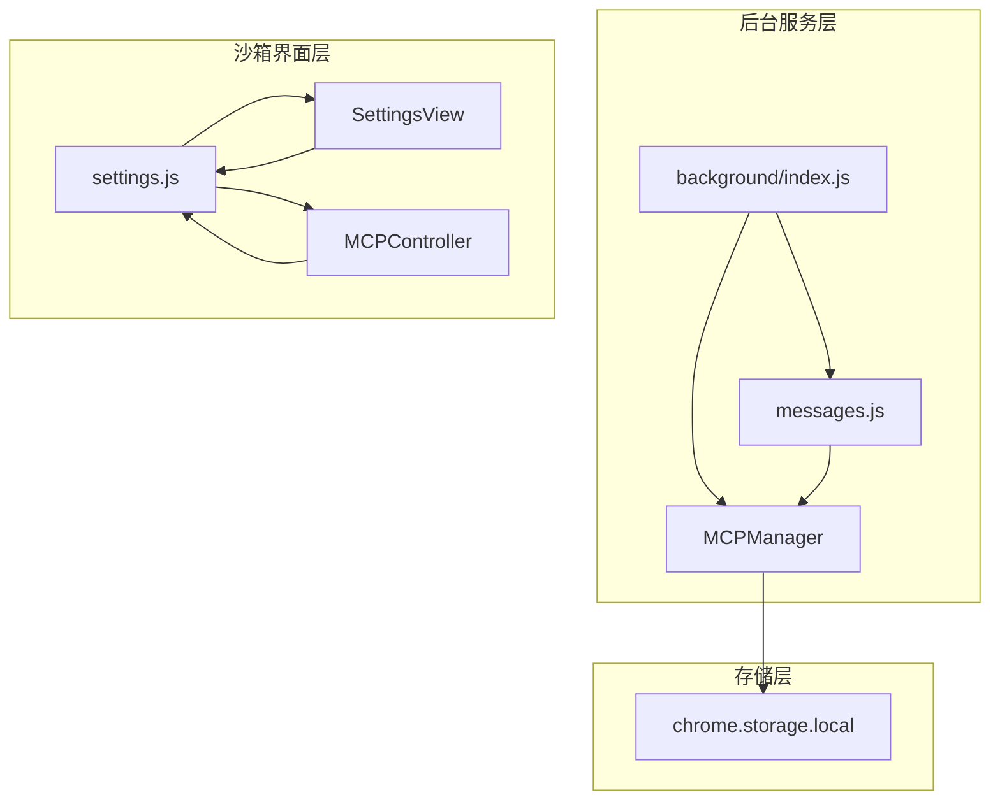
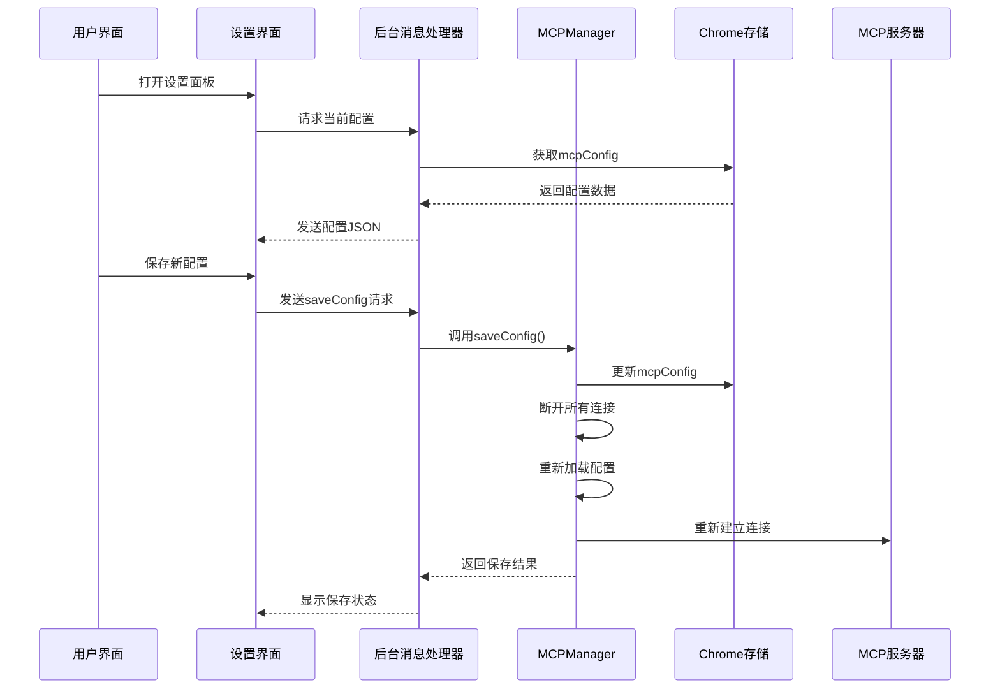
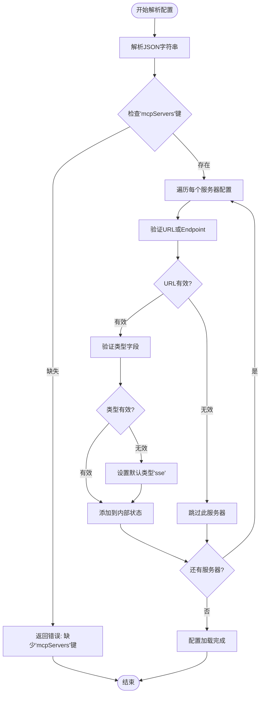
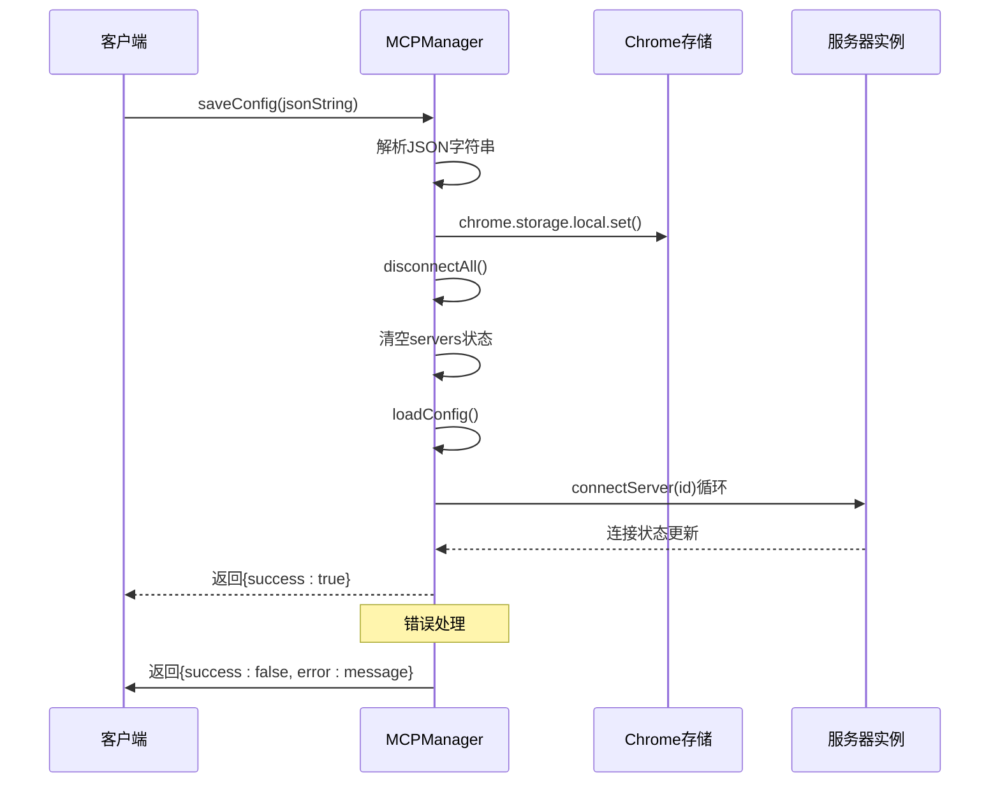
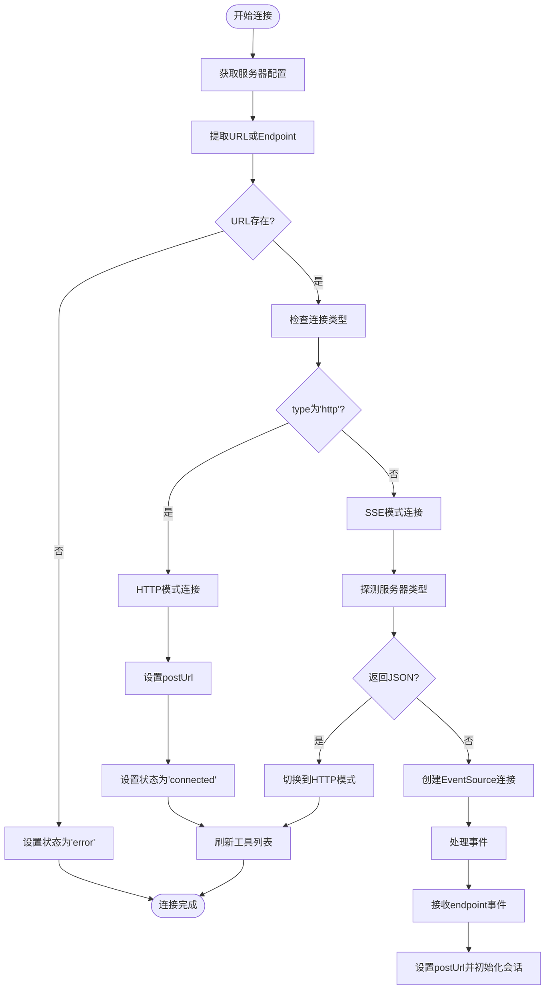
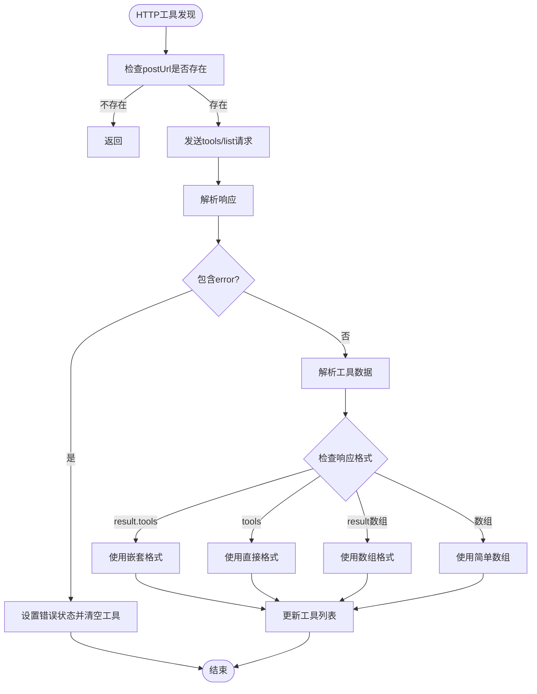
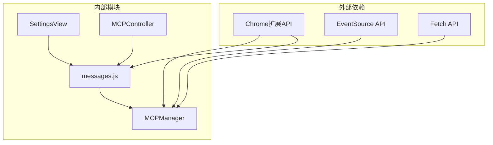

# MCP配置指南

<cite>
**本文档引用的文件**
- [mcp_manager.js](file://background/managers/mcp_manager.js)
- [messages.js](file://background/messages.js)
- [view.js](file://sandbox/ui/settings/view.js)
- [settings.js](file://sandbox/ui/settings.js)
- [mcp_controller.js](file://sandbox/controllers/mcp_controller.js)
- [manifest.json](file://manifest.json)
</cite>

## 目录
1. [简介](#简介)
2. [项目结构](#项目结构)
3. [核心组件](#核心组件)
4. [架构概览](#架构概览)
5. [详细组件分析](#详细组件分析)
6. [依赖关系分析](#依赖关系分析)
7. [性能考虑](#性能考虑)
8. [故障排除指南](#故障排除指南)
9. [结论](#结论)
10. [附录](#附录)

## 简介

本指南详细介绍了MCP（Model Context Protocol）服务器配置系统，基于MCPManager类的saveConfig、loadConfig和connectServer方法。该系统提供了完整的MCP服务器管理功能，包括配置持久化、自动连接、状态监控和工具发现。

MCP配置系统采用Chrome扩展的chrome.storage.local进行本地存储，支持两种连接模式：SSE（Server-Sent Events）和HTTP（streamable_http）。系统具备完善的错误处理机制和配置验证功能。

## 项目结构

MCP配置系统分布在以下关键模块中：



**图表来源**
- [mcp_manager.js](file://background/managers/mcp_manager.js#L1-L530)
- [messages.js](file://background/messages.js#L1-L82)
- [view.js](file://sandbox/ui/settings/view.js#L1-L241)

**章节来源**
- [mcp_manager.js](file://background/managers/mcp_manager.js#L1-L530)
- [messages.js](file://background/messages.js#L1-L82)
- [view.js](file://sandbox/ui/settings/view.js#L1-L241)

## 核心组件

### MCPManager类

MCPManager是整个配置系统的核心，负责：
- 配置加载和保存
- 服务器连接管理
- 工具发现和执行
- 状态监控和错误处理

主要数据结构：
```javascript
this.servers = {
  [serverId]: {
    config: serverConfig,      // 原始配置
    eventSource: EventSource,  // SSE连接
    postUrl: string,           // HTTP POST端点
    tools: array,              // 工具列表
    status: string             // 连接状态
  }
};
```

**章节来源**
- [mcp_manager.js](file://background/managers/mcp_manager.js#L2-L6)

### 配置存储系统

系统使用Chrome扩展的本地存储API进行配置持久化：
- 存储键名：`mcpConfig`
- 数据格式：包含`mcpServers`对象的完整配置
- 自动同步：配置变更后自动重新初始化连接

**章节来源**
- [mcp_manager.js](file://background/managers/mcp_manager.js#L21-L38)
- [messages.js](file://background/messages.js#L49-L55)

## 架构概览

MCP配置系统的整体架构采用分层设计：



**图表来源**
- [messages.js](file://background/messages.js#L42-L67)
- [mcp_manager.js](file://background/managers/mcp_manager.js#L40-L61)

**章节来源**
- [messages.js](file://background/messages.js#L1-L82)
- [mcp_manager.js](file://background/managers/mcp_manager.js#L1-L530)

## 详细组件分析

### JSON配置文件结构

MCP配置采用标准JSON格式，顶层必须包含`mcpServers`对象：

```json
{
  "mcpServers": {
    "server1": {
      "url": "https://example.com/mcp",
      "type": "sse",
      "name": "示例服务器"
    },
    "server2": {
      "endpoint": "https://api.example.com/sse",
      "type": "streamable_http"
    }
  }
}
```

#### 必填字段验证

系统对配置进行严格的字段验证：



**图表来源**
- [mcp_manager.js](file://background/managers/mcp_manager.js#L40-L61)
- [mcp_manager.js](file://background/managers/mcp_manager.js#L21-L38)

**章节来源**
- [mcp_manager.js](file://background/managers/mcp_manager.js#L40-L61)
- [mcp_manager.js](file://background/managers/mcp_manager.js#L21-L38)

### 连接模式配置

系统支持两种连接模式，通过`type`字段指定：

#### SSE模式（默认）

```javascript
// 默认类型，适用于标准MCP协议
{
  "type": "sse",
  "url": "https://server.com/mcp"
}
```

特点：
- 使用EventSource建立持久连接
- 支持实时消息推送
- 自动探测服务器能力

#### HTTP模式（streamable_http）

```javascript
// HTTP直连模式
{
  "type": "streamable_http",
  "endpoint": "https://server.com/api"
}
```

特点：
- 直接使用HTTP POST请求
- 更简单的实现方式
- 适用于特定MCP服务器

**章节来源**
- [mcp_manager.js](file://background/managers/mcp_manager.js#L75-L96)
- [mcp_manager.js](file://background/managers/mcp_manager.js#L215-L223)

### 配置保存流程

saveConfig方法实现了完整的配置保存和重连机制：



**图表来源**
- [mcp_manager.js](file://background/managers/mcp_manager.js#L40-L61)

**章节来源**
- [mcp_manager.js](file://background/managers/mcp_manager.js#L40-L61)

### 连接建立过程

connectServer方法处理不同连接模式的具体实现：



**图表来源**
- [mcp_manager.js](file://background/managers/mcp_manager.js#L71-L150)

**章节来源**
- [mcp_manager.js](file://background/managers/mcp_manager.js#L71-L150)

### 工具发现机制

系统支持两种工具发现方式：

#### SSE模式下的工具发现

通过SSE连接的endpoint事件获取POST端点，然后发送JSON-RPC请求：

```javascript
// endpoint事件触发后
es.addEventListener('endpoint', (event) => {
  const postUrl = new URL(event.data, url).toString();
  server.postUrl = postUrl;
  server.status = 'connected';
  this.initializeSession(id);
});
```

#### HTTP模式下的工具发现

直接向服务器发送tools/list请求：



**图表来源**
- [mcp_manager.js](file://background/managers/mcp_manager.js#L152-L213)

**章节来源**
- [mcp_manager.js](file://background/managers/mcp_manager.js#L152-L213)

## 依赖关系分析

MCP配置系统的关键依赖关系：



**图表来源**
- [mcp_manager.js](file://background/managers/mcp_manager.js#L1-L530)
- [messages.js](file://background/messages.js#L1-L82)

**章节来源**
- [mcp_manager.js](file://background/managers/mcp_manager.js#L1-L530)
- [messages.js](file://background/messages.js#L1-L82)

### 权限要求

系统需要以下Chrome扩展权限：

- `storage`: 用于本地配置存储
- `contextMenus`: 菜单功能
- `scripting`: 内容脚本注入
- `alarms`: 定时任务
- `debugger`: 调试功能
- `downloads`: 文件下载

**章节来源**
- [manifest.json](file://manifest.json#L6-L10)

## 性能考虑

### 连接优化策略

1. **延迟连接**: 系统仅在初始化时自动连接启用的服务器
2. **连接复用**: 配置变更时断开所有连接并重新建立
3. **超时控制**: 请求等待超时时间为10秒
4. **状态缓存**: UI层显示服务器状态信息

### 内存管理

- 事件源自动清理：断开连接时关闭EventSource
- 状态重置：重新加载配置时清空服务器状态
- 工具列表优化：只存储必要的工具元数据

## 故障排除指南

### 常见配置错误

#### 缺少必需字段

**问题**: 配置缺少`mcpServers`键
**解决**: 确保JSON根对象包含`mcpServers`对象

#### URL格式错误

**问题**: 服务器URL格式不正确
**解决**: 检查URL格式，确保可访问性

#### 类型配置错误

**问题**: `type`字段值无效
**解决**: 使用`sse`或`streamable_http`之一

### 连接问题诊断

#### SSE连接失败

可能原因：
- 服务器不支持SSE
- 网络连接问题
- CORS跨域限制

诊断步骤：
1. 检查浏览器开发者工具网络面板
2. 验证服务器是否返回正确的Content-Type
3. 查看EventSource错误日志

#### HTTP连接问题

可能原因：
- POST端点不可访问
- JSON-RPC请求格式错误
- 服务器返回错误响应

诊断步骤：
1. 测试直接HTTP请求
2. 检查服务器响应格式
3. 验证JSON-RPC方法调用

**章节来源**
- [mcp_manager.js](file://background/managers/mcp_manager.js#L79-L83)
- [mcp_manager.js](file://background/managers/mcp_manager.js#L122-L125)

## 结论

MCP配置系统提供了完整的服务器管理解决方案，具有以下优势：

1. **完整的生命周期管理**: 从配置加载到连接建立的全流程自动化
2. **灵活的连接模式**: 支持SSE和HTTP两种模式适应不同服务器
3. **强大的错误处理**: 全面的状态监控和错误恢复机制
4. **用户友好的界面**: 提供直观的配置界面和状态显示
5. **可靠的持久化**: 基于Chrome存储的配置持久化

系统设计充分考虑了实际使用场景，为MCP服务器集成提供了稳定可靠的基础框架。

## 附录

### 配置最佳实践

1. **配置结构**: 始终包含完整的`mcpServers`对象
2. **URL规范**: 使用完整的URL地址，避免相对路径
3. **类型选择**: 根据服务器支持情况选择合适的连接模式
4. **错误处理**: 实现适当的错误处理和重试机制
5. **安全考虑**: 确保服务器通信的安全性和隐私保护

### 开发建议

1. **版本兼容**: 关注MCP协议版本更新
2. **性能监控**: 实施连接性能和资源使用监控
3. **日志记录**: 完善详细的日志记录便于调试
4. **测试覆盖**: 建立全面的单元测试和集成测试
5. **文档维护**: 保持配置文档与代码同步更新