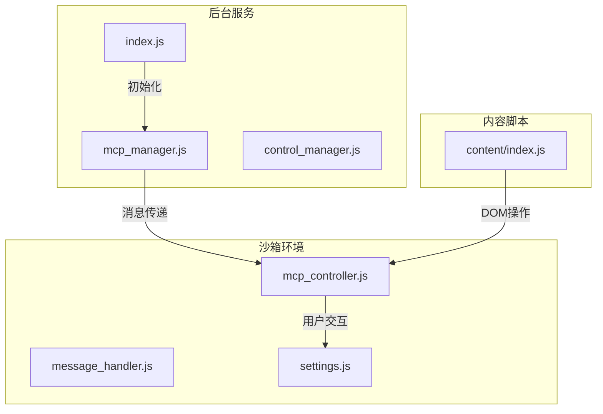
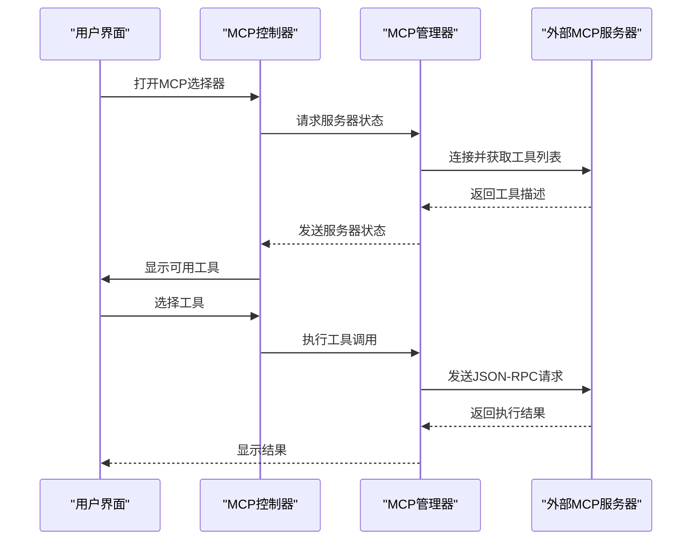
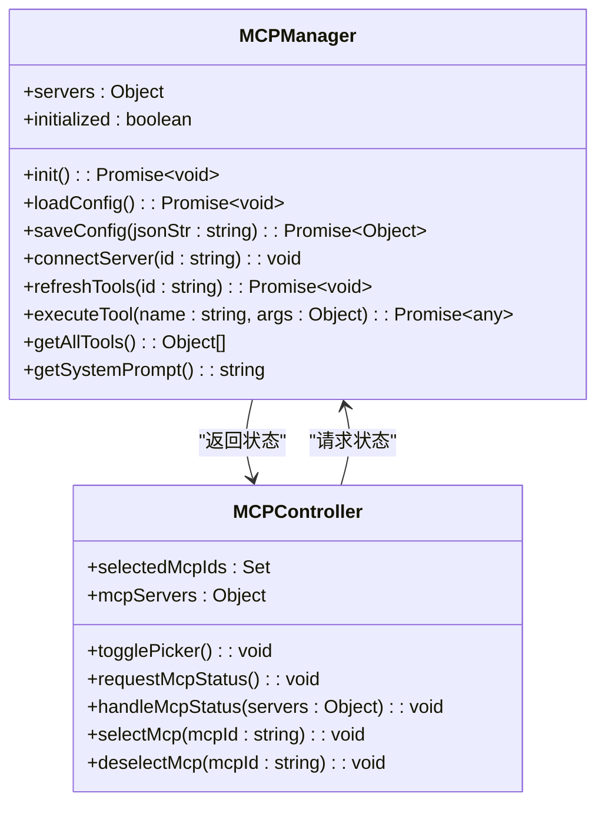
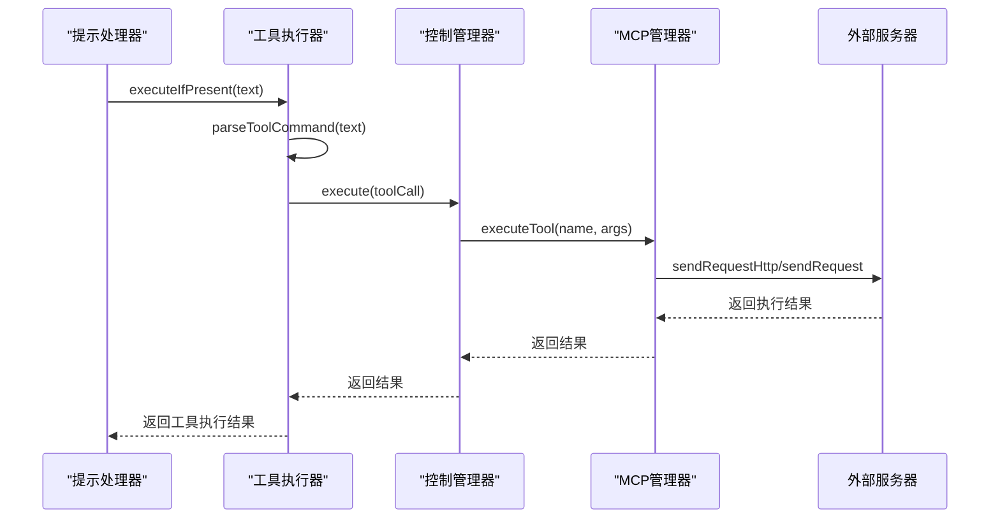
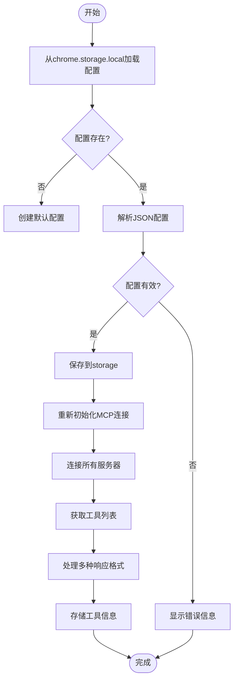
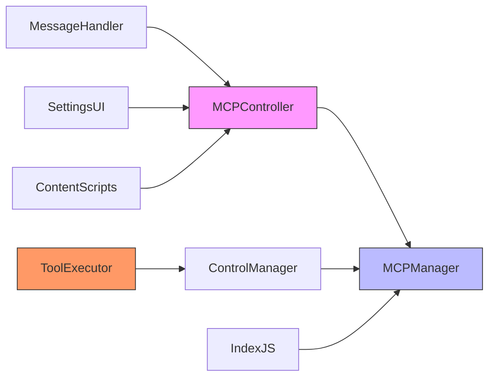

# 扩展开发指南

<cite>
**本文档中引用的文件**  
- [mcp_manager.js](file://background/managers/mcp_manager.js)
- [mcp_controller.js](file://sandbox/controllers/mcp_controller.js)
- [tool_executor.js](file://background/handlers/session/prompt/tool_executor.js)
- [settings.js](file://sandbox/ui/templates/settings.js)
- [message_handler.js](file://sandbox/controllers/message_handler.js)
- [control_manager.js](file://background/managers/control_manager.js)
- [utils.js](file://background/handlers/session/utils.js)
- [manifest.json](file://manifest.json)
- [package.json](file://package.json)
- [index.js](file://background/index.js)
</cite>

## 目录
1. [简介](#简介)
2. [项目结构](#项目结构)
3. [核心组件](#核心组件)
4. [架构概述](#架构概述)
5. [详细组件分析](#详细组件分析)
6. [依赖分析](#依赖分析)
7. [性能考虑](#性能考虑)
8. [故障排除指南](#故障排除指南)
9. [结论](#结论)

## 简介
本指南详细介绍了如何将自定义工具集成到Gemini Nexus系统中，通过Model Context Protocol (MCP) 扩展其功能。文档涵盖了从外部MCP服务器配置、工具描述格式、接口规范到前端UI集成的完整流程。开发者可以学习如何通过JSON配置文件注册工具、实现安全的认证机制，并将Python脚本、Node.js服务或浏览器扩展功能暴露为可用的MCP工具。

## 项目结构
Gemini Nexus项目采用模块化架构，主要分为background（后台）、sandbox（沙箱）、content（内容脚本）、services（服务）等目录。MCP相关功能主要分布在background/managers和sandbox/controllers中，通过消息传递机制实现前后端通信。

**图表来源**  
- [mcp_manager.js](file://background/managers/mcp_manager.js#L1-L530)
- [mcp_controller.js](file://sandbox/controllers/mcp_controller.js#L1-L221)
- [settings.js](file://sandbox/ui/templates/settings.js#L70-L174)

**章节来源**
- [mcp_manager.js](file://background/managers/mcp_manager.js#L1-L530)
- [mcp_controller.js](file://sandbox/controllers/mcp_controller.js#L1-L221)

## 核心组件
系统的核心组件包括MCPManager（工具管理）、ControlManager（控制执行）、MCPController（UI控制器）和ToolExecutor（工具执行器）。这些组件协同工作，实现了从工具注册、选择到执行的完整流程。

**章节来源**
- [mcp_manager.js](file://background/managers/mcp_manager.js#L1-L530)
- [control_manager.js](file://background/managers/control_manager.js#L1-L159)
- [mcp_controller.js](file://sandbox/controllers/mcp_controller.js#L1-L221)
- [tool_executor.js](file://background/handlers/session/prompt/tool_executor.js#L1-L49)

## 架构概述
Gemini Nexus的MCP扩展架构采用客户端-服务器模式，通过JSON-RPC协议进行通信。系统支持SSE（Server-Sent Events）和HTTP两种传输模式，允许外部工具服务器注册并提供功能。

**图表来源**  
- [mcp_manager.js](file://background/managers/mcp_manager.js#L1-L530)
- [mcp_controller.js](file://sandbox/controllers/mcp_controller.js#L1-L221)

## 详细组件分析

### MCP管理器分析
MCPManager是系统的核心组件，负责管理所有外部工具服务器的连接、配置和工具注册。

#### 类图

**图表来源**  
- [mcp_manager.js](file://background/managers/mcp_manager.js#L1-L530)
- [mcp_controller.js](file://sandbox/controllers/mcp_controller.js#L1-L221)

### 工具执行流程分析
当用户调用MCP工具时，系统通过一系列组件协同完成执行过程。

#### 序列图

**图表来源**  
- [tool_executor.js](file://background/handlers/session/prompt/tool_executor.js#L1-L49)
- [control_manager.js](file://background/managers/control_manager.js#L1-L159)
- [mcp_manager.js](file://background/managers/mcp_manager.js#L1-L530)

### 配置与集成分析
MCP工具的配置通过JSON格式在设置界面完成，系统提供完整的配置验证和错误处理机制。

#### 流程图

**图表来源**  
- [mcp_manager.js](file://background/managers/mcp_manager.js#L21-L61)
- [settings.js](file://sandbox/ui/templates/settings.js#L82-L85)

**章节来源**
- [mcp_manager.js](file://background/managers/mcp_manager.js#L1-L530)
- [settings.js](file://sandbox/ui/templates/settings.js#L75-L87)

## 依赖分析
系统各组件之间存在明确的依赖关系，通过模块化设计实现了高内聚低耦合的架构。

**图表来源**  
- [mcp_manager.js](file://background/managers/mcp_manager.js#L1-L530)
- [mcp_controller.js](file://sandbox/controllers/mcp_controller.js#L1-L221)
- [index.js](file://background/index.js#L1-L30)

**章节来源**
- [mcp_manager.js](file://background/managers/mcp_manager.js#L1-L530)
- [mcp_controller.js](file://sandbox/controllers/mcp_controller.js#L1-L221)
- [index.js](file://background/index.js#L1-L30)

## 性能考虑
系统在设计时考虑了多种性能优化策略，包括连接复用、异步加载和缓存机制。MCPManager在初始化时会自动连接所有已配置的服务器，并保持长连接以减少重复建立连接的开销。工具列表的获取采用按需刷新机制，避免频繁的网络请求。

## 故障排除指南
当MCP工具无法正常工作时，可以按照以下步骤进行排查：

**章节来源**
- [mcp_manager.js](file://background/managers/mcp_manager.js#L79-L81)
- [mcp_manager.js](file://background/managers/mcp_manager.js#L174-L178)
- [mcp_controller.js](file://sandbox/controllers/mcp_controller.js#L106-L111)

## 结论
本指南详细介绍了Gemini Nexus系统中MCP工具扩展的完整开发流程。通过MCPManager的工具注册机制和tool_executor.js的执行流程，开发者可以轻松集成自定义工具。系统提供了灵活的配置方式、安全的执行环境和友好的用户界面，使得扩展开发变得简单高效。遵循本文档的指导，开发者可以快速将Python脚本、Node.js服务或浏览器扩展功能暴露为MCP工具，极大地扩展了系统的功能边界。