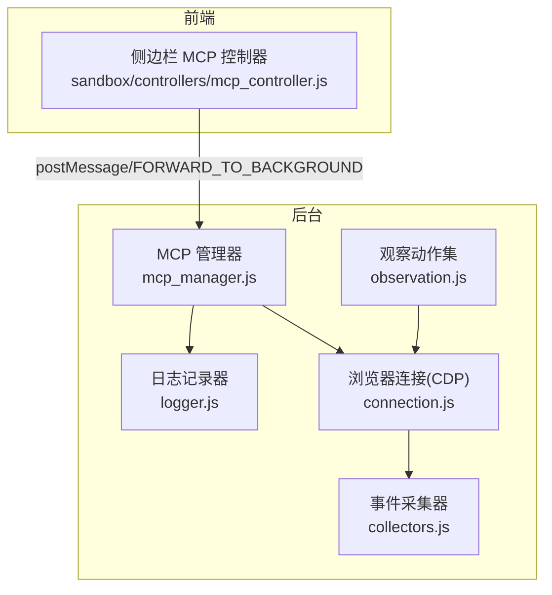
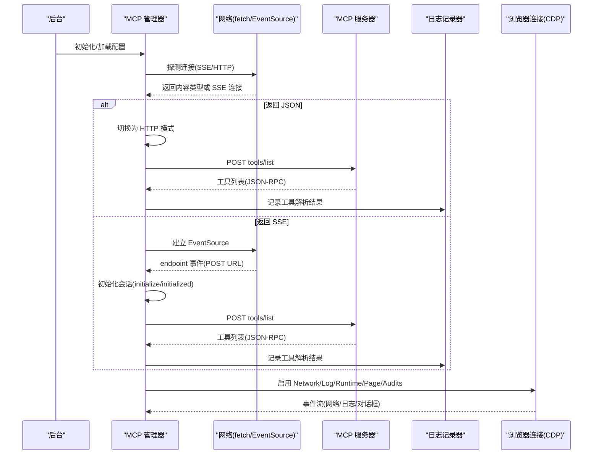
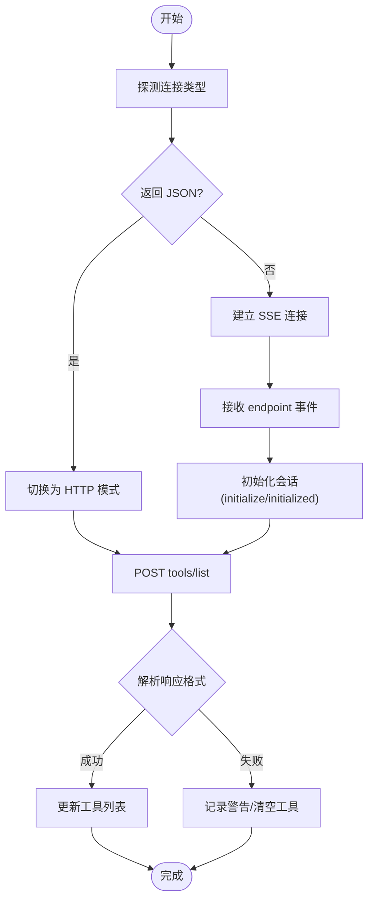
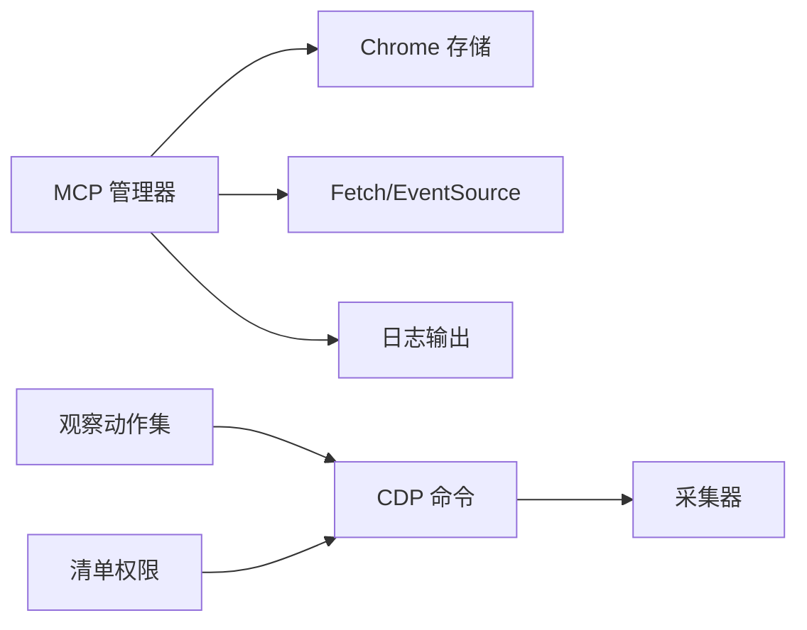

# 调试技巧

<cite>
**本文引用的文件**
- [mcp_manager.js](file://background/managers/mcp_manager.js)
- [logger.js](file://lib/logger.js)
- [connection.js](file://background/control/connection.js)
- [observation.js](file://background/control/actions/observation.js)
- [collectors.js](file://background/control/collectors.js)
- [manifest.json](file://manifest.json)
</cite>

## 目录
1. [简介](#简介)
2. [项目结构](#项目结构)
3. [核心组件](#核心组件)
4. [架构总览](#架构总览)
5. [详细组件分析](#详细组件分析)
6. [依赖关系分析](#依赖关系分析)
7. [性能与稳定性考量](#性能与稳定性考量)
8. [故障排查指南](#故障排查指南)
9. [结论](#结论)
10. [附录：浏览器开发者工具使用步骤](#附录浏览器开发者工具使用步骤)

## 简介
本指南聚焦于 MCP（Model Context Protocol）功能的调试实践，围绕 MCPManager 的 getDebugInfo 方法与丰富的日志输出，系统讲解如何通过控制台日志诊断连接问题（SSE 连接失败、HTTP 模式自动切换、工具列表获取错误），以及如何利用 getDebugInfo 获取服务器状态、连接 URL 和工具数量等关键信息。同时提供常见问题的解决方案（CORS 错误、认证失败、工具调用超时），并给出使用浏览器开发者工具监控网络请求与消息传递的具体步骤。

## 项目结构
与 MCP 调试直接相关的模块主要分布在以下位置：
- 后台管理与连接：MCP 管理器、日志记录器、浏览器连接与事件采集
- 前端交互与状态展示：侧边栏 MCP 控制器通过 postMessage 与后台通信，接收并渲染 MCP 状态

图表来源
- [mcp_manager.js](file://background/managers/mcp_manager.js#L1-L530)
- [logger.js](file://lib/logger.js#L1-L53)
- [connection.js](file://background/control/connection.js#L1-L147)
- [collectors.js](file://background/control/collectors.js#L1-L198)
- [observation.js](file://background/control/actions/observation.js#L1-L200)

章节来源
- [mcp_manager.js](file://background/managers/mcp_manager.js#L1-L530)
- [logger.js](file://lib/logger.js#L1-L53)
- [connection.js](file://background/control/connection.js#L1-L147)
- [collectors.js](file://background/control/collectors.js#L1-L198)
- [observation.js](file://background/control/actions/observation.js#L1-L200)

## 核心组件
- MCP 管理器：负责加载配置、建立连接（SSE 或 HTTP）、自动模式切换、工具列表刷新、请求/通知发送、消息处理与超时控制，并提供 getDebugInfo 输出调试信息。
- 日志记录器：统一格式化日志并通过消息通道转发到后台，便于集中查看。
- 浏览器连接（CDP）：启用 Network、Log、Runtime、Page、Audits 等域，收集网络与页面事件，辅助诊断 CORS、认证与异常等问题。
- 观察动作集：提供网络活动查询、请求详情获取、日志导出等能力，配合 CDP 收集器进行深入分析。
- 事件采集器：维护网络请求历史、日志与对话框状态，支持按类型筛选与请求详情检索。

章节来源
- [mcp_manager.js](file://background/managers/mcp_manager.js#L1-L530)
- [logger.js](file://lib/logger.js#L1-L53)
- [connection.js](file://background/control/connection.js#L1-L147)
- [observation.js](file://background/control/actions/observation.js#L1-L200)
- [collectors.js](file://background/control/collectors.js#L1-L198)

## 架构总览
下图展示了 MCP 管理器在连接建立、模式切换、工具列表获取与消息处理中的关键流程，以及与日志与 CDP 的交互。

图表来源
- [mcp_manager.js](file://background/managers/mcp_manager.js#L71-L150)
- [mcp_manager.js](file://background/managers/mcp_manager.js#L152-L213)
- [mcp_manager.js](file://background/managers/mcp_manager.js#L262-L285)
- [connection.js](file://background/control/connection.js#L60-L106)
- [collectors.js](file://background/control/collectors.js#L10-L54)

## 详细组件分析

### MCP 管理器（MCPManager）
- 连接建立与模式探测
  - 首先探测 URL 的内容类型；若返回 JSON，则自动切换为 HTTP 模式并使用 POST 直连工具列表接口。
  - 若返回 SSE，则建立 EventSource 并监听 endpoint 事件以获取 POST URL，随后初始化会话并拉取工具列表。
- 工具列表获取
  - 在 HTTP 模式下，直接 POST tools/list 并兼容多种响应格式（result.tools、tools、result 数组、直接数组）。
  - 在 SSE 模式下，通过 JSON-RPC 请求 tools/list 并等待 SSE 回包。
- 请求与通知
  - 发送 JSON-RPC 请求时内置 10 秒超时；SSE 模式下通过消息 ID 关联响应。
  - HTTP 模式下提供独立的 sendRequestHttp，用于直接等待服务器响应。
- 调试输出
  - getDebugInfo 输出每个服务器的状态、类型、URL、POST URL、工具数量与工具名称列表，并打印到控制台，便于快速核对配置与运行状态。

图表来源
- [mcp_manager.js](file://background/managers/mcp_manager.js#L101-L113)
- [mcp_manager.js](file://background/managers/mcp_manager.js#L152-L213)
- [mcp_manager.js](file://background/managers/mcp_manager.js#L287-L306)

章节来源
- [mcp_manager.js](file://background/managers/mcp_manager.js#L71-L150)
- [mcp_manager.js](file://background/managers/mcp_manager.js#L152-L213)
- [mcp_manager.js](file://background/managers/mcp_manager.js#L262-L306)
- [mcp_manager.js](file://background/managers/mcp_manager.js#L389-L403)

### 日志记录器（Logger）
- 统一的日志级别输出（INFO/WARN/ERROR），并在后台环境中通过消息通道转发日志条目，便于集中查看与持久化。
- 适用于 MCP 管理器内部的调试输出，也支持在不同上下文（背景页、沙盒 iframe）中工作。

章节来源
- [logger.js](file://lib/logger.js#L1-L53)

### 浏览器连接与事件采集（CDP）
- 启用 Network、Log、Runtime、Page、Audits 等域，收集网络请求、页面日志、异常与安全问题（如 CORS）。
- 提供网络活动概览、请求列表与请求详情（含请求/响应头、请求体、响应体），并支持按资源类型过滤。

章节来源
- [connection.js](file://background/control/connection.js#L60-L106)
- [collectors.js](file://background/control/collectors.js#L4-L90)
- [collectors.js](file://background/control/collectors.js#L92-L147)
- [observation.js](file://background/control/actions/observation.js#L143-L200)

## 依赖关系分析
- MCP 管理器依赖浏览器存储读写（配置加载/保存）、fetch 与 EventSource（连接与消息）、本地日志输出。
- 观察动作集依赖 CDP 命令（Network、Runtime、Page、Audits）与采集器，用于网络与日志的深度分析。
- manifest.json 中声明了 debugger 权限，确保后台可启用 CDP 域并收集网络与日志事件。

图表来源
- [mcp_manager.js](file://background/managers/mcp_manager.js#L21-L61)
- [observation.js](file://background/control/actions/observation.js#L143-L200)
- [collectors.js](file://background/control/collectors.js#L173-L198)
- [manifest.json](file://manifest.json#L6-L10)

章节来源
- [mcp_manager.js](file://background/managers/mcp_manager.js#L21-L61)
- [observation.js](file://background/control/actions/observation.js#L143-L200)
- [collectors.js](file://background/control/collectors.js#L173-L198)
- [manifest.json](file://manifest.json#L6-L10)

## 性能与稳定性考量
- SSE 连接与 HTTP 模式的自动切换提升了兼容性，避免因服务器返回类型不一致导致的失败。
- 工具列表获取在 HTTP 模式下直接 POST，减少不必要的长连接开销。
- 请求超时控制（默认 10 秒）防止阻塞，便于快速定位慢响应或网络异常。
- CDP 采集器限制最大历史项数，避免内存占用过高。

章节来源
- [mcp_manager.js](file://background/managers/mcp_manager.js#L101-L113)
- [mcp_manager.js](file://background/managers/mcp_manager.js#L324-L351)
- [collectors.js](file://background/control/collectors.js#L5-L90)

## 故障排查指南

### 使用控制台日志诊断连接问题
- SSE 连接失败
  - 现象：控制台出现 SSE 错误日志，服务器状态标记为 error。
  - 排查要点：检查服务器是否返回正确的 SSE 内容类型；确认 URL 可达且未被 CSP/CORS 阻断。
  - 参考路径：[mcp_manager.js](file://background/managers/mcp_manager.js#L122-L125)
- HTTP 模式切换
  - 现象：探测到服务器返回 JSON，自动切换为 HTTP 模式并使用 POST 直连工具列表。
  - 排查要点：确认服务器支持 JSON-RPC POST；检查 POST URL 是否正确。
  - 参考路径：[mcp_manager.js](file://background/managers/mcp_manager.js#L107-L113)
- 工具列表获取错误
  - 现象：工具数量为 0，或出现“无法解析工具响应”的警告。
  - 排查要点：检查服务器返回的 JSON-RPC 结构是否符合预期（result.tools、tools、result 数组、直接数组）。
  - 参考路径：[mcp_manager.js](file://background/managers/mcp_manager.js#L181-L212)

### 利用 getDebugInfo 快速核对状态
- 输出字段说明
  - status：服务器当前状态（disconnected/connecting/connected/error）
  - type：服务器类型（默认 SSE，或 streamable_http/http）
  - url：配置中的 URL 或 endpoint
  - postUrl：SSE 模式下的 POST URL（由 endpoint 事件提供）
  - toolCount：工具数量
  - tools：工具名称列表
- 使用建议
  - 在控制台执行 getDebugInfo，对比各服务器的 status 与 toolCount，确认是否正确连接与获取工具。
  - 若 status 为 error，结合日志与网络面板进一步定位。
- 参考路径：[mcp_manager.js](file://background/managers/mcp_manager.js#L389-L403)

### 常见问题与解决方案
- CORS 错误
  - 现象：网络面板显示跨域错误，请求被阻止。
  - 解决方案：确认服务器已正确设置跨域头；在浏览器开发者工具的网络面板中查看请求/响应头；必要时调整服务器 CORS 配置。
  - 参考路径：[collectors.js](file://background/control/collectors.js#L30-L54)，[observation.js](file://background/control/actions/observation.js#L143-L200)
- 认证失败
  - 现象：服务器返回 401/403 或无权限访问。
  - 解决方案：检查服务器端认证机制与凭据传递方式；确认扩展权限与 host_permissions 设置；必要时在服务器端增加允许的来源或令牌校验逻辑。
  - 参考路径：[manifest.json](file://manifest.json#L7-L10)
- 工具调用超时
  - 现象：sendRequest 超时（默认 10 秒），返回 Timeout 错误。
  - 解决方案：检查服务器处理能力与网络延迟；适当延长超时时间（需修改源码）；优化服务器端实现。
  - 参考路径：[mcp_manager.js](file://background/managers/mcp_manager.js#L324-L351)

### 使用浏览器开发者工具监控网络请求与消息传递
- 打开开发者工具（F12），切换到“网络”标签页，观察 MCP 服务器的请求与响应。
- 在“控制台”中执行 getDebugInfo，核对服务器状态与工具数量。
- 使用“观察动作集”提供的网络活动查询与请求详情获取，定位具体失败点。
- 参考路径：
  - [observation.js](file://background/control/actions/observation.js#L143-L200)
  - [collectors.js](file://background/control/collectors.js#L74-L90)

章节来源
- [mcp_manager.js](file://background/managers/mcp_manager.js#L122-L125)
- [mcp_manager.js](file://background/managers/mcp_manager.js#L107-L113)
- [mcp_manager.js](file://background/managers/mcp_manager.js#L181-L212)
- [mcp_manager.js](file://background/managers/mcp_manager.js#L389-L403)
- [mcp_manager.js](file://background/managers/mcp_manager.js#L324-L351)
- [collectors.js](file://background/control/collectors.js#L30-L54)
- [collectors.js](file://background/control/collectors.js#L74-L90)
- [observation.js](file://background/control/actions/observation.js#L143-L200)
- [manifest.json](file://manifest.json#L7-L10)

## 结论
通过 MCPManager 的丰富日志输出与 getDebugInfo 的结构化信息，结合浏览器开发者工具与 CDP 采集器，可以高效定位并解决 MCP 连接与工具调用过程中的各类问题。建议在开发与集成阶段始终开启控制台日志与网络监控，以便快速识别 SSE 失败、HTTP 模式切换、CORS 与认证异常、工具列表解析错误以及请求超时等典型问题。

## 附录：浏览器开发者工具使用步骤
- 打开开发者工具（F12）
- 切换到“网络”标签页，过滤与 MCP 服务器相关的请求
- 切换到“控制台”，执行 getDebugInfo，复制输出并核对各服务器状态与工具数量
- 如需进一步分析，使用“观察动作集”的网络活动查询与请求详情获取，查看请求/响应头、请求体与响应体
- 若出现 CORS 或认证问题，重点检查网络面板中的错误信息与响应头

章节来源
- [observation.js](file://background/control/actions/observation.js#L143-L200)
- [collectors.js](file://background/control/collectors.js#L74-L90)