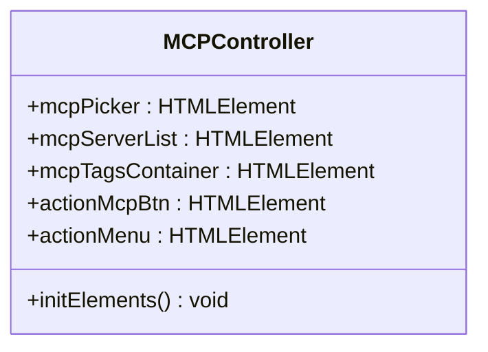
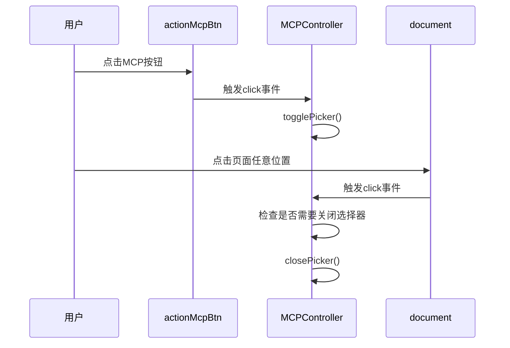
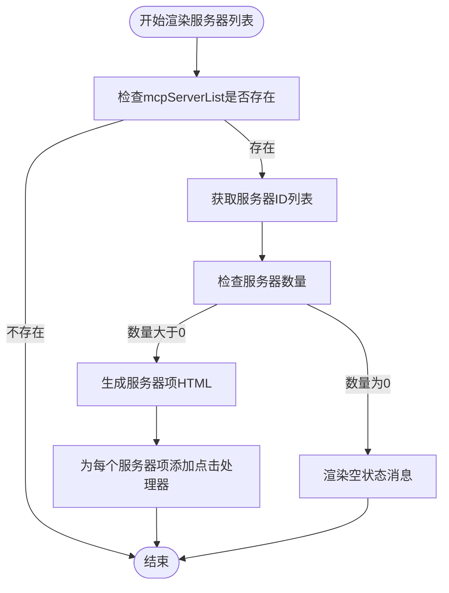
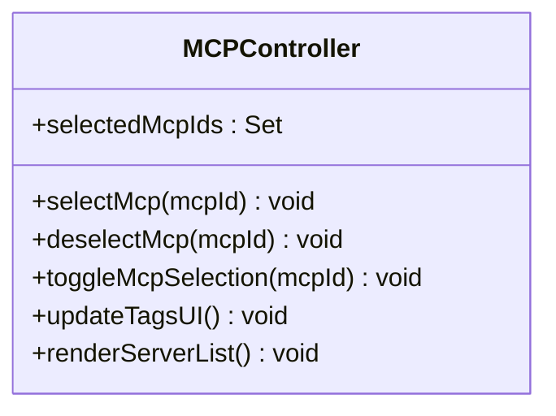
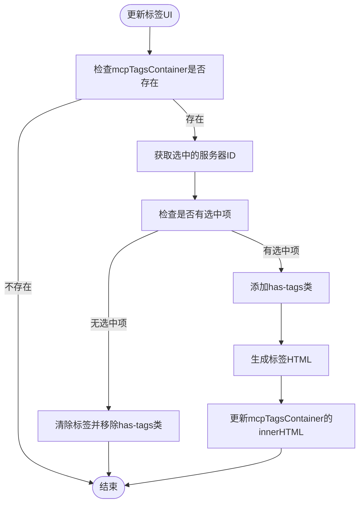
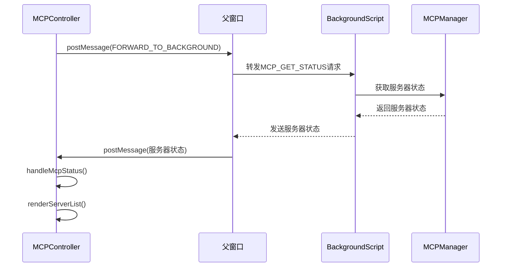
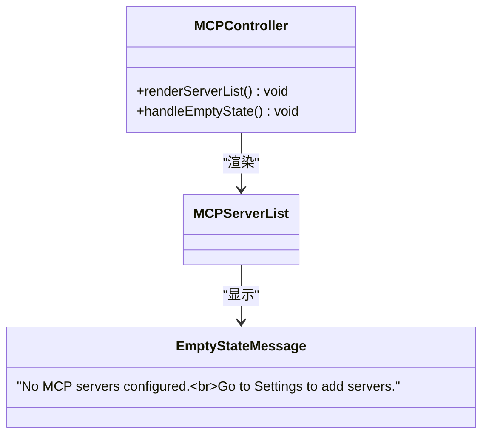

# UI集成

<cite>
**本文档中引用的文件**  
- [mcp_controller.js](file://sandbox/controllers/mcp_controller.js)
- [app_controller.js](file://sandbox/controllers/app_controller.js)
- [message_handler.js](file://sandbox/controllers/message_handler.js)
- [index.html](file://sandbox/index.html)
- [layout.js](file://sandbox/ui/layout.js)
- [components.css](file://css/components.css)
</cite>

## 目录
1. [MCP控制器概述](#mcp控制器概述)
2. [UI元素初始化](#ui元素初始化)
3. [事件监听器初始化](#事件监听器初始化)
4. [服务器列表渲染](#服务器列表渲染)
5. [服务器选择逻辑](#服务器选择逻辑)
6. [标签UI更新](#标签ui更新)
7. [与后台通信](#与后台通信)
8. [空状态处理](#空状态处理)
9. [沙箱环境中的DOM操作](#沙箱环境中的dom操作)

## MCP控制器概述

MCPController类负责在用户界面中管理MCP（Model Context Protocol）服务器的选择和状态。该控制器通过`initElements`、`initListeners`、`renderServerList`和`selectMcp`等方法构建服务器选择器界面，实现完整的UI状态管理流程。

**Section sources**
- [mcp_controller.js](file://sandbox/controllers/mcp_controller.js#L5-L221)

## UI元素初始化

`initElements`方法负责初始化MCP选择器相关的DOM元素。该方法通过`document.getElementById`获取界面中的关键元素，为后续的渲染和交互提供引用。



**Diagram sources**
- [mcp_controller.js](file://sandbox/controllers/mcp_controller.js#L15-L21)

**Section sources**
- [mcp_controller.js](file://sandbox/controllers/mcp_controller.js#L15-L21)

## 事件监听器初始化

`initListeners`方法设置各种事件监听器，实现用户交互功能。主要包括：
- 点击MCP菜单项时打开选择器
- 点击外部区域时关闭选择器
- 处理标签移除事件



**Diagram sources**
- [mcp_controller.js](file://sandbox/controllers/mcp_controller.js#L23-L55)

**Section sources**
- [mcp_controller.js](file://sandbox/controllers/mcp_controller.js#L23-L55)

## 服务器列表渲染

`renderServerList`方法负责渲染服务器列表，根据服务器状态显示相应的UI元素。该方法处理了服务器列表为空的情况，显示相应的提示信息。



**Diagram sources**
- [mcp_controller.js](file://sandbox/controllers/mcp_controller.js#L101-L147)

**Section sources**
- [mcp_controller.js](file://sandbox/controllers/mcp_controller.js#L101-L147)

## 服务器选择逻辑

`selectMcp`和`deselectMcp`方法处理服务器的选择和取消选择逻辑。当用户选择或取消选择服务器时，这些方法会更新内部状态并触发UI更新。



**Diagram sources**
- [mcp_controller.js](file://sandbox/controllers/mcp_controller.js#L149-L167)

**Section sources**
- [mcp_controller.js](file://sandbox/controllers/mcp_controller.js#L149-L167)

## 标签UI更新

`updateTagsUI`方法负责同步选中状态到标签显示。当服务器选择状态改变时，该方法会更新标签容器的内容，显示当前选中的服务器。



**Diagram sources**
- [mcp_controller.js](file://sandbox/controllers/mcp_controller.js#L169-L197)

**Section sources**
- [mcp_controller.js](file://sandbox/controllers/mcp_controller.js#L169-L197)

## 与后台通信

`requestMcpStatus`方法通过`window.parent.postMessage`与后台通信，获取服务器状态信息。`handleMcpStatus`方法接收来自后台的服务器状态数据并更新UI。



**Diagram sources**
- [mcp_controller.js](file://sandbox/controllers/mcp_controller.js#L88-L98)
- [message_handler.js](file://sandbox/controllers/message_handler.js#L82-L84)

**Section sources**
- [mcp_controller.js](file://sandbox/controllers/mcp_controller.js#L88-L98)
- [message_handler.js](file://sandbox/controllers/message_handler.js#L82-L84)

## 空状态处理

当没有配置MCP服务器时，`renderServerList`方法会显示空状态消息，提示用户前往设置页面添加服务器。这种设计提供了良好的用户体验，指导用户完成必要的配置。



**Diagram sources**
- [mcp_controller.js](file://sandbox/controllers/mcp_controller.js#L106-L113)

**Section sources**
- [mcp_controller.js](file://sandbox/controllers/mcp_controller.js#L106-L113)

## 沙箱环境中的DOM操作

在沙箱环境中，MCPController通过`window.parent.postMessage`与父窗口通信，同时直接操作沙箱内的DOM元素。这种设计确保了安全性和功能性的平衡。

```mermaid
graph TB
subgraph "沙箱环境"
MCPController
DOMElements["DOM元素<br>(mcp-picker, mcp-server-list等)"]
end
subgraph "父窗口/后台"
BackgroundScript
MCPManager
end
MCPController --> DOMElements : "直接操作"
MCPController --> BackgroundScript : "postMessage通信"
BackgroundScript --> MCPManager : "调用方法"
MCPManager --> BackgroundScript : "返回数据"
BackgroundScript --> MCPController : "postMessage返回"
```

**Diagram sources**
- [mcp_controller.js](file://sandbox/controllers/mcp_controller.js#L88-L93)
- [mcp_controller.js](file://sandbox/controllers/mcp_controller.js#L15-L21)

**Section sources**
- [mcp_controller.js](file://sandbox/controllers/mcp_controller.js#L88-L93)
- [mcp_controller.js](file://sandbox/controllers/mcp_controller.js#L15-L21)