# 后端集成

<cite>
**本文引用的文件**
- [mcp_manager.js](file://background/managers/mcp_manager.js)
- [messages.js](file://background/messages.js)
- [index.js](file://background/index.js)
- [session_manager.js](file://background/managers/session_manager.js)
- [tool_executor.js](file://background/handlers/session/prompt/tool_executor.js)
- [utils.js](file://background/handlers/session/utils.js)
- [control_manager.js](file://background/managers/control_manager.js)
- [constants.js](file://lib/constants.js)
</cite>

## 目录
1. [简介](#简介)
2. [项目结构](#项目结构)
3. [核心组件](#核心组件)
4. [架构总览](#架构总览)
5. [详细组件分析](#详细组件分析)
6. [依赖关系分析](#依赖关系分析)
7. [性能考量](#性能考量)
8. [故障排查指南](#故障排查指南)
9. [结论](#结论)
10. [附录](#附录)

## 简介
本文件深入解析 Gemini Nexus 中 MCPManager 的后端集成机制，重点覆盖以下方面：
- getAllTools 与 getSystemPrompt 如何为 Gemini 提供工具列表与系统提示
- connectServer 如何依据配置选择 SSE 或 HTTP 连接模式
- refreshToolsHttp 如何兼容多种工具列表响应格式
- executeTool 的工具调用流程（HTTP 模式与 SSE 模式的差异）
- chrome.storage.local 对 MCP 服务器配置的持久化管理
- initializeSession 中 JSON-RPC 协议初始化过程
- 从配置加载到工具执行的完整后端集成链路

## 项目结构
与 MCP 后端集成直接相关的模块主要位于 background 目录：
- managers：MCP 管理器、会话管理器、浏览器控制管理器
- handlers：会话处理器、工具执行器、通用工具
- lib：常量定义
- 入口：background/index.js 初始化各管理器并启动 MCP 连接
- 消息桥接：background/messages.js 将前端设置面板与后台管理器对接

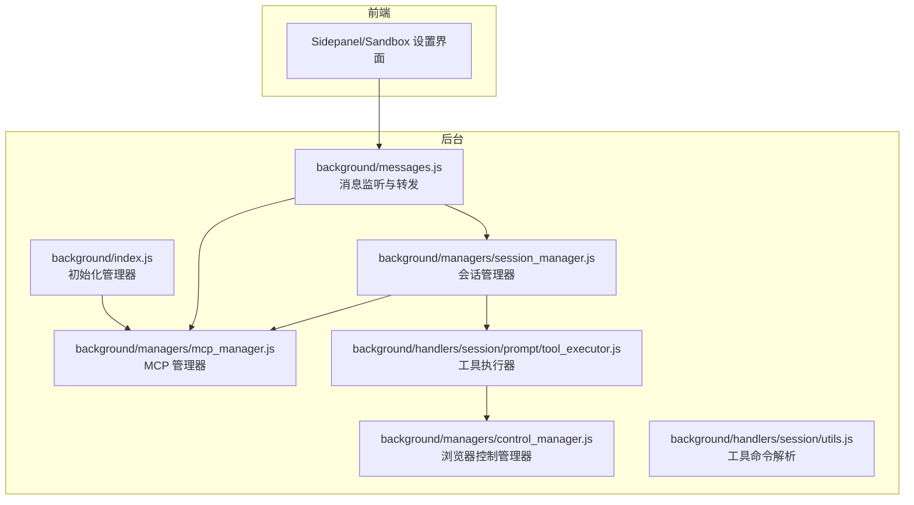

图表来源
- [index.js](file://background/index.js#L16-L26)
- [messages.js](file://background/messages.js#L14-L81)
- [mcp_manager.js](file://background/managers/mcp_manager.js#L2-L19)
- [session_manager.js](file://background/managers/session_manager.js#L6-L15)
- [tool_executor.js](file://background/handlers/session/prompt/tool_executor.js#L4-L7)
- [utils.js](file://background/handlers/session/utils.js#L4-L21)
- [control_manager.js](file://background/managers/control_manager.js#L11-L16)

章节来源
- [index.js](file://background/index.js#L16-L26)
- [messages.js](file://background/messages.js#L14-L81)

## 核心组件
- MCPManager：负责 MCP 服务器配置加载、连接建立、工具列表刷新、JSON-RPC 请求/通知发送、SSE 消息处理、工具执行与系统提示生成
- SessionManager：在向 Gemini 发送消息前注入 MCP 工具提示；检测并执行 Gemini 返回的工具调用
- ToolExecutor：解析 Gemini 输出中的工具调用指令并委派给 BrowserControlManager 执行
- BrowserControlManager：实际执行浏览器控制动作（导航、截图、输入、脚本执行等）
- 消息桥接：messages.js 将前端设置面板与后台管理器对接，支持保存/读取 MCP 配置、获取工具列表与状态

章节来源
- [mcp_manager.js](file://background/managers/mcp_manager.js#L2-L19)
- [session_manager.js](file://background/managers/session_manager.js#L6-L15)
- [tool_executor.js](file://background/handlers/session/prompt/tool_executor.js#L4-L7)
- [control_manager.js](file://background/managers/control_manager.js#L11-L16)
- [messages.js](file://background/messages.js#L14-L81)

## 架构总览
下图展示了从配置加载到工具执行的完整链路，涵盖 SSE/HTTP 模式切换、JSON-RPC 初始化、工具列表拉取、工具调用与结果回传。

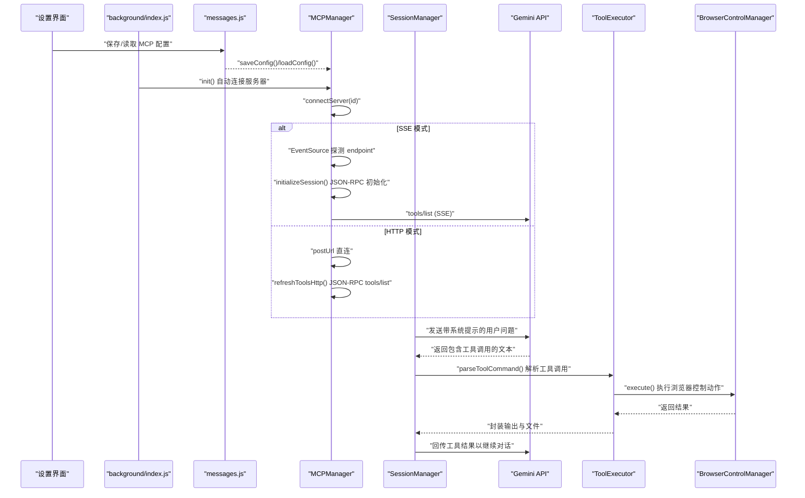

图表来源
- [index.js](file://background/index.js#L21-L26)
- [messages.js](file://background/messages.js#L42-L67)
- [mcp_manager.js](file://background/managers/mcp_manager.js#L71-L150)
- [mcp_manager.js](file://background/managers/mcp_manager.js#L262-L285)
- [mcp_manager.js](file://background/managers/mcp_manager.js#L153-L213)
- [session_manager.js](file://background/managers/session_manager.js#L54-L114)
- [tool_executor.js](file://background/handlers/session/prompt/tool_executor.js#L9-L47)
- [control_manager.js](file://background/managers/control_manager.js#L43-L157)

## 详细组件分析

### MCPManager：后端集成核心
- 配置加载与持久化
  - 使用 chrome.storage.local 存储 MCP 配置键 mcpConfig，内部结构包含 mcpServers 映射
  - loadConfig 从存储读取并初始化内存状态；saveConfig 支持更新配置并自动重建连接
- 连接建立与模式选择
  - connectServer 根据配置的 type 决定连接方式：默认 SSE；当 type 为 streamable_http 或 http 时走 HTTP 模式
  - SSE 模式下先探测内容类型，若返回 JSON 则自动降级为 HTTP 模式
  - SSE 成功后通过 endpoint 事件获取 postUrl 并进入 initializeSession
- JSON-RPC 初始化
  - initializeSession 发送 initialize 请求与 notifications/initialized 通知，随后刷新工具列表
- 工具列表刷新
  - refreshTools：SSE 模式使用 sendRequest 发送 tools/list；HTTP 模式使用 refreshToolsHttp
  - refreshToolsHttp：兼容多种响应格式（result.tools、tools、result 数组、直接数组），统一写入 server.tools
- 请求与通知
  - sendRequest：基于 fetch 发送 JSON-RPC 请求，使用 pendingRequests 映射等待 SSE 回包
  - sendNotification：单向通知，不等待响应
  - sendRequestHttp：HTTP 模式专用，直接等待 POST 响应
- 工具执行
  - executeTool：按工具名查找归属服务器，再根据服务器模式选择 sendRequest 或 sendRequestHttp
- 系统提示生成
  - getAllTools：聚合所有服务器工具，附加 _serverId 标记
  - getSystemPrompt/getSystemPromptForServers：生成面向 Gemini 的系统提示，包含工具清单与调用示例

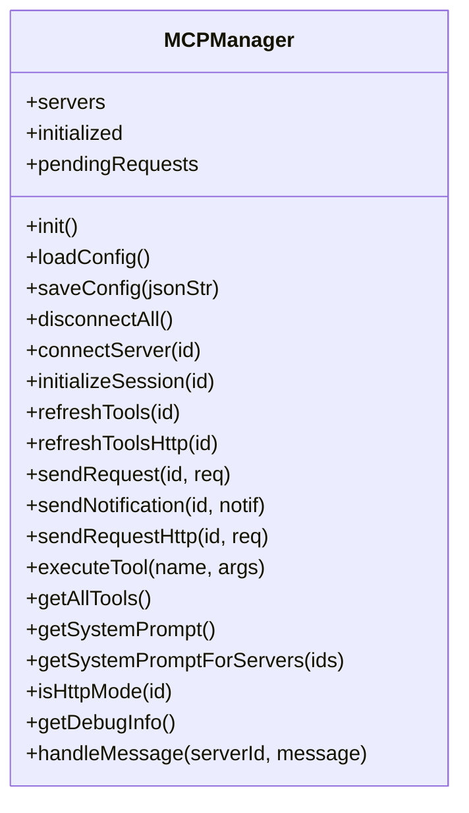

图表来源
- [mcp_manager.js](file://background/managers/mcp_manager.js#L2-L529)

章节来源
- [mcp_manager.js](file://background/managers/mcp_manager.js#L21-L61)
- [mcp_manager.js](file://background/managers/mcp_manager.js#L71-L150)
- [mcp_manager.js](file://background/managers/mcp_manager.js#L153-L213)
- [mcp_manager.js](file://background/managers/mcp_manager.js#L262-L285)
- [mcp_manager.js](file://background/managers/mcp_manager.js#L287-L306)
- [mcp_manager.js](file://background/managers/mcp_manager.js#L308-L351)
- [mcp_manager.js](file://background/managers/mcp_manager.js#L353-L368)
- [mcp_manager.js](file://background/managers/mcp_manager.js#L407-L477)
- [mcp_manager.js](file://background/managers/mcp_manager.js#L479-L525)

### connectServer：SSE 与 HTTP 模式选择
- 输入参数：服务器配置对象（包含 url/endpoint 与 type）
- 处理逻辑：
  - 若 type 为 http/streamable_http：直接使用 postUrl，标记 connected，立即刷新工具
  - 否则尝试 SSE 探测：若服务返回 application/json，则降级为 HTTP 模式
  - SSE 成功后接收 endpoint 事件，设置 postUrl 与 connected，并初始化会话
- 错误处理：无 URL 时标记 error；SSE 错误或探测失败同样标记 error

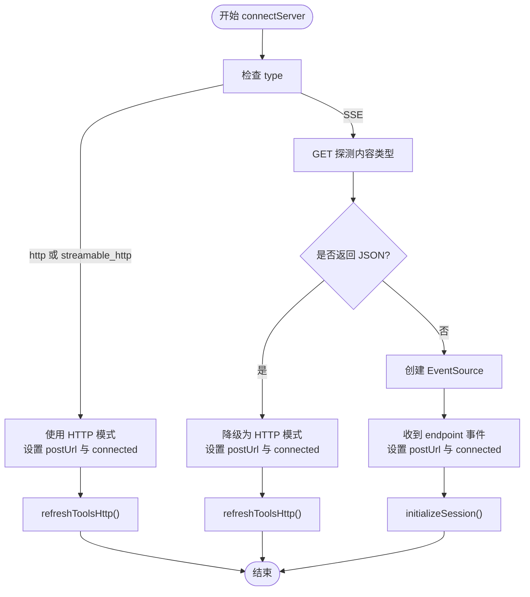

图表来源
- [mcp_manager.js](file://background/managers/mcp_manager.js#L71-L150)

章节来源
- [mcp_manager.js](file://background/managers/mcp_manager.js#L71-L150)

### refreshToolsHttp：多格式工具列表解析
- 请求：向 postUrl 发送 JSON-RPC tools/list
- 响应解析：依次尝试以下四种格式，找到工具数组即采用
  - { result: { tools: [...] } }
  - { tools: [...] }
  - { result: [...] }
  - [...]
- 异常处理：若 result.error 存在或无法解析，清空工具并标记 error

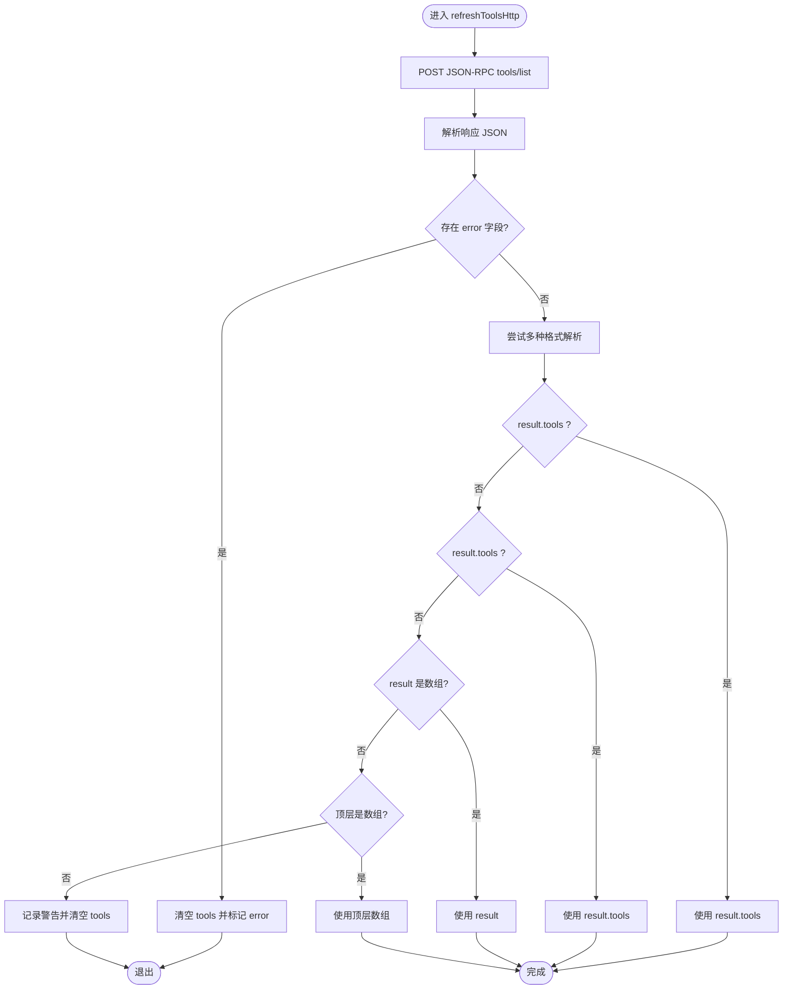

图表来源
- [mcp_manager.js](file://background/managers/mcp_manager.js#L153-L213)

章节来源
- [mcp_manager.js](file://background/managers/mcp_manager.js#L153-L213)

### executeTool：工具调用流程（SSE 与 HTTP 差异）
- 查找目标服务器：遍历工具列表，匹配工具名，确定服务器 ID
- 发送请求：
  - HTTP 模式：使用 sendRequestHttp，直接等待 POST 响应
  - SSE 模式：使用 sendRequest，通过 pendingRequests 映射等待 SSE 回包
- 结果处理：返回工具执行结果（通常包含 content 与 isError）

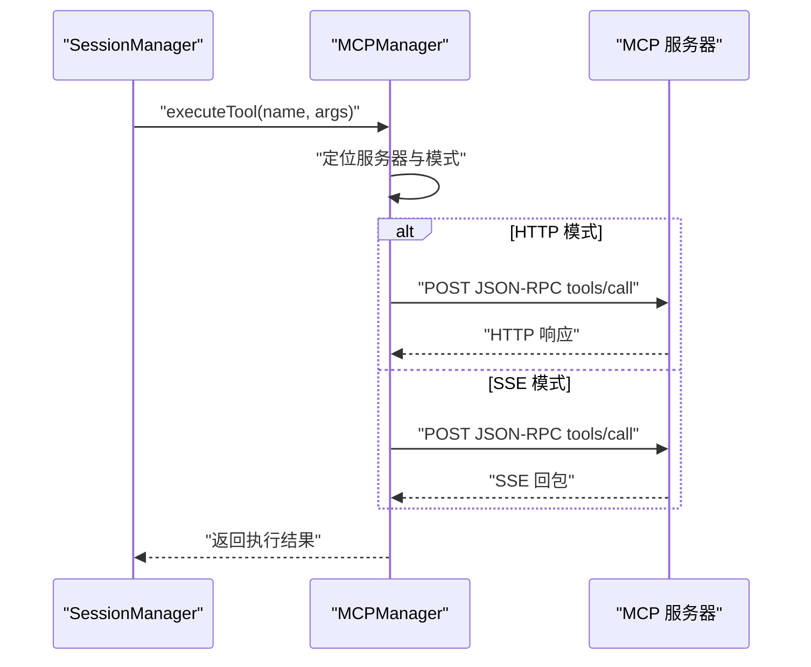

图表来源
- [mcp_manager.js](file://background/managers/mcp_manager.js#L479-L525)
- [mcp_manager.js](file://background/managers/mcp_manager.js#L229-L260)
- [mcp_manager.js](file://background/managers/mcp_manager.js#L308-L351)

章节来源
- [mcp_manager.js](file://background/managers/mcp_manager.js#L479-L525)
- [mcp_manager.js](file://background/managers/mcp_manager.js#L229-L260)
- [mcp_manager.js](file://background/managers/mcp_manager.js#L308-L351)

### getAllTools 与 getSystemPrompt：为 Gemini 提供工具与提示
- getAllTools：遍历所有服务器的工具，附加 _serverId 标记，便于后续追踪来源
- getSystemPrompt/getSystemPromptForServers：
  - 生成系统提示，列出可用工具及其描述与参数结构
  - 包含工具调用示例代码块，指导 Gemini 输出符合规范的工具调用

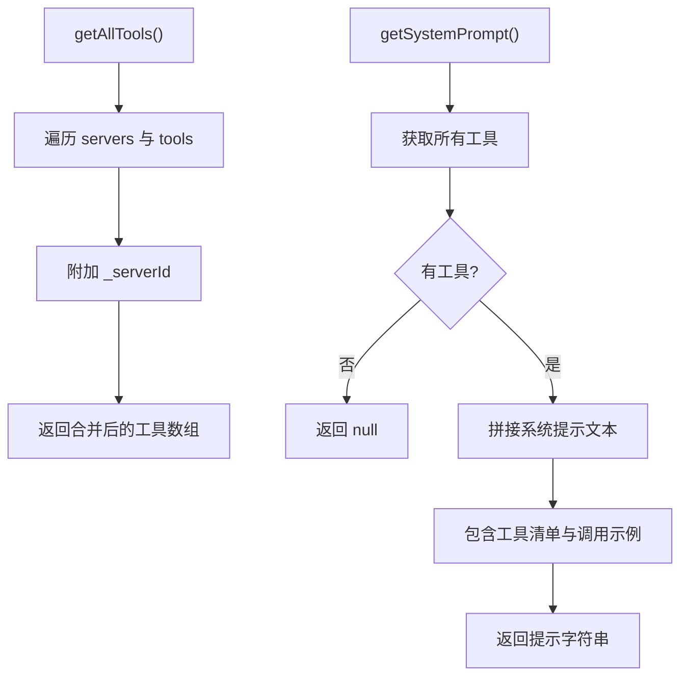

图表来源
- [mcp_manager.js](file://background/managers/mcp_manager.js#L407-L420)
- [mcp_manager.js](file://background/managers/mcp_manager.js#L422-L477)

章节来源
- [mcp_manager.js](file://background/managers/mcp_manager.js#L407-L477)

### chrome.storage.local：MCP 配置管理
- 读取：messages.js 中 MCP_GET_CONFIG 从 chrome.storage.local 获取 mcpConfig
- 保存：messages.js 中 MCP_SAVE_CONFIG 调用 mcpManager.saveConfig，写入存储并重建连接
- 初始化：background/index.js 在启动时调用 mcpManager.init，自动加载配置并连接服务器

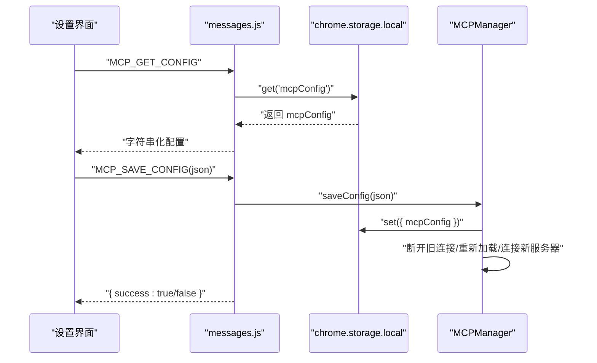

图表来源
- [messages.js](file://background/messages.js#L49-L67)
- [mcp_manager.js](file://background/managers/mcp_manager.js#L40-L61)
- [index.js](file://background/index.js#L21-L26)

章节来源
- [messages.js](file://background/messages.js#L49-L67)
- [mcp_manager.js](file://background/managers/mcp_manager.js#L40-L61)
- [index.js](file://background/index.js#L21-L26)

### initializeSession：JSON-RPC 协议初始化
- 发送 initialize 请求，包含 protocolVersion、capabilities、clientInfo
- 发送 notifications/initialized 通知
- 刷新工具列表（refreshTools）

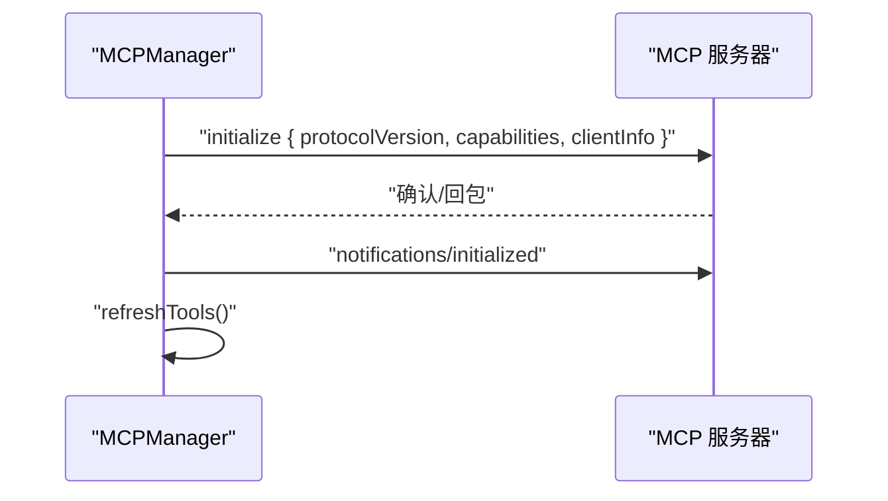

图表来源
- [mcp_manager.js](file://background/managers/mcp_manager.js#L262-L285)

章节来源
- [mcp_manager.js](file://background/managers/mcp_manager.js#L262-L285)

### 从配置加载到工具执行的完整链路
- 配置加载：background/index.js 初始化 MCPManager，触发 loadConfig 与 connectServer
- SSE/HTTP 模式：connectServer 根据 type 与探测结果选择模式；SSE 成功后 endpoint 事件提供 postUrl
- 工具列表：refreshTools/refreshToolsHttp 拉取工具并写入内存
- 系统提示：SessionManager 注入 getSystemPromptForServers 生成提示
- 工具调用：SessionManager 检测 Gemini 输出中的工具调用，ToolExecutor 解析后交由 BrowserControlManager 执行

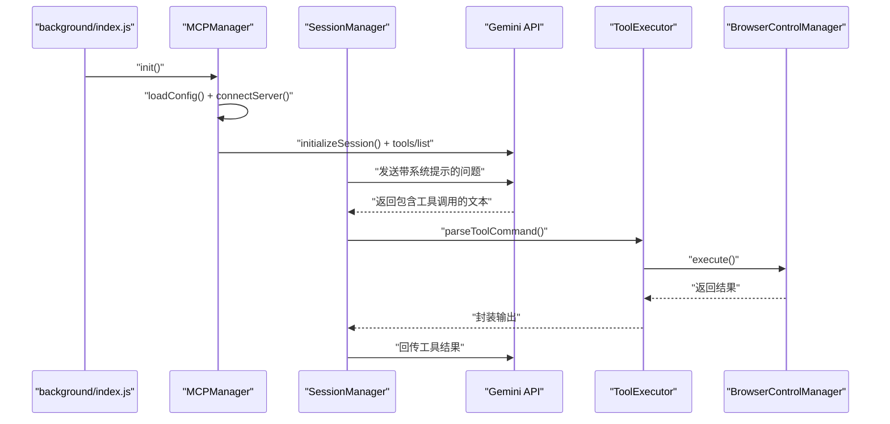

图表来源
- [index.js](file://background/index.js#L21-L26)
- [mcp_manager.js](file://background/managers/mcp_manager.js#L71-L150)
- [mcp_manager.js](file://background/managers/mcp_manager.js#L262-L285)
- [session_manager.js](file://background/managers/session_manager.js#L54-L114)
- [tool_executor.js](file://background/handlers/session/prompt/tool_executor.js#L9-L47)
- [control_manager.js](file://background/managers/control_manager.js#L43-L157)

章节来源
- [index.js](file://background/index.js#L21-L26)
- [mcp_manager.js](file://background/managers/mcp_manager.js#L71-L150)
- [mcp_manager.js](file://background/managers/mcp_manager.js#L262-L285)
- [session_manager.js](file://background/managers/session_manager.js#L54-L114)
- [tool_executor.js](file://background/handlers/session/prompt/tool_executor.js#L9-L47)
- [control_manager.js](file://background/managers/control_manager.js#L43-L157)

## 依赖关系分析
- MCPManager 依赖：
  - chrome.storage.local：配置持久化
  - EventSource/fetch：SSE/HTTP 通信
  - pendingRequests：SSE 响应关联
- SessionManager 依赖：
  - MCPManager：获取系统提示与工具列表
  - Gemini API：发送消息与接收工具调用
- ToolExecutor 依赖：
  - utils.js：parseToolCommand
  - BrowserControlManager：执行浏览器控制动作
- BrowserControlManager 依赖：
  - BrowserConnection/SnapshotManager/BrowserActions：浏览器控制能力

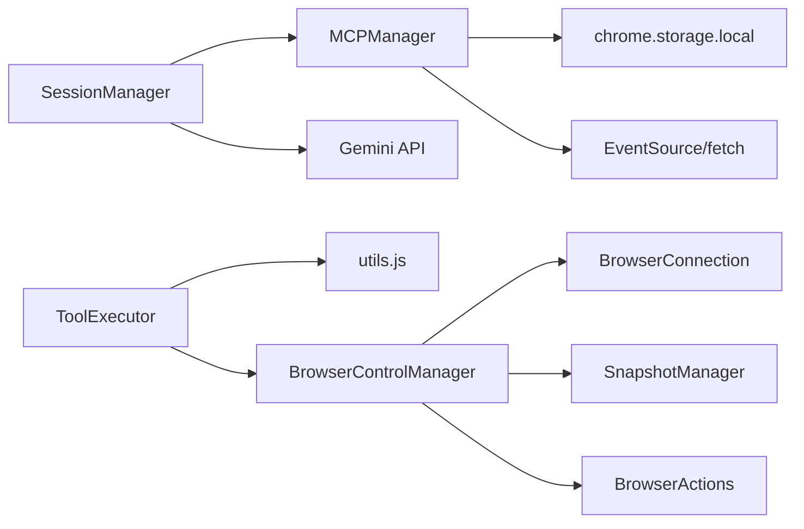

图表来源
- [mcp_manager.js](file://background/managers/mcp_manager.js#L21-L61)
- [session_manager.js](file://background/managers/session_manager.js#L6-L15)
- [tool_executor.js](file://background/handlers/session/prompt/tool_executor.js#L4-L7)
- [utils.js](file://background/handlers/session/utils.js#L4-L21)
- [control_manager.js](file://background/managers/control_manager.js#L11-L16)

章节来源
- [mcp_manager.js](file://background/managers/mcp_manager.js#L21-L61)
- [session_manager.js](file://background/managers/session_manager.js#L6-L15)
- [tool_executor.js](file://background/handlers/session/prompt/tool_executor.js#L4-L7)
- [utils.js](file://background/handlers/session/utils.js#L4-L21)
- [control_manager.js](file://background/managers/control_manager.js#L11-L16)

## 性能考量
- 连接建立：SSE 探测与 endpoint 事件可能带来额外网络往返；HTTP 模式可减少握手成本
- 工具列表刷新：refreshToolsHttp 仅一次请求；SSE 模式需等待 endpoint 事件与后续 tools/list
- 请求等待：SSE 模式通过 pendingRequests 实现超时控制，避免长时间挂起
- 浏览器控制：BrowserControlManager 在执行前确保连接有效，避免无效操作导致的重试

## 故障排查指南
- 无 URL/Endpoint：connectServer 会标记 error；检查配置键值
- SSE 探测失败：若服务返回 JSON，自动降级为 HTTP 模式；否则标记 error
- 工具列表为空：refreshToolsHttp 无法解析响应时会清空 tools；检查服务器返回格式
- 工具未找到：executeTool 会抛出错误并列出可用工具名称
- JSON-RPC 错误：sendRequest/sendRequestHttp 会在 result.error 或 HTTP 非 OK 时抛错
- 日志与调试：getDebugInfo 可查看各服务器状态、URL、postUrl、工具数量与名称

章节来源
- [mcp_manager.js](file://background/managers/mcp_manager.js#L79-L83)
- [mcp_manager.js](file://background/managers/mcp_manager.js#L106-L113)
- [mcp_manager.js](file://background/managers/mcp_manager.js#L173-L212)
- [mcp_manager.js](file://background/managers/mcp_manager.js#L501-L506)
- [mcp_manager.js](file://background/managers/mcp_manager.js#L340-L350)
- [mcp_manager.js](file://background/managers/mcp_manager.js#L389-L403)

## 结论
MCPManager 通过灵活的连接模式选择、健壮的响应解析与 JSON-RPC 协议初始化，实现了对 SSE 与 HTTP 模式的无缝支持。结合 SessionManager 的系统提示注入与工具调用回传，Gemini Nexus 能够稳定地将模型决策转化为浏览器控制动作。配置持久化与自动重连机制进一步提升了系统的可用性与可靠性。

## 附录
- 默认模型常量：DEFAULT_MODEL 定义于 constants.js，用于会话管理器的模型选择（与 MCP 无直接耦合，但影响整体对话行为）

章节来源
- [constants.js](file://lib/constants.js#L9)