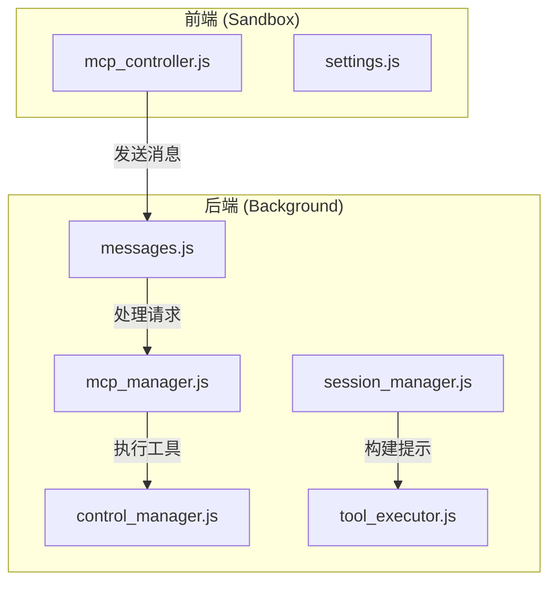
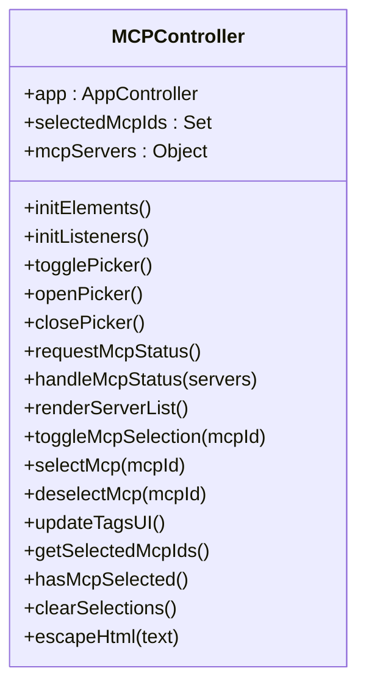
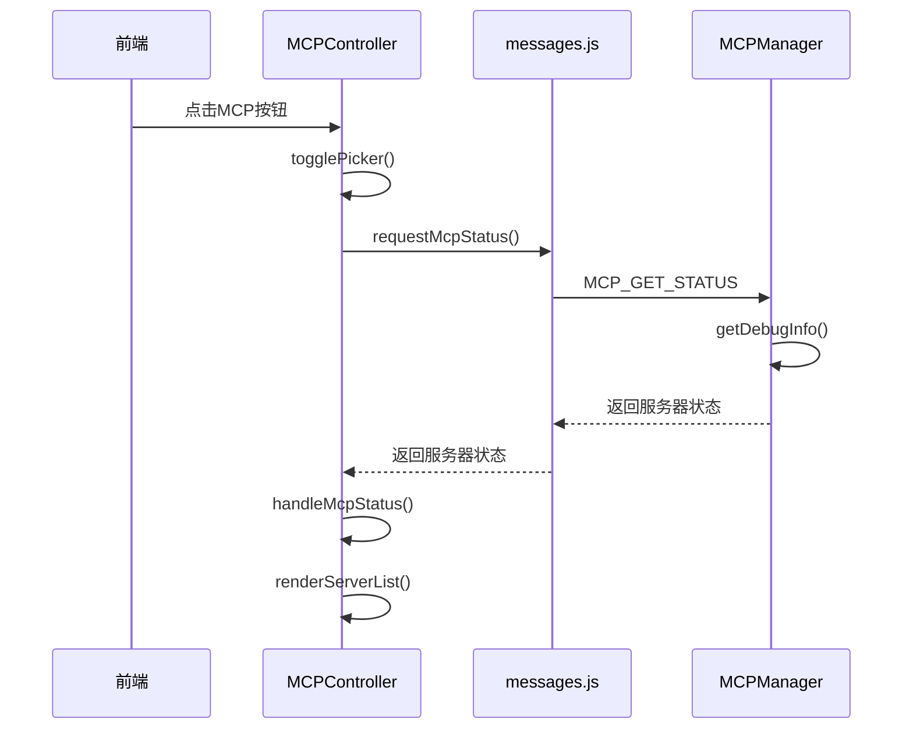
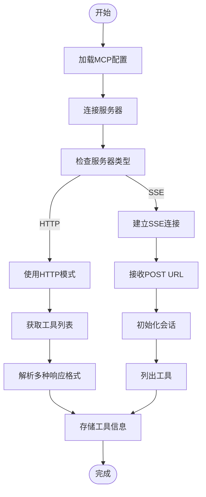
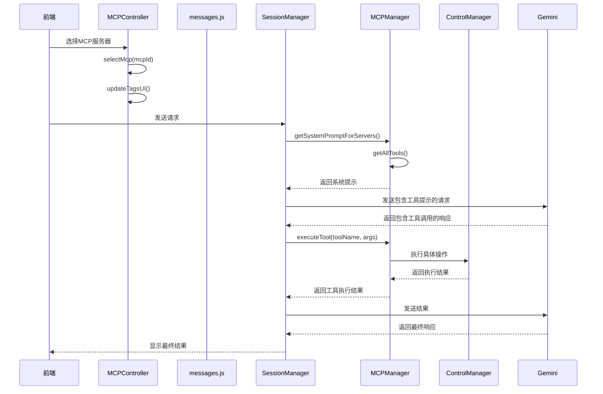
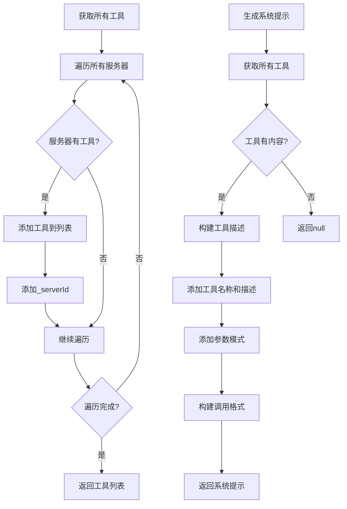
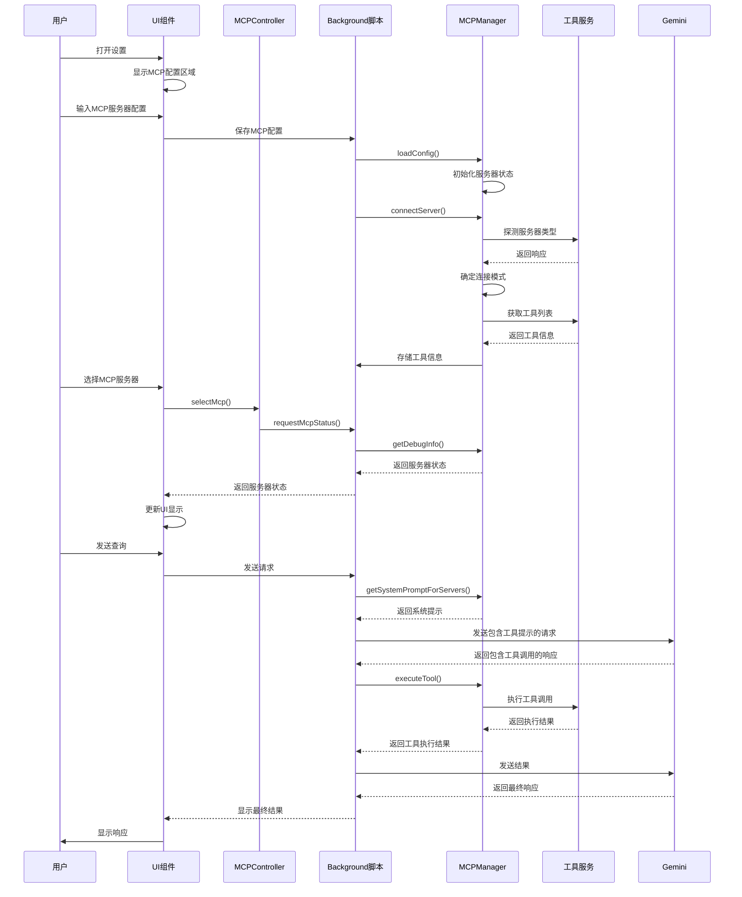

# 集成示例

<cite>
**本文档中引用的文件**  
- [mcp_controller.js](file://sandbox/controllers/mcp_controller.js)
- [mcp_manager.js](file://background/managers/mcp_manager.js)
- [tool_executor.js](file://background/handlers/session/prompt/tool_executor.js)
- [builder.js](file://background/handlers/session/prompt/builder.js)
- [preamble.js](file://background/handlers/session/prompt/preamble.js)
- [control_manager.js](file://background/managers/control_manager.js)
- [messages.js](file://background/messages.js)
- [session_manager.js](file://background/managers/session_manager.js)
- [settings.js](file://sandbox/ui/templates/settings.js)
</cite>

## 目录
1. [项目结构](#项目结构)
2. [MCPController UI组件实现](#mcpcontroller-ui组件实现)
3. [MCPManager后端管理](#mcpmanager后端管理)
4. [工具包装与调用](#工具包装与调用)
5. [消息传递流程](#消息传递流程)
6. [系统提示与工具列表](#系统提示与工具列表)
7. [完整集成流程示例](#完整集成流程示例)

## 项目结构

**Diagram sources**  
- [mcp_controller.js](file://sandbox/controllers/mcp_controller.js)
- [mcp_manager.js](file://background/managers/mcp_manager.js)
- [tool_executor.js](file://background/handlers/session/prompt/tool_executor.js)

**Section sources**  
- [mcp_controller.js](file://sandbox/controllers/mcp_controller.js)
- [mcp_manager.js](file://background/managers/mcp_manager.js)

## MCPController UI组件实现

MCPController负责在UI中处理MCP服务器选择和状态管理。它通过`initElements`方法初始化DOM元素，包括MCP选择器、服务器列表、标签容器等。

**Diagram sources**  
- [mcp_controller.js](file://sandbox/controllers/mcp_controller.js#L5-L221)

**Section sources**  
- [mcp_controller.js](file://sandbox/controllers/mcp_controller.js#L5-L221)

## MCPManager后端管理

MCPManager是后端管理核心，负责加载配置、连接服务器、获取工具列表和执行工具调用。它通过`init`方法初始化，自动连接启用的服务器。

**Diagram sources**  
- [mcp_controller.js](file://sandbox/controllers/mcp_controller.js#L88-L93)
- [messages.js](file://background/messages.js#L63-L66)
- [mcp_manager.js](file://background/managers/mcp_manager.js#L389-L403)

**Section sources**  
- [mcp_manager.js](file://background/managers/mcp_manager.js#L2-L530)

## 工具包装与调用

Python脚本或Node.js服务可以通过MCP协议包装为工具。MCPManager支持多种响应格式，包括标准JSON-RPC格式、直接格式等。

**Diagram sources**  
- [mcp_manager.js](file://background/managers/mcp_manager.js#L71-L150)
- [mcp_manager.js](file://background/managers/mcp_manager.js#L153-L213)

**Section sources**  
- [mcp_manager.js](file://background/managers/mcp_manager.js#L153-L213)

## 消息传递流程

从前端选择到后端执行的完整消息传递流程涉及多个组件的协作。

**Diagram sources**  
- [mcp_controller.js](file://sandbox/controllers/mcp_controller.js#L157-L167)
- [session_manager.js](file://background/managers/session_manager.js#L47-L118)
- [mcp_manager.js](file://background/managers/mcp_manager.js#L479-L525)

**Section sources**  
- [session_manager.js](file://background/managers/session_manager.js#L47-L118)

## 系统提示与工具列表

MCPManager提供`getAllTools`和`getSystemPrompt`方法为Gemini提供工具列表和系统提示。

**Diagram sources**  
- [mcp_manager.js](file://background/managers/mcp_manager.js#L407-L477)

**Section sources**  
- [mcp_manager.js](file://background/managers/mcp_manager.js#L407-L477)

## 完整集成流程示例

完整的MCP功能集成流程从前端UI交互开始，经过消息传递，到后端执行和结果返回。

**Diagram sources**  
- [settings.js](file://sandbox/ui/templates/settings.js#L75-L87)
- [mcp_controller.js](file://sandbox/controllers/mcp_controller.js)
- [mcp_manager.js](file://background/managers/mcp_manager.js)
- [session_manager.js](file://background/managers/session_manager.js)

**Section sources**  
- [settings.js](file://sandbox/ui/templates/settings.js#L75-L87)
- [mcp_controller.js](file://sandbox/controllers/mcp_controller.js)
- [mcp_manager.js](file://background/managers/mcp_manager.js)
- [session_manager.js](file://background/managers/session_manager.js)