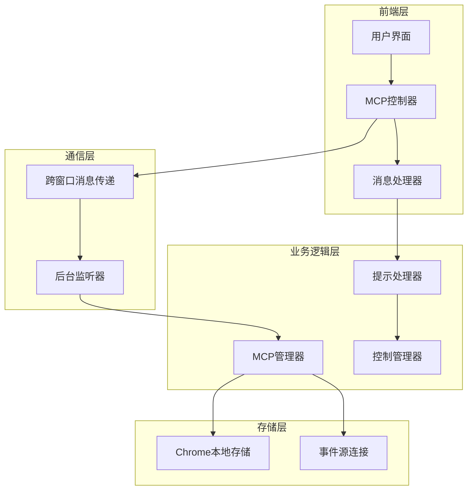
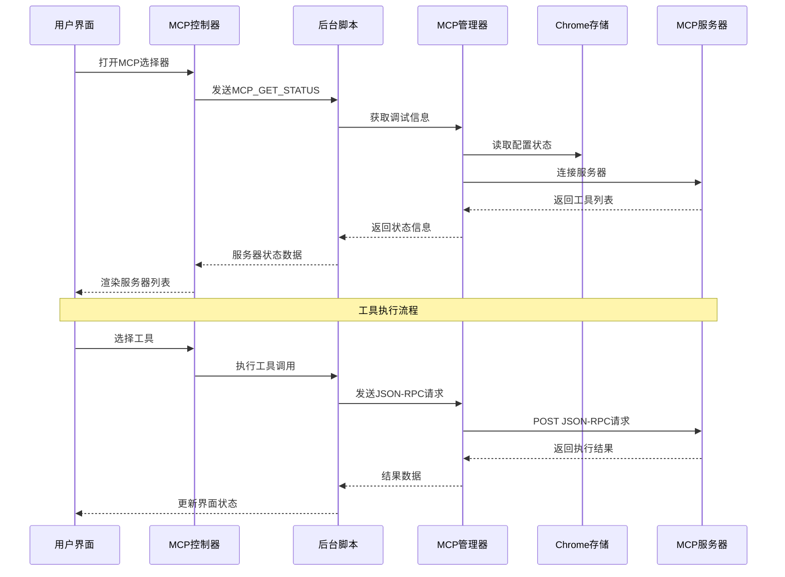
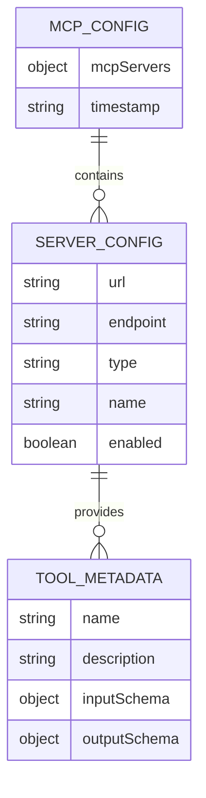
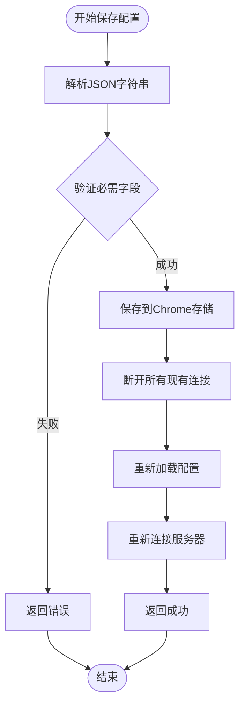
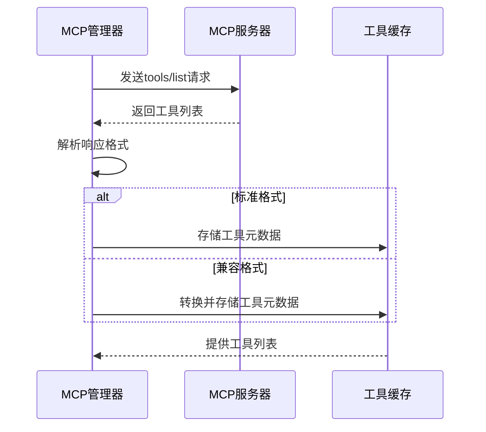
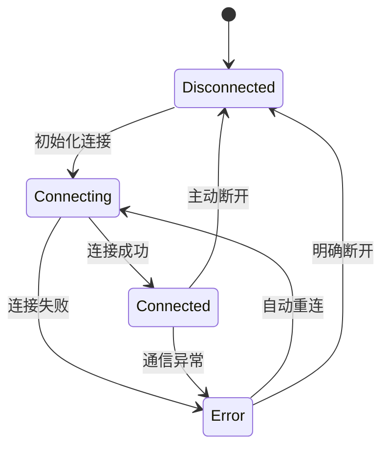
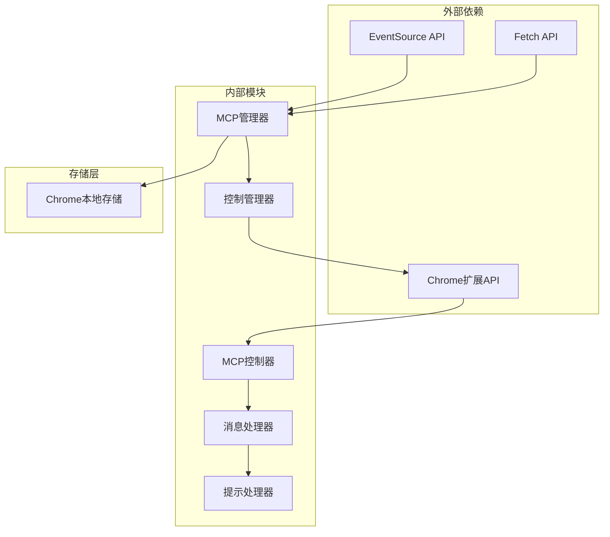

# MCP通信API

<cite>
**本文档引用的文件**
- [background/messages.js](file://background/messages.js)
- [background/managers/mcp_manager.js](file://background/managers/mcp_manager.js)
- [sandbox/controllers/mcp_controller.js](file://sandbox/controllers/mcp_controller.js)
- [sandbox/controllers/message_handler.js](file://sandbox/controllers/message_handler.js)
- [lib/messaging.js](file://lib/messaging.js)
- [background/handlers/session/prompt_handler.js](file://background/handlers/session/prompt_handler.js)
- [background/handlers/session/prompt/tool_executor.js](file://background/handlers/session/prompt/tool_executor.js)
- [background/managers/control_manager.js](file://background/managers/control_manager.js)
- [sandbox/ui/settings/view.js](file://sandbox/ui/settings/view.js)
- [sandbox/ui/settings.js](file://sandbox/ui/settings.js)
</cite>

## 目录
1. [简介](#简介)
2. [项目结构](#项目结构)
3. [核心组件](#核心组件)
4. [架构概览](#架构概览)
5. [详细组件分析](#详细组件分析)
6. [依赖关系分析](#依赖关系分析)
7. [性能考量](#性能考量)
8. [故障排除指南](#故障排除指南)
9. [结论](#结论)

## 简介

MCP（Model Context Protocol）通信API是Gemini Nexus项目中的关键组件，负责与外部模型上下文协议服务器进行通信。该API提供了完整的配置管理、工具发现、状态监控和调试功能，支持多种传输模式（SSE和HTTP）以及灵活的工具执行机制。

本专项文档专注于以下核心消息端点：
- `MCP_SAVE_CONFIG`：保存MCP配置
- `MCP_GET_CONFIG`：获取当前MCP配置
- `MCP_GET_TOOLS`：获取所有可用工具
- `MCP_GET_STATUS`：获取MCP服务状态

## 项目结构

MCP通信API在项目中采用分层架构设计，主要分布在以下模块中：

**图表来源**
- [sandbox/controllers/mcp_controller.js](file://sandbox/controllers/mcp_controller.js#L1-L221)
- [background/messages.js](file://background/messages.js#L1-L82)
- [background/managers/mcp_manager.js](file://background/managers/mcp_manager.js#L1-L530)

**章节来源**
- [sandbox/controllers/mcp_controller.js](file://sandbox/controllers/mcp_controller.js#L1-L221)
- [background/messages.js](file://background/messages.js#L1-L82)
- [background/managers/mcp_manager.js](file://background/managers/mcp_manager.js#L1-L530)

## 核心组件

### MCP管理器（MCPManager）

MCP管理器是整个MCP通信系统的核心，负责：
- 配置加载和保存
- 服务器连接管理
- 工具发现和缓存
- 请求路由和响应处理
- 调试信息生成

### 消息处理器（MessageHandler）

负责处理来自不同来源的消息请求，包括：
- MCP配置响应处理
- 工具选择界面显示
- 流式响应更新
- 错误状态管理

### 控制管理器（ControlManager）

专门处理浏览器控制相关的MCP工具执行，包括：
- 页面导航和操作
- 截图和快照
- 性能分析
- 观测性工具

**章节来源**
- [background/managers/mcp_manager.js](file://background/managers/mcp_manager.js#L1-L530)
- [sandbox/controllers/message_handler.js](file://sandbox/controllers/message_handler.js#L1-L365)
- [background/managers/control_manager.js](file://background/managers/control_manager.js#L1-L159)

## 架构概览

MCP通信API采用双通道架构，支持SSE（Server-Sent Events）和HTTP两种传输模式：

**图表来源**
- [sandbox/controllers/mcp_controller.js](file://sandbox/controllers/mcp_controller.js#L88-L93)
- [background/messages.js](file://background/messages.js#L63-L67)
- [background/managers/mcp_manager.js](file://background/managers/mcp_manager.js#L287-L306)

## 详细组件分析

### MCP配置管理

#### 配置存储结构

MCP配置采用JSON格式存储在Chrome本地存储中，具有以下结构：

**图表来源**
- [background/managers/mcp_manager.js](file://background/managers/mcp_manager.js#L21-L38)
- [background/messages.js](file://background/messages.js#L49-L55)

#### 配置验证规则

配置验证通过以下步骤确保数据完整性：

1. **必需字段检查**：验证是否存在 `mcpServers` 键
2. **URL有效性**：检查服务器URL格式和可达性
3. **类型兼容性**：验证服务器类型（SSE或HTTP）
4. **连接测试**：自动探测服务器能力

#### 配置保存流程

**图表来源**
- [background/managers/mcp_manager.js](file://background/managers/mcp_manager.js#L40-L61)

**章节来源**
- [background/managers/mcp_manager.js](file://background/managers/mcp_manager.js#L40-L61)
- [background/messages.js](file://background/messages.js#L42-L55)

### 工具元数据获取

#### 工具发现机制

MCP管理器支持多种工具发现方式：

1. **SSE模式**：通过EventSource连接获取工具列表
2. **HTTP模式**：直接发送JSON-RPC请求获取工具
3. **多格式兼容**：支持不同的响应格式

#### 工具元数据结构

工具元数据包含以下关键字段：

| 字段名 | 类型 | 描述 | 必需 |
|--------|------|------|------|
| name | string | 工具名称 | 是 |
| description | string | 工具描述 | 否 |
| inputSchema | object | 输入参数模式 | 否 |
| outputSchema | object | 输出参数模式 | 否 |
| _serverId | string | 服务器标识符 | 否 |

#### 工具刷新流程

**图表来源**
- [background/managers/mcp_manager.js](file://background/managers/mcp_manager.js#L181-L213)

**章节来源**
- [background/managers/mcp_manager.js](file://background/managers/mcp_manager.js#L181-L213)
- [background/managers/mcp_manager.js](file://background/managers/mcp_manager.js#L407-L420)

### MCP服务状态监控

#### 状态跟踪机制

MCP管理器维护详细的服务器状态信息：

#### 健康检查实现

状态监控包括以下检查点：

1. **连接状态**：实时跟踪服务器连接状态
2. **工具数量**：监控可用工具数量变化
3. **响应时间**：测量请求处理延迟
4. **错误分类**：区分网络错误和应用错误

#### 调试信息生成

调试信息包含以下关键指标：

| 指标 | 描述 | 计算方式 |
|------|------|----------|
| status | 服务器状态 | 当前连接状态 |
| type | 服务器类型 | SSE或HTTP |
| url | 原始URL | 配置中的原始地址 |
| postUrl | POST端点 | SSE模式下的实际POST地址 |
| toolCount | 工具数量 | 已缓存的工具总数 |
| tools | 工具列表 | 工具名称数组 |

**章节来源**
- [background/managers/mcp_manager.js](file://background/managers/mcp_manager.js#L389-L403)
- [background/managers/mcp_manager.js](file://background/managers/mcp_manager.js#L71-L150)

### 安全考虑

#### 配置数据敏感字段处理

当前实现中未对配置数据进行特殊的安全处理，建议改进方向：

1. **敏感信息识别**：识别可能包含认证令牌的字段
2. **数据脱敏**：对敏感字段进行显示脱敏
3. **访问控制**：限制配置修改的权限范围

#### 访问权限控制

系统目前采用以下访问控制策略：

1. **同源策略**：仅允许同源页面访问MCP功能
2. **用户确认**：重要操作需要用户确认
3. **最小权限**：按需授予必要的浏览器权限

## 依赖关系分析

MCP通信API的依赖关系呈现清晰的分层结构：

**图表来源**
- [background/managers/mcp_manager.js](file://background/managers/mcp_manager.js#L101-L149)
- [sandbox/controllers/mcp_controller.js](file://sandbox/controllers/mcp_controller.js#L88-L93)

**章节来源**
- [background/managers/mcp_manager.js](file://background/managers/mcp_manager.js#L1-L530)
- [sandbox/controllers/mcp_controller.js](file://sandbox/controllers/mcp_controller.js#L1-L221)

## 性能考量

### 连接优化策略

1. **连接复用**：避免重复建立SSE连接
2. **批量请求**：合并多个工具请求
3. **缓存机制**：缓存工具元数据减少网络请求
4. **超时控制**：设置合理的请求超时时间

### 内存管理

- **事件监听器清理**：及时移除不再使用的事件监听器
- **工具列表清理**：定期清理无效的工具引用
- **连接池管理**：合理管理服务器连接资源

## 故障排除指南

### 常见问题诊断

#### 连接问题

**症状**：服务器状态显示为"error"
**排查步骤**：
1. 检查服务器URL是否正确
2. 验证网络连接是否正常
3. 确认服务器是否支持所选传输模式

#### 工具获取失败

**症状**：工具列表为空
**排查步骤**：
1. 验证服务器是否正确实现了MCP协议
2. 检查服务器响应格式是否符合预期
3. 确认网络防火墙设置

#### 配置保存失败

**症状**：配置保存返回错误
**排查步骤**：
1. 验证JSON格式是否正确
2. 检查必需字段是否完整
3. 确认Chrome存储权限是否正常

**章节来源**
- [background/managers/mcp_manager.js](file://background/managers/mcp_manager.js#L174-L179)
- [background/messages.js](file://background/messages.js#L58-L61)

## 结论

MCP通信API为Gemini Nexus项目提供了完整的模型上下文协议支持。通过分层架构设计和灵活的传输模式，系统能够有效管理多个MCP服务器，提供丰富的工具执行能力。

主要优势包括：
- **多模式支持**：同时支持SSE和HTTP传输模式
- **智能连接管理**：自动探测服务器能力和优化连接策略
- **完整的调试支持**：提供详细的连接状态和性能监控
- **灵活的工具执行**：支持浏览器控制和观测性工具

未来改进建议：
- 增强配置数据的安全处理
- 实现更精细的错误分类和恢复机制
- 添加配置导入导出功能
- 优化工具执行的并发处理能力