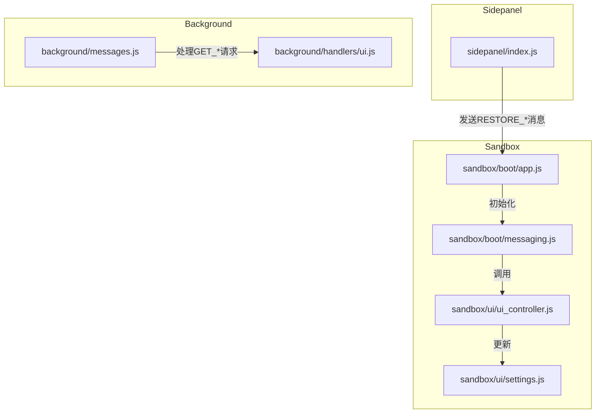
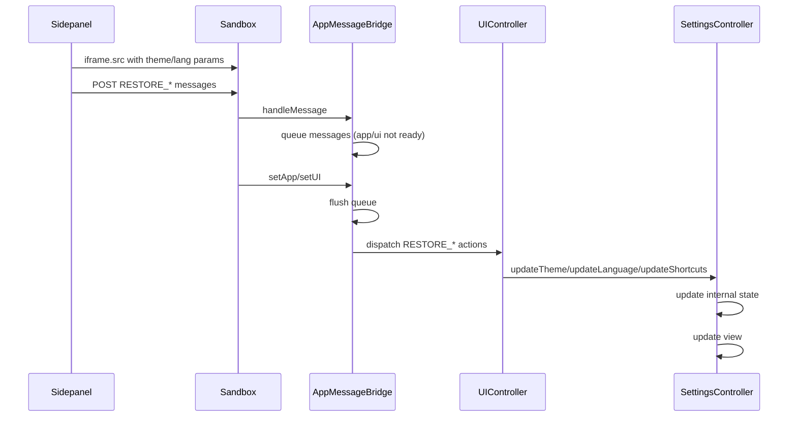
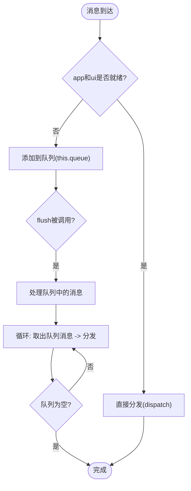
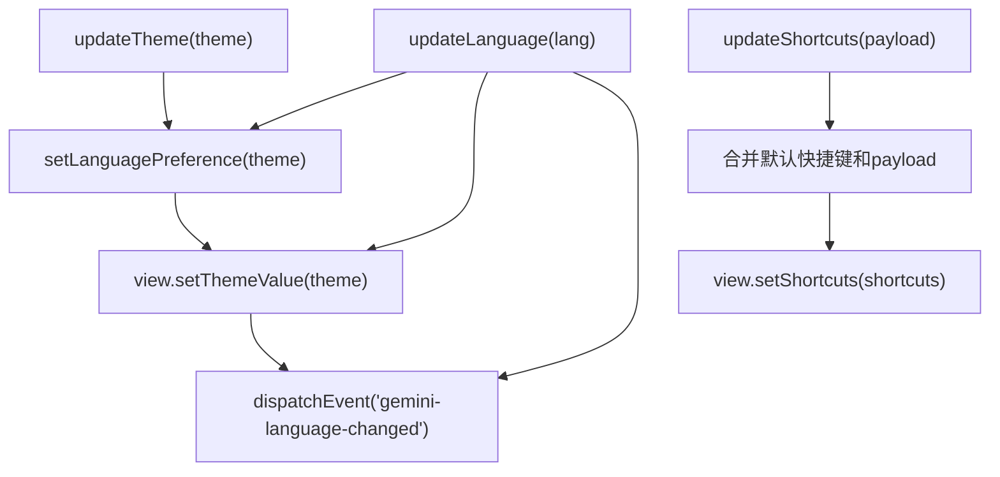
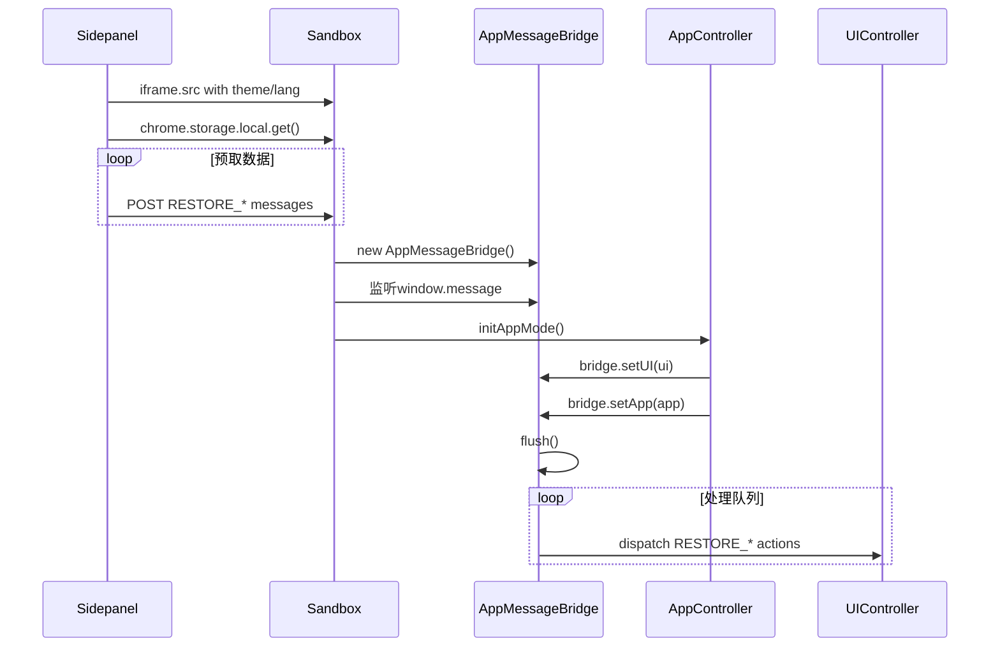
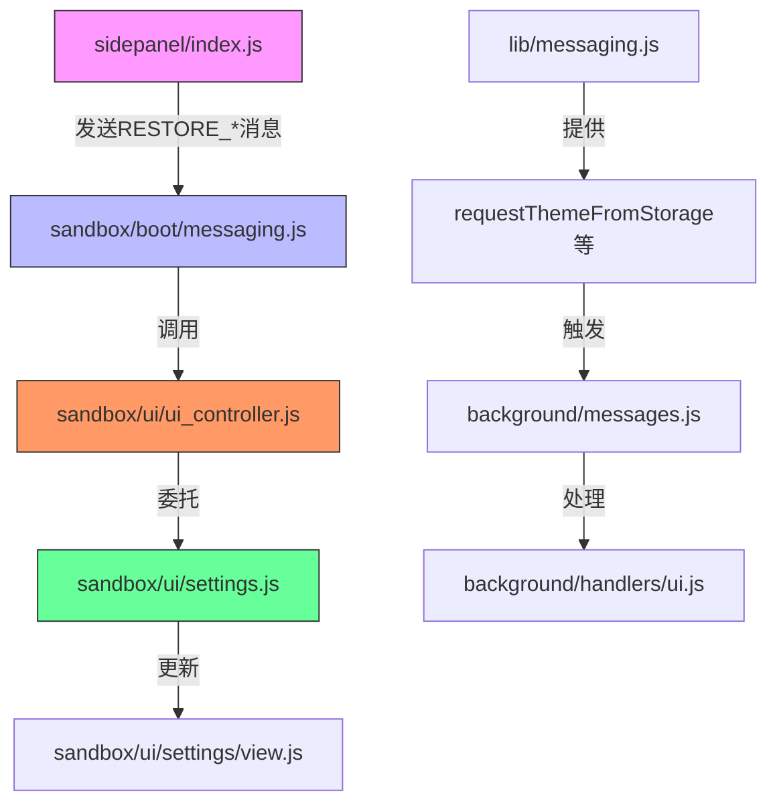

# UI状态同步

<cite>
**本文档引用的文件**
- [messages.js](file://background/messages.js)
- [ui.js](file://background/handlers/ui.js)
- [messaging.js](file://sandbox/boot/messaging.js)
- [app.js](file://sandbox/boot/app.js)
- [events.js](file://sandbox/boot/events.js)
- [bridge.js](file://content/toolbar/bridge.js)
- [settings.js](file://sandbox/ui/settings.js)
- [view.js](file://sandbox/ui/settings/view.js)
- [settings.js](file://sidepanel/index.js)
- [messaging.js](file://lib/messaging.js)
- [constants.js](file://lib/constants.js)
- [theme_init.js](file://sandbox/theme_init.js)
</cite>

## 目录
1. [简介](#简介)
2. [项目结构](#项目结构)
3. [核心组件](#核心组件)
4. [架构概述](#架构概述)
5. [详细组件分析](#详细组件分析)
6. [依赖分析](#依赖分析)
7. [性能考虑](#性能考虑)
8. [故障排除指南](#故障排除指南)
9. [结论](#结论)
10. [附录](#附录)（如有必要）

## 简介
本文档详细描述了Gemini Nexus中UI状态同步机制的实现，重点关注主题、语言、快捷键等UI配置项的恢复流程。文档详细说明了AppMessageBridge如何通过'RESTORE_THEME'、'RESTORE_LANGUAGE'、'RESTORE_SHORTCUTS'等消息实现UI组件的状态更新，解释了从storage请求配置（如GET_THEME）到后台响应并触发RESTORE_XXX事件的完整链路，并提供了ui.updateTheme()、ui.updateLanguage()等方法的调用上下文和副作用说明。

## 项目结构
Gemini Nexus项目采用模块化架构，主要分为background、content、sandbox、sidepanel等核心模块。UI状态同步机制主要涉及sandbox模块中的UI控制器和消息桥接，以及sidepanel模块中的数据预取和初始化逻辑。



**Diagram sources**
- [sidepanel/index.js](file://sidepanel/index.js#L1-L200)
- [sandbox/boot/app.js](file://sandbox/boot/app.js#L1-L90)
- [sandbox/boot/messaging.js](file://sandbox/boot/messaging.js#L1-L90)

**Section sources**
- [sidepanel/index.js](file://sidepanel/index.js#L1-L425)
- [sandbox/boot/app.js](file://sandbox/boot/app.js#L1-L90)

## 核心组件
UI状态同步的核心组件包括AppMessageBridge、UIController和SettingsController。AppMessageBridge负责在沙箱环境初始化前缓冲消息队列，并在app和ui实例就绪后触发flush操作。UIController作为协调者，将状态更新委托给具体的子控制器，而SettingsController则管理具体的UI设置状态和视图更新。

**Section sources**
- [sandbox/boot/messaging.js](file://sandbox/boot/messaging.js#L1-L90)
- [sandbox/ui/ui_controller.js](file://sandbox/ui/ui_controller.js#L1-L66)
- [sandbox/ui/settings.js](file://sandbox/ui/settings.js#L1-L248)

## 架构概述
UI状态同步的架构采用分层设计，从存储层到UI层形成完整的数据流。系统通过sidepanel预取存储数据，利用消息队列机制确保在沙箱环境完全初始化前不会丢失状态更新消息，最终通过事件驱动的方式完成UI组件的状态恢复。



**Diagram sources**
- [sidepanel/index.js](file://sidepanel/index.js#L1-L200)
- [sandbox/boot/messaging.js](file://sandbox/boot/messaging.js#L1-L90)
- [sandbox/ui/ui_controller.js](file://sandbox/ui/ui_controller.js#L1-L66)

## 详细组件分析

### AppMessageBridge分析
AppMessageBridge是UI状态同步的核心消息桥接组件，负责管理消息队列和状态分发。

#### 消息队列机制


**Diagram sources**
- [sandbox/boot/messaging.js](file://sandbox/boot/messaging.js#L1-L90)

#### 状态恢复消息处理
```mermaid
classDiagram
class AppMessageBridge {
+app : AppController
+ui : UIController
+resizeFn : Function
+queue : Array
+setApp(app)
+setUI(ui)
+setResizeFn(fn)
+handleMessage(event)
+flush()
+dispatch(action, payload, event)
}
class UIController {
+updateTheme(theme)
+updateLanguage(lang)
+updateShortcuts(shortcuts)
}
AppMessageBridge --> UIController : "调用"
note right of AppMessageBridge
dispatch方法处理以下消息类型 :
- RESTORE_THEME : 调用ui.updateTheme(payload)
- RESTORE_LANGUAGE : 调用ui.updateLanguage(payload)
- RESTORE_SHORTCUTS : 调用ui.updateShortcuts(payload)
- 其他RESTORE_*消息
- 非RESTORE消息转发给app.handleIncomingMessage
end note
```

**Diagram sources**
- [sandbox/boot/messaging.js](file://sandbox/boot/messaging.js#L49-L90)
- [sandbox/ui/ui_controller.js](file://sandbox/ui/ui_controller.js#L62-L65)

### SettingsController分析
SettingsController负责管理UI设置的状态和视图同步。

#### 状态更新流程


**Diagram sources**
- [sandbox/ui/settings.js](file://sandbox/ui/settings.js#L186-L197)

### 初始化流程分析


**Diagram sources**
- [sidepanel/index.js](file://sidepanel/index.js#L1-L200)
- [sandbox/boot/app.js](file://sandbox/boot/app.js#L1-L90)
- [sandbox/boot/messaging.js](file://sandbox/boot/messaging.js#L1-L90)

## 依赖分析
UI状态同步机制涉及多个模块间的依赖关系，形成了复杂但清晰的调用链。



**Diagram sources**
- [sidepanel/index.js](file://sidepanel/index.js#L1-L425)
- [sandbox/boot/messaging.js](file://sandbox/boot/messaging.js#L1-L90)
- [lib/messaging.js](file://lib/messaging.js#L1-L60)

## 性能考虑
UI状态同步机制在设计时考虑了多项性能优化：

1. **同步加载优化**：使用localStorage缓存theme和language，确保iframe请求在同一个事件循环中启动
2. **并行加载**：立即设置iframe.src以启动HTML加载，同时异步获取chrome.storage数据
3. **批量消息发送**：在数据和UI都就绪后，一次性发送所有RESTORE_*消息
4. **安全超时**：设置1秒超时，防止UI_READY信号丢失导致界面卡住

这些优化确保了UI状态同步的高效性和可靠性，即使在网络延迟或系统负载较高的情况下也能提供良好的用户体验。

## 故障排除指南
在开发和维护UI状态同步功能时，可能会遇到以下常见问题：

**Section sources**
- [sidepanel/index.js](file://sidepanel/index.js#L140-L147)
- [sandbox/boot/messaging.js](file://sandbox/boot/messaging.js#L30-L37)

### 消息队列未清空
如果发现UI状态未正确恢复，可能是消息队列未被清空。检查：
- AppMessageBridge的setApp和setUI是否被正确调用
- flush方法是否在app和ui都就绪后执行
- 队列中的消息是否被正确处理

### 存储数据不一致
当localStorage和chrome.storage.local数据不一致时：
- 检查sidepanel/index.js中localStorage的设置时机
- 确认SAVE_*操作同时更新了两种存储
- 验证GET_*请求的处理逻辑

### 事件监听器泄漏
为防止事件监听器泄漏：
- 确保每个addEventListener都有对应的removeEventListener
- 在组件销毁时清理所有事件监听器
- 使用现代JavaScript的WeakMap等机制管理监听器引用

## 结论
Gemini Nexus的UI状态同步机制通过精心设计的消息队列、事件驱动和分层架构，实现了高效可靠的UI配置项恢复。该机制不仅支持主题、语言、快捷键等核心配置的同步，还提供了可扩展的框架，便于添加新的UI状态类型。通过sidepanel的预取优化和沙箱环境的消息缓冲，系统在保证性能的同时，确保了用户体验的一致性和流畅性。

## 附录
### 新UI状态类型的扩展指南
要安全地扩展新的UI状态同步类型，请遵循以下步骤：

1. 在sidepanel/index.js中添加新的SAVE_*和RESTORE_*消息处理
2. 在lib/messaging.js中添加相应的request*FromStorage和save*ToStorage函数
3. 在AppMessageBridge的dispatch方法中添加新的RESTORE_*消息处理分支
4. 在UIController中添加相应的update*方法
5. 在SettingsController中实现状态管理和视图更新逻辑

确保每个新类型都遵循相同的模式，保持代码的一致性和可维护性。