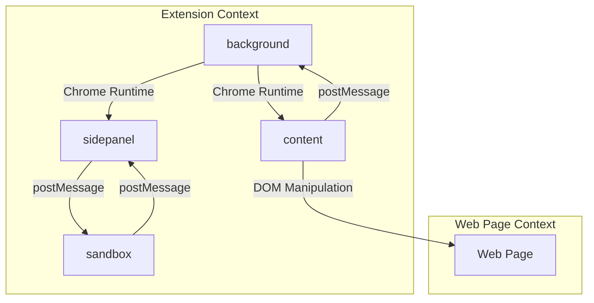
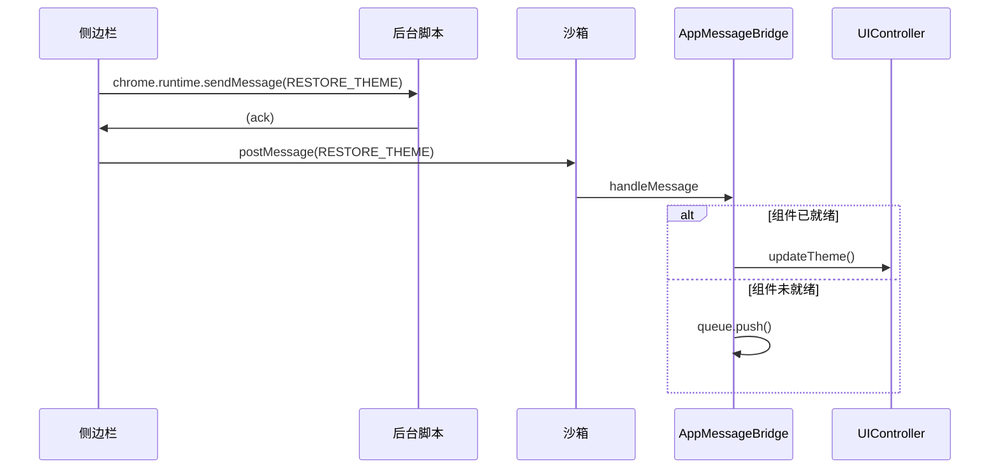
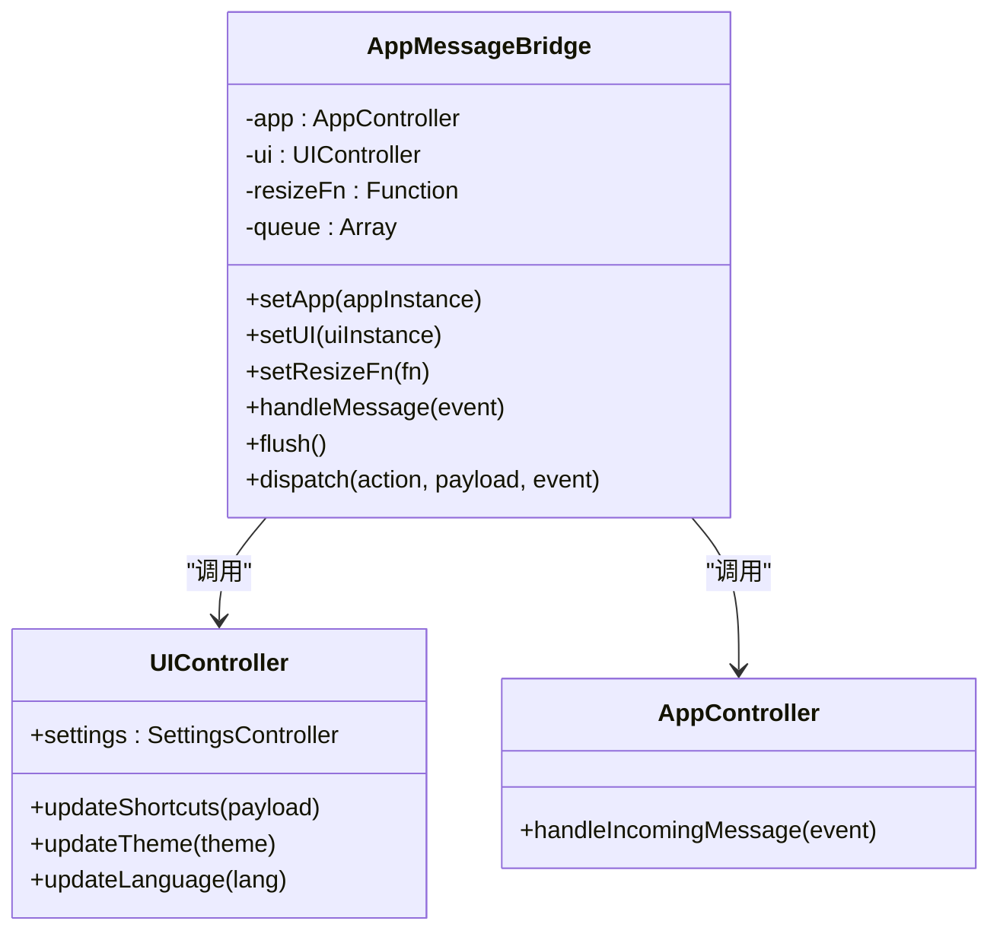
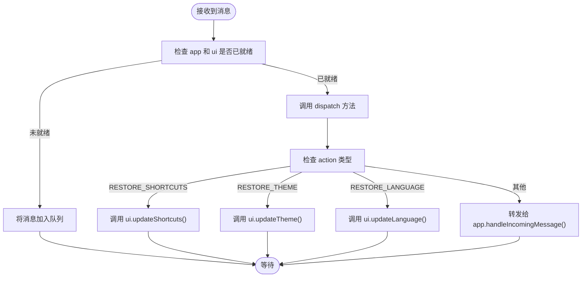
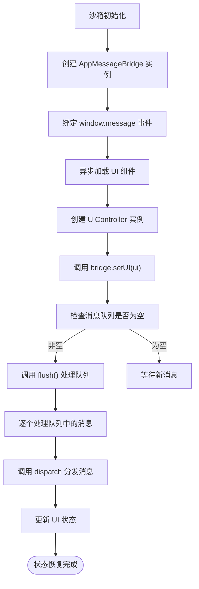
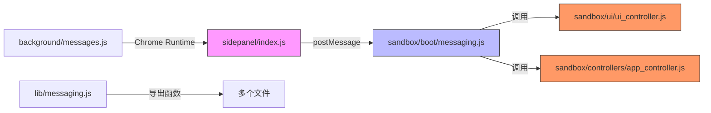

# 事件订阅机制

<cite>
**本文档引用的文件**  
- [messages.js](file://background/messages.js)
- [messaging.js](file://lib/messaging.js)
- [app.js](file://sandbox/boot/app.js)
- [messaging.js](file://sandbox/boot/messaging.js)
- [events.js](file://sandbox/boot/events.js)
- [sidepanel/index.js](file://sidepanel/index.js)
- [ui_controller.js](file://sandbox/ui/ui_controller.js)
- [settings.js](file://sandbox/ui/settings.js)
- [settings/view.js](file://sandbox/ui/settings/view.js)
- [ui/handlers.js](file://background/handlers/ui.js)
</cite>

## 目录
1. [简介](#简介)
2. [项目结构](#项目结构)
3. [核心组件](#核心组件)
4. [架构概述](#架构概述)
5. [详细组件分析](#详细组件分析)
6. [依赖分析](#依赖分析)
7. [性能考虑](#性能考虑)
8. [故障排除指南](#故障排除指南)
9. [结论](#结论)

## 简介
Gemini Nexus 扩展采用基于消息传递的发布-订阅模式来实现跨上下文的状态同步。该系统允许后台脚本、侧边栏和沙箱环境之间进行松耦合通信，特别关注状态恢复类消息（如 'RESTORE_THEME'、'RESTORE_LANGUAGE'、'RESTORE_SHORTCUTS' 等）的分发。AppMessageBridge 类在沙箱环境中充当中央事件总线，管理 UI 组件的状态同步，通过消息队列缓冲在组件初始化前接收到的事件，并在组件就绪后通过 flush 机制进行处理。整个系统结合了 Chrome 扩展的 runtime 消息机制和 postMessage API，实现了高效、可靠的状态管理和事件驱动架构。

## 项目结构
Gemini Nexus 项目采用模块化结构，主要分为 background、content、sandbox、sidepanel 等目录。background 目录包含后台脚本，负责核心逻辑和消息监听；content 目录包含内容脚本，用于与网页内容交互；sandbox 目录包含在隔离环境中运行的 UI 逻辑；sidepanel 目录包含侧边栏的桥接逻辑。这种结构通过消息传递实现各部分的解耦。

**图源**  
- [background/messages.js](file://background/messages.js#L1-L82)
- [sidepanel/index.js](file://sidepanel/index.js#L1-L425)
- [sandbox/boot/app.js](file://sandbox/boot/app.js#L1-L90)

## 核心组件
本系统的核心是 AppMessageBridge，它实现了发布-订阅模式，负责管理状态恢复消息的分发。该桥接器与 UIController 和 AppController 协同工作，确保在组件初始化完成前接收到的消息能够被正确缓冲和处理。状态恢复消息（如 RESTORE_THEME）由侧边栏发起，通过消息传递机制发送到沙箱环境，由 AppMessageBridge 调用相应的 UI 更新方法。

**本节来源**  
- [sandbox/boot/messaging.js](file://sandbox/boot/messaging.js#L1-L90)
- [sandbox/ui/ui_controller.js](file://sandbox/ui/ui_controller.js#L1-L66)
- [sandbox/boot/app.js](file://sandbox/boot/app.js#L1-L90)

## 架构概述
Gemini Nexus 的事件订阅架构采用分层设计。最底层是 Chrome 扩展的 runtime 消息系统，用于在后台脚本和扩展页面（如侧边栏）之间通信。中间层是 postMessage API，用于在侧边栏和沙箱 iframe 之间传递消息。顶层是 AppMessageBridge，它在沙箱内部实现了高级的发布-订阅模式，管理状态恢复、事件分发和组件同步。

**图源**  
- [sidepanel/index.js](file://sidepanel/index.js#L1-L425)
- [sandbox/boot/messaging.js](file://sandbox/boot/messaging.js#L1-L90)
- [sandbox/ui/ui_controller.js](file://sandbox/ui/ui_controller.js#L1-L66)

## 详细组件分析

### AppMessageBridge 分析
AppMessageBridge 是沙箱环境中的核心消息管理器，实现了发布-订阅模式。它负责接收来自侧边栏的消息，根据消息类型分发给相应的 UI 组件，并处理组件初始化前的消息缓冲。

#### 对象导向组件

**图源**  
- [sandbox/boot/messaging.js](file://sandbox/boot/messaging.js#L4-L47)
- [sandbox/ui/ui_controller.js](file://sandbox/ui/ui_controller.js#L8-L66)

#### 事件分发流程

**图源**  
- [sandbox/boot/messaging.js](file://sandbox/boot/messaging.js#L49-L90)

### 状态恢复机制分析
状态恢复机制是 AppMessageBridge 的核心功能，它确保了 UI 组件在初始化后能够恢复到正确的状态。

#### 状态恢复流程

**图源**  
- [sandbox/boot/app.js](file://sandbox/boot/app.js#L1-L90)
- [sandbox/boot/messaging.js](file://sandbox/boot/messaging.js#L20-L23)

**本节来源**  
- [sandbox/boot/messaging.js](file://sandbox/boot/messaging.js#L1-L90)
- [sandbox/boot/app.js](file://sandbox/boot/app.js#L1-L90)
- [sandbox/ui/settings.js](file://sandbox/ui/settings.js#L2-L248)

## 依赖分析
系统各组件之间通过消息传递实现松耦合。AppMessageBridge 依赖于 UIController 和 AppController 的实例，但这些依赖是通过 set 方法在运行时注入的，而不是在构造时硬编码的。这种设计允许消息桥接器在组件完全初始化前就开始接收和缓冲消息。

**图源**  
- [sidepanel/index.js](file://sidepanel/index.js#L1-L425)
- [sandbox/boot/messaging.js](file://sandbox/boot/messaging.js#L1-L90)
- [sandbox/ui/ui_controller.js](file://sandbox/ui/ui_controller.js#L1-L66)

**本节来源**  
- [sidepanel/index.js](file://sidepanel/index.js#L1-L425)
- [sandbox/boot/messaging.js](file://sandbox/boot/messaging.js#L1-L90)
- [lib/messaging.js](file://lib/messaging.js#L1-L96)

## 性能考虑
AppMessageBridge 的设计充分考虑了性能。通过在组件初始化前缓冲消息，避免了因组件未就绪而导致的消息丢失或错误。flush 机制采用 while 循环一次性处理所有队列消息，减少了函数调用开销。此外，系统使用 localStorage 缓存主题和语言设置，实现了同步加载，避免了因异步存储读取导致的 UI 闪烁。

## 故障排除指南
当遇到状态恢复问题时，应首先检查 AppMessageBridge 的消息队列是否正常工作。确保 setApp 和 setUI 方法在组件初始化后被正确调用，以触发 flush 机制。如果特定状态（如主题或语言）未正确恢复，应检查相应的 update 方法是否被正确调用，并验证消息的 action 类型是否匹配。

**本节来源**  
- [sandbox/boot/messaging.js](file://sandbox/boot/messaging.js#L40-L47)
- [sandbox/ui/settings.js](file://sandbox/ui/settings.js#L186-L218)

## 结论
Gemini Nexus 的事件订阅机制通过 AppMessageBridge 实现了一个高效、可靠的状态同步系统。该系统利用发布-订阅模式和消息队列，成功解决了组件异步初始化带来的状态管理难题。通过将消息分发与组件生命周期解耦，系统实现了良好的可维护性和扩展性，为复杂的浏览器扩展开发提供了一个优秀的架构范例。