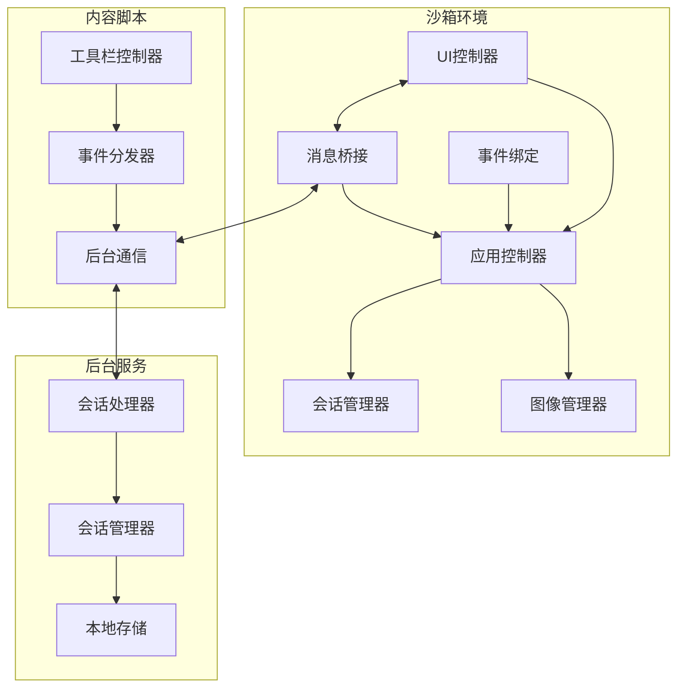
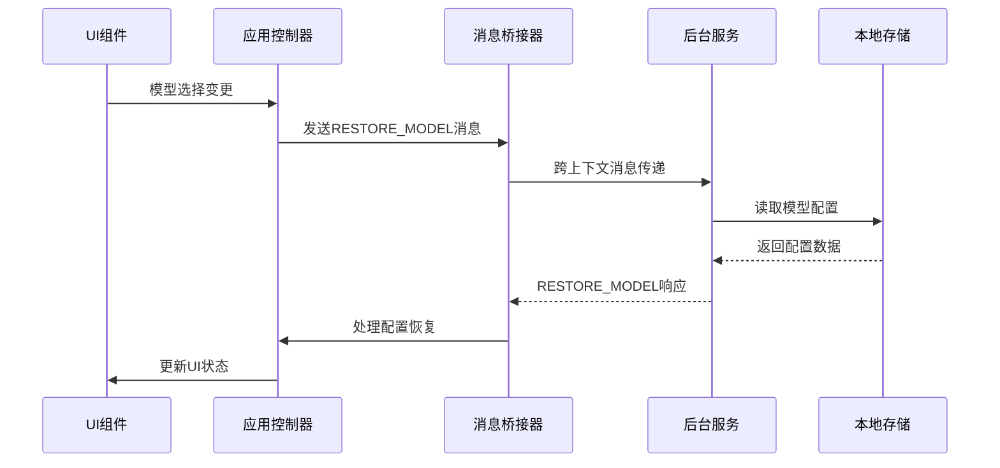
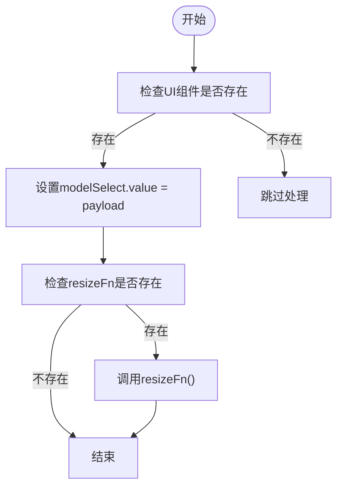
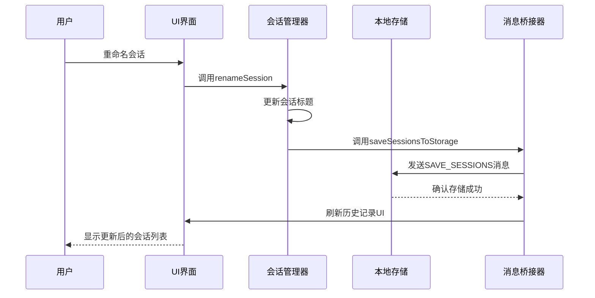
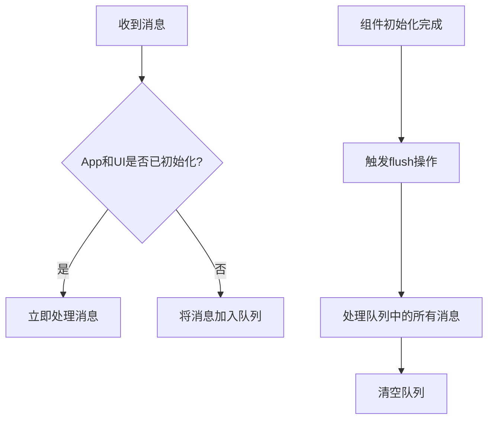
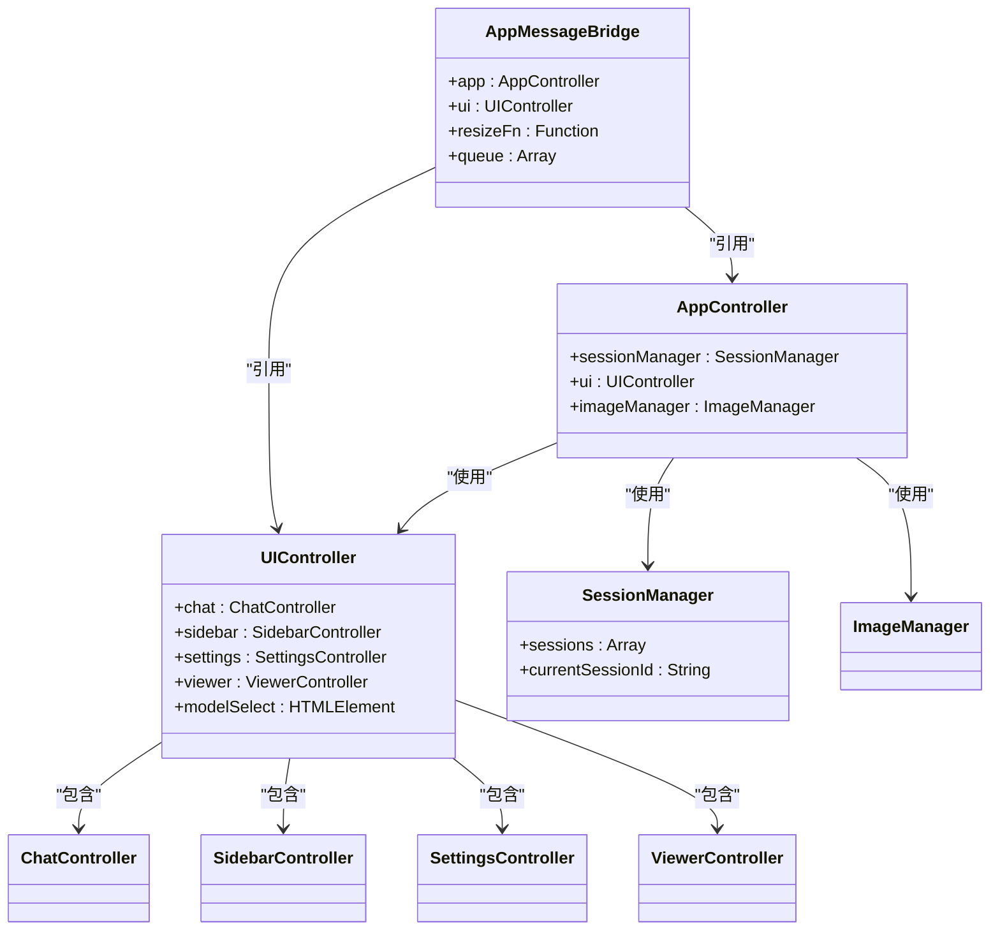

# 会话数据更新

<cite>
**本文档引用的文件**
- [ui_controller.js](file://sandbox/ui/ui_controller.js)
- [session_flow.js](file://sandbox/controllers/session_flow.js)
- [session_manager.js](file://sandbox/core/session_manager.js)
- [messaging.js](file://lib/messaging.js)
- [app.js](file://sandbox/boot/app.js)
- [events.js](file://sandbox/boot/events.js)
- [messaging.js](file://sandbox/boot/messaging.js)
- [dispatch.js](file://content/toolbar/dispatch.js)
- [controller.js](file://content/toolbar/controller.js)
</cite>

## 目录
1. [简介](#简介)
2. [项目结构](#项目结构)
3. [核心组件](#核心组件)
4. [架构概述](#架构概述)
5. [详细组件分析](#详细组件分析)
6. [依赖分析](#依赖分析)
7. [性能考虑](#性能考虑)
8. [故障排除指南](#故障排除指南)
9. [结论](#结论)
10. [附录](#附录)（如有必要）

## 简介
本文档系统化描述Gemini Nexus中会话相关数据的更新机制，特别是模型选择（RESTORE_MODEL）等会话级配置的处理流程。重点分析dispatch方法中对'RESTORE_MODEL'事件的处理逻辑，包括this.ui.modelSelect.value赋值和resizeFn回调的调用条件。说明该机制如何确保沙箱UI与后台存储的模型配置保持一致。结合saveSessionsToStorage函数，解释会话数据持久化的完整生命周期，从前端变更到存储写入再到跨实例恢复。提供在动态加载UI组件时确保事件正确应用的最佳实践，并指出潜在的竞争条件及解决方案。

## 项目结构
Gemini Nexus项目采用模块化架构，主要分为background、content、sandbox、services等核心目录。sandbox目录包含沙箱环境的UI和控制器逻辑，其中boot目录负责应用初始化和事件绑定，controllers目录包含核心业务逻辑控制器，core目录包含会话和图像管理器等核心服务。content目录包含工具栏相关逻辑，background目录包含后台消息处理和会话管理。这种分层架构确保了UI、业务逻辑和数据管理的清晰分离。



**图源**
- [app.js](file://sandbox/boot/app.js#L11-L90)
- [ui_controller.js](file://sandbox/ui/ui_controller.js#L8-L66)
- [session_flow.js](file://sandbox/controllers/session_flow.js#L7-L96)

**节源**
- [app.js](file://sandbox/boot/app.js#L1-L90)
- [project_structure](file://#L1-L200)

## 核心组件
本系统的核心组件包括会话管理器（SessionManager）、UI控制器（UIController）、应用控制器（AppController）和消息桥接器（AppMessageBridge）。会话管理器负责管理所有会话数据，包括创建、删除、切换会话等操作。UI控制器负责协调各个UI子控制器（聊天、侧边栏、设置等）。应用控制器作为核心业务逻辑中枢，协调会话管理器和UI控制器之间的交互。消息桥接器负责处理跨上下文的消息通信，确保后台服务与沙箱UI之间的数据同步。

**节源**
- [session_manager.js](file://sandbox/core/session_manager.js#L5-L105)
- [ui_controller.js](file://sandbox/ui/ui_controller.js#L8-L66)
- [app_controller.js](file://sandbox/controllers/app_controller.js#L1-L206)

## 架构概述
Gemini Nexus采用分层架构设计，前端沙箱环境与后台服务通过消息传递机制进行通信。沙箱环境包含UI层和业务逻辑层，UI层由UIController协调各个子控制器，业务逻辑层由AppController处理核心流程。后台服务层负责持久化存储和与Gemini API的交互。会话数据的更新遵循"UI事件触发→消息发送→后台处理→状态恢复"的生命周期，确保数据一致性。



**图源**
- [messaging.js](file://sandbox/boot/messaging.js#L4-L90)
- [events.js](file://sandbox/boot/events.js#L142-L177)

## 详细组件分析
### 会话数据更新机制分析
#### RESTORE_MODEL事件处理
RESTORE_MODEL事件的处理是确保UI与后台配置一致性的关键机制。当沙箱环境初始化或配置变更时，后台服务会发送RESTORE_MODEL消息，消息桥接器的dispatch方法负责处理该事件。



**图源**
- [messaging.js](file://sandbox/boot/messaging.js#L62-L67)
- [events.js](file://sandbox/boot/events.js#L146-L162)

**节源**
- [messaging.js](file://sandbox/boot/messaging.js#L49-L90)
- [events.js](file://sandbox/boot/events.js#L142-L177)

#### 会话数据持久化生命周期
会话数据的持久化遵循完整的生命周期管理，从用户操作到数据存储再到跨实例恢复。当用户执行会话相关的操作（如重命名、删除会话）时，系统会调用saveSessionsToStorage函数将更新后的会话数据写入本地存储。



**图源**
- [session_flow.js](file://sandbox/controllers/session_flow.js#L72-L78)
- [messaging.js](file://lib/messaging.js#L11-L16)

**节源**
- [session_flow.js](file://sandbox/controllers/session_flow.js#L72-L95)
- [messaging.js](file://lib/messaging.js#L1-L96)

### 动态加载UI组件的最佳实践
在动态加载UI组件时，必须确保事件处理的正确性和时序性。系统采用消息队列机制来解决组件加载的竞争条件问题。当消息到达但相关组件尚未初始化时，消息会被暂存到队列中，待组件初始化完成后再按顺序处理。



**图源**
- [messaging.js](file://sandbox/boot/messaging.js#L29-L47)
- [app.js](file://sandbox/boot/app.js#L82-L83)

**节源**
- [messaging.js](file://sandbox/boot/messaging.js#L1-L90)
- [app.js](file://sandbox/boot/app.js#L1-L90)

## 依赖分析
系统各组件之间存在明确的依赖关系。UIController依赖于各个UI子控制器（ChatController、SidebarController等），AppController依赖于SessionManager和ImageManager，消息桥接器依赖于AppController和UIController。这些依赖关系通过构造函数注入的方式实现，确保了组件间的松耦合。



**图源**
- [ui_controller.js](file://sandbox/ui/ui_controller.js#L8-L66)
- [app_controller.js](file://sandbox/controllers/app_controller.js#L1-L206)
- [messaging.js](file://sandbox/boot/messaging.js#L4-L90)

**节源**
- [ui_controller.js](file://sandbox/ui/ui_controller.js#L1-L66)
- [app_controller.js](file://sandbox/controllers/app_controller.js#L1-L206)

## 性能考虑
系统的性能优化主要体现在消息处理的异步队列机制和UI更新的批量处理上。消息桥接器的队列机制避免了因组件初始化时序问题导致的消息丢失，同时通过flush操作批量处理消息，减少了不必要的重复渲染。模型选择器的自动调整宽度功能通过创建临时span元素来精确计算文本宽度，确保了UI的美观性，但该操作被限制在change事件后执行，避免了频繁的DOM操作对性能的影响。

## 故障排除指南
当遇到会话数据不同步的问题时，应首先检查消息传递链路是否正常。确认AppMessageBridge是否正确设置了app和ui实例，检查消息队列是否被正确flush。对于模型选择器不更新的问题，需要验证RESTORE_MODEL消息是否被正确发送，以及resizeFn回调是否被正确设置。在动态加载场景下，如果UI组件未能正确响应配置变更，应检查组件初始化的时序和消息队列的处理逻辑。

**节源**
- [messaging.js](file://sandbox/boot/messaging.js#L38-L47)
- [app.js](file://sandbox/boot/app.js#L86-L87)

## 结论
Gemini Nexus的会话数据更新机制通过精心设计的消息传递和状态管理架构，确保了UI与后台存储的一致性。RESTORE_MODEL事件的处理逻辑充分考虑了组件初始化的时序问题，通过消息队列机制解决了潜在的竞争条件。会话数据的持久化生命周期完整且可靠，从用户操作到存储写入再到跨实例恢复形成了闭环。该架构设计体现了良好的分层思想和松耦合原则，为系统的可维护性和扩展性奠定了坚实基础。

## 附录
### 会话数据结构示例
```json
{
  "id": "uuid",
  "title": "会话标题",
  "timestamp": 1700000000000,
  "messages": [
    {
      "role": "user",
      "text": "用户提问",
      "image": "base64字符串"
    },
    {
      "role": "ai",
      "text": "AI回复",
      "generatedImages": ["base64字符串1", "base64字符串2"],
      "thoughts": "思考过程",
      "model": "gemini-1.5-pro"
    }
  ],
  "context": "Gemini上下文ID"
}
```

### 关键消息类型
| 消息类型 | 说明 | 发送方 | 接收方 |
|---------|------|-------|-------|
| RESTORE_MODEL | 恢复模型选择 | 后台服务 | 沙箱环境 |
| SAVE_SESSIONS | 保存会话数据 | 沙箱环境 | 后台服务 |
| UI_READY | UI准备就绪 | 沙箱环境 | 后台服务 |
| FORWARD_TO_BACKGROUND | 转发到后台 | 沙箱环境 | 后台服务 |