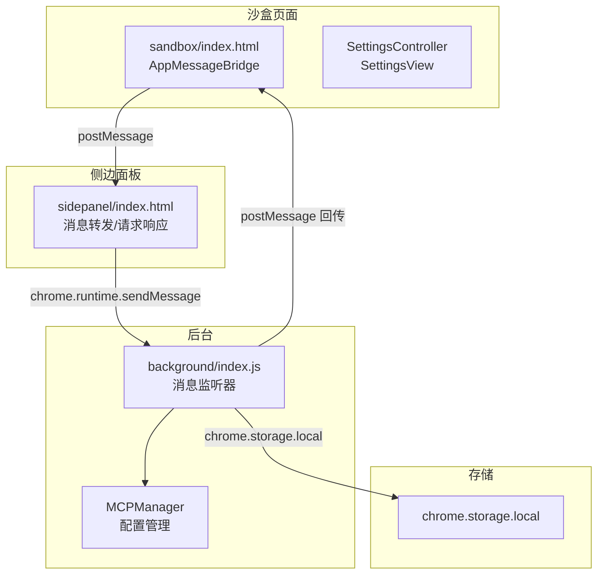
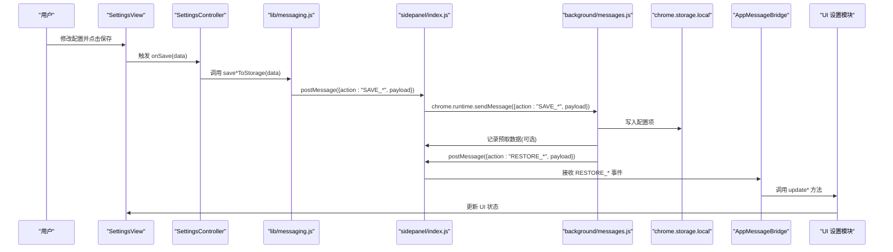
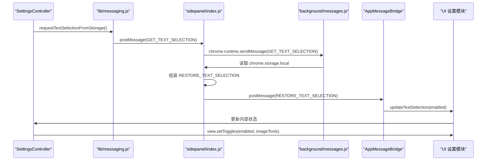
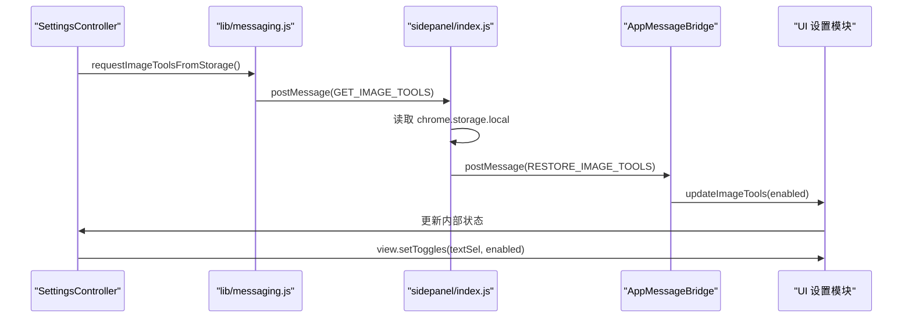
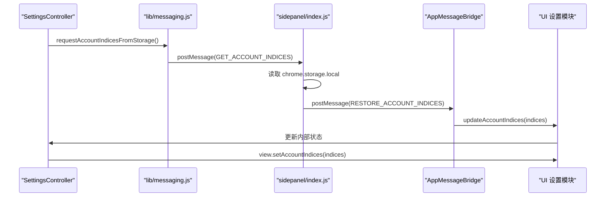
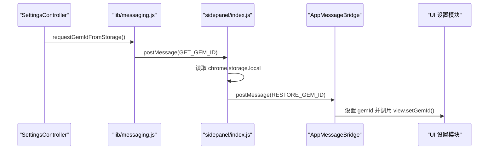
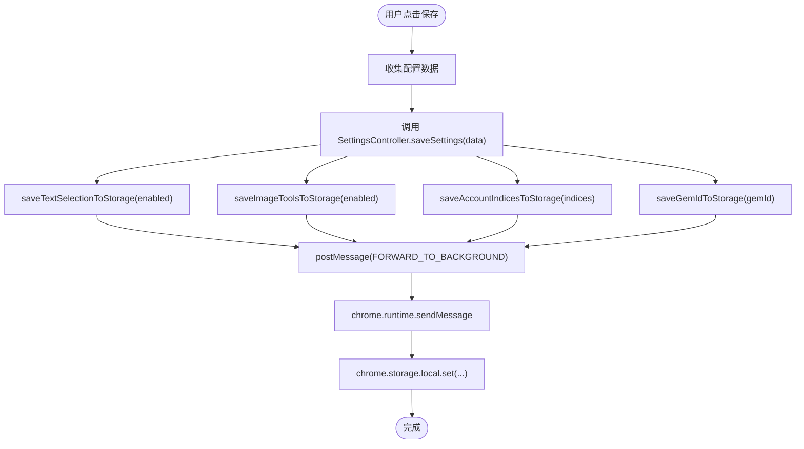
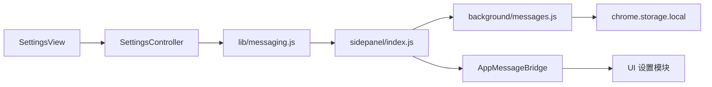

# 配置项同步

<cite>
**本文引用的文件**
- [lib/messaging.js](file://lib/messaging.js)
- [sandbox/boot/messaging.js](file://sandbox/boot/messaging.js)
- [sandbox/ui/settings.js](file://sandbox/ui/settings.js)
- [sandbox/ui/settings/view.js](file://sandbox/ui/settings/view.js)
- [sidepanel/index.js](file://sidepanel/index.js)
- [background/messages.js](file://background/messages.js)
- [background/managers/mcp_manager.js](file://background/managers/mcp_manager.js)
- [content/index.js](file://content/index.js)
- [content/selection.js](file://content/selection.js)
- [lib/logger.js](file://lib/logger.js)
- [manifest.json](file://manifest.json)
</cite>

## 目录
1. [简介](#简介)
2. [项目结构](#项目结构)
3. [核心组件](#核心组件)
4. [架构总览](#架构总览)
5. [详细组件分析](#详细组件分析)
6. [依赖关系分析](#依赖关系分析)
7. [性能考量](#性能考量)
8. [故障排查指南](#故障排查指南)
9. [结论](#结论)

## 简介
本文件深入文档化 Gemini Nexus 的配置项同步机制，重点覆盖以下持久化设置的双向同步流程：
- 文本选择开关（文本选择启用/禁用）
- 图像工具开关（图像工具启用/禁用）
- 账户索引（多账户索引字符串）
- Gem ID（用户指定的模型标识）

我们将详细阐述四个“RESTORE_*”事件的触发条件与数据流向，并结合 lib/messaging.js 中的 saveTextSelectionToStorage、requestImageToolsFromStorage 等函数，说明前端如何通过 postMessage 与后台通信实现配置读写。同时解释 this.ui.settings.updateTextSelection 等回调函数的执行环境与异常处理策略，提供配置项变更时的 UI 反馈机制与错误恢复建议。

## 项目结构
该系统围绕 Chrome 扩展沙盒页面（sandbox）与后台脚本（background）之间的消息桥接展开，配置项通过 postMessage 在 iframe 环境中与后台进行读取/保存操作，再由后台写入到 chrome.storage.local 并在需要时回传给前端以完成双向同步。

图表来源
- [sandbox/boot/messaging.js](file://sandbox/boot/messaging.js#L1-L90)
- [sidepanel/index.js](file://sidepanel/index.js#L178-L209)
- [background/messages.js](file://background/messages.js#L14-L81)
- [background/managers/mcp_manager.js](file://background/managers/mcp_manager.js#L40-L61)

章节来源
- [manifest.json](file://manifest.json#L37-L39)
- [lib/messaging.js](file://lib/messaging.js#L1-L96)

## 核心组件
- 消息桥接层：负责在沙盒页面与后台之间转发消息，分发 RESTORE_* 事件到 UI 设置模块。
- 设置控制器：维护配置状态，负责从存储请求配置并在 UI 上更新。
- 设置视图：绑定 DOM 事件，收集用户输入并触发保存动作。
- 后台消息监听器：接收来自侧边面板的消息，查询/写入 chrome.storage.local，并向沙盒页面回传 RESTORE_* 事件。
- 存储层：使用 chrome.storage.local 进行持久化，支持即时回写与本地缓存。

章节来源
- [sandbox/boot/messaging.js](file://sandbox/boot/messaging.js#L49-L89)
- [sandbox/ui/settings.js](file://sandbox/ui/settings.js#L8-L248)
- [sandbox/ui/settings/view.js](file://sandbox/ui/settings/view.js#L1-L241)
- [sidepanel/index.js](file://sidepanel/index.js#L245-L291)
- [background/messages.js](file://background/messages.js#L14-L81)

## 架构总览
下图展示了配置项同步的关键路径：从 UI 触发保存，到后台写入存储，再到沙盒页面收到 RESTORE_* 事件并更新 UI。

图表来源
- [sandbox/ui/settings/view.js](file://sandbox/ui/settings/view.js#L114-L130)
- [sandbox/ui/settings.js](file://sandbox/ui/settings.js#L113-L130)
- [lib/messaging.js](file://lib/messaging.js#L51-L96)
- [sidepanel/index.js](file://sidepanel/index.js#L178-L209)
- [background/messages.js](file://background/messages.js#L22-L80)
- [sandbox/boot/messaging.js](file://sandbox/boot/messaging.js#L69-L85)

## 详细组件分析

### 文本选择同步（RESTORE_TEXT_SELECTION）
- 触发条件
  - 用户打开设置面板时，SettingsController.handleOpen() 会调用 requestTextSelectionFromStorage() 请求当前值。
  - 后台 sidepanel/index.js 在收到 GET_TEXT_SELECTION 请求后，从 chrome.storage.local 读取 geminiTextSelectionEnabled，然后向沙盒页面发送 RESTORE_TEXT_SELECTION 事件。
- 数据流向
  - 前端：lib/messaging.js 的 requestTextSelectionFromStorage() 通过 postMessage 发送 GET_TEXT_SELECTION；SettingsController.updateTextSelection() 将值应用到视图。
  - 后端：sidepanel/index.js 读取存储并回传 RESTORE_TEXT_SELECTION；background/messages.js 不直接处理该事件，但 sidepanel 负责转发。
- 执行环境与异常处理
  - SettingsController.updateTextSelection() 直接更新内部状态并调用 view.setToggles()，未见显式 try/catch，异常通常由上层捕获或日志记录。
- UI 反馈
  - 视图通过 setToggles() 切换复选框状态，即时反映配置。

图表来源
- [sandbox/ui/settings.js](file://sandbox/ui/settings.js#L98-L101)
- [lib/messaging.js](file://lib/messaging.js#L47-L56)
- [sidepanel/index.js](file://sidepanel/index.js#L245-L255)
- [sandbox/boot/messaging.js](file://sandbox/boot/messaging.js#L69-L71)

章节来源
- [sandbox/ui/settings.js](file://sandbox/ui/settings.js#L98-L101)
- [lib/messaging.js](file://lib/messaging.js#L47-L56)
- [sidepanel/index.js](file://sidepanel/index.js#L245-L255)
- [sandbox/boot/messaging.js](file://sandbox/boot/messaging.js#L69-L71)

### 图像工具同步（RESTORE_IMAGE_TOOLS）
- 触发条件
  - SettingsController.handleOpen() 调用 requestImageToolsFromStorage() 请求当前值。
  - sidepanel/index.js 收到 GET_IMAGE_TOOLS 后从 chrome.storage.local 读取 geminiImageToolsEnabled 并回传 RESTORE_IMAGE_TOOLS。
- 数据流向
  - 前端：lib/messaging.js 的 requestImageToolsFromStorage() 发送 GET_IMAGE_TOOLS；SettingsController.updateImageTools() 应用到视图。
  - 后端：sidepanel/index.js 完成读取与回传。
- 执行环境与异常处理
  - SettingsController.updateImageTools() 更新内部状态并调用 view.setToggles()，无显式异常处理。
- UI 反馈
  - 视图通过 setToggles() 切换复选框状态。

图表来源
- [sandbox/ui/settings.js](file://sandbox/ui/settings.js#L98-L101)
- [lib/messaging.js](file://lib/messaging.js#L58-L67)
- [sidepanel/index.js](file://sidepanel/index.js#L257-L267)
- [sandbox/boot/messaging.js](file://sandbox/boot/messaging.js#L73-L76)

章节来源
- [sandbox/ui/settings.js](file://sandbox/ui/settings.js#L98-L101)
- [lib/messaging.js](file://lib/messaging.js#L58-L67)
- [sidepanel/index.js](file://sidepanel/index.js#L257-L267)
- [sandbox/boot/messaging.js](file://sandbox/boot/messaging.js#L73-L76)

### 账户索引同步（RESTORE_ACCOUNT_INDICES）
- 触发条件
  - SettingsController.handleOpen() 调用 requestAccountIndicesFromStorage() 请求当前值。
  - sidepanel/index.js 收到 GET_ACCOUNT_INDICES 后从 chrome.storage.local 读取 geminiAccountIndices 并回传 RESTORE_ACCOUNT_INDICES。
- 数据流向
  - 前端：lib/messaging.js 的 requestAccountIndicesFromStorage() 发送 GET_ACCOUNT_INDICES；SettingsController.updateAccountIndices() 应用到视图。
  - 后端：sidepanel/index.js 完成读取与回传。
- 执行环境与异常处理
  - SettingsController.updateAccountIndices() 将值赋给内部状态并调用 view.setAccountIndices()，无显式异常处理。
- UI 反馈
  - 视图通过 setAccountIndices() 更新输入框内容。

图表来源
- [sandbox/ui/settings.js](file://sandbox/ui/settings.js#L98-L101)
- [lib/messaging.js](file://lib/messaging.js#L76-L85)
- [sidepanel/index.js](file://sidepanel/index.js#L269-L279)
- [sandbox/boot/messaging.js](file://sandbox/boot/messaging.js#L77-L80)

章节来源
- [sandbox/ui/settings.js](file://sandbox/ui/settings.js#L98-L101)
- [lib/messaging.js](file://lib/messaging.js#L76-L85)
- [sidepanel/index.js](file://sidepanel/index.js#L269-L279)
- [sandbox/boot/messaging.js](file://sandbox/boot/messaging.js#L77-L80)

### Gem ID 同步（RESTORE_GEM_ID）
- 触发条件
  - SettingsController.handleOpen() 调用 requestGemIdFromStorage() 请求当前值。
  - sidepanel/index.js 收到 GET_GEM_ID 后从 chrome.storage.local 读取 gemini_gem_id 并回传 RESTORE_GEM_ID。
- 数据流向
  - 前端：lib/messaging.js 的 requestGemIdFromStorage() 发送 GET_GEM_ID；AppMessageBridge 将值赋给 ui.settings.gemId 并调用 view.setGemId()。
  - 后端：sidepanel/index.js 完成读取与回传。
- 执行环境与异常处理
  - AppMessageBridge 直接赋值并调用 view.setGemId()，未见显式 try/catch。
- UI 反馈
  - 视图通过 setGemId() 更新输入框内容。

图表来源
- [sandbox/ui/settings.js](file://sandbox/ui/settings.js#L103-L105)
- [lib/messaging.js](file://lib/messaging.js#L87-L96)
- [sidepanel/index.js](file://sidepanel/index.js#L281-L291)
- [sandbox/boot/messaging.js](file://sandbox/boot/messaging.js#L81-L85)

章节来源
- [sandbox/ui/settings.js](file://sandbox/ui/settings.js#L103-L105)
- [lib/messaging.js](file://lib/messaging.js#L87-L96)
- [sidepanel/index.js](file://sidepanel/index.js#L281-L291)
- [sandbox/boot/messaging.js](file://sandbox/boot/messaging.js#L81-L85)

### 保存流程与存储写入
- 保存入口
  - SettingsView.handleSave() 收集用户输入，调用 callbacks.onSave(data)，SettingsController.saveSettings(data) 处理保存。
- 保存实现
  - SettingsController.saveSettings() 调用 lib/messaging.js 中的 save*ToStorage 函数发送 SAVE_* 消息。
  - sidepanel/index.js 接收 SAVE_* 消息后，写入 chrome.storage.local，并可更新预取数据以提升后续加载速度。
- 异常处理
  - 保存过程中未见显式 try/catch，建议在 saveSettings 中增加 try/catch 并通过 UI 提示错误。

图表来源
- [sandbox/ui/settings/view.js](file://sandbox/ui/settings/view.js#L114-L130)
- [sandbox/ui/settings.js](file://sandbox/ui/settings.js#L113-L130)
- [lib/messaging.js](file://lib/messaging.js#L51-L96)
- [sidepanel/index.js](file://sidepanel/index.js#L178-L209)
- [sidepanel/index.js](file://sidepanel/index.js#L295-L334)

章节来源
- [sandbox/ui/settings/view.js](file://sandbox/ui/settings/view.js#L114-L130)
- [sandbox/ui/settings.js](file://sandbox/ui/settings.js#L113-L130)
- [lib/messaging.js](file://lib/messaging.js#L51-L96)
- [sidepanel/index.js](file://sidepanel/index.js#L178-L209)
- [sidepanel/index.js](file://sidepanel/index.js#L295-L334)

## 依赖关系分析
- 模块耦合
  - SettingsController 依赖 SettingsView 和 lib/messaging.js。
  - AppMessageBridge 依赖 UI 设置模块，负责将 RESTORE_* 事件分发到 ui.settings。
  - sidepanel/index.js 作为消息中转站，连接沙盒页面与后台。
  - background/messages.js 仅处理特定动作，不直接处理配置 RESTORE_*。
- 外部依赖
  - chrome.runtime.sendMessage/chrome.storage.local 提供跨上下文通信与持久化能力。
  - manifest.json 声明了沙盒页面与权限，确保消息桥接可用。

图表来源
- [sandbox/ui/settings/view.js](file://sandbox/ui/settings/view.js#L1-L241)
- [sandbox/ui/settings.js](file://sandbox/ui/settings.js#L1-L248)
- [lib/messaging.js](file://lib/messaging.js#L1-L96)
- [sidepanel/index.js](file://sidepanel/index.js#L178-L209)
- [background/messages.js](file://background/messages.js#L14-L81)

章节来源
- [sandbox/ui/settings.js](file://sandbox/ui/settings.js#L1-L248)
- [lib/messaging.js](file://lib/messaging.js#L1-L96)
- [sidepanel/index.js](file://sidepanel/index.js#L178-L209)
- [background/messages.js](file://background/messages.js#L14-L81)

## 性能考量
- 存储写入优化
  - sidepanel/index.js 在保存配置时同步更新预取数据（preFetchedData），减少后续读取延迟。
- 消息队列
  - AppMessageBridge 在 app/ui 未就绪时会将消息入队，待 flush() 后统一派发，避免丢失消息。
- UI 更新合并
  - SettingsController.update* 方法直接更新内部状态并调用 view.set*，避免重复渲染。

章节来源
- [sidepanel/index.js](file://sidepanel/index.js#L295-L334)
- [sandbox/boot/messaging.js](file://sandbox/boot/messaging.js#L40-L47)
- [sandbox/ui/settings.js](file://sandbox/ui/settings.js#L199-L216)

## 故障排查指南
- 问题：RESTORE_* 事件未生效
  - 检查 sidepanel/index.js 是否正确读取 chrome.storage.local 并回传对应 RESTORE_*。
  - 确认 AppMessageBridge 已 setUI 并且 dispatch 分支匹配 action。
- 问题：保存后 UI 未更新
  - 确认 SettingsView.handleSave() 正确触发 onSave，并且 SettingsController.saveSettings() 调用了对应的 save*ToStorage。
  - 检查 sidepanel/index.js 是否将 SAVE_* 写入 chrome.storage.local。
- 问题：异常未被捕获
  - 建议在 SettingsController.saveSettings() 中增加 try/catch，并通过 UI 层提示错误信息。
  - 日志可通过 lib/logger.js 或 chrome.runtime.sendMessage 发送到后台集中记录。
- 问题：跨上下文通信失败
  - 确保 postMessage 的目标窗口正确（window.parent 或 iframe.contentWindow）。
  - 检查 manifest.json 的 sandbox 配置与 CSP。

章节来源
- [sidepanel/index.js](file://sidepanel/index.js#L245-L291)
- [sandbox/boot/messaging.js](file://sandbox/boot/messaging.js#L29-L47)
- [sandbox/ui/settings.js](file://sandbox/ui/settings.js#L113-L130)
- [lib/logger.js](file://lib/logger.js#L28-L51)
- [manifest.json](file://manifest.json#L89-L92)

## 结论
Gemini Nexus 的配置项同步通过沙盒页面与后台之间的消息桥接实现，采用 RESTORE_* 事件驱动 UI 更新，使用 chrome.storage.local 进行持久化。整体流程清晰、职责分离明确：SettingsController 负责状态与保存，AppMessageBridge 负责事件分发，sidepanel/index.js 负责与后台通信与存储交互。为增强健壮性，建议在保存流程中加入异常捕获与 UI 错误提示，并在必要时引入更细粒度的日志上报机制。