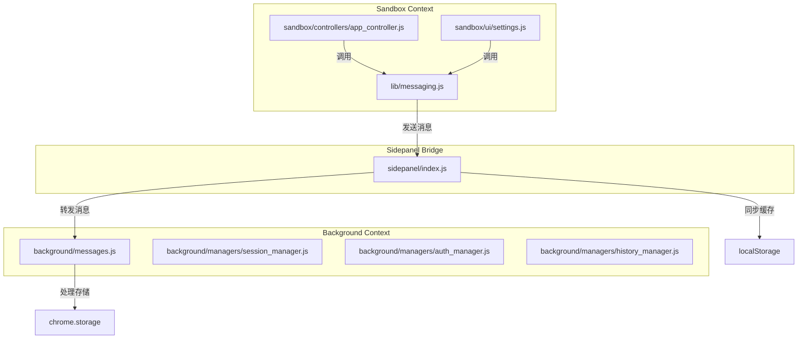
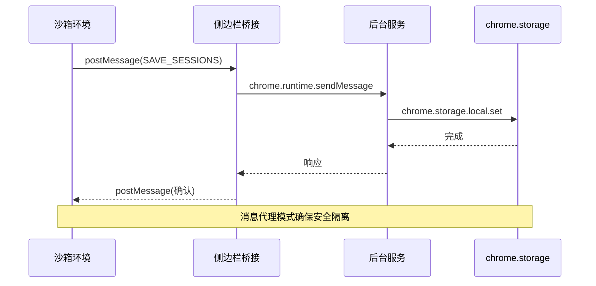
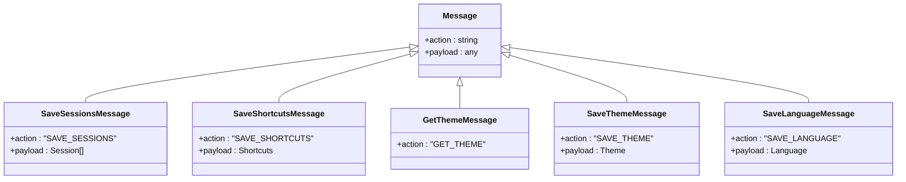
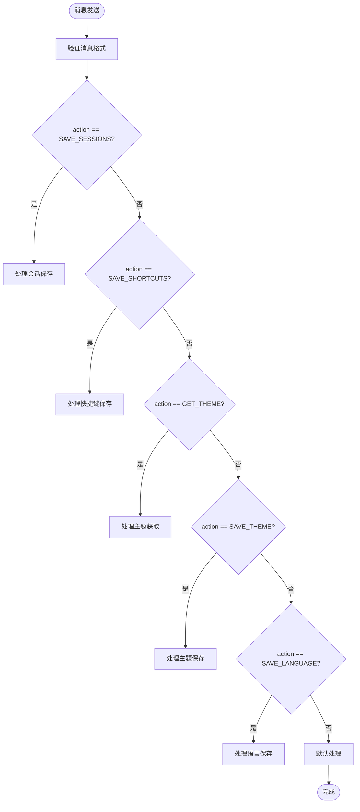
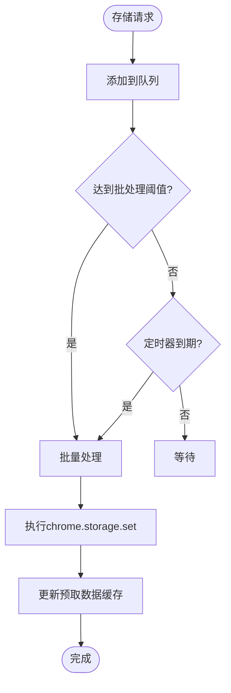
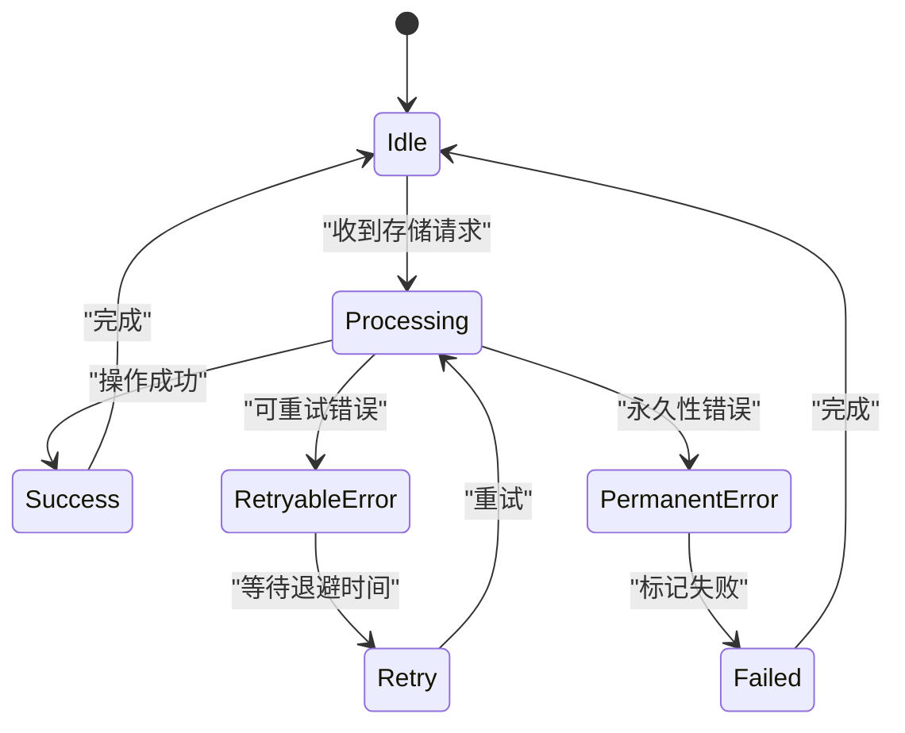
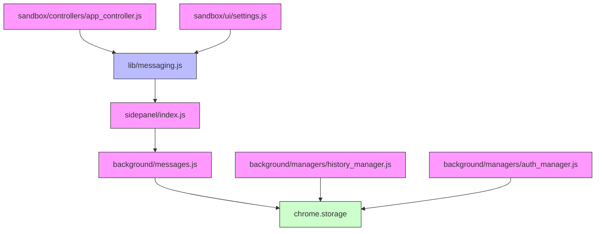

# 存储通信接口

<cite>
**本文档引用的文件**
- [messages.js](file://background/messages.js)
- [messaging.js](file://lib/messaging.js)
- [app.js](file://sandbox/boot/app.js)
- [app_controller.js](file://sandbox/controllers/app_controller.js)
- [session_manager.js](file://background/managers/session_manager.js)
- [auth_manager.js](file://background/managers/auth_manager.js)
- [history_manager.js](file://background/managers/history_manager.js)
- [sidepanel/index.js](file://sidepanel/index.js)
- [settings.js](file://sandbox/ui/settings.js)
- [view.js](file://sandbox/ui/settings/view.js)
- [constants.js](file://lib/constants.js)
</cite>

## 目录
1. [简介](#简介)
2. [项目结构](#项目结构)
3. [核心组件](#核心组件)
4. [架构概述](#架构概述)
5. [详细组件分析](#详细组件分析)
6. [依赖分析](#依赖分析)
7. [性能考虑](#性能考虑)
8. [故障排除指南](#故障排除指南)
9. [结论](#结论)

## 简介
本文档全面描述了通过消息系统与chrome.storage交互的设计模式。重点介绍'SAVE_SESSIONS'、'SAVE_SHORTCUTS'、'GET_THEME'、'SAVE_LANGUAGE'等消息的用途、数据格式和调用时机。解释了采用消息代理而非直接访问存储API的设计决策，包括安全隔离和架构解耦的优势。说明了存储操作的批量处理、节流机制和错误重试策略。提供了性能优化建议，如减少不必要的存储写入和避免存储冲突。包含实际使用示例，展示如何在沙箱环境中安全地读写用户配置。

## 项目结构
项目采用模块化架构，主要分为background、content、sandbox、lib等目录。background目录包含后台服务逻辑，sandbox目录包含沙箱环境代码，lib目录包含共享工具库。存储通信接口主要通过消息系统在不同上下文之间传递数据。

**Diagram sources**
- [background/messages.js](file://background/messages.js#L22-L79)
- [lib/messaging.js](file://lib/messaging.js#L4-L96)
- [sidepanel/index.js](file://sidepanel/index.js#L150-L425)

**Section sources**
- [background/messages.js](file://background/messages.js)
- [lib/messaging.js](file://lib/messaging.js)
- [sidepanel/index.js](file://sidepanel/index.js)

## 核心组件
核心组件包括消息代理系统、存储管理器和状态同步机制。消息代理系统负责在沙箱环境和后台服务之间传递存储请求。存储管理器处理具体的存储操作，包括会话、快捷键、主题等数据的持久化。状态同步机制确保多个组件之间的状态一致性。

**Section sources**
- [lib/messaging.js](file://lib/messaging.js#L4-L96)
- [background/messages.js](file://background/messages.js#L22-L79)
- [sidepanel/index.js](file://sidepanel/index.js#L295-L334)

## 架构概述
系统采用消息代理模式实现存储通信，通过postMessage机制在不同执行上下文之间传递消息。这种设计实现了安全隔离和架构解耦，避免了直接访问chrome.storage API可能带来的安全风险。

**Diagram sources**
- [lib/messaging.js](file://lib/messaging.js#L11-L15)
- [sidepanel/index.js](file://sidepanel/index.js#L295-L297)
- [background/messages.js](file://background/messages.js#L22-L28)

## 详细组件分析

### 消息通信组件分析
消息通信组件负责在沙箱环境和后台服务之间传递存储请求。通过定义标准化的消息格式，实现了类型安全的通信。

#### 消息类型定义

**Diagram sources**
- [lib/messaging.js](file://lib/messaging.js#L11-L45)
- [sidepanel/index.js](file://sidepanel/index.js#L295-L314)

#### 消息处理流程

**Diagram sources**
- [sidepanel/index.js](file://sidepanel/index.js#L295-L334)
- [background/messages.js](file://background/messages.js#L22-L79)

### 存储管理组件分析
存储管理组件负责具体的存储操作，包括数据持久化、批量处理和错误处理。

#### 存储操作批处理

**Diagram sources**
- [sidepanel/index.js](file://sidepanel/index.js#L295-L334)
- [background/managers/history_manager.js](file://background/managers/history_manager.js#L12-L58)

#### 错误重试策略

**Diagram sources**
- [background/managers/history_manager.js](file://background/managers/history_manager.js#L12-L62)
- [background/managers/auth_manager.js](file://background/managers/auth_manager.js#L75-L92)

**Section sources**
- [sidepanel/index.js](file://sidepanel/index.js#L295-L334)
- [background/managers/history_manager.js](file://background/managers/history_manager.js)
- [background/managers/auth_manager.js](file://background/managers/auth_manager.js)

## 依赖分析
系统各组件之间的依赖关系清晰，通过消息系统实现松耦合。沙箱环境不直接依赖chrome.storage API，而是通过消息代理间接访问。

**Diagram sources**
- [lib/messaging.js](file://lib/messaging.js)
- [sidepanel/index.js](file://sidepanel/index.js)
- [background/messages.js](file://background/messages.js)

**Section sources**
- [lib/messaging.js](file://lib/messaging.js)
- [sidepanel/index.js](file://sidepanel/index.js)
- [background/messages.js](file://background/messages.js)

## 性能考虑
系统通过多种机制优化存储操作性能，包括批量处理、本地缓存和预取数据。

### 批量处理策略
存储操作采用批量处理策略，将多个小的存储请求合并为一个大的请求，减少I/O操作次数。系统在以下情况下触发批量处理：
- 达到预设的批处理大小阈值
- 定时器到期（防止请求长时间等待）
- 收到同步请求

### 本地缓存优化
系统使用localStorage作为chrome.storage的缓存层，实现快速读取。对于主题和语言等频繁访问的配置，优先从localStorage读取，确保UI快速响应。

### 预取数据机制
侧边栏在加载时预取所有相关数据，减少后续通信开销。预取的数据包括会话历史、快捷键、模型设置等，存储在preFetchedData变量中。

**Section sources**
- [sidepanel/index.js](file://sidepanel/index.js#L18-L37)
- [sidepanel/index.js](file://sidepanel/index.js#L295-L334)

## 故障排除指南
### 常见问题及解决方案
1. **存储操作失败**
   - 检查消息格式是否正确
   - 确认后台服务是否正常运行
   - 查看控制台错误日志

2. **数据不同步**
   - 检查preFetchedData缓存是否更新
   - 确认消息是否成功传递
   - 验证chrome.storage API调用结果

3. **性能问题**
   - 检查批处理阈值设置
   - 确认本地缓存是否有效
   - 分析消息传递频率

**Section sources**
- [background/managers/history_manager.js](file://background/managers/history_manager.js#L12-L62)
- [sidepanel/index.js](file://sidepanel/index.js#L295-L334)

## 结论
本文档详细描述了存储通信接口的设计和实现。通过消息代理模式，系统实现了安全隔离和架构解耦，确保了沙箱环境的安全性。批量处理、本地缓存和预取数据等优化策略显著提升了系统性能。建议在实际使用中遵循最佳实践，合理使用存储API，避免不必要的写入操作。