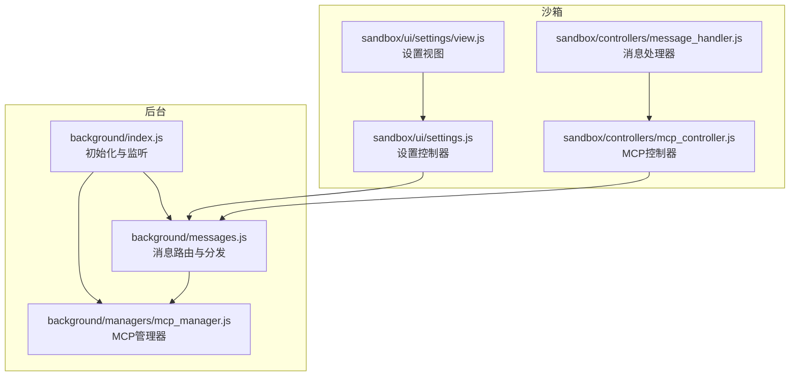
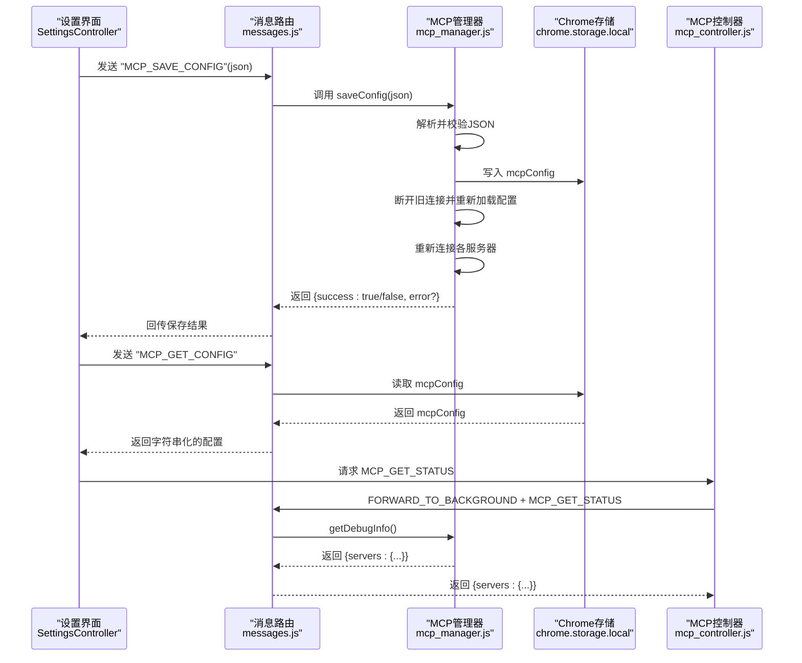
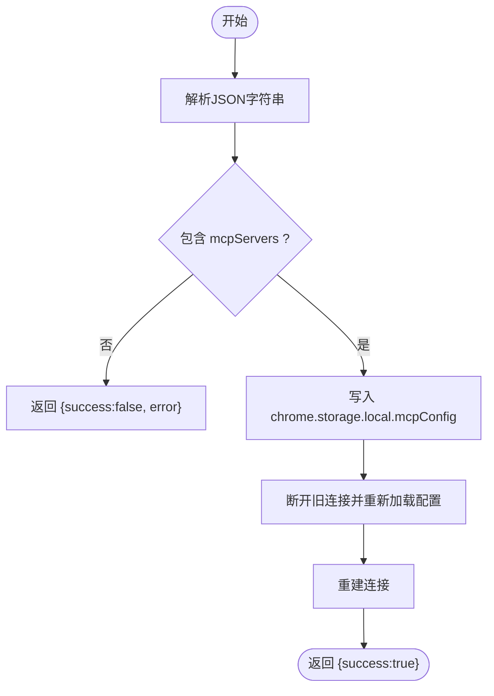
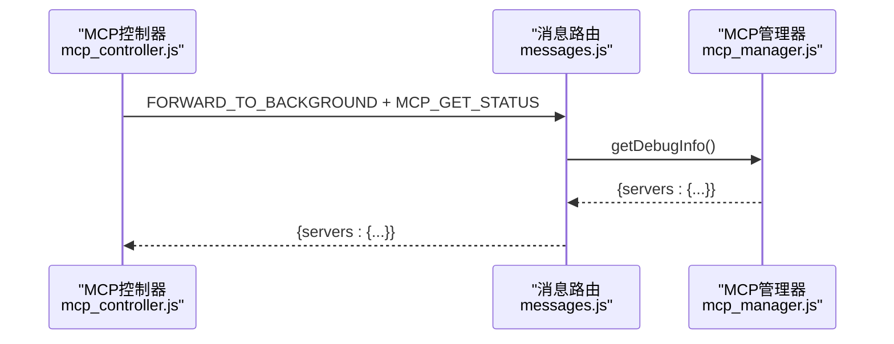
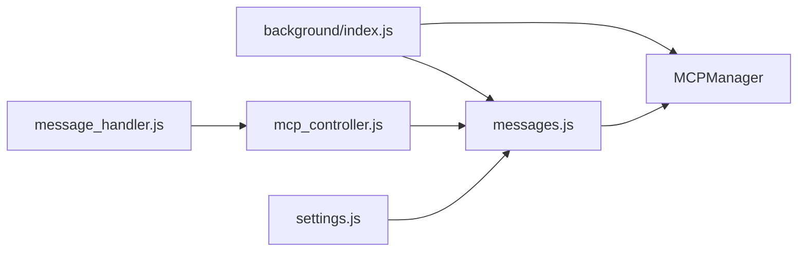

# MCP管理协议

<cite>
**本文档引用的文件**
- [background/managers/mcp_manager.js](file://background/managers/mcp_manager.js)
- [background/messages.js](file://background/messages.js)
- [sandbox/controllers/mcp_controller.js](file://sandbox/controllers/mcp_controller.js)
- [sandbox/controllers/message_handler.js](file://sandbox/controllers/message_handler.js)
- [sandbox/ui/settings.js](file://sandbox/ui/settings.js)
- [sandbox/ui/settings/view.js](file://sandbox/ui/settings/view.js)
- [background/index.js](file://background/index.js)
</cite>

## 目录
1. [简介](#简介)
2. [项目结构](#项目结构)
3. [核心组件](#核心组件)
4. [架构总览](#架构总览)
5. [详细组件分析](#详细组件分析)
6. [依赖关系分析](#依赖关系分析)
7. [性能考量](#性能考量)
8. [故障排除指南](#故障排除指南)
9. [结论](#结论)

## 简介
本文件系统性阐述Gemini Nexus中实现的MCP（Model Context Protocol）管理协议，聚焦以下核心消息端点：
- MCP_SAVE_CONFIG：保存MCP配置
- MCP_GET_CONFIG：获取当前MCP配置
- MCP_GET_TOOLS：获取所有可用工具
- MCP_GET_STATUS：获取MCP服务器状态

文档还涵盖：
- MCP配置的JSON Schema定义与存储结构（mcpConfig对象）
- 工具元数据的序列化格式
- 配置保存时的数据验证流程与错误处理机制
- 工具列表获取时的缓存策略
- MCP服务器状态调试信息的采集方法与安全边界控制（敏感信息过滤）
- 每个MCP管理消息的完整请求/响应示例与异常情况处理指南

## 项目结构
MCP管理协议涉及后台管理器、消息路由、沙箱控制器与UI设置模块之间的协作。关键文件如下：
- 后台管理器：负责连接MCP服务器、维护状态、刷新工具列表、执行工具调用
- 消息路由：在扩展运行时监听来自前端的消息并分发到相应处理器
- 沙箱控制器：负责MCP服务器选择UI与状态展示
- 设置界面：提供配置输入、保存与获取配置的入口
- 应用入口：初始化MCP管理器并建立消息监听

图表来源
- [background/index.js](file://background/index.js#L1-L30)
- [background/messages.js](file://background/messages.js#L1-L82)
- [background/managers/mcp_manager.js](file://background/managers/mcp_manager.js#L1-L530)
- [sandbox/controllers/mcp_controller.js](file://sandbox/controllers/mcp_controller.js#L1-L221)
- [sandbox/controllers/message_handler.js](file://sandbox/controllers/message_handler.js#L1-L365)
- [sandbox/ui/settings.js](file://sandbox/ui/settings.js#L1-L249)
- [sandbox/ui/settings/view.js](file://sandbox/ui/settings/view.js#L1-L241)

章节来源
- [background/index.js](file://background/index.js#L1-L30)
- [background/messages.js](file://background/messages.js#L1-L82)

## 核心组件
- MCPManager：负责加载/保存配置、连接服务器、维护状态、刷新工具列表、执行工具调用
- 消息路由：在后台监听扩展消息，分发至对应处理器（含MCP管理）
- MCPController：在沙箱侧维护MCP服务器选择UI与状态展示
- SettingsController/SettingsView：提供MCP配置的编辑、保存与获取入口

章节来源
- [background/managers/mcp_manager.js](file://background/managers/mcp_manager.js#L1-L530)
- [background/messages.js](file://background/messages.js#L1-L82)
- [sandbox/controllers/mcp_controller.js](file://sandbox/controllers/mcp_controller.js#L1-L221)
- [sandbox/ui/settings.js](file://sandbox/ui/settings.js#L1-L249)
- [sandbox/ui/settings/view.js](file://sandbox/ui/settings/view.js#L1-L241)

## 架构总览
下图展示了MCP管理协议在系统中的交互路径，从设置界面发起配置保存，到后台管理器持久化并重建连接，再到沙箱侧的状态展示与工具获取。

图表来源
- [background/messages.js](file://background/messages.js#L42-L67)
- [background/managers/mcp_manager.js](file://background/managers/mcp_manager.js#L40-L61)
- [sandbox/controllers/mcp_controller.js](file://sandbox/controllers/mcp_controller.js#L88-L93)

## 详细组件分析

### MCP配置的JSON Schema定义与存储结构
- 存储键名：mcpConfig
- 结构要点：
  - mcpServers：对象映射，键为服务器ID（通常使用名称），值为服务器配置对象
  - 服务器配置字段（示例）：
    - url 或 endpoint：服务器URL
    - type：传输类型，支持 "sse"（默认）、"streamable_http"、"http"
  - 状态字段：由MCPManager内部维护，包含 status、postUrl、tools 等

- 配置保存流程与验证：
  - 前端设置界面先进行基础JSON格式校验
  - 后台接收后解析并检查是否包含 mcpServers 键
  - 成功后写入 chrome.storage.local，并断开旧连接、重新加载配置、重建连接
  - 失败时返回包含错误信息的对象

- 获取配置：
  - 后台直接从存储读取并以字符串形式返回，便于设置界面显示与编辑

- 工具列表获取：
  - 后台聚合所有服务器的工具列表，附加 _serverId 字段用于标识来源

- 状态调试信息：
  - 后台提供 getDebugInfo()，返回每个服务器的 status、type、url、postUrl、toolCount、tools（仅名称）

章节来源
- [background/managers/mcp_manager.js](file://background/managers/mcp_manager.js#L21-L61)
- [background/messages.js](file://background/messages.js#L49-L61)
- [sandbox/ui/settings.js](file://sandbox/ui/settings.js#L238-L247)

### MCP_SAVE_CONFIG（保存配置）
- 请求
  - 来源：设置界面
  - 动作：MCP_SAVE_CONFIG
  - 参数：json（字符串化的JSON，包含 mcpServers）
- 处理流程
  - 前端基础校验（JSON格式）
  - 后台解析并校验 mcpServers 键存在
  - 写入存储、断开旧连接、重新加载配置、重建连接
- 响应
  - { success: true } 或 { success: false, error: "..." }
- 异常处理
  - JSON解析失败或缺少 mcpServers 键时返回错误
  - 连接失败时状态标记为 error

图表来源
- [background/managers/mcp_manager.js](file://background/managers/mcp_manager.js#L40-L61)
- [sandbox/ui/settings.js](file://sandbox/ui/settings.js#L238-L247)

章节来源
- [background/messages.js](file://background/messages.js#L42-L47)
- [background/managers/mcp_manager.js](file://background/managers/mcp_manager.js#L40-L61)
- [sandbox/ui/settings.js](file://sandbox/ui/settings.js#L238-L247)

### MCP_GET_CONFIG（获取配置）
- 请求
  - 来源：设置界面
  - 动作：MCP_GET_CONFIG
- 处理流程
  - 后台从 chrome.storage.local 读取 mcpConfig
  - 若不存在则返回空对象 { mcpServers: {} }
  - 将配置以字符串形式返回，便于设置界面显示与编辑
- 响应
  - 字符串化的配置JSON
- 异常处理
  - 存储读取失败时返回空配置

章节来源
- [background/messages.js](file://background/messages.js#L49-L55)
- [background/managers/mcp_manager.js](file://background/managers/mcp_manager.js#L21-L38)

### MCP_GET_TOOLS（获取工具列表）
- 请求
  - 来源：沙箱控制器或会话上下文
  - 动作：MCP_GET_TOOLS
- 处理流程
  - 后台聚合所有服务器的工具列表
  - 为每个工具附加 _serverId 字段，标识其来源服务器
- 响应
  - { tools: [...] }
- 异常处理
  - 无工具时返回空数组；工具解析失败不影响其他服务器

章节来源
- [background/messages.js](file://background/messages.js#L57-L61)
- [background/managers/mcp_manager.js](file://background/managers/mcp_manager.js#L407-L420)

### MCP_GET_STATUS（获取服务器状态）
- 请求
  - 来源：沙箱侧MCP控制器
  - 动作：MCP_GET_STATUS
- 处理流程
  - 后台调用 getDebugInfo()，返回每个服务器的简要状态信息
- 响应
  - { servers: { [id]: { status, type, url, postUrl, toolCount, tools[] } } }
- 异常处理
  - 无服务器时返回空对象

图表来源
- [sandbox/controllers/mcp_controller.js](file://sandbox/controllers/mcp_controller.js#L88-L93)
- [background/messages.js](file://background/messages.js#L63-L67)
- [background/managers/mcp_manager.js](file://background/managers/mcp_manager.js#L389-L403)

章节来源
- [sandbox/controllers/mcp_controller.js](file://sandbox/controllers/mcp_controller.js#L88-L93)
- [background/messages.js](file://background/messages.js#L63-L67)
- [background/managers/mcp_manager.js](file://background/managers/mcp_manager.js#L389-L403)

### 工具元数据的序列化格式
- 工具对象字段（示例）
  - name：工具名称
  - description：工具描述
  - inputSchema：输入参数Schema（可选）
  - 其他自定义字段：由服务器提供
- 附加字段
  - _serverId：标识工具来源服务器ID
- 工具列表刷新策略
  - SSE模式：通过SSE endpoint事件获取POST URL后初始化会话并列出工具
  - HTTP模式：直接向POST URL发送JSON-RPC请求 "tools/list"，兼容多种响应格式
  - 缓存策略：工具列表作为内存缓存，随服务器连接状态变化而更新

章节来源
- [background/managers/mcp_manager.js](file://background/managers/mcp_manager.js#L153-L213)
- [background/managers/mcp_manager.js](file://background/managers/mcp_manager.js#L287-L306)
- [background/managers/mcp_manager.js](file://background/managers/mcp_manager.js#L407-L420)

### 配置保存时的数据验证流程与错误处理机制
- 前端验证
  - 基础JSON格式校验，提示无效JSON
- 后端验证
  - 解析JSON并检查 mcpServers 键是否存在
  - 写入存储成功后触发重连流程
- 错误处理
  - 保存失败：返回 { success: false, error: message }
  - 连接失败：服务器状态标记为 error，工具列表清空

章节来源
- [sandbox/ui/settings.js](file://sandbox/ui/settings.js#L238-L247)
- [background/managers/mcp_manager.js](file://background/managers/mcp_manager.js#L40-L61)

### MCP服务器状态调试信息采集与安全边界控制
- 调试信息采集
  - getDebugInfo() 返回每个服务器的 status、type、url、postUrl、toolCount、tools[]
- 安全边界控制
  - 当前实现未对调试信息进行敏感信息过滤
  - 建议在生产环境输出前移除或脱敏敏感字段（如URL中的认证参数）
  - 在日志系统中避免记录完整URL与敏感头信息

章节来源
- [background/managers/mcp_manager.js](file://background/managers/mcp_manager.js#L389-L403)

## 依赖关系分析
- 初始化与监听
  - background/index.js 初始化MCPManager并设置消息监听
- 消息路由
  - background/messages.js 分发MCP相关动作到MCPManager
- 沙箱交互
  - sandbox/controllers/mcp_controller.js 通过postMessage转发MCP_GET_STATUS
  - sandbox/controllers/message_handler.js 接收MCP状态响应并更新UI
  - sandbox/ui/settings.js 与设置视图配合完成配置的保存与获取

图表来源
- [background/index.js](file://background/index.js#L16-L26)
- [background/messages.js](file://background/messages.js#L14-L81)
- [sandbox/controllers/mcp_controller.js](file://sandbox/controllers/mcp_controller.js#L88-L93)
- [sandbox/controllers/message_handler.js](file://sandbox/controllers/message_handler.js#L82-L85)
- [sandbox/ui/settings.js](file://sandbox/ui/settings.js#L234-L236)

章节来源
- [background/index.js](file://background/index.js#L16-L26)
- [background/messages.js](file://background/messages.js#L14-L81)

## 性能考量
- 连接探测与降级
  - 初次探测若服务器返回JSON而非SSE，则自动切换到HTTP模式，减少不必要的SSE连接失败
- 工具列表刷新
  - HTTP模式下直接POST "tools/list"，避免SSE往返延迟
  - SSE模式下通过endpoint事件获取postUrl后再初始化会话
- 请求超时
  - 发送SSE请求时采用Promise+定时器方式等待响应，超时后清理并拒绝

章节来源
- [background/managers/mcp_manager.js](file://background/managers/mcp_manager.js#L98-L150)
- [background/managers/mcp_manager.js](file://background/managers/mcp_manager.js#L308-L351)

## 故障排除指南
- 无法连接服务器
  - 检查配置中的 url/endpoint 是否正确
  - 查看后台日志中的连接状态与错误信息
  - 若服务器返回JSON而非SSE，确认已自动切换到HTTP模式
- 工具列表为空
  - 确认服务器已正确初始化并返回工具
  - 检查工具列表刷新逻辑（SSE vs HTTP）
- 保存配置失败
  - 确认JSON格式有效且包含 mcpServers 键
  - 查看后台返回的错误信息
- 状态显示异常
  - 使用 MCP_GET_STATUS 获取调试信息，核对 status、postUrl、toolCount

章节来源
- [background/managers/mcp_manager.js](file://background/managers/mcp_manager.js#L79-L83)
- [background/managers/mcp_manager.js](file://background/managers/mcp_manager.js#L153-L213)
- [background/messages.js](file://background/messages.js#L63-L67)

## 结论
本实现提供了完整的MCP管理协议端点，覆盖配置保存、配置获取、工具列表与服务器状态查询。通过SSE与HTTP两种传输模式的自动探测与降级，提升了兼容性与鲁棒性。建议后续增强：
- 对调试信息进行敏感信息过滤
- 在工具列表获取时引入更完善的缓存与失效策略
- 扩展JSON Schema校验以提升配置质量与安全性