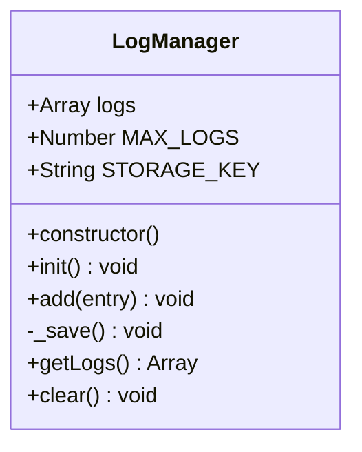

# 日志通信协议

<cite>
**本文档引用的文件**   
- [log_manager.js](file://background/managers/log_manager.js)
- [logger.js](file://lib/logger.js)
- [messages.js](file://background/messages.js)
- [sidepanel/index.js](file://sidepanel/index.js)
- [sandbox/ui/settings.js](file://sandbox/ui/settings.js)
</cite>

## 目录
1. [简介](#简介)
2. [日志条目数据结构](#日志条目数据结构)
3. [日志通信机制](#日志通信机制)
4. [日志管理器实现](#日志管理器实现)
5. [日志分页与性能优化](#日志分页与性能优化)
6. [前端调用示例](#前端调用示例)
7. [异常处理与补偿机制](#异常处理与补偿机制)

## 简介
Gemini Nexus日志通信协议基于Chrome扩展的`chrome.runtime.sendMessage`机制，实现了跨上下文的日志集中化管理。该协议定义了`LOG_ENTRY`和`GET_LOGS`两种核心消息类型，分别用于日志写入和日志读取。系统通过`LogManager`类在后台页面中维护日志的内存缓冲区和持久化存储，确保日志数据的可靠性和可访问性。

**Section sources**
- [messages.js](file://background/messages.js#L22-L82)
- [log_manager.js](file://background/managers/log_manager.js#L1-L62)

## 日志条目数据结构
日志条目（Log Entry）采用标准化的JSON对象结构，包含以下核心字段：

- **level**: 日志级别，字符串类型，取值包括`INFO`、`WARN`、`ERROR`等，用于标识日志的严重程度。
- **timestamp**: 时间戳，数字类型，表示日志生成的毫秒级时间（`Date.now()`）。
- **source**: 源标识，字符串类型，用于标识日志来源的上下文或模块（如`Background`、`Content Script`）。
- **message**: 消息内容，字符串类型，包含具体的日志描述信息。
- **data**: 附加数据，可选字段，可以包含任意可序列化的JSON数据，用于提供额外的调试信息。

该数据结构在`lib/logger.js`中由`Logger`类的`_log`方法构造，并确保`data`字段通过`JSON.parse(JSON.stringify(data))`进行深度克隆，以保证其可序列化性。

**Section sources**
- [logger.js](file://lib/logger.js#L13-L27)
- [log_manager.js](file://background/managers/log_manager.js#L18-L23)

## 日志通信机制
日志通信机制依赖于Chrome扩展的运行时消息系统，实现了从不同执行上下文到后台页面的单向日志流。

### LOG_ENTRY消息
当任何模块需要记录日志时，会通过`Logger`类发送`LOG_ENTRY`消息。该机制根据当前执行环境选择不同的通信路径：
- **直接通信**: 在后台页面、内容脚本或弹出页面中，直接调用`chrome.runtime.sendMessage`将`{ action: 'LOG_ENTRY', entry }`发送到后台。
- **间接通信**: 在沙箱（Sandbox）的iframe环境中，通过`window.parent.postMessage`将消息封装为`{ action: 'FORWARD_TO_BACKGROUND', payload: { action: 'LOG_ENTRY', entry } }`，由`sidepanel/index.js`中的桥接代码转发至后台。

后台的`messages.js`文件中的全局消息监听器捕获`LOG_ENTRY`消息，并将其委托给`LogManager`实例进行处理。

### GET_LOGS消息
`GET_LOGS`消息用于从后台请求所有日志记录。与`LOG_ENTRY`不同，这是一个需要响应的异步请求。发送方调用`chrome.runtime.sendMessage`并传递`{ action: 'GET_LOGS' }`，后台的监听器会立即调用`sendResponse({ logs: logManager.getLogs() })`返回日志数组。由于`sendResponse`必须在消息处理函数的同步执行期间被调用，因此该操作是即时完成的。

**Section sources**
- [logger.js](file://lib/logger.js#L28-L52)
- [messages.js](file://background/messages.js#L25-L32)
- [sidepanel/index.js](file://sidepanel/index.js#L180-L196)

## 日志管理器实现
`LogManager`是日志系统的核心，负责日志的存储、持久化和生命周期管理。

### 异步写入策略
`LogManager`采用异步写入策略来平衡性能和数据可靠性。当新的日志条目通过`add(entry)`方法添加时，它会立即被推入内存中的`logs`数组。随后，`_save()`方法被调用，通过`chrome.storage.local.set`将整个日志数组异步保存到本地存储。此操作不等待完成，避免阻塞主线程。`chrome.storage.local`的内部机制已经足够高效，通常无需额外的防抖（debounce）处理。

### 内存与持久化管理
- **内存缓冲**: 所有日志首先存储在内存的`logs`数组中，以实现快速的读写访问。
- **持久化存储**: 日志通过`chrome.storage.local`持久化，使用`gemini_nexus_logs`作为存储键。在`LogManager`初始化时，会尝试从存储中恢复日志。
- **容量限制**: 通过`MAX_LOGS`常量（默认2000条）限制日志数量。当日志条目超过此限制时，系统会通过`slice(-this.MAX_LOGS)`保留最新的日志，自动丢弃最旧的日志，防止内存和存储溢出。



**Diagram sources**
- [log_manager.js](file://background/managers/log_manager.js#L4-L61)

**Section sources**
- [log_manager.js](file://background/managers/log_manager.js#L1-L62)
- [background/index.js](file://background/index.js#L17-L26)

## 日志分页与性能优化
系统通过多种机制优化日志的读取性能和用户体验。

### 分页处理机制
虽然`GET_LOGS`消息本身返回所有日志，但前端消费方（如设置界面）会实现分页逻辑。例如，`sandbox/ui/settings.js`中的`SettingsController`在收到日志后，会将其格式化为文本并触发下载，而不是在UI中一次性渲染所有日志。这本质上是一种“客户端分页”，避免了在界面上加载大量数据导致的性能问题。

### 性能优化方案
- **内存缓冲区管理**: 如前所述，内存中的日志数组提供了O(1)的添加和O(n)的读取性能，是高效的缓冲机制。
- **历史日志持久化**: 利用`chrome.storage.local`进行持久化，该API针对扩展的键值存储进行了优化，适合存储中等大小的数据集。
- **避免阻塞**: 所有存储操作都是异步的，确保日志记录不会阻塞应用的主逻辑。
- **初始化优化**: 在`LogManager`初始化时，仅进行一次存储读取，减少了启动时的I/O开销。

**Section sources**
- [log_manager.js](file://background/managers/log_manager.js#L12-L27)
- [sandbox/ui/settings.js](file://sandbox/ui/settings.js#L143-L167)

## 前端调用示例
以下是在前端代码中发送日志的完整示例：

```javascript
// 1. 创建一个Logger实例
const logger = new Logger('MyModule');

// 2. 记录不同级别的日志
logger.info('This is an info message', { userId: 123 });
logger.warn('This is a warning', { action: 'deprecated_api_call' });
logger.error('An error occurred', { error: new Error('Something went wrong') });

// 3. 在沙箱环境中，使用sendToBackground发送GET_LOGS请求
import { sendToBackground } from '../../lib/messaging.js';

// 请求所有日志
sendToBackground({ action: 'GET_LOGS' }).then(response => {
    // 处理返回的日志数组
    console.log('Received logs:', response.logs);
}).catch(error => {
    console.error('Failed to get logs:', error);
});
```

此示例展示了如何使用`Logger`类进行日志记录，以及如何通过`sendToBackground`工具函数与后台通信。

**Section sources**
- [logger.js](file://lib/logger.js#L4-L27)
- [messaging.js](file://lib/messaging.js#L4-L8)
- [sandbox/ui/settings.js](file://sandbox/ui/settings.js#L143-L145)

## 异常处理与补偿机制
日志系统设计了多层次的异常处理和补偿机制，以确保系统的健壮性。

### 异常处理
- **消息发送失败**: 在`logger.js`中，`chrome.runtime.sendMessage`的调用被包裹在`try-catch`块中，并且其返回的Promise的`catch`回调被忽略。这意味着如果后台页面暂时不可达（例如在扩展启动初期），日志发送失败不会导致调用方崩溃。
- **存储失败**: `LogManager`的`_save()`方法对`chrome.storage.local.set`的调用也使用了`catch(() => {})`来忽略错误，防止存储问题影响日志记录流程。

### 补偿机制
- **本地控制台回退**: 当日志通过`Logger`类记录时，除了发送到后台，还会根据日志级别调用`console.log`、`console.warn`或`console.error`。这确保了即使后台通信失败，开发者仍然可以在当前上下文的控制台中看到日志，作为重要的补偿手段。
- **数据丢失容忍**: 系统设计上容忍少量日志丢失。由于日志主要用于调试和监控，而非关键业务数据，因此短暂的通信中断导致的日志丢失是可以接受的。系统优先保证主功能的稳定运行。

**Section sources**
- [logger.js](file://lib/logger.js#L22-L27)
- [logger.js](file://lib/logger.js#L35-L37)
- [log_manager.js](file://background/managers/log_manager.js#L44-L45)