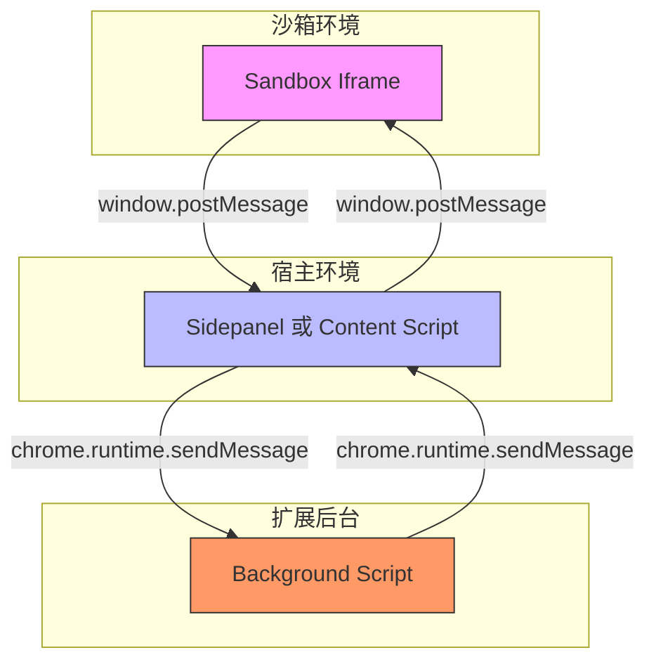
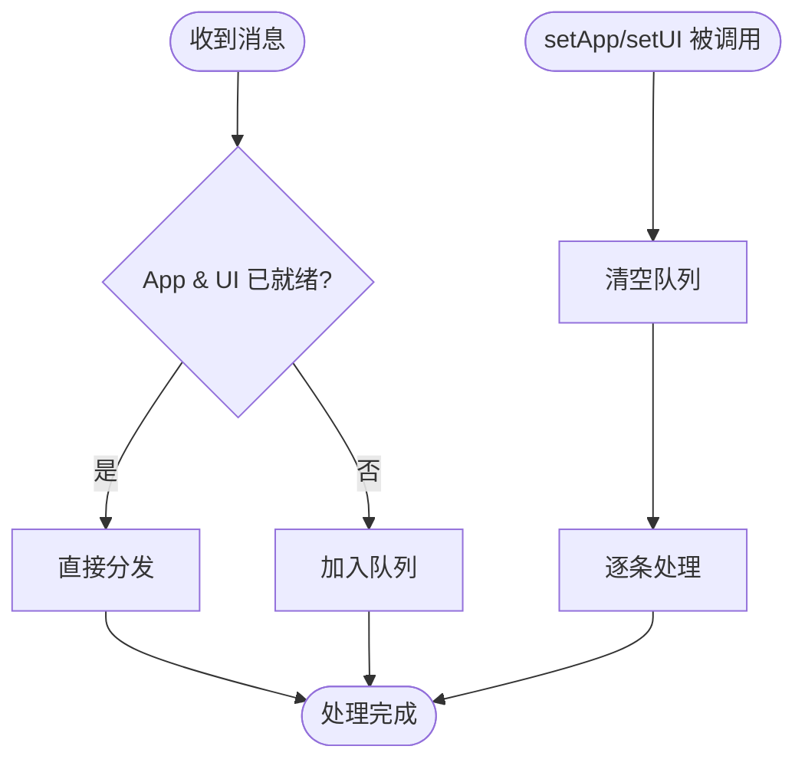
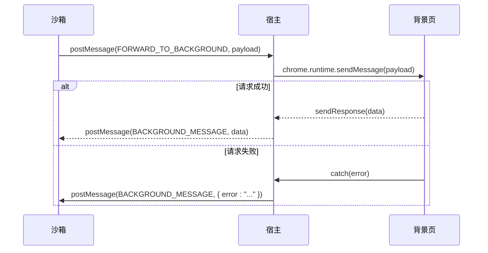

# 核心消息协议

<cite>
**本文档引用文件**  
- [messages.js](file://background/messages.js)
- [messaging.js](file://lib/messaging.js)
- [messaging.js](file://sandbox/boot/messaging.js)
- [index.js](file://background/index.js)
- [bridge.js](file://content/toolbar/bridge.js)
- [sidepanel/index.js](file://sidepanel/index.js)
- [logger.js](file://lib/logger.js)
- [session.js](file://background/handlers/session.js)
- [ui.js](file://background/handlers/ui.js)
- [events.js](file://sandbox/boot/events.js)
- [app.js](file://sandbox/boot/app.js)
- [log_manager.js](file://background/managers/log_manager.js)
</cite>

## 目录
1. [引言](#引言)
2. [双层通信架构](#双层通信架构)
3. [核心消息类型与传输路径](#核心消息类型与传输路径)
4. [AppMessageBridge 消息代理桥接器](#appmessagebridge-消息代理桥接器)
5. [消息头设计与负载结构](#消息头设计与负载结构)
6. [错误传播与异常处理机制](#错误传播与异常处理机制)
7. [安全边界与跨上下文通信规则](#安全边界与跨上下文通信规则)
8. [调用示例与使用模式](#调用示例与使用模式)
9. [结论](#结论)

## 引言
Gemini Nexus 扩展采用基于 `chrome.runtime.sendMessage` 和 `window.postMessage` 的双层消息通信机制，实现背景页、内容脚本、沙箱环境与侧边栏之间的安全、高效通信。本协议文档详细描述了消息传输路径、数据结构、序列化格式、桥接器设计原理及安全边界处理策略，为开发者提供完整的通信体系参考。

**Section sources**
- [messages.js](file://background/messages.js#L1-L82)
- [messaging.js](file://lib/messaging.js#L1-L96)

## 双层通信架构
Gemini Nexus 的通信架构分为两个层级：
1. **扩展内部通信层**：使用 `chrome.runtime.sendMessage` 在背景页、内容脚本和侧边栏之间进行受信通信。
2. **沙箱隔离通信层**：使用 `window.postMessage` 在沙箱 iframe 与宿主环境（侧边栏或内容脚本）之间进行跨源通信。

沙箱环境通过 `FORWARD_TO_BACKGROUND` 消息类型将请求转发至背景页，形成“沙箱 → 宿主 → 背景页”的完整通信链路。



**Diagram sources**
- [sidepanel/index.js](file://sidepanel/index.js#L178-L195)
- [messaging.js](file://lib/messaging.js#L4-L8)

**Section sources**
- [sidepanel/index.js](file://sidepanel/index.js#L1-L425)
- [messaging.js](file://lib/messaging.js#L1-L96)

## 核心消息类型与传输路径
### 日志系统消息
| 消息类型 | 传输路径 | 数据结构 | 序列化格式 | 说明 |
|--------|--------|--------|----------|------|
| `LOG_ENTRY` | 任意上下文 → 背景页 | `{ action: "LOG_ENTRY", entry: { level, context, message, timestamp } }` | JSON | 记录日志条目，由 `LogManager` 处理 |
| `GET_LOGS` | 请求方 → 背景页 → 响应方 | `{ action: "GET_LOGS" }` → `{ logs: [...] }` | JSON | 获取所有日志记录 |

**Section sources**
- [messages.js](file://background/messages.js#L25-L33)
- [log_manager.js](file://background/managers/log_manager.js#L2-L61)

### 后台标签页控制消息
| 消息类型 | 传输路径 | 数据结构 | 序列化格式 | 说明 |
|--------|--------|--------|----------|------|
| `OPEN_TAB_BACKGROUND` | 任意上下文 → 背景页 | `{ action: "OPEN_TAB_BACKGROUND", url: string }` | JSON | 在后台打开新标签页，不切换焦点 |

**Section sources**
- [messages.js](file://background/messages.js#L36-L38)

### MCP 管理消息
| 消息类型 | 传输路径 | 数据结构 | 序列化格式 | 说明 |
|--------|--------|--------|----------|------|
| `MCP_SAVE_CONFIG` | 请求方 → 背景页 → 响应方 | `{ action: "MCP_SAVE_CONFIG", json: object }` → `{ success: boolean }` | JSON | 保存 MCP 配置 |
| `MCP_GET_CONFIG` | 请求方 → 背景页 → 响应方 | `{ action: "MCP_GET_CONFIG" }` → `{ config: string }` | JSON | 获取 MCP 配置（字符串化 JSON） |
| `MCP_GET_TOOLS` | 请求方 → 背景页 → 响应方 | `{ action: "MCP_GET_TOOLS" }` → `{ tools: array }` | JSON | 获取所有可用工具列表 |
| `MCP_GET_STATUS` | 请求方 → 背景页 → 响应方 | `{ action: "MCP_GET_STATUS" }` → `{ servers: object }` | JSON | 获取 MCP 服务器状态 |

**Section sources**
- [messages.js](file://background/messages.js#L42-L67)

### 会话与 UI 控制消息
| 消息类型 | 传输路径 | 数据结构 | 序列化格式 | 说明 |
|--------|--------|--------|----------|------|
| `SEND_PROMPT` | 沙箱 → 背景页 | `{ action: "SEND_PROMPT", prompt: string, images: array }` | JSON | 发送提示请求 |
| `CANCEL_PROMPT` | 任意上下文 → 背景页 | `{ action: "CANCEL_PROMPT" }` → `{ status: "cancelled" \| "no_active_request" }` | JSON | 取消当前请求 |
| `OPEN_SIDE_PANEL` | 请求方 → 背景页 | `{ action: "OPEN_SIDE_PANEL", sessionId?: string }` | JSON | 打开侧边栏并可选切换会话 |
| `GET_ACTIVE_TAB_INFO` | 请求方 → 背景页 → 响应方 | `{ action: "GET_ACTIVE_TAB_INFO" }` → `{ action: "ACTIVE_TAB_INFO", title, url }` | JSON | 获取当前活动标签页信息 |

**Section sources**
- [session.js](file://background/handlers/session.js#L1-L56)
- [ui.js](file://background/handlers/ui.js#L1-L195)

## AppMessageBridge 消息代理桥接器
`AppMessageBridge` 类位于 `sandbox/boot/messaging.js`，是沙箱环境与应用逻辑之间的核心通信桥接器。

### 设计原理
- **延迟绑定**：在应用实例（`app`）和 UI 实例（`ui`）初始化完成前，所有消息被暂存于队列中。
- **自动刷新**：当 `setApp()` 或 `setUI()` 被调用时，自动清空消息队列并分发所有待处理消息。
- **单向分发**：消息根据 `action` 类型分发给 `ui` 或 `app` 实例处理。

### 消息队列机制


**Diagram sources**
- [messaging.js](file://sandbox/boot/messaging.js#L29-L47)

**Section sources**
- [messaging.js](file://sandbox/boot/messaging.js#L4-L90)
- [app.js](file://sandbox/boot/app.js#L81-L83)

## 消息头设计与负载结构
### 消息头设计
所有消息均采用统一的结构：
```json
{
  "action": "消息类型",
  "payload": { /* 可选负载数据 */ }
}
```

### 负载结构定义
- **`FORWARD_TO_BACKGROUND`**：`payload` 包含完整的子消息对象，如 `{ action: "LOG_ENTRY", entry: {...} }`
- **`RESTORE_*` 系列消息**：`payload` 为原始数据值，如主题名、快捷键配置等
- **`BACKGROUND_MESSAGE`**：`payload` 为从背景页返回的原始消息对象

### 序列化规则
- 所有对象均通过 `JSON.stringify` 序列化
- 函数和复杂对象不支持跨上下文传递
- 大型数据（如图像）以 Base64 字符串形式传输

**Section sources**
- [messaging.js](file://lib/messaging.js#L4-L96)
- [sidepanel/index.js](file://sidepanel/index.js#L54-L98)

## 错误传播与异常处理机制
### 错误传播路径
1. **沙箱环境**：通过 `window.parent.postMessage` 发送错误消息
2. **宿主环境**：捕获 `chrome.runtime.sendMessage` 的 `catch` 分支
3. **背景页**：记录错误日志并通过 `sendResponse` 返回结构化错误

### 异常处理模式
- **静默忽略**：对 `chrome.runtime.sendMessage` 的失败进行 `catch` 并忽略，防止阻塞主流程
- **结构化响应**：对于需要响应的请求，返回 `{ status: "error", message: "..." }` 结构
- **日志记录**：所有关键错误均通过 `LOG_ENTRY` 消息记录到中央日志系统



**Diagram sources**
- [sidepanel/index.js](file://sidepanel/index.js#L181-L195)
- [logger.js](file://lib/logger.js#L28-L52)

**Section sources**
- [sidepanel/index.js](file://sidepanel/index.js#L178-L195)
- [logger.js](file://lib/logger.js#L1-L52)

## 安全边界与跨上下文通信规则
### 安全边界处理
- **沙箱隔离**：沙箱环境运行在独立的 iframe 中，无法直接访问 `chrome` API
- **消息验证**：宿主环境仅转发预定义的 `action` 类型，过滤非法消息
- **源验证**：`window.addEventListener('message')` 检查 `event.source` 是否为预期的 iframe

### 消息转发规则
1. **出站规则**：沙箱只能通过 `FORWARD_TO_BACKGROUND` 向背景页发送消息
2. **入站规则**：背景页通过 `chrome.runtime.sendMessage` 向宿主发送消息，宿主再通过 `postMessage` 转发给沙箱
3. **存储同步**：所有持久化数据通过宿主环境的 `chrome.storage.local` 操作，沙箱仅接收更新通知

**Section sources**
- [sidepanel/index.js](file://sidepanel/index.js#L151-L153)
- [messaging.js](file://lib/messaging.js#L38-L47)

## 调用示例与使用模式
### 记录日志
```javascript
// 在任意上下文中
import { sendToBackground } from '../lib/messaging.js';

sendToBackground({
  action: 'LOG_ENTRY',
  entry: {
    level: 'INFO',
    context: 'MyComponent',
    message: 'Operation completed'
  }
});
```

### 获取日志数据
```javascript
// 仅在支持响应的上下文中（如侧边栏）
chrome.runtime.sendMessage({ action: 'GET_LOGS' })
  .then(response => {
    console.log('Logs:', response.logs);
  });
```

### 打开后台标签页
```javascript
// 通过 lib/messaging.js 封装
sendToBackground({
  action: 'OPEN_TAB_BACKGROUND',
  url: 'https://example.com'
});
```

### 沙箱内初始化通信
```javascript
// sandbox/boot/app.js
const bridge = new AppMessageBridge();
bridge.setUI(ui);
bridge.setApp(app); // 触发队列消息分发
```

**Section sources**
- [messaging.js](file://lib/messaging.js#L4-L8)
- [app.js](file://sandbox/boot/app.js#L22-L23)
- [messages.js](file://background/messages.js#L25-L27)

## 结论
Gemini Nexus 的核心消息协议通过 `chrome.runtime.sendMessage` 和 `window.postMessage` 的双层架构，实现了安全、灵活、可扩展的跨上下文通信。`AppMessageBridge` 的延迟分发机制确保了组件初始化顺序的解耦，而统一的消息头设计和严格的转发规则保障了系统的稳定性和安全性。该协议为扩展的模块化开发和功能扩展提供了坚实的基础。