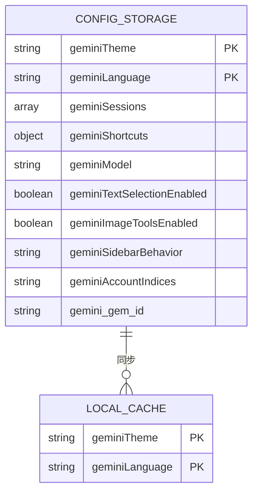

# 配置同步机制

<cite>
**本文档引用的文件**  
- [messages.js](file://background/messages.js)
- [messaging.js](file://sandbox/boot/messaging.js)
- [messaging.js](file://lib/messaging.js)
- [sidepanel/index.js](file://sidepanel/index.js)
- [app.js](file://sandbox/boot/app.js)
- [ui_controller.js](file://sandbox/ui/ui_controller.js)
- [settings.js](file://sandbox/ui/settings.js)
- [settings/view.js](file://sandbox/ui/settings/view.js)
- [core/i18n.js](file://sandbox/core/i18n.js)
- [app_controller.js](file://sandbox/controllers/app_controller.js)
</cite>

## 目录
1. [简介](#简介)
2. [配置同步架构](#配置同步架构)
3. [核心组件分析](#核心组件分析)
4. [配置项存储与数据流](#配置项存储与数据流)
5. [典型场景调用链路](#典型场景调用链路)
6. [实时通知机制](#实时通知机制)
7. [序列化与反序列化处理](#序列化与反序列化处理)
8. [配置变更处理流程](#配置变更处理流程)

## 简介
Gemini Nexus扩展通过window.postMessage机制实现了跨上下文的配置同步方案，确保在不同运行环境（如沙箱、侧边栏、后台）之间保持配置数据的一致性。系统采用RESTORE_*系列消息进行配置的双向同步，通过AppMessageBridge消息代理桥接器实现队列缓冲，确保在组件初始化完成前的消息不会丢失。配置数据存储在chrome.storage.local中，并通过localStorage进行同步缓存以提高加载速度。

## 配置同步架构
Gemini Nexus的配置同步机制采用分层架构，通过消息传递实现跨上下文通信。系统主要由三个核心组件构成：消息发送端、消息代理桥接器和消息接收端。

**Diagram sources**
- [sidepanel/index.js](file://sidepanel/index.js#L132-L136)
- [messaging.js](file://sandbox/boot/messaging.js#L9-L47)

**Section sources**
- [sidepanel/index.js](file://sidepanel/index.js#L1-L425)
- [messaging.js](file://sandbox/boot/messaging.js#L1-L90)

## 核心组件分析
### AppMessageBridge消息代理桥接器
AppMessageBridge是配置同步机制的核心组件，负责在沙箱环境中接收和分发配置消息。它实现了消息队列缓冲机制，确保在UI组件初始化完成前接收到的消息能够被正确处理。

**Diagram sources**
- [messaging.js](file://sandbox/boot/messaging.js#L4-L90)
- [ui_controller.js](file://sandbox/ui/ui_controller.js#L8-L66)

**Section sources**
- [messaging.js](file://sandbox/boot/messaging.js#L1-L90)
- [ui_controller.js](file://sandbox/ui/ui_controller.js#L1-L66)

### 配置消息处理流程
配置消息的处理流程包括消息接收、队列管理、分发和执行四个阶段。当沙箱环境接收到配置消息时，如果UI组件尚未初始化，则消息被暂存到队列中；当UI组件初始化完成后，通过flush方法将队列中的消息依次分发处理。

**Diagram sources**
- [messaging.js](file://sandbox/boot/messaging.js#L29-L47)
- [messaging.js](file://sandbox/boot/messaging.js#L49-L89)

**Section sources**
- [messaging.js](file://sandbox/boot/messaging.js#L1-L90)

## 配置项存储与数据流
### 存储位置与访问方式
配置数据主要存储在chrome.storage.local中，同时为了提高加载速度，部分关键配置（如主题、语言）也缓存在localStorage中。这种双重存储策略确保了配置数据的持久性和快速访问。

**Diagram sources**
- [sidepanel/index.js](file://sidepanel/index.js#L10-L11)
- [sidepanel/index.js](file://sidepanel/index.js#L309-L313)

**Section sources**
- [sidepanel/index.js](file://sidepanel/index.js#L1-L425)

### 数据流分析
配置数据在系统中的流动遵循特定的路径，从存储层到UI层，再到用户交互，最后返回存储层形成闭环。这个过程确保了配置数据的一致性和实时性。

**Diagram sources**
- [sidepanel/index.js](file://sidepanel/index.js#L22-L34)
- [sidepanel/index.js](file://sidepanel/index.js#L295-L334)
- [messaging.js](file://sandbox/boot/messaging.js#L29-L47)

**Section sources**
- [sidepanel/index.js](file://sidepanel/index.js#L1-L425)
- [messaging.js](file://sandbox/boot/messaging.js#L1-L90)

## 典型场景调用链路
### 主题切换场景
当用户在设置界面更改主题时，系统会触发一系列操作来确保主题配置在所有上下文中保持一致。

**Diagram sources**
- [settings/view.js](file://sandbox/ui/settings/view.js#L73-L75)
- [sidepanel/index.js](file://sidepanel/index.js#L307-L309)
- [messaging.js](file://sandbox/boot/messaging.js#L54-L56)

**Section sources**
- [settings/view.js](file://sandbox/ui/settings/view.js#L1-L241)
- [sidepanel/index.js](file://sidepanel/index.js#L1-L425)
- [messaging.js](file://sandbox/boot/messaging.js#L1-L90)

### 语言更新场景
语言更新的调用链路与主题切换类似，但涉及到国际化文本的重新加载和应用。

**Diagram sources**
- [settings/view.js](file://sandbox/ui/settings/view.js#L76-L78)
- [sidepanel/index.js](file://sidepanel/index.js#L311-L313)
- [messaging.js](file://sandbox/boot/messaging.js#L58-L60)
- [core/i18n.js](file://sandbox/core/i18n.js#L211-L224)

**Section sources**
- [settings/view.js](file://sandbox/ui/settings/view.js#L1-L241)
- [sidepanel/index.js](file://sidepanel/index.js#L1-L425)
- [messaging.js](file://sandbox/boot/messaging.js#L1-L90)
- [core/i18n.js](file://sandbox/core/i18n.js#L1-L250)

## 实时通知机制
### 配置变更通知
系统通过监听配置变更事件，实现配置的实时通知和同步。当配置发生变化时，不仅会更新本地存储，还会通知所有相关组件进行相应的更新。

**Diagram sources**
- [sidepanel/index.js](file://sidepanel/index.js#L295-L334)
- [messaging.js](file://sandbox/boot/messaging.js#L50-L85)

**Section sources**
- [sidepanel/index.js](file://sidepanel/index.js#L1-L425)
- [messaging.js](file://sandbox/boot/messaging.js#L1-L90)

### 跨上下文同步
跨上下文的配置同步通过消息传递实现，确保在不同运行环境中配置数据的一致性。

**Diagram sources**
- [sidepanel/index.js](file://sidepanel/index.js#L245-L291)
- [messaging.js](file://sandbox/boot/messaging.js#L50-L85)

**Section sources**
- [sidepanel/index.js](file://sidepanel/index.js#L1-L425)
- [messaging.js](file://sandbox/boot/messaging.js#L1-L90)

## 序列化与反序列化处理
### 配置数据序列化
在保存配置数据时，系统会对复杂数据结构进行序列化处理，确保数据能够正确存储和传输。

**Diagram sources**
- [sidepanel/index.js](file://sidepanel/index.js#L52-L63)
- [sidepanel/index.js](file://sidepanel/index.js#L296-L302)

**Section sources**
- [sidepanel/index.js](file://sidepanel/index.js#L1-L425)

### 消息数据处理
消息传递过程中的数据处理包括序列化和反序列化两个阶段，确保数据在不同上下文间的正确传递。

**Diagram sources**
- [messaging.js](file://lib/messaging.js#L4-L96)
- [messaging.js](file://sandbox/boot/messaging.js#L30-L31)

**Section sources**
- [messaging.js](file://lib/messaging.js#L1-L96)
- [messaging.js](file://sandbox/boot/messaging.js#L1-L90)

## 配置变更处理流程
### SAVE_*请求触发条件
SAVE_*系列请求在用户通过UI界面修改配置时被触发，这些请求会将新的配置值保存到存储中，并触发相应的同步机制。

**Diagram sources**
- [messaging.js](file://lib/messaging.js#L29-L95)
- [sidepanel/index.js](file://sidepanel/index.js#L295-L334)

**Section sources**
- [messaging.js](file://lib/messaging.js#L1-L96)
- [sidepanel/index.js](file://sidepanel/index.js#L1-L425)

### RESTORE_*消息双向同步
RESTORE_*系列消息用于在不同上下文间同步配置状态，实现双向同步机制。

**Diagram sources**
- [sidepanel/index.js](file://sidepanel/index.js#L61-L136)
- [sidepanel/index.js](file://sidepanel/index.js#L245-L291)
- [messaging.js](file://lib/messaging.js#L25-L95)

**Section sources**
- [sidepanel/index.js](file://sidepanel/index.js#L1-L425)
- [messaging.js](file://lib/messaging.js#L1-L96)