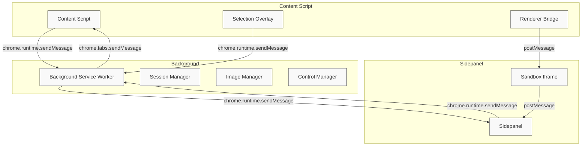
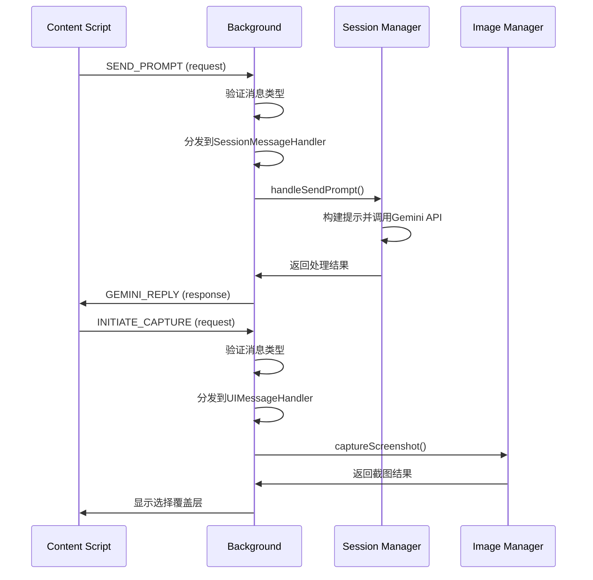
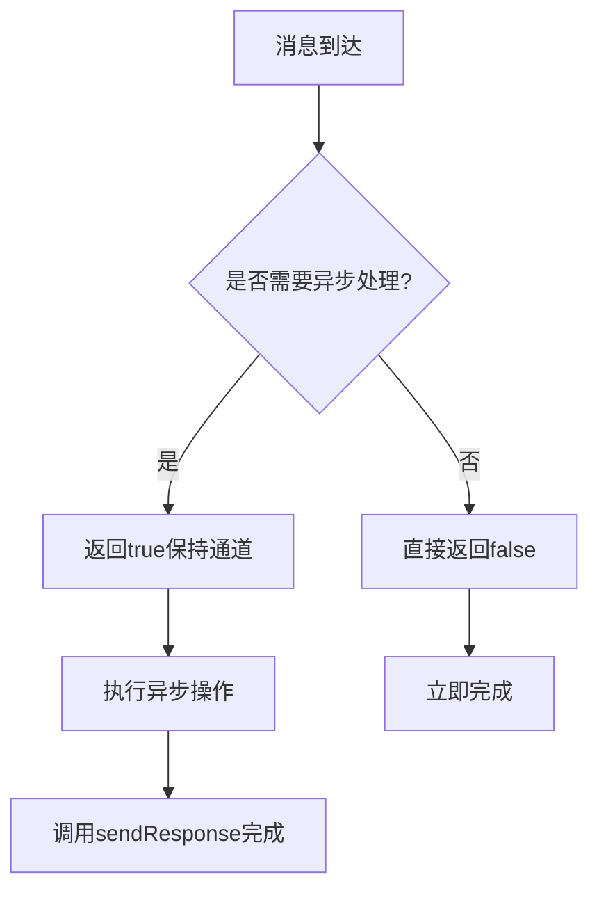
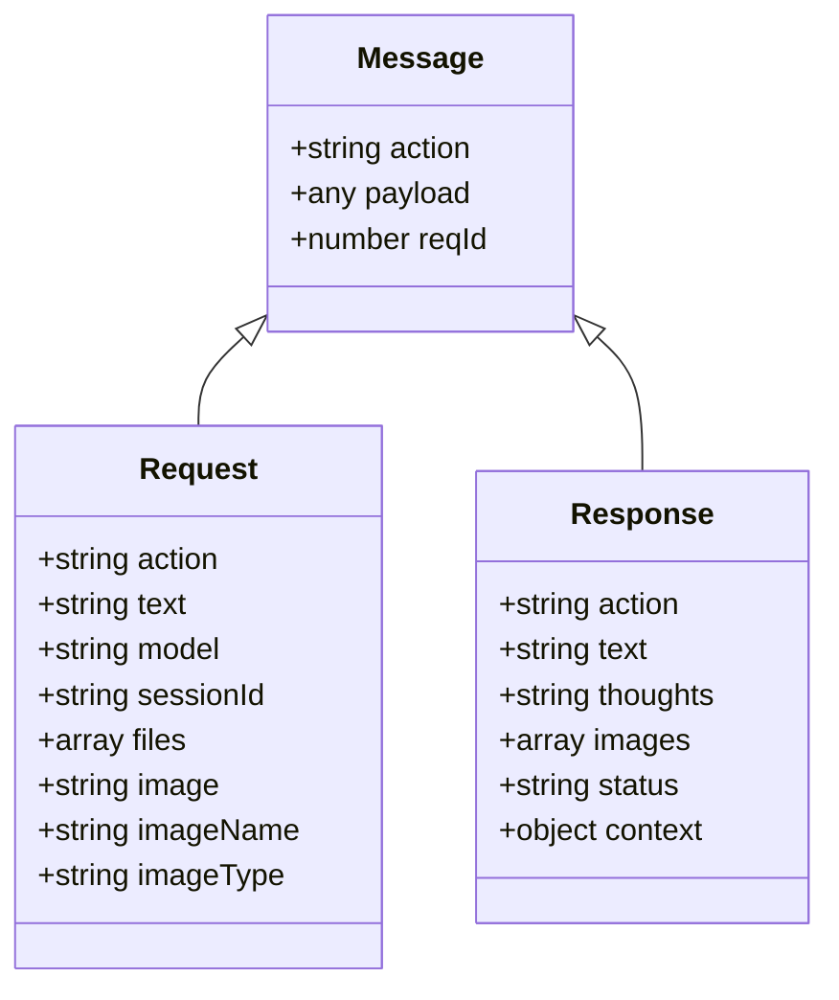
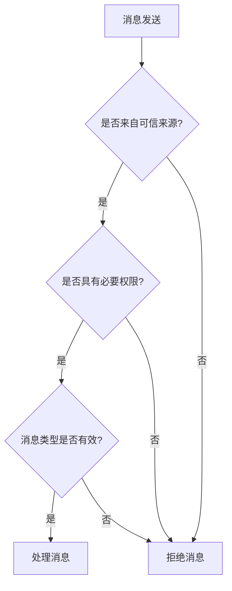

# 消息通信API

<cite>
**本文档引用的文件**  
- [background/messages.js](file://background/messages.js)
- [background/handlers/session.js](file://background/handlers/session.js)
- [background/handlers/ui.js](file://background/handlers/ui.js)
- [lib/messaging.js](file://lib/messaging.js)
- [sandbox/boot/messaging.js](file://sandbox/boot/messaging.js)
- [content/toolbar/bridge.js](file://content/toolbar/bridge.js)
- [sidepanel/index.js](file://sidepanel/index.js)
- [background/index.js](file://background/index.js)
- [content/overlay.js](file://content/overlay.js)
- [background/managers/session_manager.js](file://background/managers/session_manager.js)
- [background/handlers/session/prompt_handler.js](file://background/handlers/session/prompt_handler.js)
- [background/handlers/session/quick_ask_handler.js](file://background/handlers/session/quick_ask_handler.js)
- [background/handlers/session/context_handler.js](file://background/handlers/session/context_handler.js)
</cite>

## 目录
1. [简介](#简介)
2. [消息总线架构](#消息总线架构)
3. [核心消息类型](#核心消息类型)
4. [消息处理流程](#消息处理流程)
5. [异步处理与响应机制](#异步处理与响应机制)
6. [消息序列化与反序列化](#消息序列化与反序列化)
7. [消息端点详细说明](#消息端点详细说明)
8. [安全与权限控制](#安全与权限控制)
9. [调试与日志追踪](#调试与日志追踪)
10. [版本兼容性与废弃策略](#版本兼容性与废弃策略)

## 简介
Gemini Nexus扩展程序采用基于`chrome.runtime.sendMessage`的内部消息通信机制，实现跨上下文（background、content script、sidepanel、sandbox iframe）的安全高效通信。该系统采用中心化消息总线设计，所有消息最终由background服务工作线程统一处理，确保状态一致性和安全性。消息系统支持请求-响应模式、单向通知和事件广播，满足不同场景的通信需求。

## 消息总线架构
Gemini Nexus的消息通信采用分层架构，通过`chrome.runtime.sendMessage`作为核心IPC机制，结合`window.postMessage`实现跨iframe通信。系统通过消息代理和桥接模式，将不同上下文的通信需求统一到background服务工作线程进行集中处理。



**Diagram sources**
- [background/index.js](file://background/index.js#L1-L30)
- [background/messages.js](file://background/messages.js#L1-L82)
- [sidepanel/index.js](file://sidepanel/index.js#L1-L425)
- [content/toolbar/bridge.js](file://content/toolbar/bridge.js#L1-L66)

**Section sources**
- [background/index.js](file://background/index.js#L1-L30)
- [manifest.json](file://manifest.json#L1-L93)

## 核心消息类型
系统定义了多种消息类型，涵盖会话管理、UI控制、内容获取和系统操作等核心功能。主要消息类型包括：

- **SEND_PROMPT**: 发送用户提示到Gemini AI
- **QUICK_ASK**: 快速询问（基于选中文本）
- **OPEN_SIDE_PANEL**: 打开侧边栏
- **INITIATE_CAPTURE**: 启动截图选择
- **AREA_SELECTED**: 区域选择完成
- **FETCH_IMAGE**: 获取网络图片
- **CAPTURE_SCREENSHOT**: 截取当前页面
- **LOG_ENTRY**: 记录日志条目
- **GET_LOGS**: 获取日志记录
- **SET_CONTEXT**: 设置会话上下文
- **RESET_CONTEXT**: 重置会话上下文

## 消息处理流程
消息处理采用责任链模式，由background服务工作线程中的主消息监听器接收所有消息，并根据消息类型分发给相应的处理器。系统通过`SessionMessageHandler`和`UIMessageHandler`两个主要处理器来处理不同类别的消息。



**Diagram sources**
- [background/messages.js](file://background/messages.js#L1-L82)
- [background/handlers/session.js](file://background/handlers/session.js#L1-L56)
- [background/handlers/ui.js](file://background/handlers/ui.js#L1-L195)

**Section sources**
- [background/messages.js](file://background/messages.js#L1-L82)
- [background/handlers/session.js](file://background/handlers/session.js#L1-L56)

## 异步处理与响应机制
系统采用异步非阻塞的消息处理机制，支持长时运行操作的流式更新。对于需要异步处理的消息，系统返回`true`以保持消息通道开放，直到调用`sendResponse`完成响应。



**Diagram sources**
- [background/messages.js](file://background/messages.js#L1-L82)
- [background/handlers/session/prompt_handler.js](file://background/handlers/session/prompt_handler.js#L1-L103)

**Section sources**
- [background/messages.js](file://background/messages.js#L1-L82)
- [background/handlers/session/prompt_handler.js](file://background/handlers/session/prompt_handler.js#L1-L103)

## 消息序列化与反序列化
所有消息通过JSON格式进行序列化传输，确保跨上下文的数据一致性。系统采用轻量级序列化策略，避免传输大型数据对象，对于图片等二进制数据使用base64编码。



**Diagram sources**
- [background/messages.js](file://background/messages.js#L1-L82)
- [background/handlers/session/prompt_handler.js](file://background/handlers/session/prompt_handler.js#L1-L103)
- [background/managers/session_manager.js](file://background/managers/session_manager.js#L1-L285)

**Section sources**
- [background/messages.js](file://background/messages.js#L1-L82)
- [background/handlers/session/prompt_handler.js](file://background/handlers/session/prompt_handler.js#L1-L103)

## 消息端点详细说明
### SEND_PROMPT 消息端点
发送用户提示到Gemini AI进行处理。

**请求格式**
```json
{
  "action": "SEND_PROMPT",
  "text": "用户输入的提示文本",
  "model": "gemini-2.5-flash",
  "sessionId": "会话ID",
  "files": [
    {
      "base64": "图片base64编码",
      "type": "image/png",
      "name": "图片名称"
    }
  ],
  "enableBrowserControl": true,
  "mcpIds": ["mcp-server-1"]
}
```

**响应格式**
```json
{
  "action": "GEMINI_REPLY",
  "text": "AI回复文本",
  "thoughts": "AI思考过程",
  "images": ["生成的图片base64"],
  "status": "success|error",
  "context": "更新后的会话上下文"
}
```

**Section sources**
- [background/handlers/session.js](file://background/handlers/session.js#L1-L56)
- [background/handlers/session/prompt_handler.js](file://background/handlers/session/prompt_handler.js#L1-L103)

### QUICK_ASK 消息端点
快速询问功能，基于当前选中的文本向Gemini提问。

**请求格式**
```json
{
  "action": "QUICK_ASK",
  "text": "选中的文本内容",
  "model": "gemini-2.5-flash",
  "sessionId": "会话ID"
}
```

**响应格式**
```json
{
  "action": "GEMINI_STREAM_DONE",
  "result": {
    "text": "AI回复",
    "status": "success|error"
  },
  "sessionId": "保存的会话ID"
}
```

**Section sources**
- [background/handlers/session.js](file://background/handlers/session.js#L1-L56)
- [background/handlers/session/quick_ask_handler.js](file://background/handlers/session/quick_ask_handler.js#L1-L99)

### OPEN_SIDE_PANEL 消息端点
打开侧边栏并可选择性切换到指定会话。

**请求格式**
```json
{
  "action": "OPEN_SIDE_PANEL",
  "sessionId": "要切换的会话ID"
}
```

**响应格式**
```json
{
  "status": "opened"
}
```

**Section sources**
- [background/handlers/ui.js](file://background/handlers/ui.js#L1-L195)

### INITIATE_CAPTURE 消息端点
启动截图选择流程。

**请求格式**
```json
{
  "action": "INITIATE_CAPTURE",
  "mode": "ocr|snip|screenshot_translate",
  "source": "sidepanel|local"
}
```

**响应格式**
```json
{
  "status": "completed"
}
```

**Section sources**
- [background/handlers/ui.js](file://background/handlers/ui.js#L1-L195)
- [content/overlay.js](file://content/overlay.js#L1-L213)

## 安全与权限控制
系统通过Chrome扩展的权限模型和消息验证机制确保通信安全。所有敏感操作都需要适当的权限声明，并在background服务工作线程中进行验证。



**Section sources**
- [manifest.json](file://manifest.json#L1-L93)
- [background/messages.js](file://background/messages.js#L1-L82)

## 调试与日志追踪
系统提供完整的日志追踪机制，支持调试消息流和监控系统状态。

### 日志消息端点
**LOG_ENTRY**
```json
{
  "action": "LOG_ENTRY",
  "entry": {
    "level": "info|error|warn",
    "message": "日志消息",
    "timestamp": "时间戳"
  }
}
```

**GET_LOGS**
```json
{
  "action": "GET_LOGS"
}
```

**响应**
```json
{
  "logs": ["日志条目数组"]
}
```

### 消息监听工具
开发者可以通过Chrome开发者工具的background服务工作线程面板，使用`chrome.runtime.onMessage`监听器来监控所有消息流。

**Section sources**
- [background/messages.js](file://background/messages.js#L1-L82)
- [lib/logger.js](file://lib/logger.js#L28-L52)

## 版本兼容性与废弃策略
系统采用渐进式版本控制策略，确保向后兼容性。旧版本的消息端点在废弃前会维持至少两个主要版本的兼容性，并通过文档明确标识废弃状态。

**版本控制策略**
1. 新增功能使用新action名称
2. 修改现有功能时保持向后兼容
3. 废弃功能通过文档标记并提供迁移指南
4. 重大变更在发布说明中明确说明

**Section sources**
- [background/messages.js](file://background/messages.js#L1-L82)
- [README.md](file://README.md)