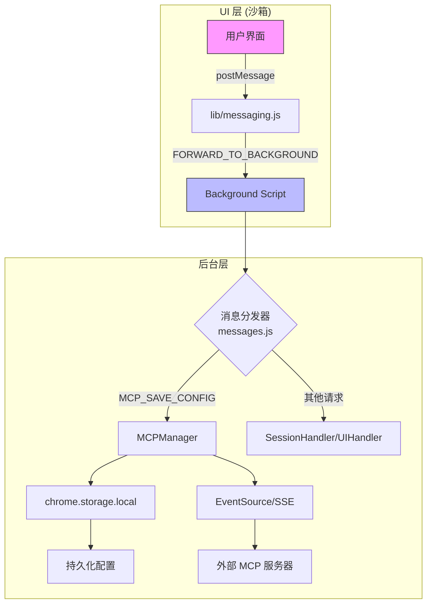
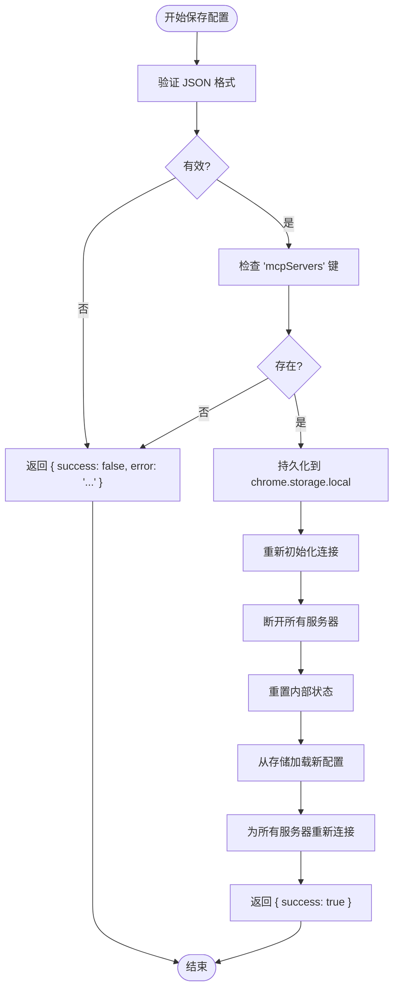
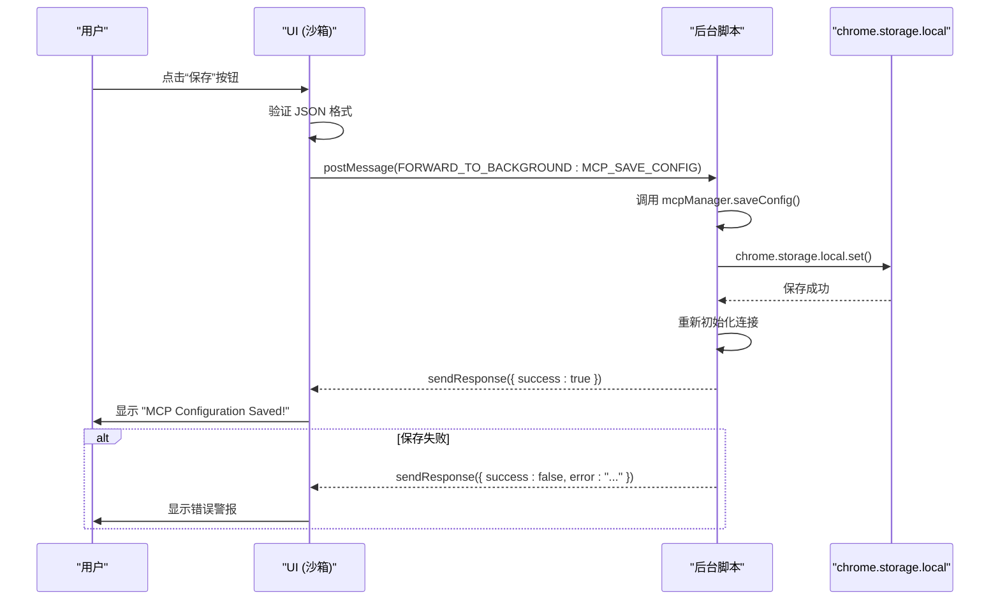

# 命令执行

<cite>
**本文档引用的文件**  
- [messages.js](file://background/messages.js)
- [mcp_manager.js](file://background/managers/mcp_manager.js)
- [mcp_controller.js](file://sandbox/controllers/mcp_controller.js)
- [settings.js](file://sandbox/ui/settings.js)
- [settings/view.js](file://sandbox/ui/settings/view.js)
- [lib/messaging.js](file://lib/messaging.js)
- [control_manager.js](file://background/managers/control_manager.js)
- [tool_executor.js](file://background/handlers/session/prompt/tool_executor.js)
- [ui.js](file://background/handlers/ui.js)
- [log_manager.js](file://background/managers/log_manager.js)
- [logger.js](file://lib/logger.js)
</cite>

## 目录
1. [简介](#简介)
2. [命令执行架构概览](#命令执行架构概览)
3. [异步处理流程](#异步处理流程)
4. [持久化与配置管理](#持久化与配置管理)
5. [UI层请求发起与响应处理](#ui层请求发起与响应处理)
6. [事件驱动的生命周期管理](#事件驱动的生命周期管理)
7. [安全性与错误处理](#安全性与错误处理)
8. [日志与调试](#日志与调试)
9. [结论](#结论)

## 简介

Gemini Nexus 扩展通过一个复杂的事件驱动架构实现了强大的命令执行能力，特别是针对 `MCP_SAVE_CONFIG` 等写操作的异步处理。本文档深入探讨了其命令执行模式，涵盖了从用户界面发起请求，到后台服务进行持久化存储（使用 `chrome.storage.local`），再到结果反馈和错误传播的完整生命周期。文档将详细解释如何通过返回 `true` 来保持 `sendResponse` 通道开放，并利用 Promise 链式调用完成延迟响应，同时强调了输入验证和权限控制等关键安全考虑。

**Section sources**
- [messages.js](file://background/messages.js#L1-L82)
- [mcp_manager.js](file://background/managers/mcp_manager.js#L1-L530)

## 命令执行架构概览

Gemini Nexus 的命令执行遵循一个清晰的分层架构。用户界面（UI）运行在沙箱化的 iframe 环境中，通过 `window.parent.postMessage` 将请求转发到扩展的后台（background）脚本。后台脚本是整个系统的控制中心，它通过 `chrome.runtime.onMessage` 监听所有消息，并根据 `request.action` 的值将请求分发给不同的处理器（如 `MCPManager` 或 `SessionMessageHandler`）。



**Diagram sources**
- [lib/messaging.js](file://lib/messaging.js#L1-L96)
- [messages.js](file://background/messages.js#L1-L82)
- [mcp_manager.js](file://background/managers/mcp_manager.js#L1-L530)

**Section sources**
- [lib/messaging.js](file://lib/messaging.js#L1-L96)
- [messages.js](file://background/messages.js#L1-L82)

## 异步处理流程

对于需要异步操作的命令，如 `MCP_SAVE_CONFIG`，Gemini Nexus 采用了一种标准的异步消息处理模式。关键在于消息监听器返回 `true`，以指示响应将通过 `sendResponse` 回调函数异步发送。

在 `background/messages.js` 中，当收到 `MCP_SAVE_CONFIG` 请求时，代码会调用 `mcpManager.saveConfig(request.json)`。这个方法返回一个 Promise。然后，通过 `.then()` 链式调用，在 Promise 解析（resolve）后，使用 `sendResponse(result)` 发送最终结果。此时，`sendResponse` 通道仍然有效，因为监听器已经返回了 `true`。

```javascript
// 伪代码示例，实际逻辑在 messages.js 和 mcp_manager.js 中
chrome.runtime.onMessage.addListener((request, sender, sendResponse) => {
    if (request.action === 'MCP_SAVE_CONFIG') {
        mcpManager.saveConfig(request.json).then(result => {
            sendResponse(result); // 在 Promise 完成后发送响应
        });
        return true; // 保持 sendResponse 通道开放
    }
});
```

**Section sources**
- [messages.js](file://background/messages.js#L42-L47)
- [mcp_manager.js](file://background/managers/mcp_manager.js#L40-L61)

## 持久化与配置管理

配置的持久化是通过 Chrome 扩展的 `chrome.storage.local` API 实现的。`MCPManager` 类负责管理 MCP 服务器的配置。

`saveConfig` 方法是核心写操作。它首先尝试解析传入的 JSON 字符串以进行验证。如果解析成功且包含必需的 `mcpServers` 键，则使用 `chrome.storage.local.set` 将配置对象持久化到本地存储中。成功保存后，`MCPManager` 会重新初始化其连接：断开所有现有连接，清空内部状态，从存储中重新加载配置，并为所有启用的服务器重新建立连接。



**Diagram sources**
- [mcp_manager.js](file://background/managers/mcp_manager.js#L40-L61)

**Section sources**
- [mcp_manager.js](file://background/managers/mcp_manager.js#L40-L61)

## UI层请求发起与响应处理

UI 层通过 `lib/messaging.js` 中的 `sendToBackground` 函数向后台发起配置保存请求。在 `sandbox/ui/settings.js` 中，`SettingsController` 的 `saveMcpConfig` 方法负责此操作。它首先对用户输入的 JSON 进行基本验证（尝试 `JSON.parse`），如果格式无效，则弹出警告框。验证通过后，它会调用 `sendToBackground({ action: 'MCP_SAVE_CONFIG', json: jsonStr })`。

后台处理完成后，响应会通过 `window.addEventListener('message')` 被 `SettingsController` 捕获。代码通过检查 `payload.success` 属性来判断操作结果，并相应地向用户显示成功或错误的提示信息。



**Diagram sources**
- [settings.js](file://sandbox/ui/settings.js#L238-L247)
- [settings/view.js](file://sandbox/ui/settings/view.js#L62-L66)
- [messages.js](file://background/messages.js#L42-L47)

**Section sources**
- [settings.js](file://sandbox/ui/settings.js#L238-L247)
- [settings/view.js](file://sandbox/ui/settings/view.js#L62-L66)

## 事件驱动的生命周期管理

命令执行的生命周期由事件驱动。`MCPManager` 的 `init` 方法在后台脚本启动时被调用，它负责从存储中加载初始配置并自动连接到启用的服务器。`connectServer` 方法处理与单个 MCP 服务器的连接，它会探测服务器的类型（SSE 或 HTTP），并建立相应的连接机制。

当服务器通过 SSE 发送消息时，`handleMessage` 方法会被触发。该方法根据消息的 `id` 来匹配挂起的请求，并使用存储在 `pendingRequests` 映射中的 `resolve` 或 `reject` 函数来完成相应的 Promise。这种模式确保了异步请求和响应的正确关联。

**Section sources**
- [mcp_manager.js](file://background/managers/mcp_manager.js#L8-L19)
- [mcp_manager.js](file://background/managers/mcp_manager.js#L71-L150)
- [mcp_manager.js](file://background/managers/mcp_manager.js#L370-L385)

## 安全性与错误处理

安全性在命令执行中至关重要。`saveConfig` 方法内置了输入验证，通过 `JSON.parse` 和检查 `mcpServers` 键来防止无效或恶意的配置被保存。错误处理贯穿整个流程，所有关键操作都包裹在 `try-catch` 块中。

在 `mcp_manager.js` 中，`saveConfig` 方法捕获所有异常，并返回一个包含错误信息的结构化响应 `{ success: false, error: e.message }`。同样，在与外部 MCP 服务器通信时，如 `refreshToolsHttp` 方法，代码会检查服务器返回的 `result.error`，并在出现错误时更新服务器状态为 `'error'`。这种结构化的错误传播机制确保了错误信息能够从底层一直传递到 UI 层，以便向用户展示。

**Section sources**
- [mcp_manager.js](file://background/managers/mcp_manager.js#L41-L60)
- [mcp_manager.js](file://background/managers/mcp_manager.js#L173-L178)
- [mcp_manager.js](file://background/managers/mcp_manager.js#L248-L257)

## 日志与调试

系统内置了强大的日志记录功能。`Logger` 类（位于 `lib/logger.js`）允许各个模块记录信息、警告和错误。这些日志条目通过 `chrome.runtime.sendMessage` 被发送到后台的 `LogManager`。

`LogManager` 负责集中管理所有日志，将它们存储在 `chrome.storage.local` 中，并限制最大日志数量以防止存储溢出。用户可以通过设置界面的“下载日志”功能来获取这些日志，这对于调试和问题排查非常有价值。

```mermaid
classDiagram
class Logger {
+context : string
+info(message, data)
+warn(message, data)
+error(message, data)
-_log(level, message, data)
}
class LogManager {
-logs : Array
-MAX_LOGS : number
+add(entry)
+getLogs()
+clear()
-_save()
}
Logger -->|发送日志| chrome.runtime
chrome.runtime -->|LOG_ENTRY| LogManager
LogManager -->|存储| chrome.storage.local
```

**Diagram sources**
- [logger.js](file://lib/logger.js#L1-L53)
- [log_manager.js](file://background/managers/log_manager.js#L1-L62)

**Section sources**
- [logger.js](file://lib/logger.js#L1-L53)
- [log_manager.js](file://background/managers/log_manager.js#L1-L62)

## 结论

Gemini Nexus 的命令执行模式是一个精心设计的异步、事件驱动系统。它通过返回 `true` 来保持响应通道开放，并利用 Promise 链式调用优雅地处理延迟操作。`MCP_SAVE_CONFIG` 等写操作通过 `chrome.storage.local` 实现了可靠的持久化，并在成功后触发连接的重新初始化。UI 层通过清晰的事件监听和用户反馈机制与后台进行通信。整个流程通过严格的输入验证和全面的错误处理来保障安全性和健壮性，而集中的日志系统则为维护和调试提供了有力支持。这种架构确保了扩展在处理复杂异步任务时的响应性和可靠性。