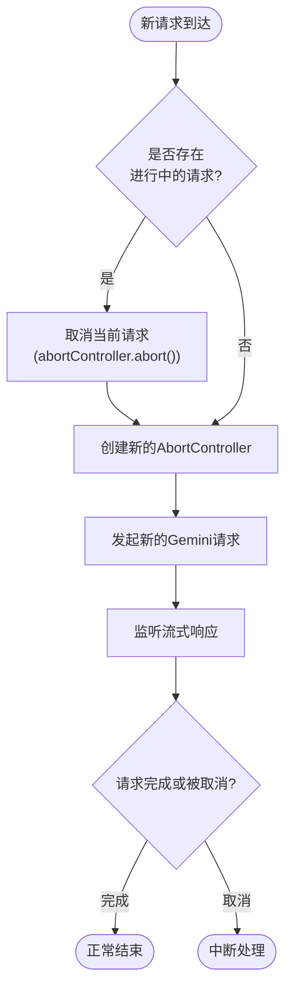

# 批量操作

<cite>
**本文档引用的文件**  
- [session_manager.js](file://background/managers/session_manager.js)
- [prompt_handler.js](file://background/handlers/session/prompt_handler.js)
- [mcp_manager.js](file://background/managers/mcp_manager.js)
- [gemini_api.js](file://services/gemini_api.js)
- [history_manager.js](file://background/managers/history_manager.js)
- [tool_executor.js](file://background/handlers/session/prompt/tool_executor.js)
- [message.js](file://sandbox/render/message.js)
- [messages.js](file://background/messages.js)
</cite>

## 目录
1. [简介](#简介)
2. [多阶段响应处理模式](#多阶段响应处理模式)
3. [消息ID与请求配对机制](#消息id与请求配对机制)
4. [并发控制与队列管理策略](#并发控制与队列管理策略)
5. [调试指南：响应丢失与错序问题](#调试指南响应丢失与错序问题)
6. [性能优化建议](#性能优化建议)
7. [结论](#结论)

## 简介
Gemini Nexus 批量操作功能支持在单个用户请求下触发多个响应阶段，实现复杂的自动化交互流程。该机制通过会话上下文更新和附加工具调用的组合响应来增强AI的执行能力。系统利用消息ID跟踪确保响应与请求的正确配对，并通过并发控制策略避免竞态条件。本文档详细说明其实现方式、核心组件及最佳实践。

## 多阶段响应处理模式

Gemini Nexus 的多阶段响应处理模式允许在一次用户请求后触发多个响应阶段，包括初始AI响应、工具调用执行和最终结果整合。该流程由 `PromptHandler` 类驱动，通过循环机制协调 `GeminiSessionManager` 和 `ToolExecutor` 组件完成。

**图示来源**  
- [prompt_handler.js](file://background/handlers/session/prompt_handler.js#L13-L87)
- [session_manager.js](file://background/managers/session_manager.js#L21-L128)
- [tool_executor.js](file://background/handlers/session/prompt/tool_executor.js#L9-L48)

**本节来源**  
- [prompt_handler.js](file://background/handlers/session/prompt_handler.js#L13-L87)
- [session_manager.js](file://background/managers/session_manager.js#L21-L128)

## 消息ID与请求配对机制

系统通过消息ID跟踪机制确保每个响应都能正确匹配到其对应的请求，防止跨请求混淆。当用户发起请求时，系统生成唯一的消息ID并注入到Gemini API请求中。在流式响应解析过程中，`parseGeminiLine` 函数提取响应中的会话ID、响应ID和选择ID，用于维护会话状态的一致性。

**图示来源**  
- [gemini_api.js](file://services/gemini_api.js#L26-L230)
- [parser.js](file://services/parser.js#L4-L156)
- [message.js](file://sandbox/render/message.js#L8-L324)

**本节来源**  
- [gemini_api.js](file://services/gemini_api.js#L26-L230)
- [parser.js](file://services/parser.js#L4-L156)

## 并发控制与队列管理策略

为避免快速连续发送请求导致的竞态条件，系统实现了严格的并发控制策略。`GeminiSessionManager` 使用 `AbortController` 管理当前请求，确保同一时间只有一个活跃请求。当新请求到达时，系统会自动取消当前正在进行的请求。

此外，系统通过 `setupMessageListener` 中的消息队列机制处理并发请求，确保消息按顺序处理，避免状态混乱。

**图示来源**  
- [session_manager.js](file://background/managers/session_manager.js#L204-L211)
- [messages.js](file://background/messages.js#L22-L82)

**本节来源**  
- [session_manager.js](file://background/managers/session_manager.js#L204-L211)
- [messages.js](file://background/messages.js#L22-L82)

## 调试指南：响应丢失与错序问题

开发者在使用批量操作功能时可能遇到响应丢失或错序的问题。以下是常见问题的识别与解决方案：

### 常见问题诊断
- **响应丢失**：检查是否因请求取消导致 `AbortError`，确认 `onUpdate` 回调是否正确处理流式更新
- **响应错序**：验证消息ID是否正确传递，检查会话上下文是否同步更新
- **工具调用失败**：查看MCP服务器连接状态，确认工具参数格式正确

### 调试步骤
1. 启用日志记录功能，通过 `LOG_ENTRY` 消息收集详细执行轨迹
2. 使用 `GET_LOGS` 请求获取完整的日志信息进行分析
3. 检查网络请求是否包含正确的 `gemId` 和上下文信息
4. 验证MCP服务器状态，通过 `MCP_GET_STATUS` 获取调试信息

**本节来源**  
- [session_manager.js](file://background/managers/session_manager.js#L149-L198)
- [mcp_manager.js](file://background/managers/mcp_manager.js#L387-L403)
- [messages.js](file://background/messages.js#L25-L32)

## 性能优化建议

为提升批量操作的性能表现，建议采用以下优化策略：

### 响应批处理
- 合并多个小的流式更新，减少UI重绘次数
- 使用防抖技术控制更新频率，避免过度渲染

### 流量节流
- 实施请求频率限制，防止触发Gemini的速率限制
- 在多账户配置下自动轮换账户以分散请求负载

### 缓存优化
- 利用本地存储缓存会话上下文，减少重复的身份验证
- 对静态资源进行预加载，提高响应速度

### 并发优化
- 限制同时进行的工具调用数量，避免资源争用
- 使用连接池管理DevTools协议连接，降低建立连接的开销

**本节来源**  
- [session_manager.js](file://background/managers/session_manager.js#L43-L45)
- [keep_alive.js](file://background/managers/keep_alive.js#L47-L83)
- [mcp_manager.js](file://background/managers/mcp_manager.js#L14-L19)

## 结论
Gemini Nexus 的批量操作功能通过精心设计的多阶段响应机制、可靠的消息ID跟踪和严格的并发控制，实现了复杂场景下的稳定交互。开发者应充分利用提供的调试工具和性能优化建议，确保应用的健壮性和高效性。通过合理配置MCP服务器和优化请求流程，可以充分发挥系统的潜力，提供流畅的用户体验。