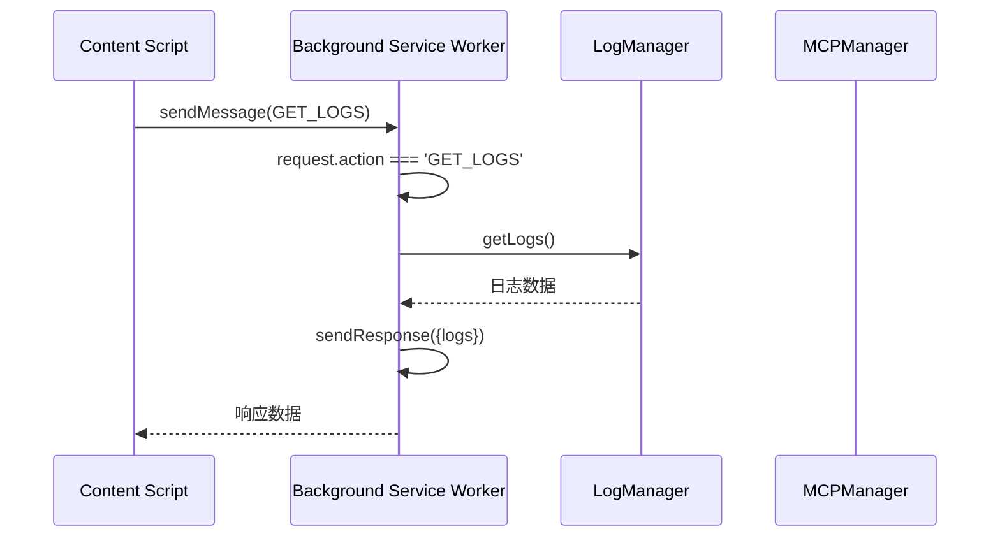
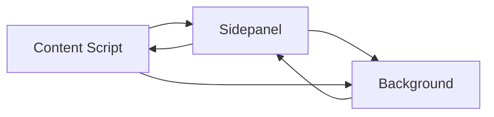
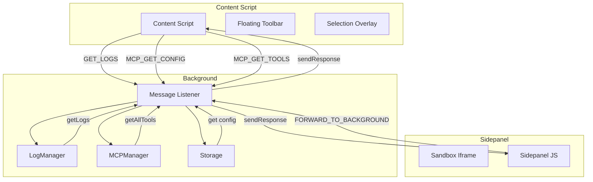

# 查询请求

<cite>
**本文档引用的文件**
- [messages.js](file://background/messages.js)
- [log_manager.js](file://background/managers/log_manager.js)
- [mcp_manager.js](file://background/managers/mcp_manager.js)
- [index.js](file://background/index.js)
- [bridge.js](file://content/toolbar/bridge.js)
- [index.js](file://content/index.js)
- [index.js](file://sidepanel/index.js)
- [manifest.json](file://manifest.json)
- [messaging.js](file://lib/messaging.js)
- [logger.js](file://lib/logger.js)
</cite>

## 目录
1. [简介](#简介)
2. [查询请求实现机制](#查询请求实现机制)
3. [异步通信与同步响应](#异步通信与同步响应)
4. [只读查询请求分析](#只读查询请求分析)
5. [内容脚本中的安全请求](#内容脚本中的安全请求)
6. [超时边界与错误处理](#超时边界与错误处理)
7. [架构流程图](#架构流程图)

## 简介
本文档详细分析Gemini Nexus扩展中'GET_LOGS'、'MCP_GET_CONFIG'、'MCP_GET_TOOLS'等只读查询请求的实现机制。重点阐述这些请求如何通过chrome.runtime.sendMessage进行异步通信，并在background service worker中同步返回响应数据。文档将解释sendResponse(data)后返回true的语义含义，以及为何这类查询操作不需要Promise封装。

**Section sources**
- [messages.js](file://background/messages.js#L1-L82)
- [manifest.json](file://manifest.json#L1-L93)

## 查询请求实现机制
Gemini Nexus的查询请求机制基于Chrome扩展的runtime消息传递系统实现。在background service worker中，通过setupMessageListener函数设置全局消息监听器，处理来自content script、sidepanel和其他组件的请求。

查询请求的处理遵循特定模式：当接收到特定action的请求时，直接从相应管理器获取数据并通过sendResponse返回。这种设计确保了只读操作的高效性和响应性。

```mermaid
flowchart TD
A[Content Script] --> |chrome.runtime.sendMessage| B[Background Service Worker]
B --> C{请求类型判断}
C --> |GET_LOGS| D[LogManager.getLogs()]
C --> |MCP_GET_CONFIG| E[MCPManager.config]
C --> |MCP_GET_TOOLS| F[MCPManager.getAllTools()]
D --> G[sendResponse]
E --> G
F --> G
G --> |响应数据| A
```

**Diagram sources**
- [messages.js](file://background/messages.js#L22-L81)
- [log_manager.js](file://background/managers/log_manager.js#L47-L49)
- [mcp_manager.js](file://background/managers/mcp_manager.js#L407-L420)

**Section sources**
- [messages.js](file://background/messages.js#L1-L82)
- [index.js](file://background/index.js#L26-L30)

## 异步通信与同步响应
查询请求的通信机制体现了Chrome扩展消息系统的独特特性。尽管chrome.runtime.sendMessage是异步API，但通过返回true并使用sendResponse，可以实现同步响应语义。

当在消息监听器中返回true时，表示将异步发送响应。sendResponse函数允许在事件循环的后续滴答中调用，从而在不阻塞主线程的情况下完成同步响应。这种机制对于只读查询特别有效，因为它避免了Promise封装的开销。



**Diagram sources**
- [messages.js](file://background/messages.js#L30-L33)
- [log_manager.js](file://background/managers/log_manager.js#L47-L49)

**Section sources**
- [messages.js](file://background/messages.js#L22-L33)
- [log_manager.js](file://background/managers/log_manager.js#L47-L49)

## 只读查询请求分析
### GET_LOGS请求
GET_LOGS请求用于获取系统日志数据。该请求直接调用LogManager的getLogs方法，返回当前存储的所有日志条目。日志系统实现了自动持久化和容量限制，确保性能稳定。

**Section sources**
- [messages.js](file://background/messages.js#L30-L33)
- [log_manager.js](file://background/managers/log_manager.js#L47-L49)

### MCP_GET_CONFIG请求
MCP_GET_CONFIG请求从chrome.storage.local获取MCP配置信息。如果存储中没有配置数据，则返回包含空服务器列表的默认配置。该请求使用异步chrome.storage API，但通过回调模式保持同步响应语义。

**Section sources**
- [messages.js](file://background/messages.js#L49-L55)
- [mcp_manager.js](file://background/managers/mcp_manager.js#L21-L27)

### MCP_GET_TOOLS请求
MCP_GET_TOOLS请求调用MCPManager的getAllTools方法，聚合所有已连接服务器的工具列表。返回的数据包含每个工具的元信息以及其所属服务器ID，便于后续调用。

**Section sources**
- [messages.js](file://background/messages.js#L57-L61)
- [mcp_manager.js](file://background/managers/mcp_manager.js#L407-L420)

## 内容脚本中的安全请求
在content script中，可以通过多种方式安全地请求数据。对于直接通信，使用chrome.runtime.sendMessage；对于通过sidepanel的间接通信，使用postMessage转发机制。



**Diagram sources**
- [index.js](file://content/index.js#L19-L111)
- [index.js](file://sidepanel/index.js#L180-L192)

**Section sources**
- [index.js](file://content/index.js#L19-L111)
- [index.js](file://sidepanel/index.js#L180-L192)

## 超时边界与错误处理
### 超时处理
查询请求本身不涉及长时间操作，因此通常不会遇到超时问题。但对于依赖异步存储操作的请求（如MCP_GET_CONFIG），Chrome runtime系统会自动处理超时，确保不会无限期等待。

### 错误处理策略
系统采用分层错误处理策略：
1. 存储未初始化时返回默认值
2. 捕获并记录内部错误，但不中断正常流程
3. 对于无效请求，静默忽略或返回空响应

当存储未初始化时，系统返回预定义的默认值，确保功能可用性。例如，MCP配置在未初始化时返回包含空服务器列表的默认结构。

**Section sources**
- [messages.js](file://background/messages.js#L50-L52)
- [mcp_manager.js](file://background/managers/mcp_manager.js#L23-L27)
- [logger.js](file://lib/logger.js#L28-L52)

## 架构流程图


**Diagram sources**
- [messages.js](file://background/messages.js#L22-L81)
- [index.js](file://background/index.js#L26-L30)
- [index.js](file://content/index.js#L19-L111)
- [index.js](file://sidepanel/index.js#L180-L192)

**Section sources**
- [messages.js](file://background/messages.js#L22-L81)
- [index.js](file://background/index.js#L26-L30)
- [index.js](file://content/index.js#L19-L111)
- [index.js](file://sidepanel/index.js#L180-L192)