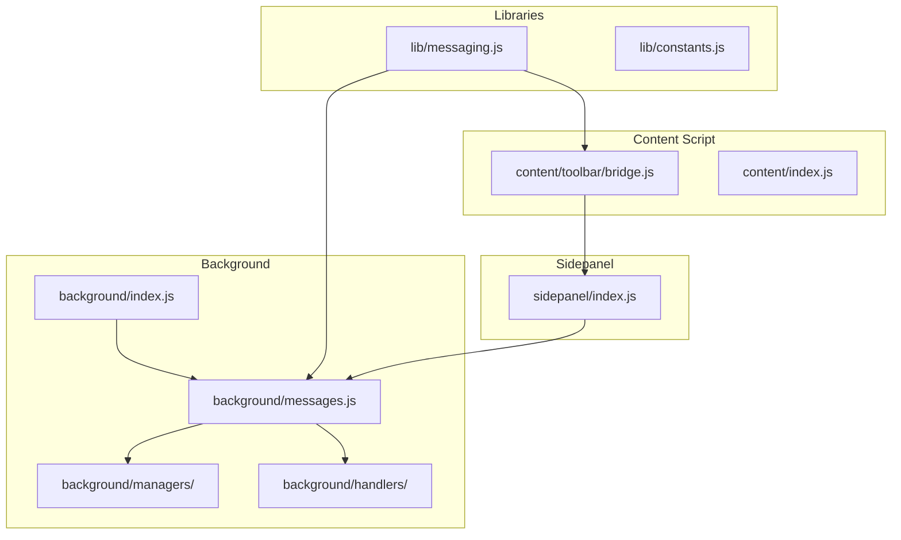
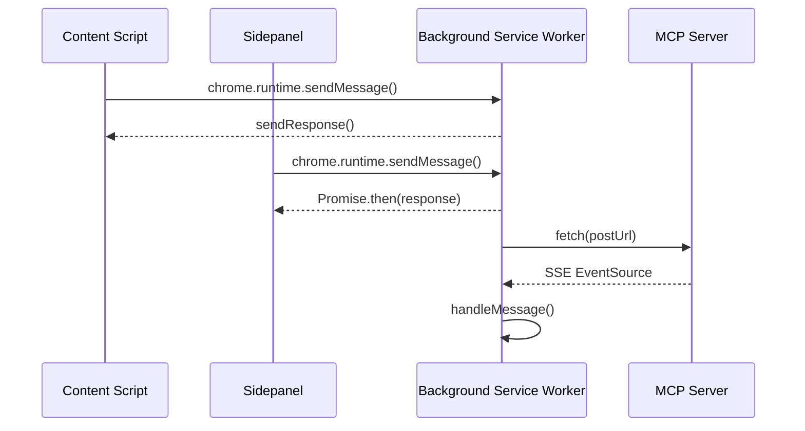
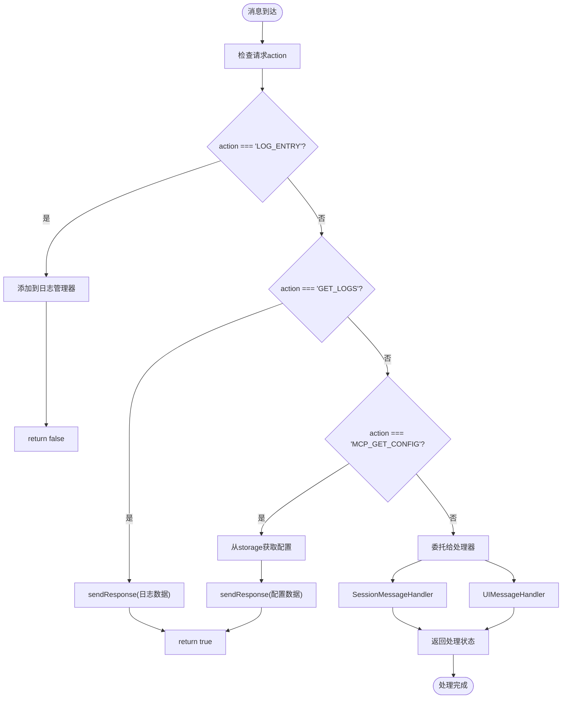
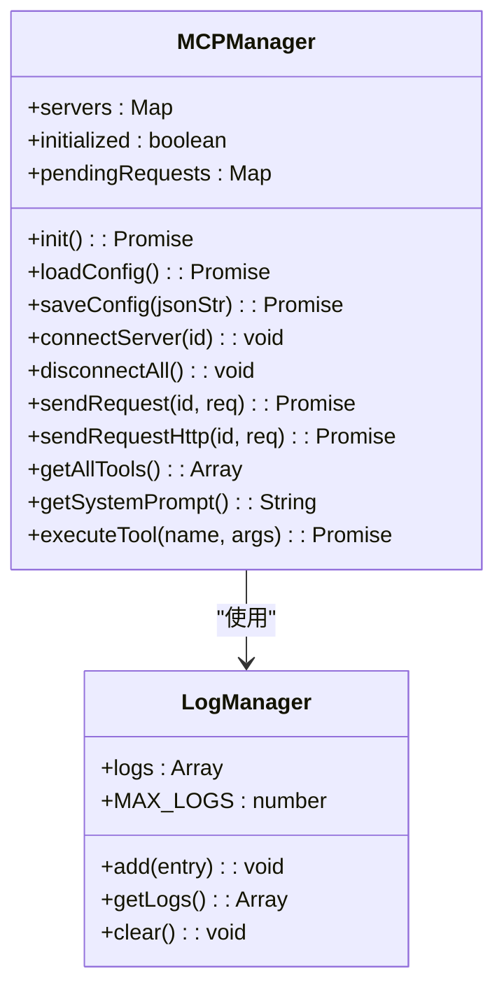
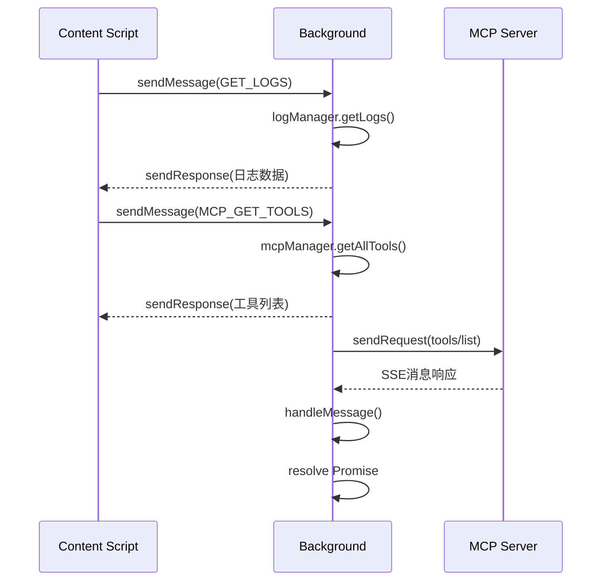
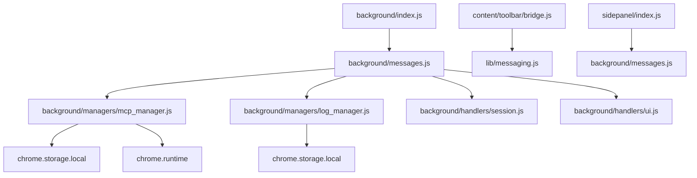

# 请求响应模式

<cite>
**本文档中引用的文件**   
- [messages.js](file://background/messages.js)
- [mcp_manager.js](file://background/managers/mcp_manager.js)
- [log_manager.js](file://background/managers/log_manager.js)
- [bridge.js](file://content/toolbar/bridge.js)
- [session.js](file://background/handlers/session.js)
- [ui.js](file://background/handlers/ui.js)
- [index.js](file://background/index.js)
- [sidepanel/index.js](file://sidepanel/index.js)
- [messaging.js](file://lib/messaging.js)
</cite>

## 目录
1. [简介](#简介)
2. [项目结构](#项目结构)
3. [核心组件](#核心组件)
4. [架构概述](#架构概述)
5. [详细组件分析](#详细组件分析)
6. [依赖分析](#依赖分析)
7. [性能考虑](#性能考虑)
8. [故障排除指南](#故障排除指南)
9. [结论](#结论)

## 简介
本文档深入分析Gemini Nexus扩展中的请求-响应模式，重点关注异步消息处理机制和基于Promise的响应封装。文档详细记录了'GET_LOGS'、'MCP_GET_CONFIG'、'MCP_GET_TOOLS'等查询类消息的响应流程、超时处理和缓存策略。同时解释了在Chrome扩展消息系统中sendResponse(true)与return false的语义差异及正确使用场景。

## 项目结构

**图示来源**
- [background/index.js](file://background/index.js#L1-L30)
- [background/messages.js](file://background/messages.js#L1-L82)
- [content/toolbar/bridge.js](file://content/toolbar/bridge.js#L1-L66)

## 核心组件

本文档的核心组件包括消息处理系统、MCP管理器、日志管理器和桥接通信机制。这些组件共同构成了Gemini Nexus扩展的请求-响应基础设施，实现了content script、background service worker和sidepanel之间的高效通信。

**章节来源**
- [background/messages.js](file://background/messages.js#L1-L82)
- [background/managers/mcp_manager.js](file://background/managers/mcp_manager.js#L1-L530)

## 架构概述

**图示来源**
- [background/messages.js](file://background/messages.js#L22-L79)
- [background/managers/mcp_manager.js](file://background/managers/mcp_manager.js#L308-L351)
- [sidepanel/index.js](file://sidepanel/index.js#L180-L192)

## 详细组件分析

### 消息处理机制分析

**图示来源**
- [background/messages.js](file://background/messages.js#L25-L67)
- [background/handlers/session.js](file://background/handlers/session.js#L15-L53)
- [background/handlers/ui.js](file://background/handlers/ui.js#L9-L169)

### MCP管理器分析

**图示来源**
- [background/managers/mcp_manager.js](file://background/managers/mcp_manager.js#L2-L530)
- [background/managers/log_manager.js](file://background/managers/log_manager.js#L4-L62)

### 异步消息处理分析

**图示来源**
- [background/messages.js](file://background/messages.js#L30-L61)
- [background/managers/mcp_manager.js](file://background/managers/mcp_manager.js#L407-L420)
- [background/managers/mcp_manager.js](file://background/managers/mcp_manager.js#L308-L351)

## 依赖分析

**图示来源**
- [background/index.js](file://background/index.js#L10-L26)
- [background/messages.js](file://background/messages.js#L3-L21)
- [lib/messaging.js](file://lib/messaging.js#L4-L96)

## 性能考虑

Gemini Nexus的请求-响应模式在性能方面进行了多项优化。日志管理器使用固定大小的缓冲区（MAX_LOGS = 2000）来防止内存泄漏，并通过异步存储操作避免阻塞主线程。MCP管理器实现了连接池和自动重连机制，减少了重复建立连接的开销。对于高频请求如'GET_LOGS'，系统采用直接响应模式（return true），避免了Promise的额外开销。

## 故障排除指南

当遇到请求-响应问题时，可以按照以下步骤进行排查：

1. **检查消息监听器是否正确设置**：确保background/index.js中的setupMessageListener已正确调用
2. **验证sendResponse的返回值**：对于需要响应的消息，必须返回true；对于单向消息，返回false
3. **检查跨上下文通信**：sidepanel和content script需要通过FORWARD_TO_BACKGROUND中转消息
4. **查看日志输出**：使用'GET_LOGS'消息获取系统日志，分析错误信息
5. **验证MCP连接状态**：使用'MCP_GET_STATUS'检查服务器连接情况

**章节来源**
- [background/messages.js](file://background/messages.js#L22-L79)
- [sidepanel/index.js](file://sidepanel/index.js#L180-L192)
- [background/managers/log_manager.js](file://background/managers/log_manager.js#L47-L49)

## 结论

Gemini Nexus的请求-响应模式设计精巧，通过结合Chrome扩展的runtime消息系统和自定义的Promise封装，实现了高效可靠的跨上下文通信。系统正确区分了单向通知（return false）和请求-响应模式（return true），并为不同类型的查询消息实现了适当的响应策略。MCP管理器的异步请求处理机制确保了与外部服务器通信的稳定性和可靠性，为扩展的核心功能提供了坚实的基础。