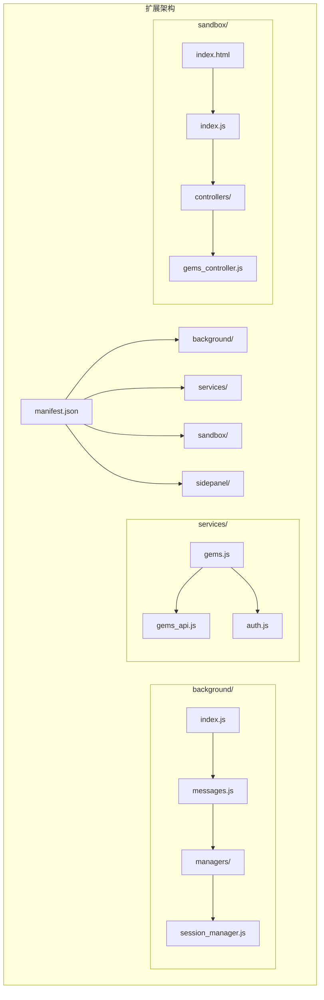
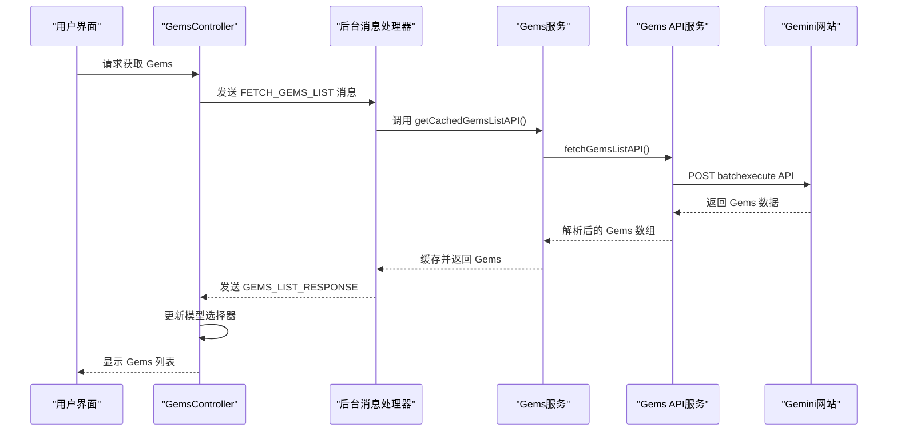
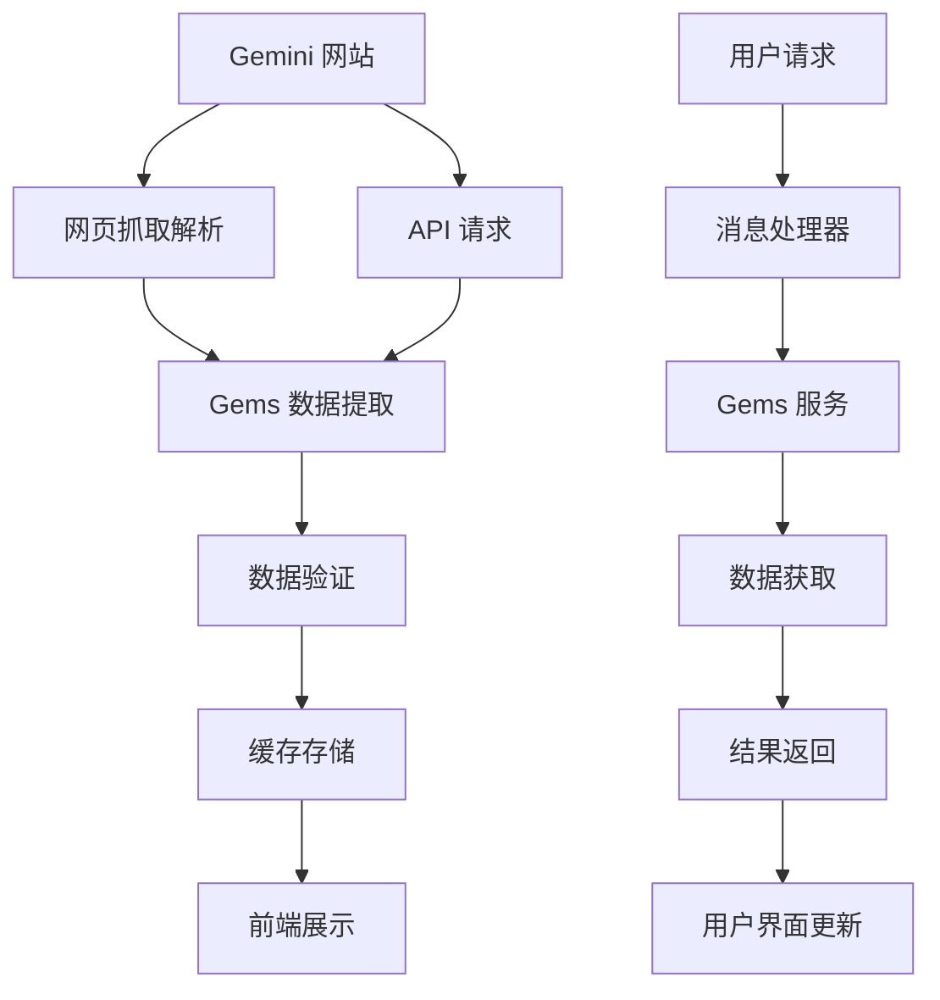
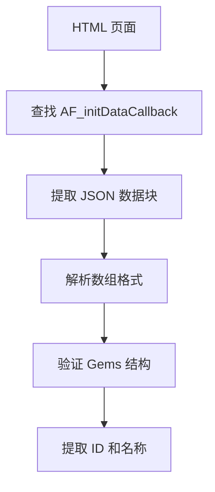
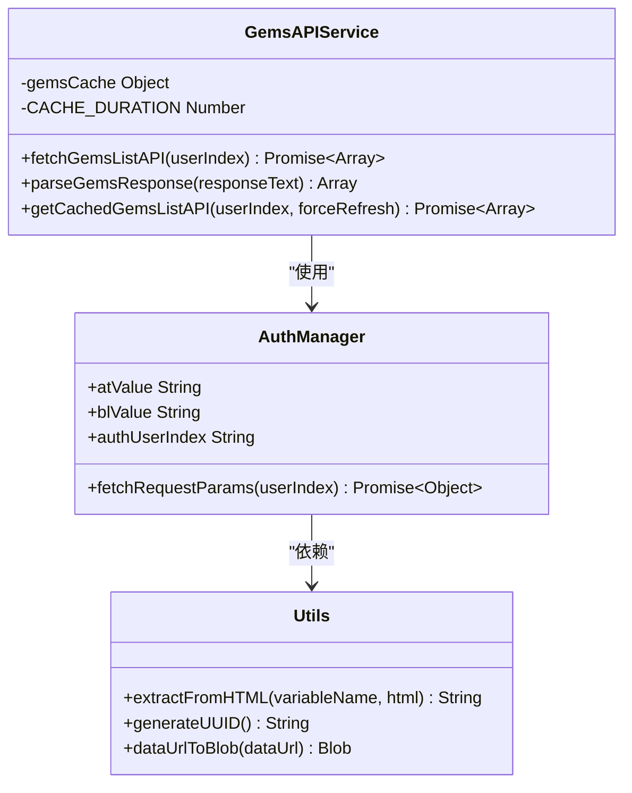
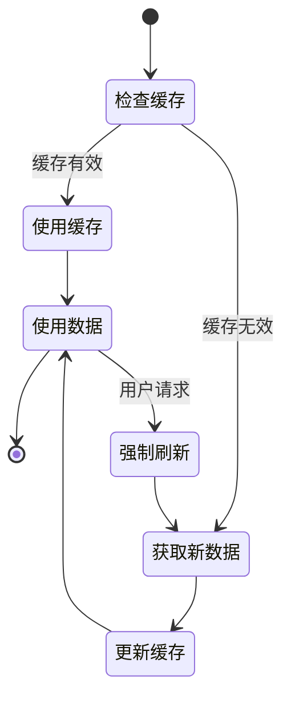
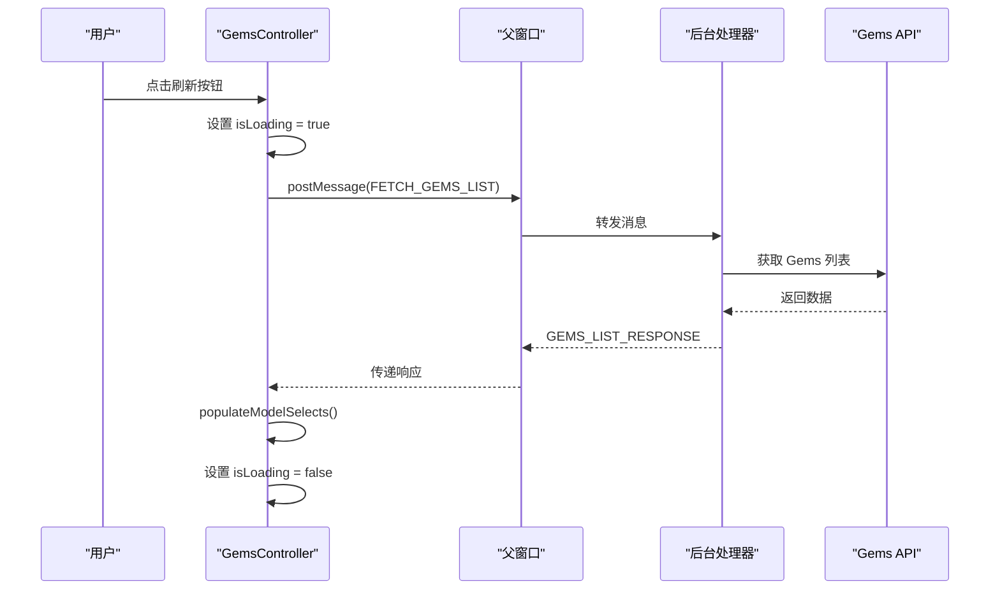
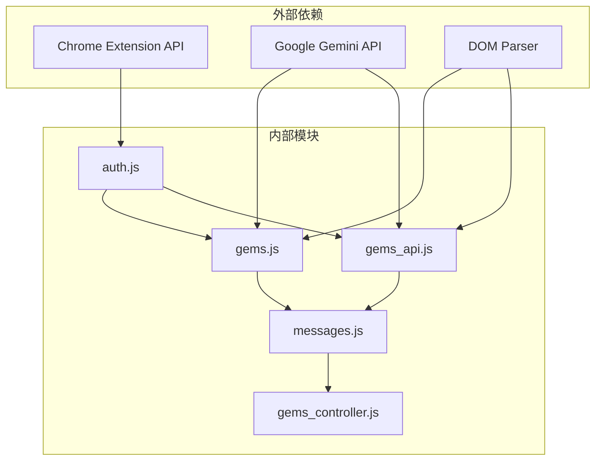
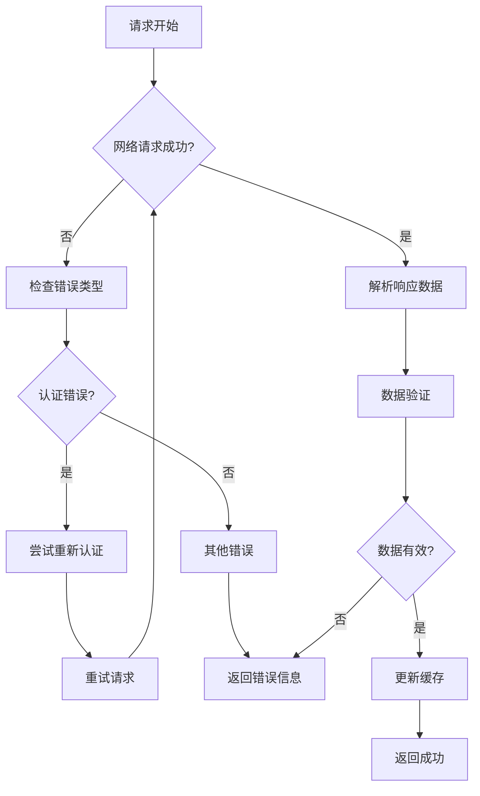

# Gems 服务

<cite>
**本文档引用的文件**
- [services/gems.js](file://services/gems.js)
- [services/gems_api.js](file://services/gems_api.js)
- [services/auth.js](file://services/auth.js)
- [background/messages.js](file://background/messages.js)
- [background/managers/session_manager.js](file://background/managers/session_manager.js)
- [sandbox/controllers/gems_controller.js](file://sandbox/controllers/gems_controller.js)
- [manifest.json](file://manifest.json)
- [lib/utils.js](file://lib/utils.js)
- [background/index.js](file://background/index.js)
- [sandbox/index.html](file://sandbox/index.html)
- [sidepanel/index.html](file://sidepanel/index.html)
- [README.md](file://README.md)
</cite>

## 目录
1. [简介](#简介)
2. [项目结构](#项目结构)
3. [核心组件](#核心组件)
4. [架构概览](#架构概览)
5. [详细组件分析](#详细组件分析)
6. [依赖关系分析](#依赖关系分析)
7. [性能考虑](#性能考虑)
8. [故障排除指南](#故障排除指南)
9. [结论](#结论)

## 简介

Gems 服务是 Gemini Nexus Chrome 扩展中的一个核心功能模块，专门用于从 Google Gemini 平台获取和管理用户创建的 "Gems"（宝石）模型。Gems 是用户自定义的 AI 模型配置，可以包含特定的提示词、系统指令和行为规范。

该服务提供了两种主要的数据获取方式：
- **网页抓取方式**：通过解析 Gemini 网页源码提取 Gems 信息
- **API 方式**：使用官方 batchexecute API 直接获取 Gems 数据

## 项目结构

Gemini Nexus 采用模块化架构设计，Gems 服务位于 `services/` 目录下，与后台管理器、消息处理机制和沙盒界面紧密集成。

**图表来源**
- [manifest.json](file://manifest.json#L1-L93)
- [background/index.js](file://background/index.js#L1-L30)
- [services/gems.js](file://services/gems.js#L1-L312)

**章节来源**
- [README.md](file://README.md#L50-L66)
- [manifest.json](file://manifest.json#L1-L93)

## 核心组件

### Gems 数据服务层

Gems 服务包含两个主要的数据获取组件：

1. **网页抓取服务** (`services/gems.js`)
   - 解析 Gemini 网页 HTML 提取 Gems 信息
   - 支持多种数据提取模式
   - 实现智能缓存机制

2. **API 服务** (`services/gems_api.js`)
   - 使用官方 batchexecute API 获取 Gems
   - 更稳定可靠的数据来源
   - 包含完整的认证流程

### 控制器层

- **GemsController** (`sandbox/controllers/gems_controller.js`)
  - 管理 Gems 数据的前端展示
  - 处理用户交互和状态管理
  - 集成到模型选择器中

### 后台管理器

- **消息处理器** (`background/messages.js`)
  - 处理跨组件的消息通信
  - 协调 Gems 数据获取请求
  - 实现错误处理和日志记录

**章节来源**
- [services/gems.js](file://services/gems.js#L1-L312)
- [services/gems_api.js](file://services/gems_api.js#L1-L181)
- [sandbox/controllers/gems_controller.js](file://sandbox/controllers/gems_controller.js#L1-L168)

## 架构概览

Gems 服务采用分层架构设计，确保了良好的模块分离和可维护性。

**图表来源**
- [sandbox/controllers/gems_controller.js](file://sandbox/controllers/gems_controller.js#L23-L78)
- [background/messages.js](file://background/messages.js#L71-L84)
- [services/gems_api.js](file://services/gems_api.js#L13-L75)

### 数据流架构

**图表来源**
- [services/gems.js](file://services/gems.js#L53-L139)
- [services/gems_api.js](file://services/gems_api.js#L81-L141)
- [background/messages.js](file://background/messages.js#L71-L84)

## 详细组件分析

### Gems 数据提取算法

Gems 服务实现了三种不同的数据提取策略，以提高成功率和兼容性。

#### 策略一：AF_initDataCallback 模式
这是 Google Gemini 常用的数据初始化模式，通过正则表达式匹配特定的数据结构。

**图表来源**
- [services/gems.js](file://services/gems.js#L59-L79)

#### 策略二：WIZ_global_data 模式
处理全局数据对象，适用于不同的页面结构。

#### 策略三：URL 提取模式
直接从页面链接中提取 Gems ID，虽然缺少名称信息但能提供基本标识。

**章节来源**
- [services/gems.js](file://services/gems.js#L53-L139)

### API 服务实现

API 服务使用官方 batchexecute 接口，提供更稳定的数据获取方式。

**图表来源**
- [services/gems_api.js](file://services/gems_api.js#L13-L75)
- [services/auth.js](file://services/auth.js#L7-L40)
- [lib/utils.js](file://lib/utils.js#L5-L9)

### 缓存机制设计

Gems 服务实现了智能缓存系统，避免频繁的网络请求。

**图表来源**
- [services/gems.js](file://services/gems.js#L289-L311)
- [services/gems_api.js](file://services/gems_api.js#L157-L180)

**章节来源**
- [services/gems.js](file://services/gems.js#L278-L311)
- [services/gems_api.js](file://services/gems_api.js#L146-L180)

### 前端控制器实现

GemsController 负责管理 Gems 数据在用户界面中的展示和交互。

**图表来源**
- [sandbox/controllers/gems_controller.js](file://sandbox/controllers/gems_controller.js#L23-L78)

**章节来源**
- [sandbox/controllers/gems_controller.js](file://sandbox/controllers/gems_controller.js#L1-L168)

## 依赖关系分析

### 组件间依赖

**图表来源**
- [services/auth.js](file://services/auth.js#L1-L41)
- [services/gems.js](file://services/gems.js#L5-L6)
- [services/gems_api.js](file://services/gems_api.js#L5-L6)
- [background/messages.js](file://background/messages.js#L3-L5)

### 关键依赖关系

1. **认证依赖**：所有 Gems 获取都需要有效的认证参数
2. **网络依赖**：需要稳定的网络连接访问 Gemini 服务
3. **DOM 解析依赖**：网页抓取方式依赖准确的 HTML 解析
4. **缓存依赖**：API 方式依赖本地缓存机制

**章节来源**
- [services/auth.js](file://services/auth.js#L16-L40)
- [lib/utils.js](file://lib/utils.js#L5-L9)

## 性能考虑

### 缓存策略优化

Gems 服务采用了多层次的缓存策略来优化性能：

1. **时间缓存**：默认缓存时间为 5 分钟
2. **账户隔离**：不同账户索引使用独立缓存
3. **智能失效**：支持强制刷新机制

### 错误处理机制

**图表来源**
- [services/gems.js](file://services/gems.js#L42-L47)
- [services/gems_api.js](file://services/gems_api.js#L71-L75)

### 并发控制

系统实现了请求去重机制，避免重复的 Gems 获取请求：

- **并发检测**：防止同时发起多个相同的请求
- **超时处理**：15 秒超时机制
- **状态管理**：清晰的加载状态跟踪

**章节来源**
- [sandbox/controllers/gems_controller.js](file://sandbox/controllers/gems_controller.js#L23-L78)

## 故障排除指南

### 常见问题诊断

#### 认证问题
- **症状**：返回 "未登录" 或 "401 未授权"
- **解决方案**：检查 Google 账号登录状态，重新登录 Gemini
- **预防措施**：定期检查认证令牌有效性

#### 网络连接问题
- **症状**：请求超时或网络错误
- **解决方案**：检查网络连接，稍后重试
- **预防措施**：实现自动重连机制

#### 数据解析失败
- **症状**：Gems 列表为空或部分数据缺失
- **解决方案**：启用备用解析策略，检查页面结构变化
- **预防措施**：实现多策略解析机制

### 调试工具

系统提供了完善的日志记录和调试功能：

1. **控制台日志**：详细的执行过程记录
2. **错误堆栈**：完整的错误信息追踪
3. **性能监控**：请求耗时和成功率统计

**章节来源**
- [services/gems.js](file://services/gems.js#L42-L47)
- [services/gems_api.js](file://services/gems_api.js#L71-L75)
- [background/messages.js](file://background/messages.js#L79-L82)

## 结论

Gems 服务作为 Gemini Nexus 的重要组成部分，展现了优秀的架构设计和实现质量。通过提供多种数据获取策略、智能缓存机制和完善的错误处理，确保了稳定可靠的用户体验。

### 主要优势

1. **多策略兼容**：同时支持网页抓取和 API 获取两种方式
2. **智能缓存**：有效减少网络请求，提升响应速度
3. **健壮性设计**：完善的错误处理和重试机制
4. **模块化架构**：清晰的组件分离和职责划分

### 技术亮点

- **灵活的数据提取算法**：适应不同的页面结构变化
- **高效的缓存管理**：平衡数据新鲜度和性能需求
- **优雅的错误处理**：提供友好的用户反馈和恢复机制
- **完整的生命周期管理**：从请求到展示的全流程控制

该服务为 Gemini Nexus 提供了强大的 Gems 管理能力，是扩展功能的重要基础组件。