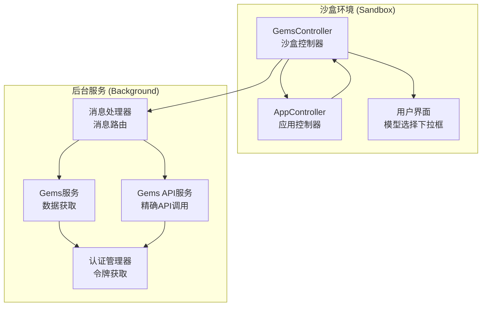
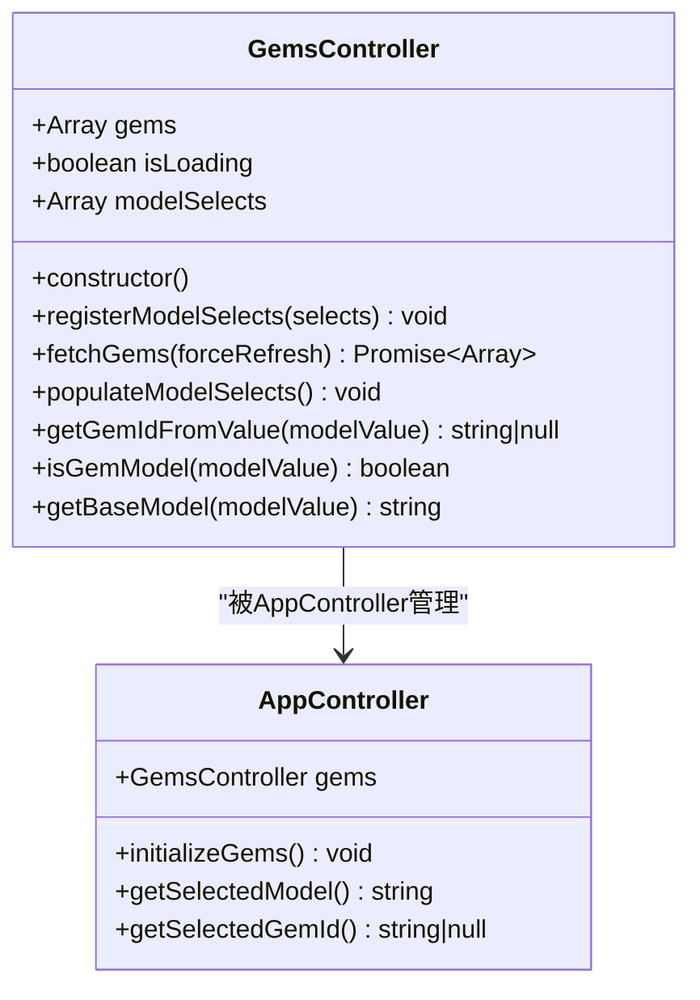
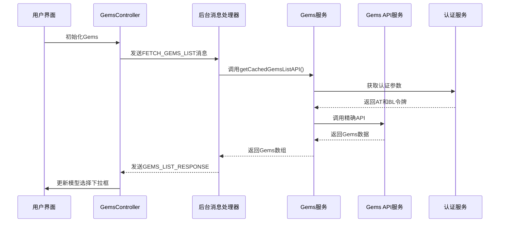
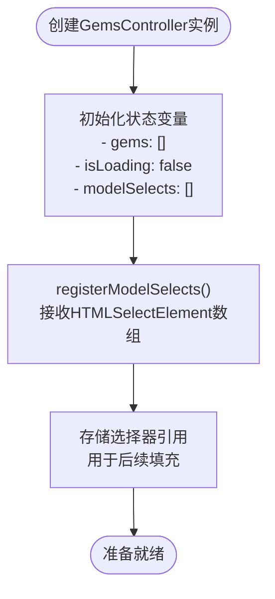
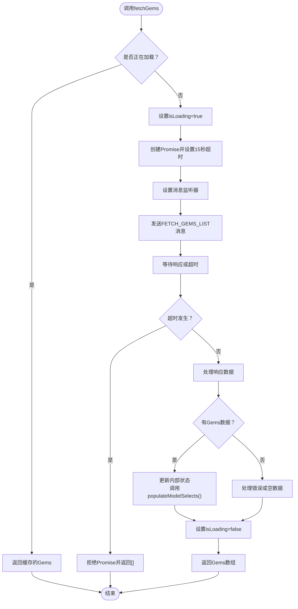
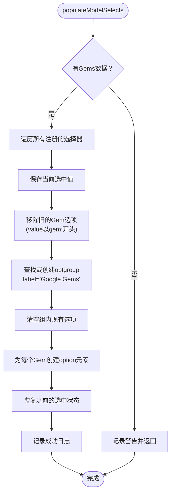
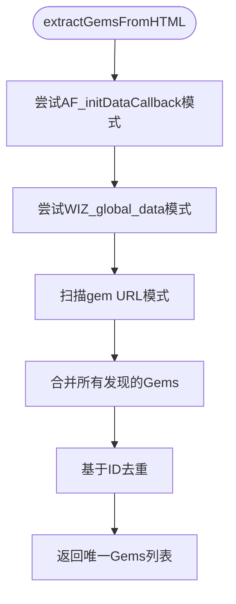
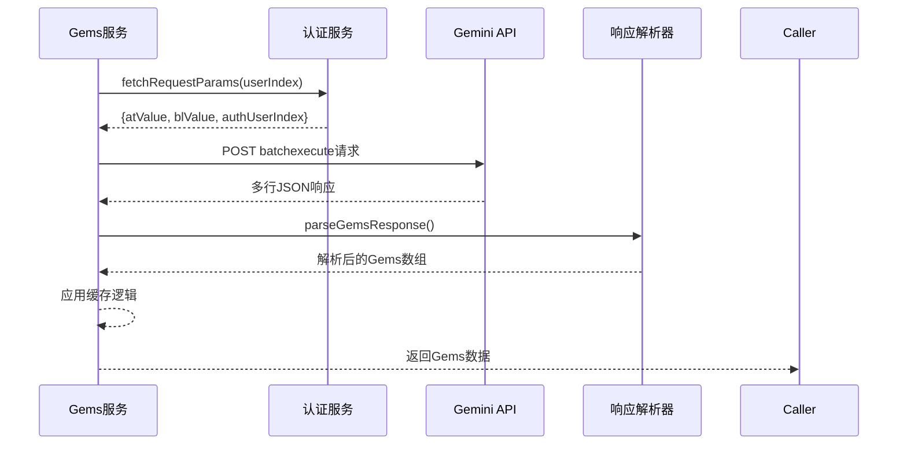
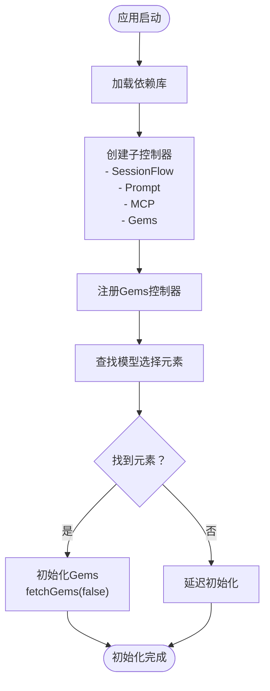
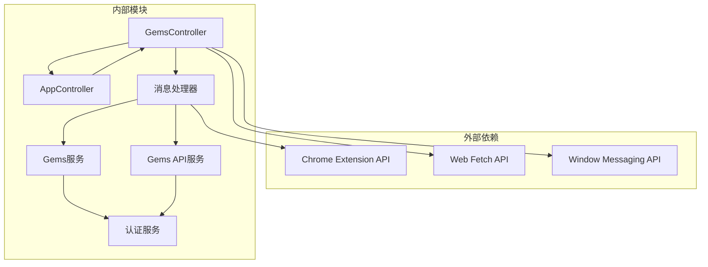

# Gems控制器实现

<cite>
**本文档引用的文件**
- [gems_controller.js](file://sandbox/controllers/gems_controller.js)
- [gems.js](file://services/gems.js)
- [gems_api.js](file://services/gems_api.js)
- [app_controller.js](file://sandbox/controllers/app_controller.js)
- [messages.js](file://background/messages.js)
- [auth.js](file://services/auth.js)
- [app.js](file://sandbox/boot/app.js)
</cite>

## 目录
1. [简介](#简介)
2. [项目结构](#项目结构)
3. [核心组件](#核心组件)
4. [架构概览](#架构概览)
5. [详细组件分析](#详细组件分析)
6. [依赖关系分析](#依赖关系分析)
7. [性能考虑](#性能考虑)
8. [故障排除指南](#故障排除指南)
9. [结论](#结论)

## 简介

Gems控制器是Gemini Nexus扩展中的一个关键组件，负责管理Google Gems（Gemini助手的预设配置）的获取、缓存和用户界面集成。该控制器实现了跨框架通信机制，允许沙盒环境中的前端组件与后台服务进行交互，动态加载和显示可用的Gems选项。

Gems控制器的核心功能包括：
- 从Google Gemini API获取Gems列表
- 缓存机制以提高性能
- 用户界面集成，将Gems选项填充到模型选择下拉框中
- 支持多账户管理和账户轮换
- 错误处理和超时管理

## 项目结构

Gems控制器的实现分布在多个模块中，形成了清晰的分层架构：

**图表来源**
- [gems_controller.js](file://sandbox/controllers/gems_controller.js#L1-L168)
- [app_controller.js](file://sandbox/controllers/app_controller.js#L1-L230)
- [messages.js](file://background/messages.js#L70-L125)

**章节来源**
- [gems_controller.js](file://sandbox/controllers/gems_controller.js#L1-L168)
- [app_controller.js](file://sandbox/controllers/app_controller.js#L1-L230)
- [messages.js](file://background/messages.js#L70-L125)

## 核心组件

### GemsController类

GemsController是沙盒环境中的主要控制器类，负责管理Gems的生命周期：

**图表来源**
- [gems_controller.js](file://sandbox/controllers/gems_controller.js#L3-L167)
- [app_controller.js](file://sandbox/controllers/app_controller.js#L37-L53)

### 数据结构

Gems对象的标准格式：
- `id`: 字符串，Gem的唯一标识符
- `name`: 字符串，Gem的显示名称
- `description`: 字符串，Gem的描述信息
- `systemPrompt`: 字符串，Gem的系统提示词（可选）

**章节来源**
- [gems_controller.js](file://sandbox/controllers/gems_controller.js#L1-L168)
- [gems.js](file://services/gems.js#L1-L312)

## 架构概览

Gems控制器采用事件驱动的消息传递架构，实现了沙盒环境与后台服务之间的松耦合通信：

**图表来源**
- [gems_controller.js](file://sandbox/controllers/gems_controller.js#L23-L78)
- [messages.js](file://background/messages.js#L72-L85)
- [gems_api.js](file://services/gems_api.js#L13-L75)

## 详细组件分析

### GemsController实现

#### 初始化和注册机制

GemsController通过构造函数初始化状态变量，并提供注册方法来绑定用户界面元素：

**图表来源**
- [gems_controller.js](file://sandbox/controllers/gems_controller.js#L4-L16)

#### 异步数据获取流程

fetchGems方法实现了完整的异步数据获取流程，包含超时管理和错误处理：

**图表来源**
- [gems_controller.js](file://sandbox/controllers/gems_controller.js#L23-L78)

#### 用户界面集成

populateModelSelects方法负责将Gems数据集成到用户界面中：

**图表来源**
- [gems_controller.js](file://sandbox/controllers/gems_controller.js#L83-L133)

### 服务层实现

#### HTML解析策略

Gems服务实现了多种数据提取策略来从Google Gemini页面中解析Gems信息：

**图表来源**
- [gems.js](file://services/gems.js#L53-L139)

#### API调用机制

Gems API服务提供了更精确的数据获取方式，直接使用batchexecute API：

**图表来源**
- [gems_api.js](file://services/gems_api.js#L13-L75)
- [auth.js](file://services/auth.js#L7-L40)

**章节来源**
- [gems.js](file://services/gems.js#L1-L312)
- [gems_api.js](file://services/gems_api.js#L1-L181)
- [auth.js](file://services/auth.js#L1-L41)

### 应用集成

#### 初始化流程

AppController负责协调Gems控制器的初始化过程：

**图表来源**
- [app_controller.js](file://sandbox/controllers/app_controller.js#L41-L53)
- [app.js](file://sandbox/boot/app.js#L82-L82)

#### 模型选择处理

Gems控制器提供了专门的方法来处理模型值的转换：

| 方法 | 输入 | 输出 | 描述 |
|------|------|------|------|
| `getGemIdFromValue()` | `"gem:4c81ac3f4657"` | `"4c81ac3f4657"` | 从带前缀的值中提取Gem ID |
| `isGemModel()` | `"gem:4c81ac3f4657"` | `true` | 检查值是否指向Gem |
| `getBaseModel()` | `"gem:4c81ac3f4657"` | `"gem"` | 获取Gem的基础模型名 |

**章节来源**
- [app_controller.js](file://sandbox/controllers/app_controller.js#L109-L117)
- [gems_controller.js](file://sandbox/controllers/gems_controller.js#L140-L166)

## 依赖关系分析

Gems控制器的依赖关系展现了清晰的分层架构：

**图表来源**
- [gems_controller.js](file://sandbox/controllers/gems_controller.js#L1-L168)
- [messages.js](file://background/messages.js#L70-L125)

### 关键依赖点

1. **消息传递机制**: 使用window.postMessage实现沙盒与后台的通信
2. **缓存策略**: 实现5分钟的本地缓存避免重复请求
3. **错误处理**: 完整的异常捕获和超时管理
4. **多账户支持**: 通过userIndex参数支持多个Gemini账户

**章节来源**
- [gems_controller.js](file://sandbox/controllers/gems_controller.js#L33-L77)
- [gems_api.js](file://services/gems_api.js#L157-L180)

## 性能考虑

### 缓存策略

Gems控制器实现了两级缓存机制：

1. **短期缓存**: 5分钟有效期，减少API调用频率
2. **内存缓存**: 在单次会话中保持数据一致性

### 异步优化

- **超时控制**: 15秒请求超时防止UI阻塞
- **并发控制**: 防止重复请求的loading状态检查
- **渐进式加载**: 先显示现有数据，再更新新数据

### 内存管理

- **自动清理**: 移除旧的Gem选项避免DOM膨胀
- **智能去重**: 基于ID的重复检测和清理
- **选择状态保持**: 在更新过程中保持用户的先前选择

## 故障排除指南

### 常见问题及解决方案

#### 1. Gems无法加载

**症状**: 控制台显示"API error"或"No Gems found"

**可能原因**:
- 网络连接问题
- Google账户未登录
- API限制或临时故障

**解决步骤**:
1. 检查网络连接状态
2. 验证Google账户登录状态
3. 尝试强制刷新 (`forceRefresh = true`)
4. 检查浏览器扩展权限

#### 2. 用户界面不更新

**症状**: Gems列表没有显示在模型选择框中

**可能原因**:
- DOM元素未找到
- 选择器引用丢失
- 异步操作未完成

**解决步骤**:
1. 确认模型选择元素存在
2. 重新初始化Gems控制器
3. 检查populateModelSelects方法的执行
4. 验证optgroup创建逻辑

#### 3. 超时错误

**症状**: 控制台显示"Request timeout after 15 seconds"

**解决步骤**:
1. 检查网络延迟
2. 减少同时进行的请求
3. 检查防火墙或代理设置
4. 尝试稍后重试

**章节来源**
- [gems_controller.js](file://sandbox/controllers/gems_controller.js#L24-L77)
- [messages.js](file://background/messages.js#L79-L83)

## 结论

Gems控制器实现了高效、可靠的Google Gems管理功能，通过以下关键特性确保良好的用户体验：

1. **模块化设计**: 清晰的职责分离和接口定义
2. **健壮的错误处理**: 完善的异常捕获和降级策略
3. **性能优化**: 智能缓存和异步处理机制
4. **用户友好**: 平滑的UI更新和状态保持
5. **可扩展性**: 支持多账户和未来功能扩展

该实现展示了现代浏览器扩展开发的最佳实践，包括适当的错误处理、性能优化和用户体验设计。通过事件驱动的消息传递架构，Gems控制器能够有效地集成到更大的Gemini Nexus生态系统中，为用户提供无缝的Gemini助手体验。