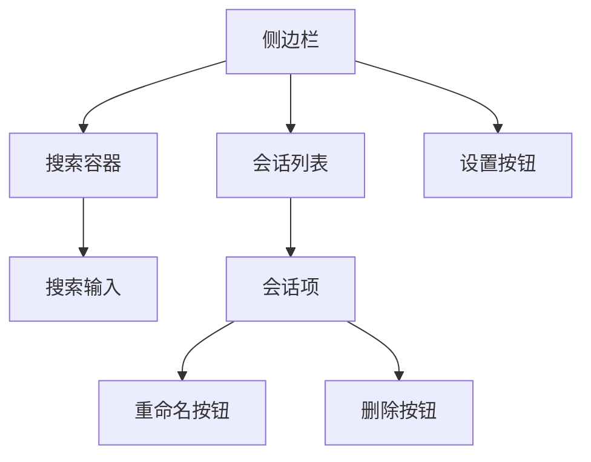
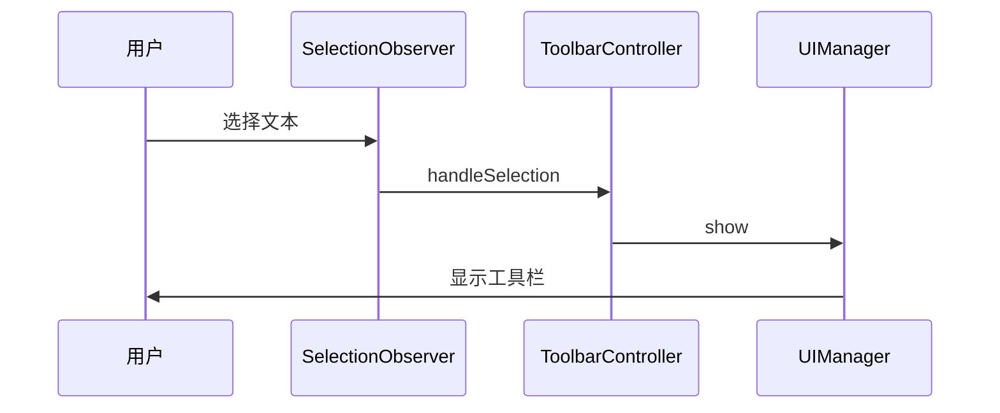
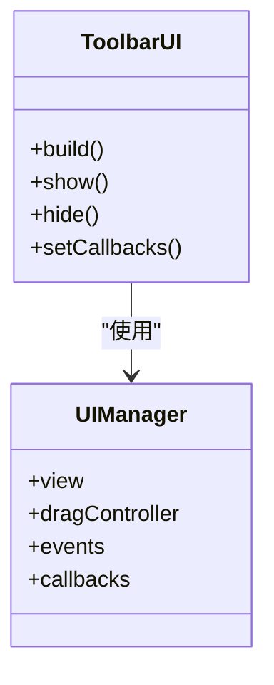
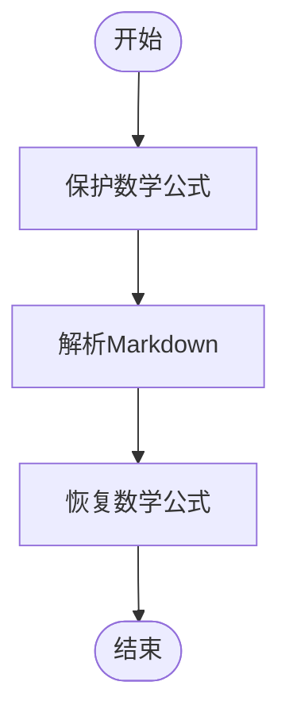
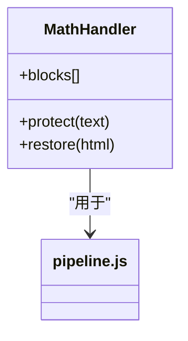
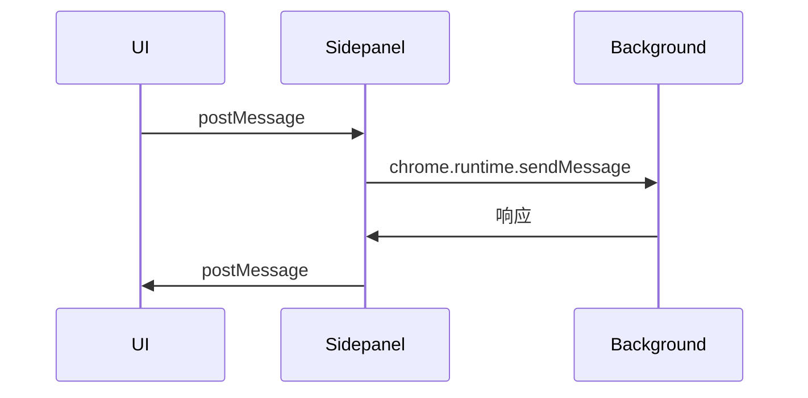
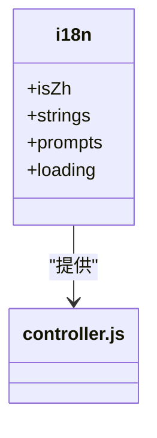
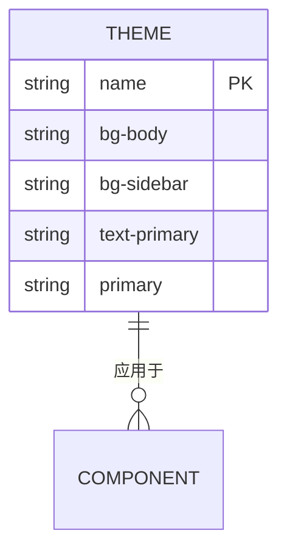

# UI组件

<cite>
**本文档引用的文件**
- [sidepanel/index.js](file://sidepanel/index.js)
- [sandbox/ui/sidebar.js](file://sandbox/ui/sidebar.js)
- [css/base.css](file://css/base.css)
- [css/sidebar.css](file://css/sidebar.css)
- [sandbox/ui/templates/sidebar.js](file://sandbox/ui/templates/sidebar.js)
- [content/toolbar/controller.js](file://content/toolbar/controller.js)
- [content/toolbar/ui/manager.js](file://content/toolbar/ui/manager.js)
- [content/toolbar/styles/markdown.js](file://content/toolbar/styles/markdown.js)
- [content/toolbar/ui/renderer.js](file://content/toolbar/ui/renderer.js)
- [sandbox/render/content.js](file://sandbox/render/content.js)
- [sandbox/render/pipeline.js](file://sandbox/render/pipeline.js)
- [sandbox/render/math_utils.js](file://sandbox/render/math_utils.js)
- [content/toolbar/i18n.js](file://content/toolbar/i18n.js)
- [sandbox/theme_init.js](file://sandbox/theme_init.js)
- [sandbox/ui/viewer.js](file://sandbox/ui/viewer.js)
</cite>

## 目录
1. [简介](#简介)
2. [侧边栏界面](#侧边栏界面)
3. [浮动工具栏](#浮动工具栏)
4. [内容渲染组件](#内容渲染组件)
5. [UI状态管理与数据同步](#ui状态管理与数据同步)
6. [可访问性与国际化](#可访问性与国际化)
7. [主题与样式定制](#主题与样式定制)
8. [组件属性与事件](#组件属性与事件)

## 简介
本文档详细描述了Gemini Nexus的用户界面元素及其技术实现。文档涵盖了侧边栏、浮动工具栏和沙箱环境中的内容渲染组件，解释了它们的布局、交互逻辑、显示策略和响应式设计。同时，文档化了关键UI组件的属性、事件、插槽和定制选项，提供了CSS类名说明和主题定制指南，并讨论了可访问性（a11y）实现和国际化（i18n）支持。

## 侧边栏界面
侧边栏是Gemini Nexus的主要交互界面，提供会话历史管理、搜索和设置访问功能。它通过一个固定的侧边栏容器实现，支持多种布局模式和交互逻辑。

**Diagram sources**
- [sandbox/ui/templates/sidebar.js](file://sandbox/ui/templates/sidebar.js)
- [css/sidebar.css](file://css/sidebar.css)

**Section sources**
- [sandbox/ui/sidebar.js](file://sandbox/ui/sidebar.js)
- [sidepanel/index.js](file://sidepanel/index.js)

## 浮动工具栏
浮动工具栏是一个动态的UI组件，根据用户选择和上下文显示不同的操作选项。它具有复杂的显示策略、样式定制和响应式设计。

### 显示策略
浮动工具栏的显示由`ToolbarController`管理，根据用户选择和鼠标位置动态显示。工具栏可以显示在选区附近或作为独立窗口。

**Diagram sources**
- [content/toolbar/controller.js](file://content/toolbar/controller.js)
- [content/toolbar/ui/manager.js](file://content/toolbar/ui/manager.js)

### 样式定制
工具栏的样式通过CSS变量和内联样式结合实现，支持主题切换和自定义外观。

**Diagram sources**
- [content/toolbar/ui/manager.js](file://content/toolbar/ui/manager.js)
- [content/toolbar/styles/markdown.js](file://content/toolbar/styles/markdown.js)

**Section sources**
- [content/toolbar/controller.js](file://content/toolbar/controller.js)
- [content/toolbar/ui/manager.js](file://content/toolbar/ui/manager.js)

## 内容渲染组件
沙箱环境中的内容渲染组件负责处理Markdown、数学公式和图表展示，确保内容的正确渲染和交互。

### Markdown处理
Markdown内容通过`transformMarkdown`函数处理，该函数使用marked库解析Markdown并生成HTML。

**Diagram sources**
- [sandbox/render/pipeline.js](file://sandbox/render/pipeline.js)
- [sandbox/render/content.js](file://sandbox/render/content.js)

### 数学公式处理
数学公式通过`MathHandler`类处理，支持多种LaTeX语法，包括行内公式和块级公式。

**Diagram sources**
- [sandbox/render/math_utils.js](file://sandbox/render/math_utils.js)
- [sandbox/render/pipeline.js](file://sandbox/render/pipeline.js)

**Section sources**
- [sandbox/render/content.js](file://sandbox/render/content.js)
- [sandbox/render/pipeline.js](file://sandbox/render/pipeline.js)
- [sandbox/render/math_utils.js](file://sandbox/render/math_utils.js)

## UI状态管理与数据同步
UI状态管理通过消息传递和存储机制实现，确保UI组件与后台服务之间的数据同步。

**Diagram sources**
- [sidepanel/index.js](file://sidepanel/index.js)
- [content/toolbar/controller.js](file://content/toolbar/controller.js)

**Section sources**
- [sidepanel/index.js](file://sidepanel/index.js)
- [content/toolbar/controller.js](file://content/toolbar/controller.js)

## 可访问性与国际化
系统通过多种机制支持可访问性和国际化，确保不同用户群体的使用体验。

### 国际化实现
国际化通过`i18n.js`文件实现，根据浏览器语言设置自动切换界面语言。

**Diagram sources**
- [content/toolbar/i18n.js](file://content/toolbar/i18n.js)
- [sandbox/theme_init.js](file://sandbox/theme_init.js)

**Section sources**
- [content/toolbar/i18n.js](file://content/toolbar/i18n.js)
- [sandbox/theme_init.js](file://sandbox/theme_init.js)

## 主题与样式定制
主题和样式通过CSS变量和JavaScript动态切换实现，支持深色和浅色主题。

### CSS变量
CSS变量定义在`base.css`文件中，为不同主题提供颜色和样式配置。

**Diagram sources**
- [css/base.css](file://css/base.css)
- [css/sidebar.css](file://css/sidebar.css)

**Section sources**
- [css/base.css](file://css/base.css)
- [css/sidebar.css](file://css/sidebar.css)

## 组件属性与事件
关键UI组件的属性、事件、插槽和定制选项如下：

### 侧边栏组件
- **属性**: `sidebar`, `overlay`, `listEl`, `toggleBtn`, `closeBtn`
- **事件**: `toggle`, `close`, `handleSearch`, `renderList`
- **插槽**: 无
- **定制选项**: 搜索、会话列表、设置按钮

### 浮动工具栏组件
- **属性**: `ui`, `actions`, `imageDetector`, `streamHandler`, `inputManager`
- **事件**: `handleAction`, `handleSelection`, `handleClick`, `handleModelChange`
- **插槽**: 无
- **定制选项**: 模型选择、图像分析、文本操作

### 内容渲染组件
- **属性**: `contentDiv`, `text`, `role`
- **事件**: `renderContent`, `transformMarkdown`, `protect`, `restore`
- **插槽**: 无
- **定制选项**: Markdown解析、数学公式渲染、代码高亮

**Section sources**
- [sandbox/ui/sidebar.js](file://sandbox/ui/sidebar.js)
- [content/toolbar/controller.js](file://content/toolbar/controller.js)
- [sandbox/render/content.js](file://sandbox/render/content.js)