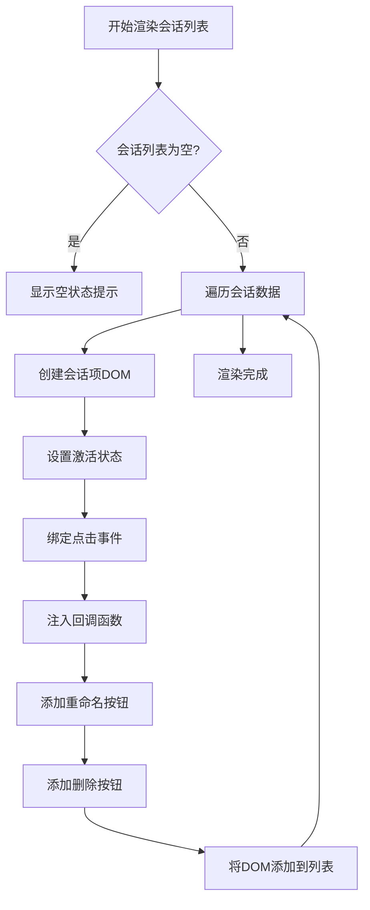
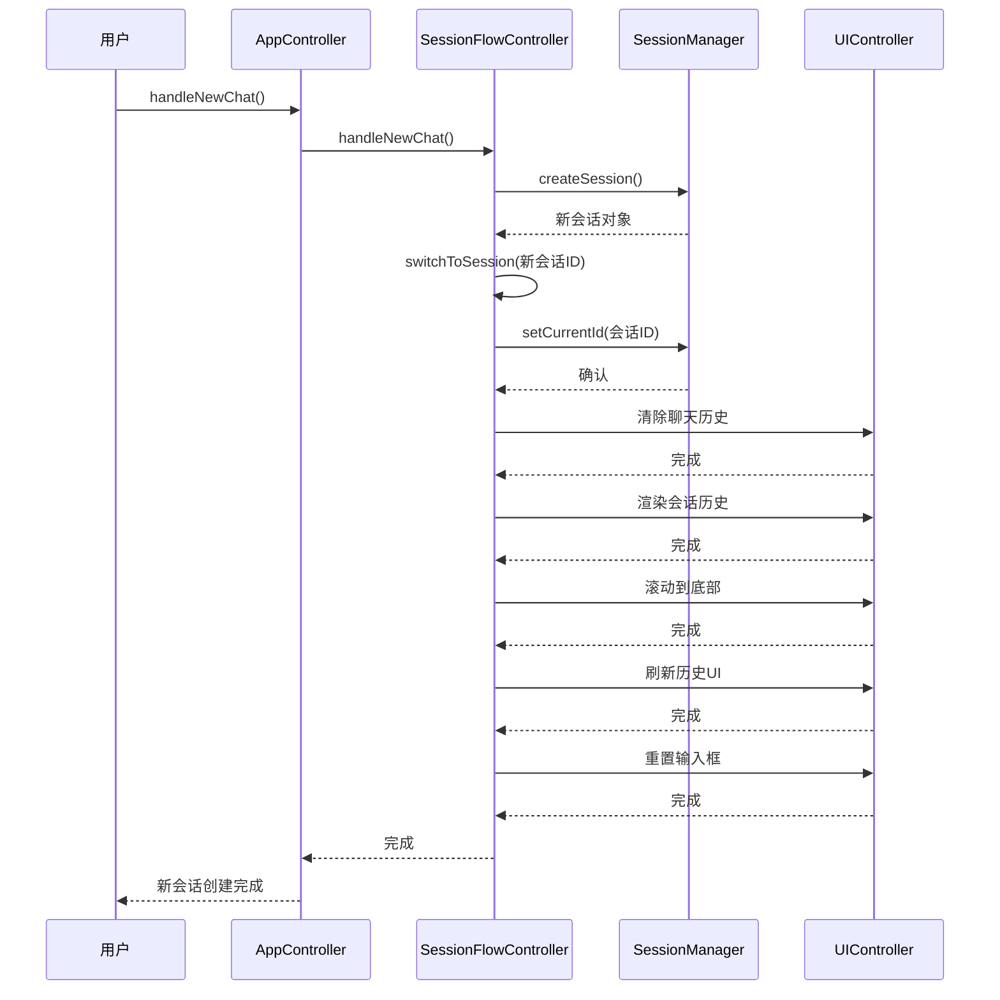
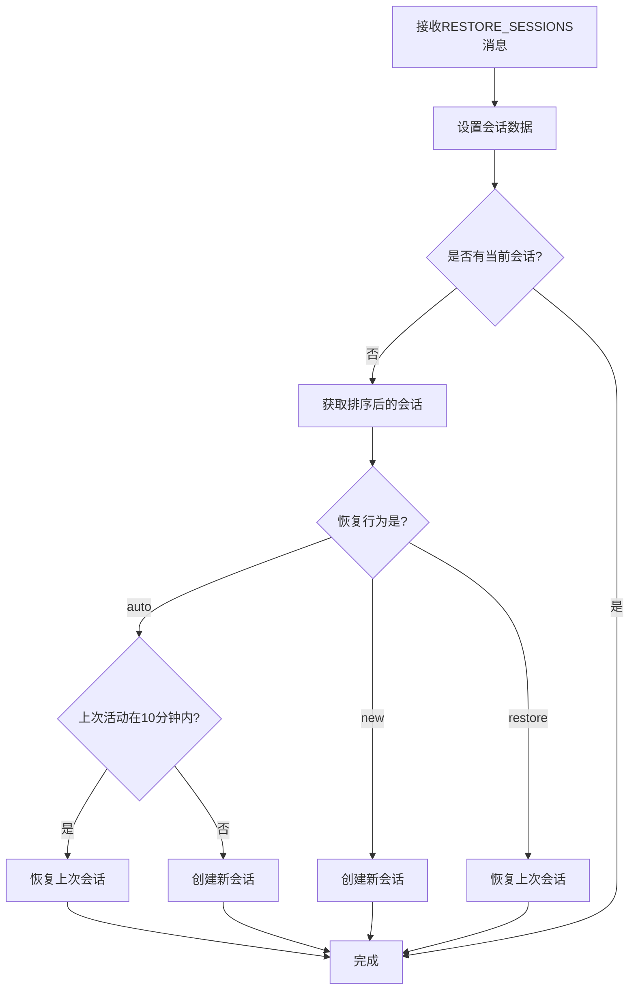
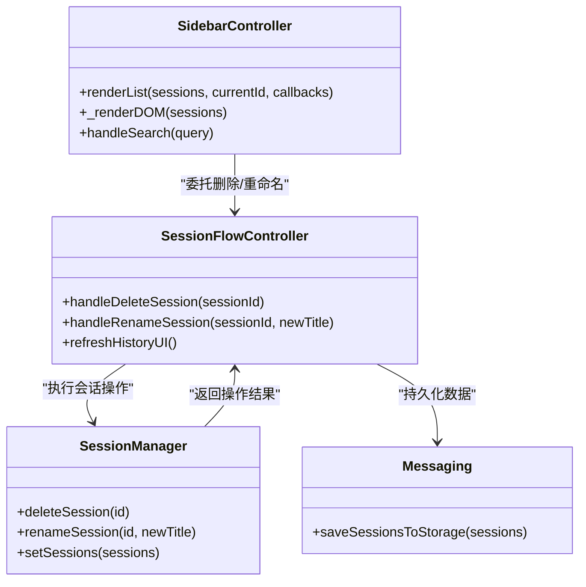

# 会话交互

<cite>
**本文档引用的文件**   
- [app_controller.js](file://sandbox/controllers/app_controller.js)
- [session_flow.js](file://sandbox/controllers/session_flow.js)
- [sidebar.js](file://sandbox/ui/sidebar.js)
- [session_manager.js](file://sandbox/core/session_manager.js)
- [history_manager.js](file://background/managers/history_manager.js)
- [message.js](file://sandbox/render/message.js)
- [messaging.js](file://lib/messaging.js)
</cite>

## 目录
1. [会话列表渲染与回调注入](#会话列表渲染与回调注入)
2. [新会话创建与会话切换流程](#新会话创建与会话切换流程)
3. [会话历史持久化与恢复机制](#会话历史持久化与恢复机制)
4. [会话管理操作实现](#会话管理操作实现)
5. [错误处理与边界情况](#错误处理与边界情况)

## 会话列表渲染与回调注入

会话列表的渲染由 `SidebarController` 类的 `renderList` 方法负责，该方法接收会话数据、当前会话ID和回调函数对象作为参数。在渲染过程中，系统会为每个会话项创建一个包含标题和操作按钮的DOM元素，并根据当前会话状态设置激活样式。

回调函数通过 `itemCallbacks` 对象注入，包含会话切换、删除和重命名三个核心操作。当用户与会话项交互时，相应的回调函数会被触发。例如，点击会话项会调用 `onSwitch` 回调，触发会话切换；点击删除按钮会调用 `onDelete` 回调，启动会话删除流程。

**Diagram sources**
- [sidebar.js](file://sandbox/ui/sidebar.js#L93-L248)

**Section sources**
- [sidebar.js](file://sandbox/ui/sidebar.js#L93-L248)

## 新会话创建与会话切换流程

`AppController` 类通过委托模式将 `handleNewChat` 和 `switchToSession` 方法的实现委托给 `SessionFlowController`。当用户创建新会话时，系统会首先检查是否有正在进行的生成任务，如果有则取消该任务并重置消息流。

创建新会话的流程包括：调用 `sessionManager.createSession()` 创建新的会话实例，设置默认标题，然后调用 `switchToSession` 切换到新创建的会话。会话切换流程更为复杂，它首先取消任何正在进行的生成任务，重置消息流，然后更新会话管理器中的当前会话ID。

**Diagram sources**
- [app_controller.js](file://sandbox/controllers/app_controller.js#L77-L83)
- [session_flow.js](file://sandbox/controllers/session_flow.js#L14-L58)

**Section sources**
- [app_controller.js](file://sandbox/controllers/app_controller.js#L77-L83)
- [session_flow.js](file://sandbox/controllers/session_flow.js#L14-L58)

## 会话历史持久化与恢复机制

会话历史的持久化策略采用本地存储与消息传递相结合的方式。当会话数据发生变化时，系统通过 `saveSessionsToStorage` 函数将会话数据发送到背景页面，由背景页面负责将其保存到 `chrome.storage.local` 中。这种设计实现了沙箱环境与浏览器扩展API之间的安全隔离。

会话恢复机制在应用初始化时触发，通过处理 `RESTORE_SESSIONS` 消息来实现。系统首先将接收到的会话数据设置到会话管理器中，然后根据侧边栏恢复行为配置决定是否自动恢复上次会话。恢复行为有三种模式：'new'（始终创建新会话）、'restore'（始终恢复上次会话）和 'auto'（智能恢复）。

**Diagram sources**
- [app_controller.js](file://sandbox/controllers/app_controller.js#L139-L175)
- [messaging.js](file://lib/messaging.js#L11-L16)

**Section sources**
- [app_controller.js](file://sandbox/controllers/app_controller.js#L139-L175)
- [messaging.js](file://lib/messaging.js#L11-L16)

## 会话管理操作实现

会话管理操作包括删除、重命名和导出等用户交互功能。删除会话时，系统会首先检查被删除的会话是否为当前会话，如果是则需要进行会话切换。删除操作完成后，系统会持久化更新后的会话列表，并根据情况决定是刷新历史UI还是切换到其他会话。

重命名会话的实现包含输入验证和长度限制。当用户点击重命名按钮时，系统会将静态标题替换为可编辑的输入框，并绑定相应的事件处理程序。输入框支持Enter键确认和Escape键取消操作。提交后，系统会验证新标题的有效性，更新会话管理器中的会话标题，持久化数据并刷新UI。

**Diagram sources**
- [session_flow.js](file://sandbox/controllers/session_flow.js#L72-L94)
- [session_manager.js](file://sandbox/core/session_manager.js#L60-L67)
- [sidebar.js](file://sandbox/ui/sidebar.js#L172-L234)

**Section sources**
- [session_flow.js](file://sandbox/controllers/session_flow.js#L72-L94)
- [session_manager.js](file://sandbox/core/session_manager.js#L60-L67)

## 错误处理与边界情况

系统在会话管理中实现了全面的错误处理和边界情况应对方案。在会话删除操作中，系统会检查删除后是否需要会话切换，并根据剩余会话的数量决定是切换到最新会话还是创建新会话。这种设计确保了用户界面始终处于有效状态。

在会话重命名操作中，系统实现了输入验证，拒绝空标题或仅包含空白字符的标题。同时，系统对标题长度进行了限制，确保UI显示的完整性。对于异步操作如消息发送和会话持久化，系统采用了Promise和回调机制，确保操作的可靠性和错误的可追溯性。

当处理外部消息时，系统对消息负载进行了空值检查，使用 `payload || []` 的模式确保即使接收到空或无效数据也不会导致程序崩溃。这种防御性编程实践提高了系统的健壮性和用户体验。

**Section sources**
- [session_flow.js](file://sandbox/controllers/session_flow.js#L81-L94)
- [app_controller.js](file://sandbox/controllers/app_controller.js#L141-L142)
- [session_manager.js](file://sandbox/core/session_manager.js#L73-L74)