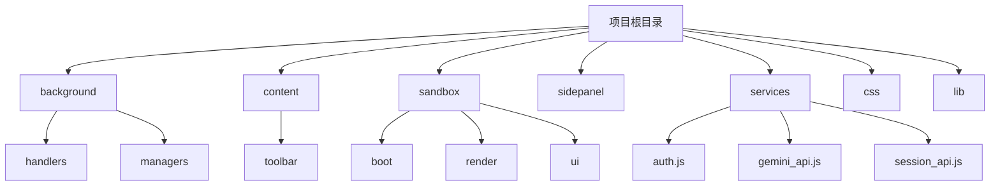
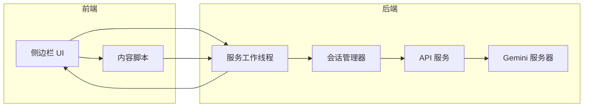
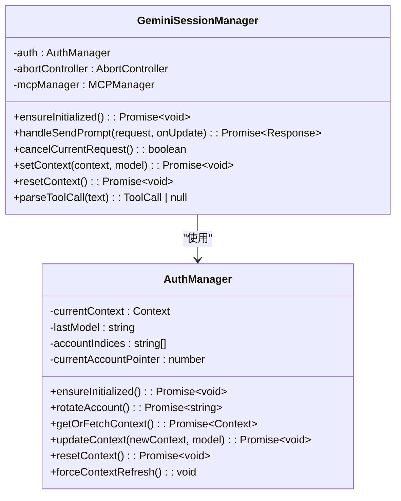
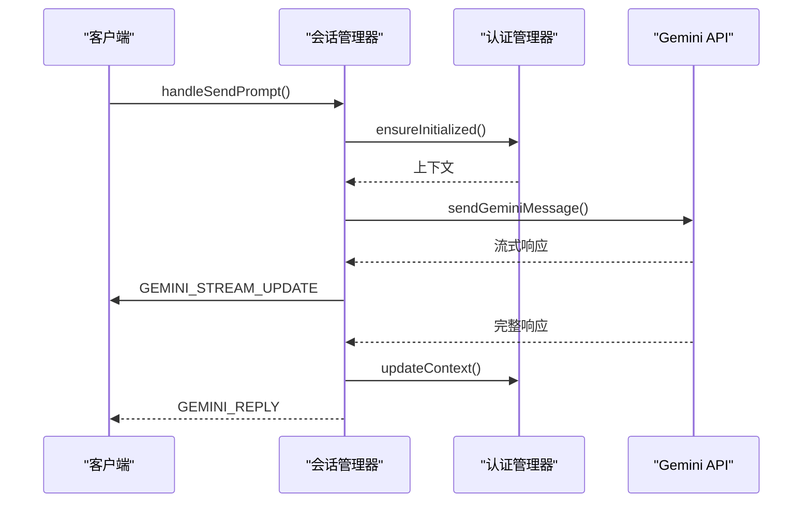
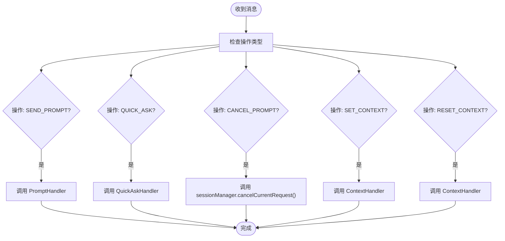
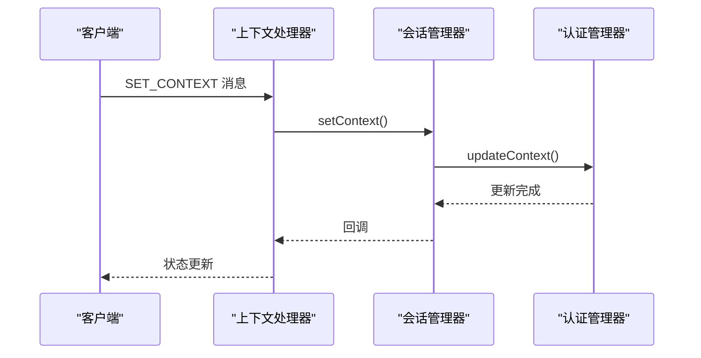
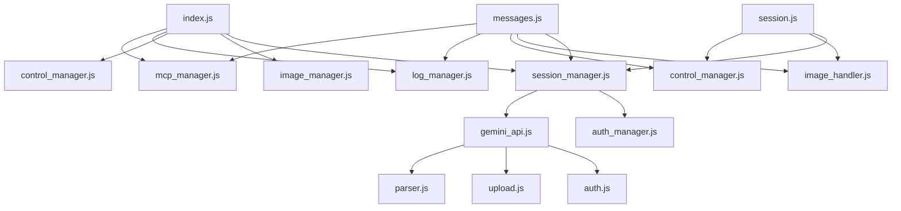

# 会话API集成

<cite>
**本文档中引用的文件**  
- [session_api.js](file://services/session_api.js)
- [session_manager.js](file://background/managers/session_manager.js)
- [session.js](file://background/handlers/session.js)
- [context_handler.js](file://background/handlers/session/context_handler.js)
- [prompt_handler.js](file://background/handlers/session/prompt_handler.js)
- [quick_ask_handler.js](file://background/handlers/session/quick_ask_handler.js)
- [gemini_api.js](file://services/gemini_api.js)
- [auth_manager.js](file://background/managers/auth_manager.js)
- [messages.js](file://background/messages.js)
- [builder.js](file://background/handlers/session/prompt/builder.js)
- [parser.js](file://services/parser.js)
- [index.js](file://background/index.js)
- [manifest.json](file://manifest.json)
- [README.md](file://README.md)
</cite>

## 目录
1. [简介](#简介)
2. [项目结构](#项目结构)
3. [核心组件](#核心组件)
4. [架构概述](#架构概述)
5. [详细组件分析](#详细组件分析)
6. [依赖分析](#依赖分析)
7. [性能考虑](#性能考虑)
8. [故障排除指南](#故障排除指南)
9. [结论](#结论)

## 简介
Gemini Nexus 是一款由 Google Gemini 驱动的强大 AI 助手 Chrome 扩展。该扩展提供侧边栏对话、智能总结、图像分析、文本选中工具、浏览器控制、会话管理等多种功能。本技术文档重点分析其会话API集成机制，涵盖会话管理、上下文处理、消息流控制和错误处理等关键方面。

## 项目结构
Gemini Nexus 项目采用模块化架构，将不同功能分离到独立的目录中。主要结构包括 background（服务工作线程）、content（内容脚本）、sandbox（沙盒环境）、sidepanel（侧边方面板）、services（API服务）等。这种结构确保了关注点分离，使代码更易于维护和扩展。

**图源**
- [README.md](file://README.md#L52-L66)

**节源**
- [README.md](file://README.md#L52-L66)

## 核心组件
核心组件包括会话管理器（GeminiSessionManager）、消息处理器（SessionMessageHandler）和API服务（sendGeminiMessage、deleteSessionFromServer）。这些组件协同工作，实现完整的会话生命周期管理，从发送提示到处理响应，再到会话删除。

**节源**
- [session_manager.js](file://background/managers/session_manager.js#L6-L286)
- [session.js](file://background/handlers/session.js#L7-L56)
- [gemini_api.js](file://services/gemini_api.js#L30-L259)

## 架构概述
系统架构基于Chrome扩展的典型模式，使用服务工作线程处理后台逻辑，内容脚本与网页交互，侧边栏提供用户界面。会话API集成主要在后台线程中完成，通过消息传递与前端组件通信。

**图源**
- [manifest.json](file://manifest.json#L11-L14)
- [index.js](file://background/index.js#L4-L30)

## 详细组件分析

### 会话管理器分析
GeminiSessionManager 是会话管理的核心类，负责处理与 Gemini 服务器的通信，管理认证上下文，并处理错误和重试逻辑。

#### 类图

**图源**
- [session_manager.js](file://background/managers/session_manager.js#L6-L286)
- [auth_manager.js](file://background/managers/auth_manager.js#L5-L130)

#### 消息发送序列图

**图源**
- [session_manager.js](file://background/managers/session_manager.js#L21-L203)
- [gemini_api.js](file://services/gemini_api.js#L30-L259)

### 消息处理器分析
SessionMessageHandler 负责处理来自扩展各部分的消息，将其路由到适当的处理器。它支持多种操作，包括发送提示、快速提问、取消请求和上下文管理。

#### 消息处理流程图

**图源**
- [session.js](file://background/handlers/session.js#L15-L54)

**节源**
- [session.js](file://background/handlers/session.js#L7-L56)

### 上下文管理分析
上下文管理是维持会话连续性的关键。系统通过 AuthManager 管理认证状态和会话上下文，在每次请求后更新上下文，确保多轮对话的连贯性。

#### 上下文管理序列图

**图源**
- [context_handler.js](file://background/handlers/session/context_handler.js#L9-L18)
- [session_manager.js](file://background/managers/session_manager.js#L214-L221)

## 依赖分析
系统依赖关系清晰，各组件之间耦合度适中。主要依赖包括服务工作线程对管理器的依赖、消息处理器对会话管理器的依赖，以及API服务对认证模块的依赖。

**图源**
- [index.js](file://background/index.js#L4-L30)
- [messages.js](file://background/messages.js#L3-L125)

**节源**
- [index.js](file://background/index.js#L4-L30)
- [messages.js](file://background/messages.js#L16-L125)

## 性能考虑
系统在性能方面进行了多项优化，包括并行文件上传、流式响应处理和上下文缓存。错误处理机制也考虑了性能影响，如在认证失败时自动轮换账户而不是立即失败。

## 故障排除指南
常见问题包括认证失败、速率限制和空响应。系统提供了详细的错误消息和恢复建议，如提示用户登录、等待几分钟或刷新页面。日志系统也帮助诊断问题。

**节源**
- [session_manager.js](file://background/managers/session_manager.js#L150-L199)
- [gemini_api.js](file://services/gemini_api.js#L236-L247)

## 结论
Gemini Nexus 的会话API集成设计精良，实现了完整的会话管理功能。通过模块化设计和清晰的依赖关系，系统既灵活又可靠。未来可以考虑增加更多错误恢复策略和性能监控功能。