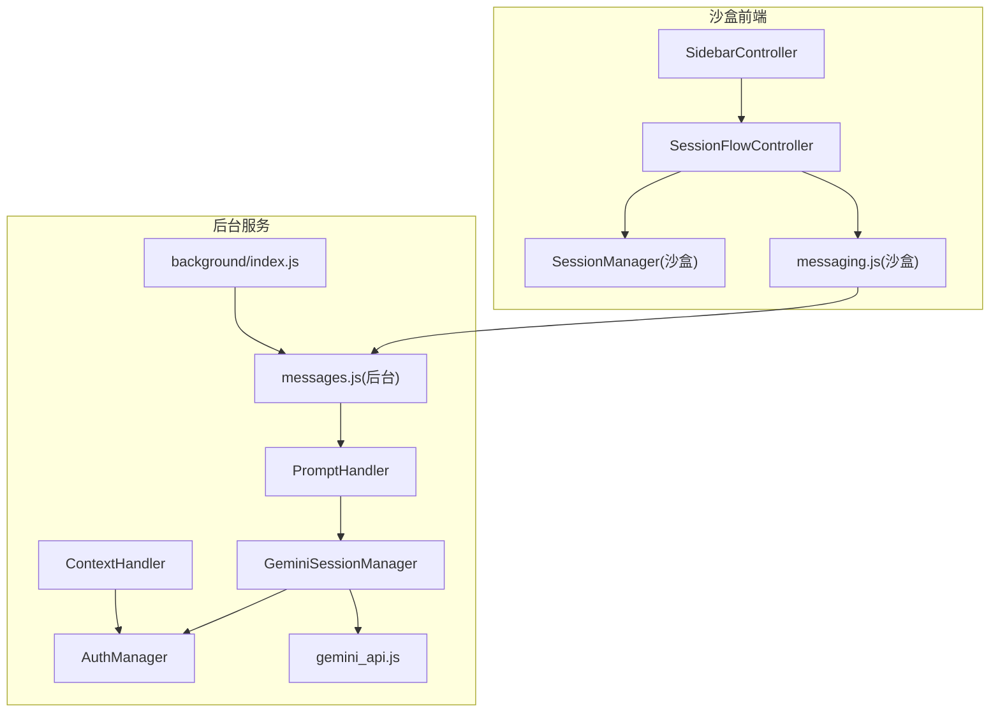
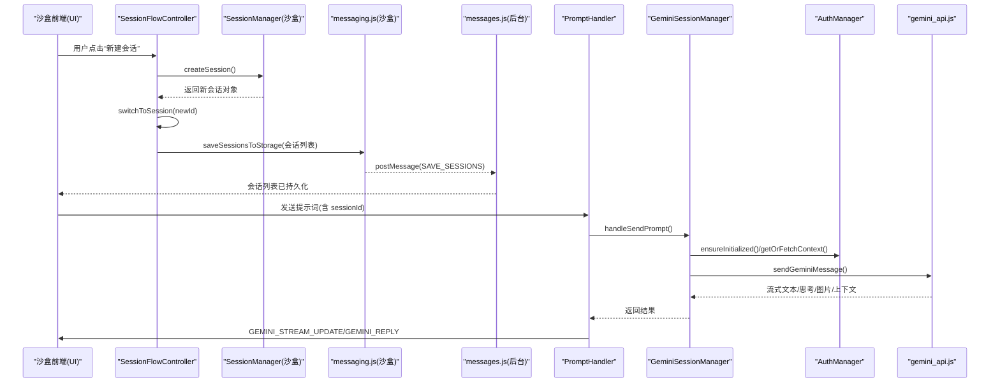
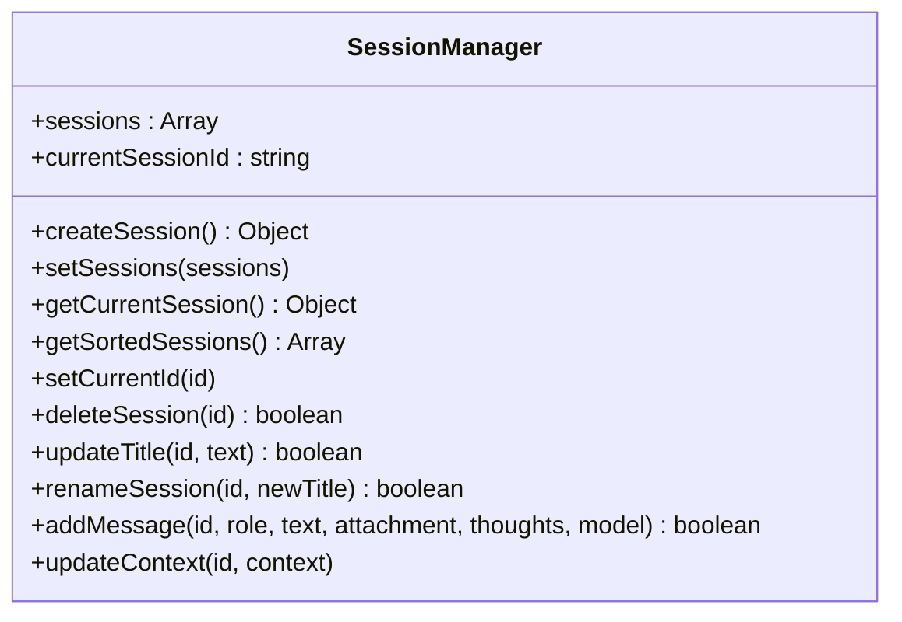
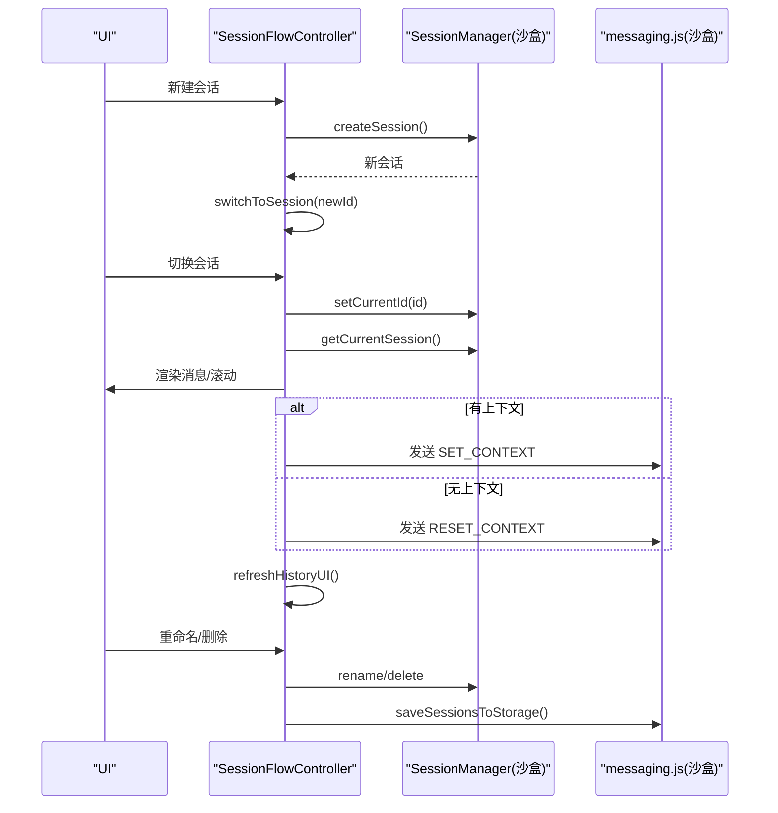
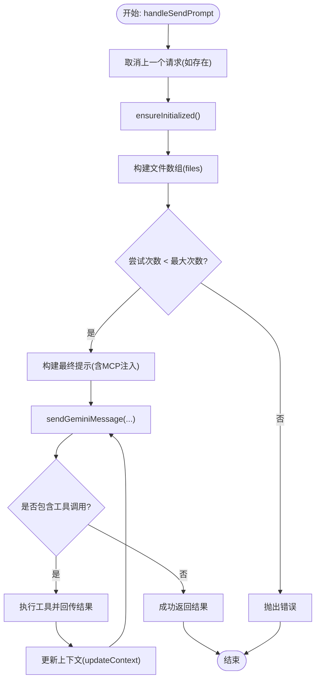
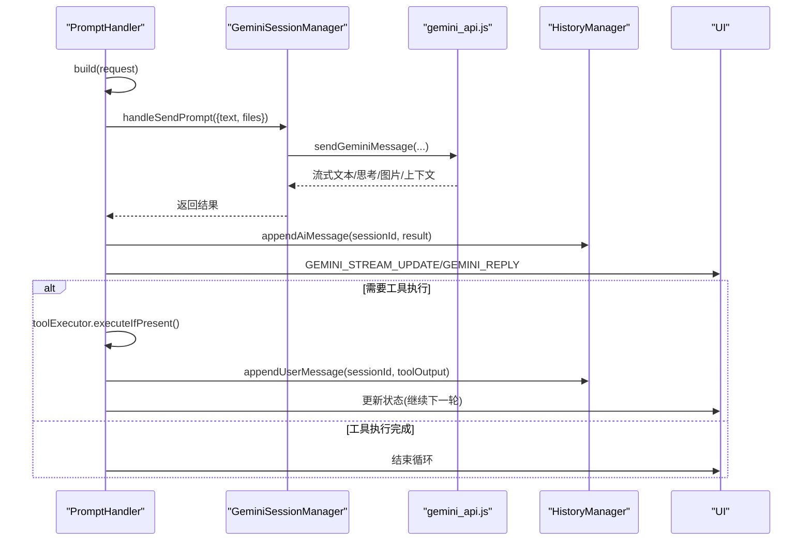
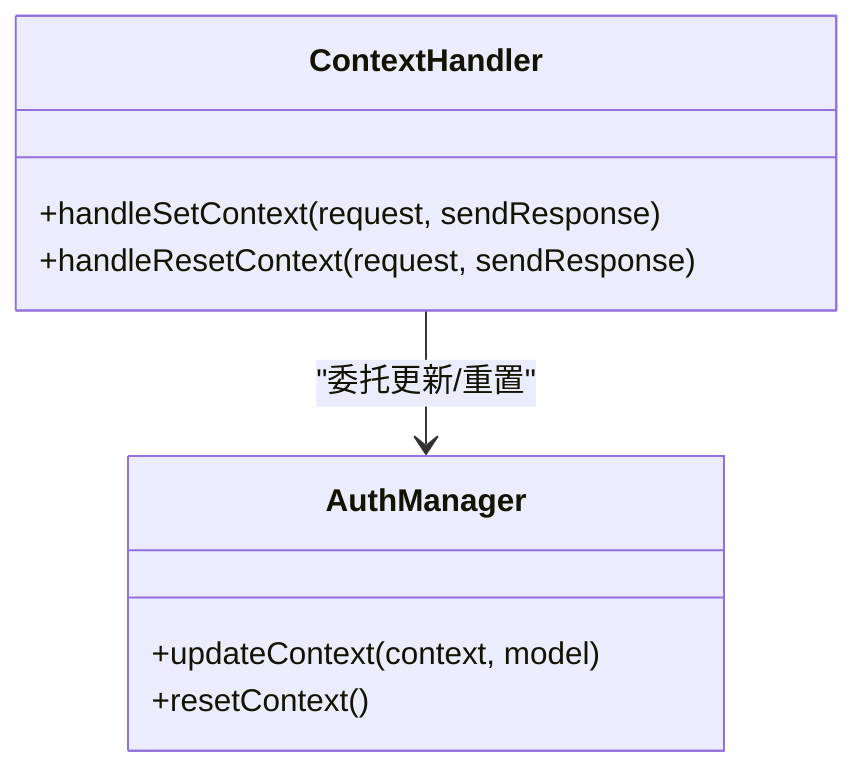
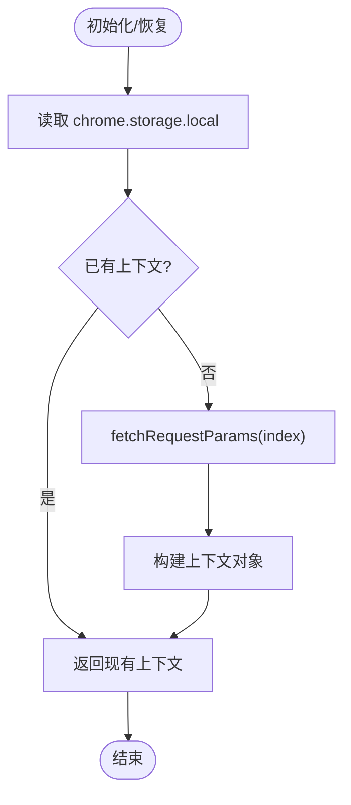
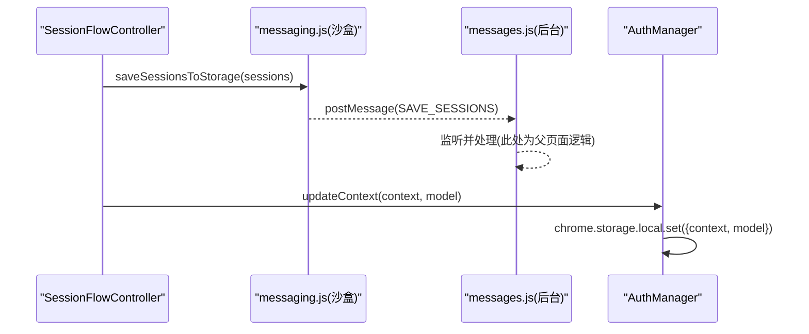
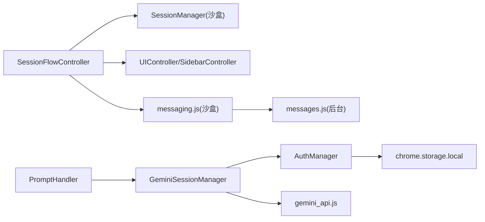

# 会话管理

<cite>
**本文引用的文件**
- [background/managers/session_manager.js](file://background/managers/session_manager.js)
- [sandbox/core/session_manager.js](file://sandbox/core/session_manager.js)
- [background/handlers/session.js](file://background/handlers/session.js)
- [background/handlers/session/prompt_handler.js](file://background/handlers/session/prompt_handler.js)
- [background/handlers/session/context_handler.js](file://background/handlers/session/context_handler.js)
- [sandbox/controllers/session_flow.js](file://sandbox/controllers/session_flow.js)
- [lib/messaging.js](file://lib/messaging.js)
- [background/messages.js](file://background/messages.js)
- [background/index.js](file://background/index.js)
- [sandbox/boot/app.js](file://sandbox/boot/app.js)
- [services/gemini_api.js](file://services/gemini_api.js)
- [background/managers/auth_manager.js](file://background/managers/auth_manager.js)
- [sandbox/ui/sidebar.js](file://sandbox/ui/sidebar.js)
</cite>

## 目录
1. [简介](#简介)
2. [项目结构](#项目结构)
3. [核心组件](#核心组件)
4. [架构总览](#架构总览)
5. [详细组件分析](#详细组件分析)
6. [依赖关系分析](#依赖关系分析)
7. [性能考量](#性能考量)
8. [故障排查指南](#故障排查指南)
9. [结论](#结论)

## 简介
本文件系统性梳理“会话管理”模块的实现机制，重点覆盖：
- 沙箱环境与后台服务中的双重会话管理器（SessionManager）及其协同工作方式
- 会话创建、切换、持久化的完整流程，以及 handleNewChat 和 switchToSession 如何通过 SessionFlowController 协调 UI 状态与数据模型
- 会话排序算法（按时间戳降序）与当前会话标识机制
- 会话数据通过 chrome.storage.local 的持久化生命周期
- 会话上下文管理与 Gemini API 会话状态同步的技术细节
- 多账户环境下会话数据的隔离策略

## 项目结构
会话管理横跨沙盒前端与后台服务两部分：
- 沙盒前端：负责 UI 展示、用户交互、会话列表渲染与本地状态维护
- 后台服务：负责与 Gemini API 通信、上下文管理、多账户轮换与错误处理

图表来源
- [sandbox/core/session_manager.js](file://sandbox/core/session_manager.js#L1-L105)
- [sandbox/controllers/session_flow.js](file://sandbox/controllers/session_flow.js#L1-L96)
- [sandbox/ui/sidebar.js](file://sandbox/ui/sidebar.js#L1-L249)
- [lib/messaging.js](file://lib/messaging.js#L1-L96)
- [background/managers/session_manager.js](file://background/managers/session_manager.js#L1-L285)
- [background/handlers/session/prompt_handler.js](file://background/handlers/session/prompt_handler.js#L1-L103)
- [background/handlers/session/context_handler.js](file://background/handlers/session/context_handler.js#L1-L21)
- [background/managers/auth_manager.js](file://background/managers/auth_manager.js#L1-L130)
- [background/messages.js](file://background/messages.js#L1-L82)
- [background/index.js](file://background/index.js#L1-L30)
- [services/gemini_api.js](file://services/gemini_api.js#L1-L230)

章节来源
- [sandbox/core/session_manager.js](file://sandbox/core/session_manager.js#L1-L105)
- [background/managers/session_manager.js](file://background/managers/session_manager.js#L1-L285)
- [background/messages.js](file://background/messages.js#L1-L82)
- [background/index.js](file://background/index.js#L1-L30)

## 核心组件
- 沙盒 SessionManager：维护会话列表、当前会话 ID、消息与上下文；提供创建、切换、删除、重命名、添加消息、更新上下文等方法。
- 后台 GeminiSessionManager：封装与 Gemini API 的交互，支持多账户轮换、上下文更新、工具调用反馈循环、取消请求等。
- SessionFlowController：协调沙盒前端的 UI 更新与数据模型同步，处理新建会话、切换会话、重命名、删除等操作。
- PromptHandler：在后台处理发送提示词的主流程，包含自动反馈循环与工具执行。
- ContextHandler：处理设置/重置上下文的后台逻辑。
- AuthManager：负责从 chrome.storage.local 恢复/保存上下文、模型、账户索引与指针，支持多账户轮换与强制刷新。
- messaging.js：沙盒与后台之间的消息桥接，用于保存会话列表、转发到后台等。

章节来源
- [sandbox/core/session_manager.js](file://sandbox/core/session_manager.js#L1-L105)
- [background/managers/session_manager.js](file://background/managers/session_manager.js#L1-L285)
- [sandbox/controllers/session_flow.js](file://sandbox/controllers/session_flow.js#L1-L96)
- [background/handlers/session/prompt_handler.js](file://background/handlers/session/prompt_handler.js#L1-L103)
- [background/handlers/session/context_handler.js](file://background/handlers/session/context_handler.js#L1-L21)
- [background/managers/auth_manager.js](file://background/managers/auth_manager.js#L1-L130)
- [lib/messaging.js](file://lib/messaging.js#L1-L96)

## 架构总览
会话管理采用“沙盒前端 + 后台服务”的分层设计：
- 沙盒前端负责用户交互与本地状态，通过 messaging.js 将指令转发至后台
- 后台服务负责与 Gemini API 通信、上下文管理与多账户轮换
- 两者通过 chrome.runtime 或 postMessage 进行消息传递，确保 UI 与数据模型一致

图表来源
- [sandbox/controllers/session_flow.js](file://sandbox/controllers/session_flow.js#L1-L96)
- [lib/messaging.js](file://lib/messaging.js#L1-L96)
- [background/messages.js](file://background/messages.js#L1-L82)
- [background/handlers/session/prompt_handler.js](file://background/handlers/session/prompt_handler.js#L1-L103)
- [background/managers/session_manager.js](file://background/managers/session_manager.js#L1-L285)
- [background/managers/auth_manager.js](file://background/managers/auth_manager.js#L1-L130)
- [services/gemini_api.js](file://services/gemini_api.js#L1-L230)

## 详细组件分析

### SessionManager（沙盒）
职责与行为要点：
- 维护 sessions 数组与 currentSessionId
- 提供 createSession、getCurrentSession、getSortedSessions、setCurrentId、deleteSession、updateTitle、renameSession、addMessage、updateContext 等方法
- 排序算法：按时间戳降序（b.timestamp - a.timestamp），保证最新会话在前
- 当前会话标识：通过 currentSessionId 实现，切换时更新该值并触发 UI 列表高亮

图表来源
- [sandbox/core/session_manager.js](file://sandbox/core/session_manager.js#L1-L105)

章节来源
- [sandbox/core/session_manager.js](file://sandbox/core/session_manager.js#L1-L105)

### SessionFlowController（沙盒）
职责与行为要点：
- handleNewChat：取消生成、重置流、创建新会话、切换到新会话
- switchToSession：取消生成、重置流、设置当前会话、渲染历史消息、滚动到底部、根据会话上下文向后台发送 SET_CONTEXT 或 RESET_CONTEXT
- refreshHistoryUI：使用 getSortedSessions 渲染侧边栏历史列表
- handleRenameSession/handleDeleteSession：更新会话标题/删除会话，持久化到存储并通过 messaging.js 通知后台

图表来源
- [sandbox/controllers/session_flow.js](file://sandbox/controllers/session_flow.js#L1-L96)
- [lib/messaging.js](file://lib/messaging.js#L1-L96)

章节来源
- [sandbox/controllers/session_flow.js](file://sandbox/controllers/session_flow.js#L1-L96)
- [lib/messaging.js](file://lib/messaging.js#L1-L96)

### GeminiSessionManager（后台）
职责与行为要点：
- handleSendPrompt：构建文件数组、构造 MCP 注入提示、调用 Gemini API、解析工具调用、执行工具并回传给模型、更新上下文、错误处理与多账户轮换
- cancelCurrentRequest：通过 AbortController 取消当前请求
- setContext/resetContext：委托 AuthManager 更新/重置上下文并持久化
- parseToolCall：从文本中提取工具调用 JSON 结构

图表来源
- [background/managers/session_manager.js](file://background/managers/session_manager.js#L1-L285)
- [services/gemini_api.js](file://services/gemini_api.js#L1-L230)
- [background/managers/auth_manager.js](file://background/managers/auth_manager.js#L1-L130)

章节来源
- [background/managers/session_manager.js](file://background/managers/session_manager.js#L1-L285)
- [services/gemini_api.js](file://services/gemini_api.js#L1-L230)
- [background/managers/auth_manager.js](file://background/managers/auth_manager.js#L1-L130)

### PromptHandler（后台）
职责与行为要点：
- handle：构建初始提示、循环发送到 Gemini、保存 AI 回复到历史、可选执行浏览器控制工具、决定下一步或结束
- 使用 onUpdate 回调向 UI 推送流式更新
- 通过 chrome.runtime.sendMessage 通知 UI 完整结果

图表来源
- [background/handlers/session/prompt_handler.js](file://background/handlers/session/prompt_handler.js#L1-L103)
- [background/managers/session_manager.js](file://background/managers/session_manager.js#L1-L285)
- [services/gemini_api.js](file://services/gemini_api.js#L1-L230)

章节来源
- [background/handlers/session/prompt_handler.js](file://background/handlers/session/prompt_handler.js#L1-L103)

### ContextHandler（后台）
职责与行为要点：
- handleSetContext：将会话上下文写入 AuthManager 并持久化
- handleResetContext：重置上下文并轮换账户指针（多账户）

图表来源
- [background/handlers/session/context_handler.js](file://background/handlers/session/context_handler.js#L1-L21)
- [background/managers/auth_manager.js](file://background/managers/auth_manager.js#L1-L130)

章节来源
- [background/handlers/session/context_handler.js](file://background/handlers/session/context_handler.js#L1-L21)
- [background/managers/auth_manager.js](file://background/managers/auth_manager.js#L1-L130)

### AuthManager（后台）
职责与行为要点：
- 从 chrome.storage.local 恢复上下文、模型、账户索引与指针
- getOrFetchContext：若无上下文则通过 fetchRequestParams 获取凭据
- rotateAccount：多账户轮换，更新存储中的指针
- updateContext/resetContext：更新/重置上下文并持久化
- forceContextRefresh：强制刷新上下文

图表来源
- [background/managers/auth_manager.js](file://background/managers/auth_manager.js#L1-L130)

章节来源
- [background/managers/auth_manager.js](file://background/managers/auth_manager.js#L1-L130)

### 消息桥接与持久化
- 沙盒端通过 messaging.js 将会话列表保存到父页面，后台通过 messages.js 监听并处理
- 后台通过 chrome.storage.local 存储上下文、模型、账户索引与指针
- 会话列表通过 SAVE_SESSIONS 消息持久化，侧边栏渲染使用 getSortedSessions

图表来源
- [lib/messaging.js](file://lib/messaging.js#L1-L96)
- [background/messages.js](file://background/messages.js#L1-L82)
- [background/managers/auth_manager.js](file://background/managers/auth_manager.js#L1-L130)

章节来源
- [lib/messaging.js](file://lib/messaging.js#L1-L96)
- [background/messages.js](file://background/messages.js#L1-L82)
- [background/managers/auth_manager.js](file://background/managers/auth_manager.js#L1-L130)

## 依赖关系分析
- SessionFlowController 依赖 SessionManager（沙盒）与 UI 控制器，负责 UI 与数据模型的同步
- PromptHandler 依赖 GeminiSessionManager 与工具执行器，负责提示词发送与工具反馈循环
- GeminiSessionManager 依赖 AuthManager 与 gemini_api.js，负责上下文管理与 API 交互
- AuthManager 依赖 chrome.storage.local 与 fetchRequestParams，负责多账户与上下文持久化
- messaging.js 在沙盒与后台之间建立消息通道

图表来源
- [sandbox/controllers/session_flow.js](file://sandbox/controllers/session_flow.js#L1-L96)
- [sandbox/core/session_manager.js](file://sandbox/core/session_manager.js#L1-L105)
- [background/handlers/session/prompt_handler.js](file://background/handlers/session/prompt_handler.js#L1-L103)
- [background/managers/session_manager.js](file://background/managers/session_manager.js#L1-L285)
- [background/managers/auth_manager.js](file://background/managers/auth_manager.js#L1-L130)
- [services/gemini_api.js](file://services/gemini_api.js#L1-L230)
- [lib/messaging.js](file://lib/messaging.js#L1-L96)
- [background/messages.js](file://background/messages.js#L1-L82)

章节来源
- [sandbox/controllers/session_flow.js](file://sandbox/controllers/session_flow.js#L1-L96)
- [background/handlers/session/prompt_handler.js](file://background/handlers/session/prompt_handler.js#L1-L103)
- [background/managers/session_manager.js](file://background/managers/session_manager.js#L1-L285)
- [background/managers/auth_manager.js](file://background/managers/auth_manager.js#L1-L130)
- [services/gemini_api.js](file://services/gemini_api.js#L1-L230)
- [lib/messaging.js](file://lib/messaging.js#L1-L96)
- [background/messages.js](file://background/messages.js#L1-L82)

## 性能考量
- 流式传输：后台通过 onUpdate 回调推送增量文本，避免一次性渲染大量内容
- 并发上传：文件上传采用 Promise.all 并行处理，提升多模态输入效率
- 上下文缓存：AuthManager 在内存中缓存上下文，减少重复获取
- 取消机制：AbortController 支持快速取消正在进行的请求，释放资源
- 排序优化：getSortedSessions 使用原数组副本排序，避免修改原始顺序

## 故障排查指南
常见问题与定位建议：
- 登录失效/会话过期
  - 现象：返回包含“未登录/会话已过期”信息
  - 处理：后台会清除本地上下文并提示用户登录；必要时轮换账户
  - 参考路径：[background/managers/session_manager.js](file://background/managers/session_manager.js#L159-L171)
- 请求过于频繁
  - 现象：返回“Too many requests”或“请求过于频繁”
  - 处理：等待一段时间再试；后台会提示刷新页面
  - 参考路径：[background/managers/session_manager.js](file://background/managers/session_manager.js#L172-L177)
- 服务器无响应
  - 现象：返回“服务器无响应”
  - 处理：刷新 Gemini 页面后重试
  - 参考路径：[background/managers/session_manager.js](file://background/managers/session_manager.js#L178-L184)
- 响应解析失败
  - 现象：返回“响应解析失败”
  - 处理：刷新后重试
  - 参考路径：[background/managers/session_manager.js](file://background/managers/session_manager.js#L185-L191)
- 工具执行失败
  - 现象：工具调用后追加错误信息
  - 处理：查看工具返回结果，修正参数或环境
  - 参考路径：[background/managers/session_manager.js](file://background/managers/session_manager.js#L104-L113)

章节来源
- [background/managers/session_manager.js](file://background/managers/session_manager.js#L159-L191)

## 结论
本会话管理模块通过沙盒前端与后台服务的清晰分工，实现了：
- 会话创建、切换、重命名、删除的完整生命周期
- 会话排序（按时间戳降序）与当前会话标识机制
- 与 Gemini API 的上下文同步与工具调用反馈循环
- 多账户轮换与上下文持久化（chrome.storage.local）
- UI 与数据模型的实时同步与错误处理

该设计在保证功能完整性的同时，兼顾了性能与可维护性，适合在扩展更多特性（如会话导入导出、标签分类、历史搜索）时继续演进。