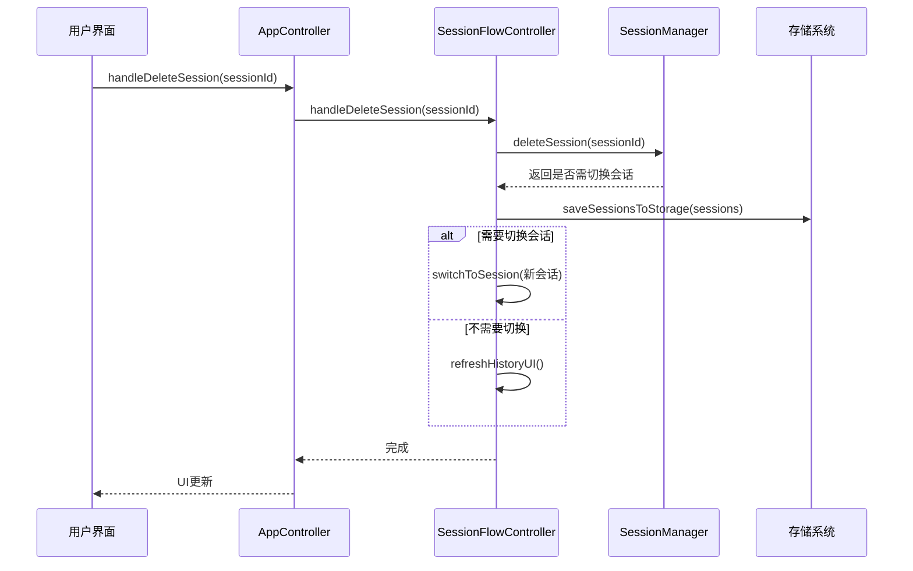
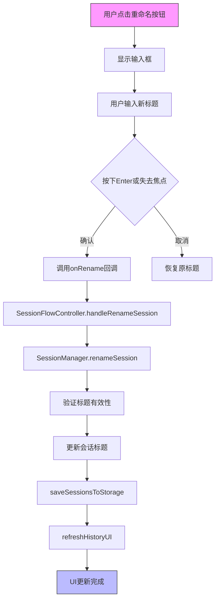
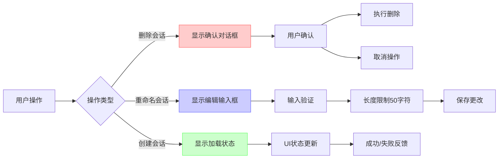
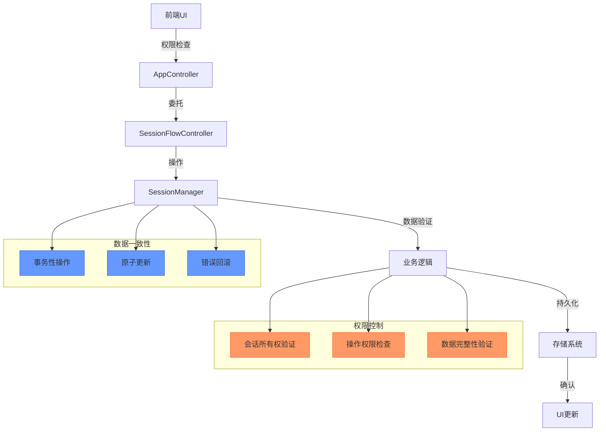

# 用户操作

<cite>
**本文档引用的文件**   
- [session_manager.js](file://background/managers/session_manager.js)
- [app_controller.js](file://sandbox/controllers/app_controller.js)
- [session_flow.js](file://sandbox/controllers/session_flow.js)
- [session_manager.js](file://sandbox/core/session_manager.js)
- [sidebar.js](file://sandbox/ui/sidebar.js)
- [messaging.js](file://lib/messaging.js)
- [session.js](file://background/handlers/session.js)
</cite>

## 目录
1. [会话删除功能实现](#会话删除功能实现)
2. [会话重命名功能实现](#会话重命名功能实现)
3. [会话导出与数据管理](#会话导出与数据管理)
4. [用户交互体验实现](#用户交互体验实现)
5. [权限控制与数据一致性](#权限控制与数据一致性)

## 会话删除功能实现

会话删除功能通过多层控制器委托机制实现，确保UI实时更新和数据一致性。`handleDeleteSession`方法从AppController开始，委托至SessionFlowController执行删除逻辑。



**Diagram sources**
- [app_controller.js](file://sandbox/controllers/app_controller.js#L100-L102)
- [session_flow.js](file://sandbox/controllers/session_flow.js#L81-L93)
- [session_manager.js](file://sandbox/core/session_manager.js#L41-L49)

**Section sources**
- [app_controller.js](file://sandbox/controllers/app_controller.js#L100-L102)
- [session_flow.js](file://sandbox/controllers/session_flow.js#L81-L93)
- [session_manager.js](file://sandbox/core/session_manager.js#L41-L49)

## 会话重命名功能实现

会话重命名功能的实现路径从UI输入事件捕获开始，通过完整的调用链最终调用SessionManager.renameSession方法。



**Diagram sources**
- [sidebar.js](file://sandbox/ui/sidebar.js#L172-L214)
- [session_flow.js](file://sandbox/controllers/session_flow.js#L72-L78)
- [session_manager.js](file://sandbox/core/session_manager.js#L60-L67)

**Section sources**
- [sidebar.js](file://sandbox/ui/sidebar.js#L172-L214)
- [session_flow.js](file://sandbox/controllers/session_flow.js#L72-L78)
- [session_manager.js](file://sandbox/core/session_manager.js#L60-L67)

## 会话导出与数据管理

会话导出功能涉及数据序列化格式、安全考虑和错误处理机制。系统通过消息传递机制与后台通信，确保数据安全。

```mermaid
classDiagram
class SessionManager {
+sessions : Array
+currentSessionId : string
+createSession()
+deleteSession(id)
+renameSession(id, title)
+getSortedSessions()
}
class Messaging {
+sendToBackground(payload)
+saveSessionsToStorage(sessions)
+requestThemeFromStorage()
}
class SessionData {
+id : string
+title : string
+timestamp : number
+messages : Array
+context : object
}
SessionManager --> SessionData : 包含
Messaging --> SessionManager : 数据传递
SessionManager --> Messaging : saveSessionsToStorage
note right of SessionData
数据序列化格式：
- id : UUID格式
- title : 最大50字符
- timestamp : 毫秒时间戳
- messages : 消息数组
- context : Gemini上下文
end note
```

**Diagram sources**
- [session_manager.js](file://sandbox/core/session_manager.js#L5-L105)
- [messaging.js](file://lib/messaging.js#L1-L96)
- [session_manager.js](file://background/managers/session_manager.js#L6-L285)

**Section sources**
- [session_manager.js](file://sandbox/core/session_manager.js#L5-L105)
- [messaging.js](file://lib/messaging.js#L1-L96)

## 用户交互体验实现

系统实现了完整的用户交互体验，包括确认对话框、加载状态反馈和错误提示等UX细节。



**Diagram sources**
- [sidebar.js](file://sandbox/ui/sidebar.js#L231-L233)
- [session_flow.js](file://sandbox/controllers/session_flow.js#L14-L22)
- [app_controller.js](file://sandbox/controllers/app_controller.js#L77-L79)

**Section sources**
- [sidebar.js](file://sandbox/ui/sidebar.js#L231-L233)
- [session_flow.js](file://sandbox/controllers/session_flow.js#L14-L22)

## 权限控制与数据一致性

系统通过多层次的权限控制和数据一致性保障措施，确保用户操作的安全性和可靠性。



**Diagram sources**
- [app_controller.js](file://sandbox/controllers/app_controller.js#L11-L36)
- [session_flow.js](file://sandbox/controllers/session_flow.js#L7-L12)
- [session_manager.js](file://sandbox/core/session_manager.js#L6-L9)

**Section sources**
- [app_controller.js](file://sandbox/controllers/app_controller.js#L11-L36)
- [session_flow.js](file://sandbox/controllers/session_flow.js#L7-L12)
- [session_manager.js](file://sandbox/core/session_manager.js#L6-L9)