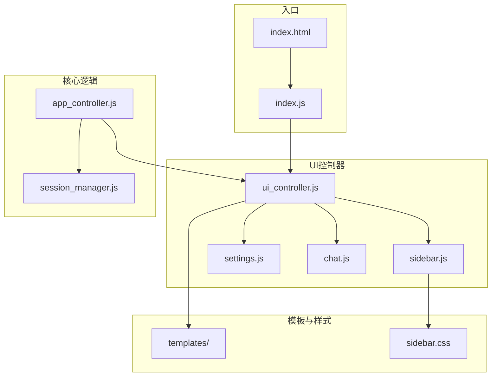
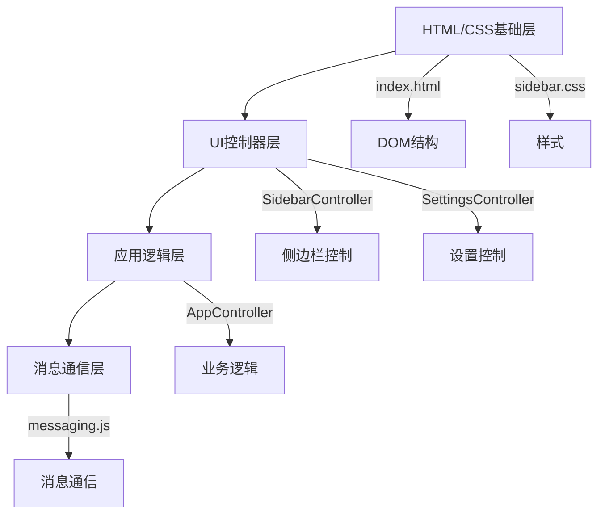
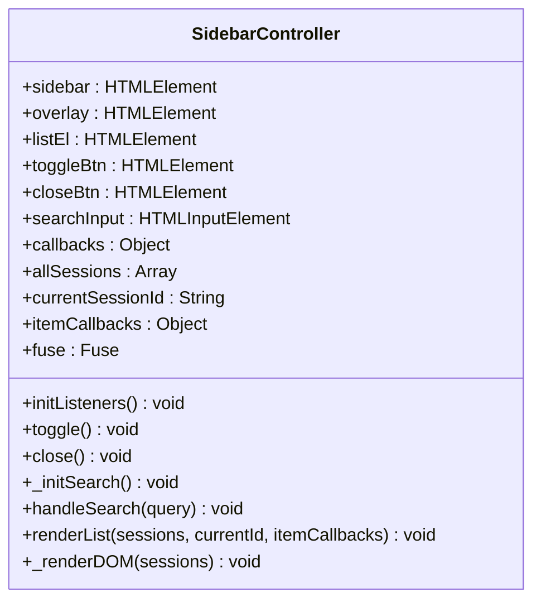
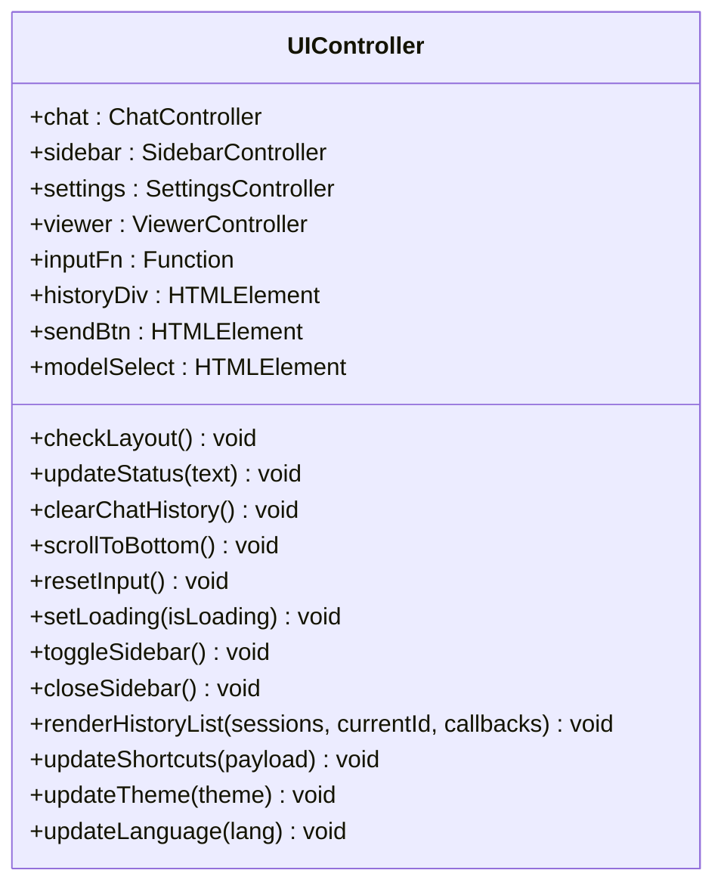
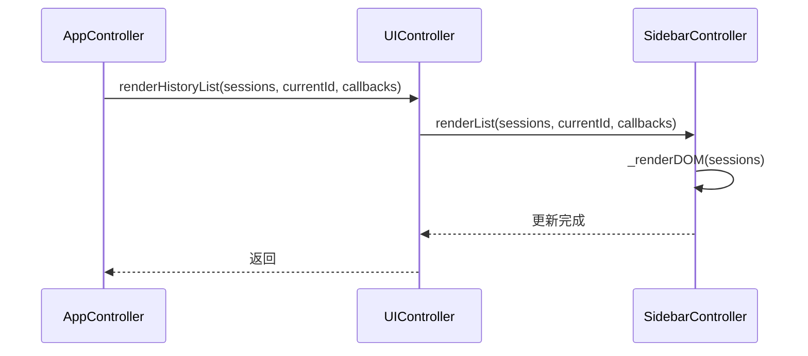
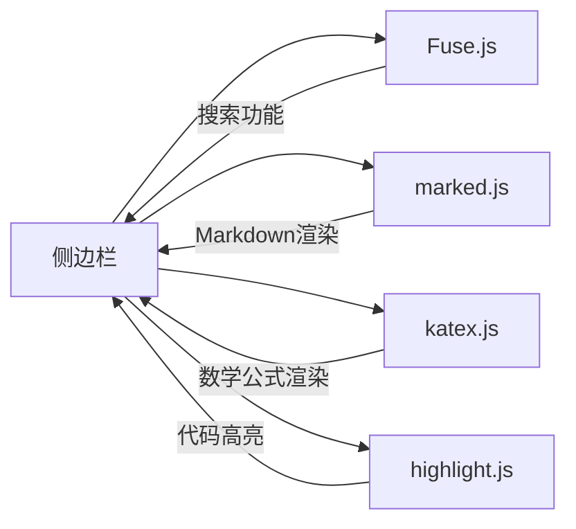

# 侧边栏界面

<cite>
**本文档引用的文件**  
- [index.html](file://sandbox/index.html)
- [sidebar.js](file://sandbox/ui/sidebar.js)
- [ui_controller.js](file://sandbox/ui/ui_controller.js)
- [app_controller.js](file://sandbox/controllers/app_controller.js)
- [sidebar.css](file://css/sidebar.css)
- [settings.js](file://sandbox/ui/settings.js)
- [layout.js](file://sandbox/ui/layout.js)
- [templates.js](file://sandbox/ui/templates.js)
- [sidebar.js](file://sandbox/ui/templates/sidebar.js)
- [i18n.js](file://sandbox/core/i18n.js)
- [app.js](file://sandbox/boot/app.js)
</cite>

## 目录
1. [简介](#简介)
2. [项目结构](#项目结构)
3. [核心组件](#核心组件)
4. [架构概览](#架构概览)
5. [详细组件分析](#详细组件分析)
6. [依赖分析](#依赖分析)
7. [性能考虑](#性能考虑)
8. [故障排除指南](#故障排除指南)
9. [结论](#结论)

## 简介
本文档详细描述了Gemini Nexus侧边栏的整体布局、交互逻辑和生命周期管理。重点说明了`index.html`中的结构设计与sandbox环境的集成方式，解释了`UIController`如何协调`ChatController`、`SidebarController`、`SettingsController`等子控制器实现功能解耦，并阐述了`AppController`与`UIController`之间的通信机制和状态同步策略。文档还提供了侧边栏打开/关闭、宽窄模式切换（layout-wide）的实现细节，以及会话历史渲染、模型选择更新、设置面板联动等核心交互的代码示例。同时讨论了响应式布局适配、可访问性支持和多语言集成方案。

## 项目结构
Gemini Nexus的侧边栏界面主要由`sandbox`目录下的UI组件构成，通过模块化设计实现了清晰的职责分离。`index.html`作为入口文件，加载了必要的CSS和JavaScript资源，并通过`index.js`启动应用。UI组件被组织在`sandbox/ui`目录下，包括`sidebar.js`、`chat.js`、`settings.js`等控制器，以及`templates`目录下的HTML模板。样式文件位于根目录的`css`文件夹中，其中`sidebar.css`专门负责侧边栏的视觉呈现。

**Diagram sources**
- [index.html](file://sandbox/index.html#L1-L28)
- [ui_controller.js](file://sandbox/ui/ui_controller.js#L1-L66)
- [sidebar.js](file://sandbox/ui/sidebar.js#L1-L249)
- [app_controller.js](file://sandbox/controllers/app_controller.js#L1-L207)

**Section sources**
- [index.html](file://sandbox/index.html#L1-L28)
- [sidebar.js](file://sandbox/ui/sidebar.js#L1-L249)
- [ui_controller.js](file://sandbox/ui/ui_controller.js#L1-L66)

## 核心组件
侧边栏的核心组件包括`SidebarController`、`UIController`和`AppController`。`SidebarController`负责管理侧边栏的显示状态、会话历史列表的渲染和搜索功能。`UIController`作为协调者，整合了多个子控制器，提供统一的接口供上层逻辑调用。`AppController`则负责业务逻辑的处理，与背景脚本进行通信，并管理应用的整体状态。

**Section sources**
- [sidebar.js](file://sandbox/ui/sidebar.js#L1-L249)
- [ui_controller.js](file://sandbox/ui/ui_controller.js#L1-L66)
- [app_controller.js](file://sandbox/controllers/app_controller.js#L1-L207)

## 架构概览
Gemini Nexus的侧边栏采用分层架构，从下到上分别为：HTML/CSS基础层、UI控制器层、应用逻辑层和消息通信层。`index.html`定义了基本的DOM结构，`sidebar.css`提供了样式支持。`SidebarController`直接操作DOM元素，实现具体的UI行为。`UIController`封装了`SidebarController`的功能，为`AppController`提供高层API。`AppController`通过消息系统与背景脚本交互，处理用户操作并更新UI状态。

**Diagram sources**
- [index.html](file://sandbox/index.html#L1-L28)
- [sidebar.css](file://css/sidebar.css#L1-L251)
- [sidebar.js](file://sandbox/ui/sidebar.js#L1-L249)
- [settings.js](file://sandbox/ui/settings.js#L1-L249)
- [app_controller.js](file://sandbox/controllers/app_controller.js#L1-L207)

## 详细组件分析

### SidebarController分析
`SidebarController`是侧边栏的核心控制器，负责管理侧边栏的显示状态和会话历史列表。它通过监听按钮点击事件来实现侧边栏的打开和关闭，并利用Fuse.js库提供高效的会话搜索功能。

#### 类图

**Diagram sources**
- [sidebar.js](file://sandbox/ui/sidebar.js#L1-L249)

### UIController分析
`UIController`作为UI层的协调者，整合了`ChatController`、`SidebarController`、`SettingsController`等多个子控制器，实现了功能解耦。它通过构造函数接收DOM元素，并初始化各个子控制器，同时暴露统一的接口供`AppController`调用。

#### 类图

**Diagram sources**
- [ui_controller.js](file://sandbox/ui/ui_controller.js#L1-L66)

### AppController与UIController通信
`AppController`与`UIController`之间通过直接的方法调用进行通信。`AppController`持有`UIController`的实例，并通过调用其暴露的方法来更新UI状态。这种设计模式实现了业务逻辑与UI表现的分离，使得代码更加模块化和可维护。

#### 序列图

**Diagram sources**
- [app_controller.js](file://sandbox/controllers/app_controller.js#L1-L207)
- [ui_controller.js](file://sandbox/ui/ui_controller.js#L1-L66)
- [sidebar.js](file://sandbox/ui/sidebar.js#L1-L249)

**Section sources**
- [app_controller.js](file://sandbox/controllers/app_controller.js#L1-L207)
- [ui_controller.js](file://sandbox/ui/ui_controller.js#L1-L66)

## 依赖分析
侧边栏系统的依赖关系清晰，主要依赖于`Fuse.js`进行会话搜索，`marked.js`和`katex.js`进行内容渲染，以及`highlight.js`进行代码高亮。这些依赖通过`loader.js`在应用启动时异步加载，以优化首屏渲染性能。

**Diagram sources**
- [loader.js](file://sandbox/boot/loader.js#L1-L48)
- [sidebar.js](file://sandbox/ui/sidebar.js#L1-L249)

**Section sources**
- [loader.js](file://sandbox/boot/loader.js#L1-L48)

## 性能考虑
为了优化性能，侧边栏采用了多种策略。首先，通过`theme_init.js`在页面加载初期就应用主题和语言设置，避免了后续的重绘。其次，依赖库被延迟加载，确保了首屏内容的快速呈现。此外，会话搜索功能使用了Fuse.js库，提供了高效的模糊搜索能力，即使在大量会话数据下也能保持流畅的用户体验。

## 故障排除指南
如果侧边栏无法正常显示，首先检查`index.html`中的CSS文件是否正确加载。如果搜索功能失效，确认`fuse.basic.min.js`是否成功加载。对于多语言支持问题，检查`i18n.js`中的翻译键是否正确，并确保`data-i18n`属性在HTML模板中正确使用。

**Section sources**
- [index.html](file://sandbox/index.html#L1-L28)
- [i18n.js](file://sandbox/core/i18n.js#L1-L250)
- [sidebar.js](file://sandbox/ui/sidebar.js#L1-L249)

## 结论
Gemini Nexus的侧边栏界面通过模块化的设计和清晰的分层架构，实现了功能的解耦和代码的可维护性。`UIController`作为协调者，有效地整合了各个子控制器，而`AppController`则负责业务逻辑的处理和状态管理。通过合理的依赖管理和性能优化策略，侧边栏在各种使用场景下都能提供流畅的用户体验。未来可以进一步优化搜索算法，增加更多个性化设置选项，以提升用户满意度。