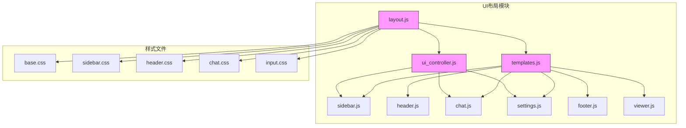
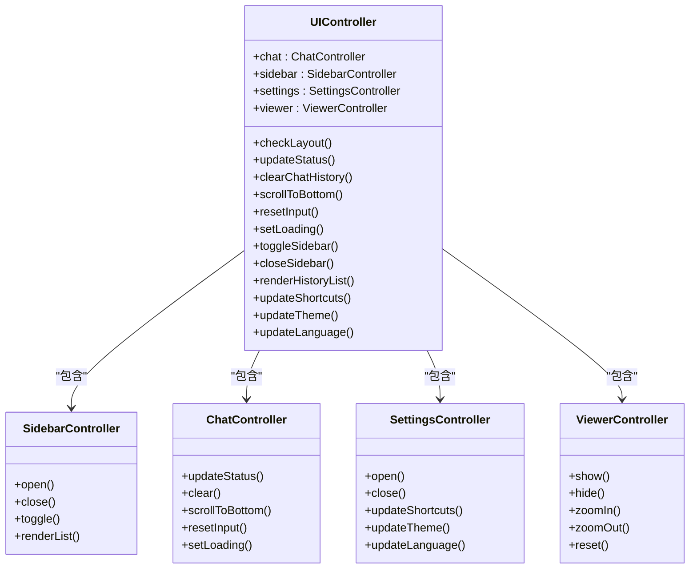
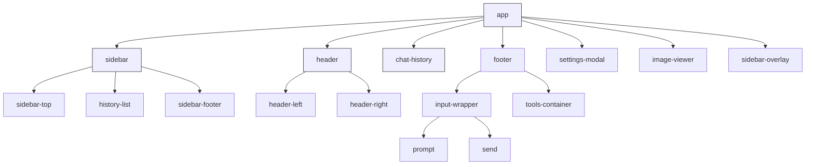
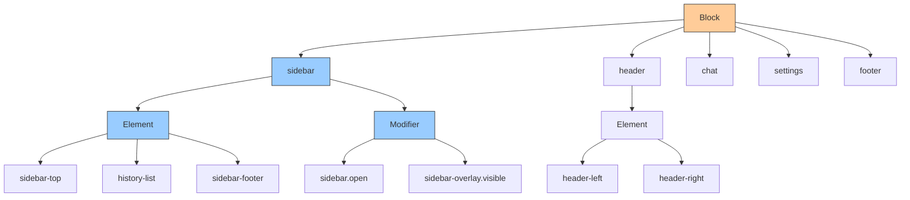
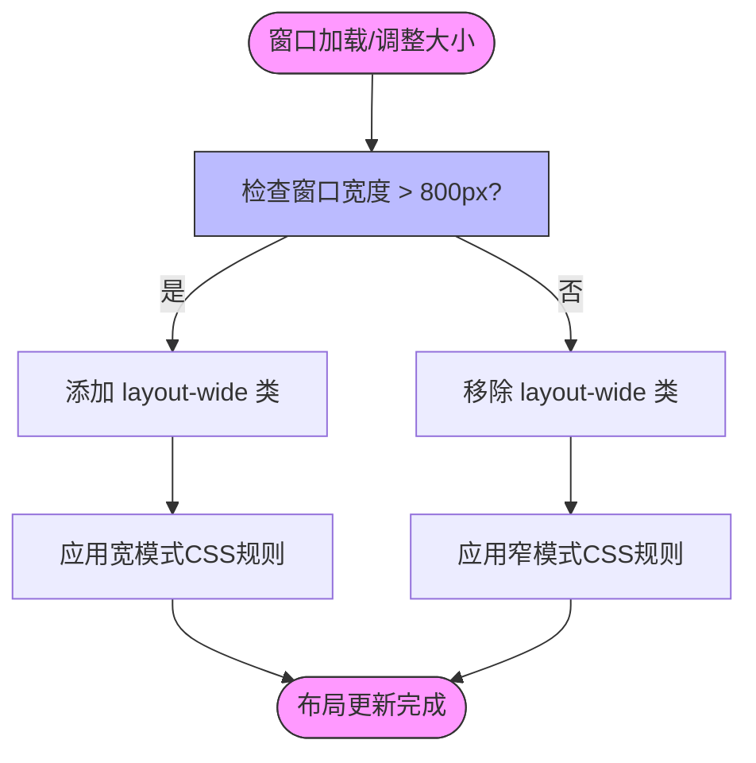
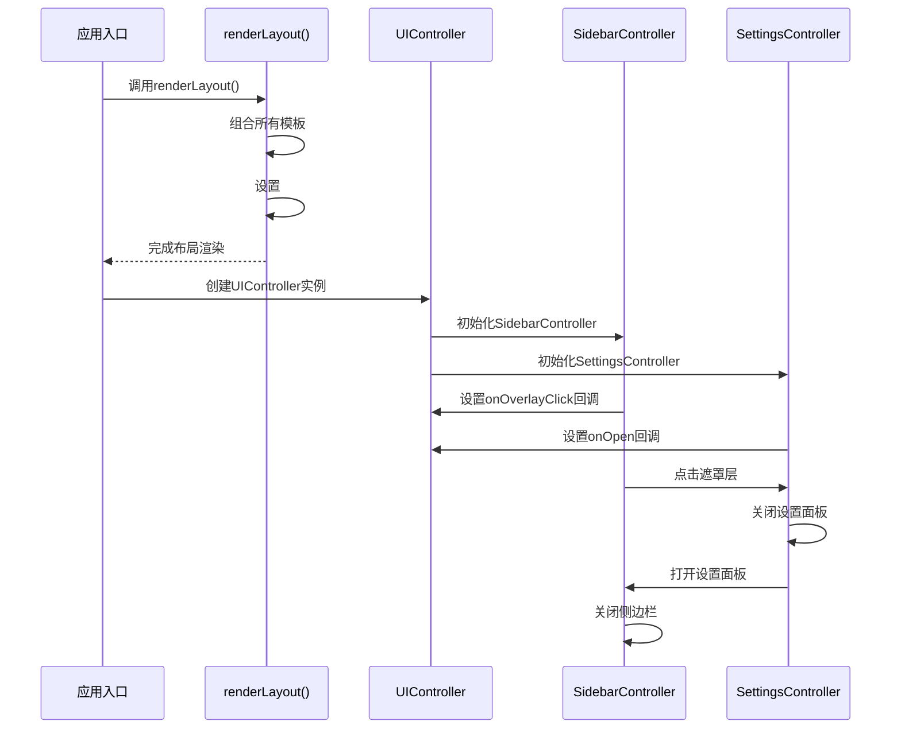
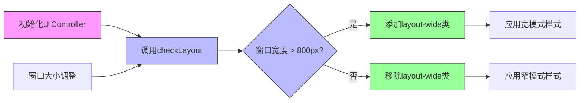
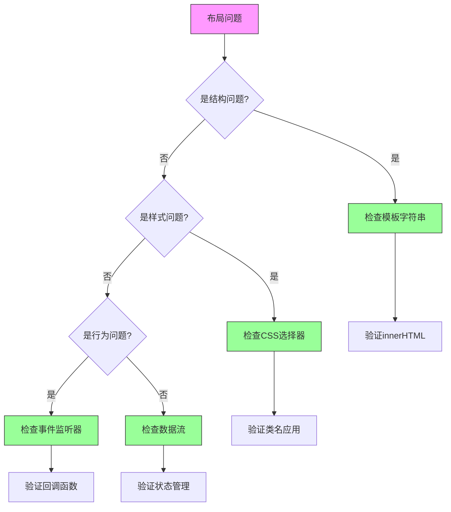
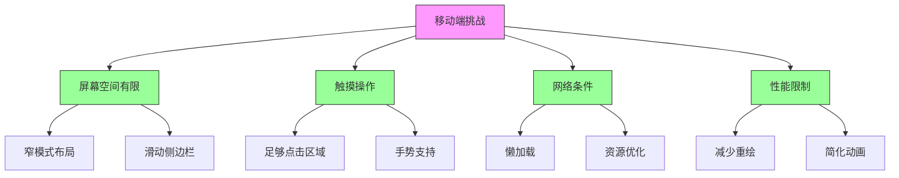

# 布局结构

<cite>
**本文档中引用的文件**  
- [index.html](file://sandbox/index.html)
- [layout.js](file://sandbox/ui/layout.js)
- [ui_controller.js](file://sandbox/ui/ui_controller.js)
- [sidebar.css](file://css/sidebar.css)
- [header.css](file://css/header.css)
- [chat.css](file://css/chat.css)
- [base.css](file://css/base.css)
- [sidebar.js](file://sandbox/ui/templates/sidebar.js)
- [header.js](file://sandbox/ui/templates/header.js)
- [chat.js](file://sandbox/ui/templates/chat.js)
- [settings.js](file://sandbox/ui/templates/settings.js)
- [footer.js](file://sandbox/ui/templates/footer.js)
- [viewer.js](file://sandbox/ui/templates/viewer.js)
- [templates.js](file://sandbox/ui/templates.js)
</cite>

## 目录
1. [项目结构](#项目结构)
2. [核心布局组件](#核心布局组件)
3. [DOM结构设计原则](#dom结构设计原则)
4. [CSS类名约定](#css类名约定)
5. [响应式布局机制](#响应式布局机制)
6. [整体页面框架定义](#整体页面框架定义)
7. [宽窄模式切换实现](#宽窄模式切换实现)
8. [布局调试技巧](#布局调试技巧)
9. [移动端适配挑战](#移动端适配挑战)

## 项目结构

项目采用模块化架构，布局相关代码主要分布在`sandbox/ui/`目录下。核心布局文件包括`layout.js`负责整体结构渲染，`ui_controller.js`管理UI状态，以及`templates/`目录下的各个区域模板文件。CSS样式文件按功能分离在`css/`目录中，包括`base.css`基础样式、`sidebar.css`侧边栏样式等。

**图示来源**  
- [layout.js](file://sandbox/ui/layout.js#L1-L17)
- [templates.js](file://sandbox/ui/templates.js#L1-L10)

**本节来源**  
- [sandbox/](file://sandbox/)
- [css/](file://css/)

## 核心布局组件

系统由多个核心UI组件构成：侧边栏（Sidebar）、头部（Header）、聊天区（Chat）、设置面板（Settings）、底部工具栏（Footer）和图片查看器（Viewer）。这些组件通过模板字符串组合成完整的DOM结构，由`UIController`统一管理状态和交互。

**图示来源**  
- [ui_controller.js](file://sandbox/ui/ui_controller.js#L8-L65)
- [sidebar.js](file://sandbox/ui/sidebar.js)
- [chat.js](file://sandbox/ui/chat.js)
- [settings.js](file://sandbox/ui/settings.js)
- [viewer.js](file://sandbox/ui/viewer.js)

**本节来源**  
- [sandbox/ui/ui_controller.js](file://sandbox/ui/ui_controller.js#L1-L65)
- [sandbox/ui/](file://sandbox/ui/)

## DOM结构设计原则

DOM结构采用语义化标签和模块化设计原则。通过模板字符串在`layout.js`中组合各个区域的HTML结构，确保代码可维护性和可读性。每个主要区域都有明确的ID和语义化类名，如`#history-sidebar`、`.header`、`#chat-history`等。

布局根元素`#app`采用Flexbox布局，允许子元素灵活伸缩。各组件通过语义化的ID和类名进行标识，便于JavaScript操作和CSS样式应用。模板系统将UI结构与逻辑分离，提高了代码的可维护性。

**图示来源**  
- [index.html](file://sandbox/index.html#L24)
- [layout.js](file://sandbox/ui/layout.js#L13)
- [sidebar.js](file://sandbox/ui/templates/sidebar.js#L4)
- [header.js](file://sandbox/ui/templates/header.js#L4)
- [chat.js](file://sandbox/ui/templates/chat.js#L3)
- [footer.js](file://sandbox/ui/templates/footer.js#L4)

**本节来源**  
- [sandbox/ui/layout.js](file://sandbox/ui/layout.js#L12-L16)
- [sandbox/ui/templates/](file://sandbox/ui/templates/)

## CSS类名约定

CSS类名采用BEM（Block Element Modifier）命名规范，确保样式作用域清晰且易于理解。主要布局区域作为Block，其子元素作为Element，状态变化作为Modifier。

例如，`.sidebar`是Block，`.sidebar-top`和`.sidebar-footer`是Element，`.sidebar.open`是Modifier。这种命名方式避免了样式冲突，提高了代码可维护性。颜色和间距等设计变量通过CSS自定义属性（CSS Variables）在`:root`中定义，实现主题切换功能。

**图示来源**  
- [sidebar.css](file://css/sidebar.css#L5-L23)
- [header.css](file://css/header.css#L6-L29)
- [chat.css](file://css/chat.css#L3-L14)
- [base.css](file://css/base.css#L2-L106)

**本节来源**  
- [css/](file://css/)
- [base.css](file://css/base.css#L2-L106)

## 响应式布局机制

响应式布局通过`layout-wide`类实现，该类在窗口宽度超过800px时被添加到`body`元素上。这一机制允许在不同屏幕尺寸下应用不同的样式规则，优化用户体验。

在CSS中，通过`body.layout-wide`选择器覆盖默认样式，调整各组件的布局和尺寸。例如，宽模式下侧边栏始终显示，而窄模式下侧边栏以滑动方式出现。这种设计既保证了大屏幕上的信息密度，又确保了小屏幕上的可用性。

**图示来源**  
- [ui_controller.js](file://sandbox/ui/ui_controller.js#L35-L43)
- [sidebar.css](file://css/sidebar.css#L26-L33)
- [header.css](file://css/header.css#L20-L26)
- [chat.css](file://css/chat.css#L17-L29)

**本节来源**  
- [sandbox/ui/ui_controller.js](file://sandbox/ui/ui_controller.js#L31-L43)
- [css/](file://css/)

## 整体页面框架定义

整体页面框架由`sandbox/ui/layout.js`中的`renderLayout`函数定义，该函数将各个模板组合并注入到`#app`容器中。框架包括六个主要区域：侧边栏、头部、聊天区、底部工具栏、设置面板和图片查看器。

`UIController`作为中央控制器，初始化各个子控制器并协调它们之间的交互。例如，打开设置面板时会自动关闭侧边栏，点击侧边栏遮罩层会关闭设置面板。这种集成方式确保了UI状态的一致性和用户体验的连贯性。

**图示来源**  
- [layout.js](file://sandbox/ui/layout.js#L12-L16)
- [ui_controller.js](file://sandbox/ui/ui_controller.js#L8-L30)
- [sidebar.js](file://sandbox/ui/sidebar.js)
- [settings.js](file://sandbox/ui/settings.js)

**本节来源**  
- [sandbox/ui/layout.js](file://sandbox/ui/layout.js#L12-L16)
- [sandbox/ui/ui_controller.js](file://sandbox/ui/ui_controller.js#L8-L30)

## 宽窄模式切换实现

宽窄模式切换的实现逻辑基于窗口宽度的实时检测。`UIController`在构造时调用`checkLayout`方法，并监听`window.resize`事件。当窗口宽度超过800px时，添加`layout-wide`类；否则移除该类。

800px的断点设计考虑了移动设备和桌面设备的典型屏幕尺寸。大多数手机屏幕宽度小于800px，而平板和桌面设备通常大于此值。这种设计确保了在移动设备上采用节省空间的窄模式，在大屏幕上则使用信息更丰富的宽模式。

**图示来源**  
- [ui_controller.js](file://sandbox/ui/ui_controller.js#L31-L43)
- [sidebar.css](file://css/sidebar.css#L26-L29)
- [header.css](file://css/header.css#L20-L22)

**本节来源**  
- [sandbox/ui/ui_controller.js](file://sandbox/ui/ui_controller.js#L31-L43)
- [css/](file://css/)

## 布局调试技巧

布局调试应从结构、样式和行为三个层面进行。首先检查DOM结构是否正确生成，确保所有ID和类名符合预期。然后验证CSS样式是否正确应用，特别是响应式规则和主题变量。

使用浏览器开发者工具的设备模拟功能测试不同屏幕尺寸下的布局表现。在控制台中手动添加或移除`layout-wide`类，快速验证宽窄模式的样式差异。检查`UIController`的实例化过程，确保所有子控制器正确初始化并建立适当的回调关系。

**图示来源**  
- [layout.js](file://sandbox/ui/layout.js#L15)
- [ui_controller.js](file://sandbox/ui/ui_controller.js#L32)
- [sidebar.css](file://css/sidebar.css)
- [header.css](file://css/header.css)

**本节来源**  
- [sandbox/ui/](file://sandbox/ui/)
- [css/](file://css/)

## 移动端适配挑战

移动端适配面临屏幕空间有限、触摸操作和网络条件等挑战。本系统通过窄模式优化小屏幕体验，侧边栏采用滑动进入方式，避免遮挡主要内容。CSS媒体查询进一步优化了移动设备的显示效果。

触摸操作方面，确保所有交互元素有足够的点击区域，符合移动设备的触摸习惯。图片查看器支持手势缩放和拖拽，提供良好的移动浏览体验。性能方面，采用懒加载策略，优先渲染关键内容，提升移动设备上的加载速度。

**图示来源**  
- [sidebar.css](file://css/sidebar.css#L246-L251)
- [chat.css](file://css/chat.css#L398-L403)
- [ui_controller.js](file://sandbox/ui/ui_controller.js)
- [layout.js](file://sandbox/ui/layout.js)

**本节来源**  
- [css/](file://css/)
- [sandbox/ui/](file://sandbox/ui/)