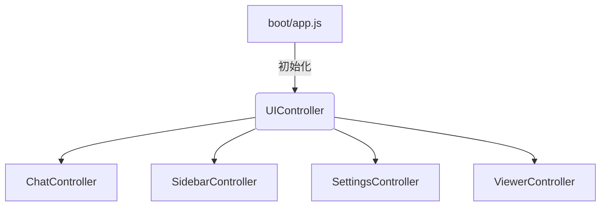
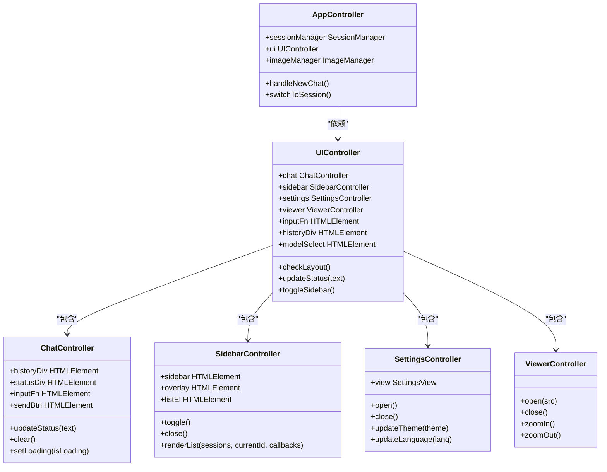
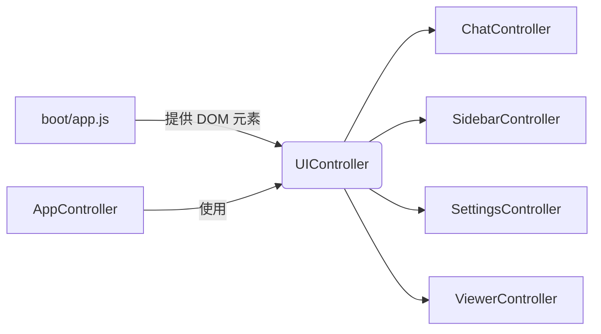

# UI控制器

<cite>
**本文档中引用的文件**  
- [ui_controller.js](file://sandbox/ui/ui_controller.js)
- [chat.js](file://sandbox/ui/chat.js)
- [sidebar.js](file://sandbox/ui/sidebar.js)
- [settings.js](file://sandbox/ui/settings.js)
- [viewer.js](file://sandbox/ui/viewer.js)
- [app_controller.js](file://sandbox/controllers/app_controller.js)
- [message_handler.js](file://sandbox/controllers/message_handler.js)
- [boot/app.js](file://sandbox/boot/app.js)
- [layout.js](file://sandbox/ui/layout.js)
- [templates.js](file://sandbox/ui/templates.js)
- [sidebar.js](file://sandbox/ui/templates/sidebar.js)
</cite>

## 目录
1. [简介](#简介)
2. [项目结构](#项目结构)
3. [核心组件](#核心组件)
4. [架构概述](#架构概述)
5. [详细组件分析](#详细组件分析)
6. [依赖分析](#依赖分析)
7. [性能考虑](#性能考虑)
8. [故障排除指南](#故障排除指南)
9. [结论](#结论)

## 简介
UIController 是整个用户界面的核心协调者，负责初始化和管理多个子控制器，协调它们之间的交互，并为上层控制器（如 AppController）提供统一的接口。它采用外观模式（Facade Pattern），封装了复杂的 UI 子系统，使外部调用更加简洁。该控制器还负责响应式布局的管理、公共属性的暴露以及 UI 组件生命周期的协调。

## 项目结构
UIController 位于 `sandbox/ui/` 目录下，是整个 UI 层的入口点。它依赖于 `chat.js`、`sidebar.js`、`settings.js` 和 `viewer.js` 四个子控制器来管理具体的 UI 功能模块。其初始化由 `sandbox/boot/app.js` 中的 `initAppMode` 函数触发，该函数在应用启动时动态导入并实例化 UIController。



**图源**
- [app.js](file://sandbox/boot/app.js#L11-L90)
- [ui_controller.js](file://sandbox/ui/ui_controller.js#L8-L65)

**节源**
- [app.js](file://sandbox/boot/app.js#L11-L90)
- [ui_controller.js](file://sandbox/ui/ui_controller.js#L8-L65)

## 核心组件
UIController 的核心职责是作为外观模式的实现，统一管理四个子控制器：ChatController、SidebarController、SettingsController 和 ViewerController。它在构造函数中接收一个包含 DOM 元素的 `elements` 对象，并将这些元素传递给相应的子控制器进行初始化。同时，它将自身的一些方法代理给子控制器，并暴露关键的 DOM 引用给外部使用。

**节源**
- [ui_controller.js](file://sandbox/ui/ui_controller.js#L8-L65)

## 架构概述
UIController 的架构设计体现了分层和解耦的思想。它位于 UI 层的顶层，其下是四个职责分明的子控制器。AppController 作为业务逻辑的中心，通过 UIController 与整个 UI 层进行交互，而无需直接了解底层子控制器的细节。这种设计极大地降低了系统的耦合度。



**图源**
- [ui_controller.js](file://sandbox/ui/ui_controller.js#L8-L65)
- [app_controller.js](file://sandbox/controllers/app_controller.js#L10-L206)

## 详细组件分析
### UIController 分析
UIController 通过其构造函数完成对子控制器的初始化和自身功能的设置。

#### 构造函数与子控制器初始化
在构造函数中，UIController 接收一个 `elements` 对象，该对象包含了所有必要的 DOM 元素引用。它使用这些引用来创建四个子控制器的实例：
- **ChatController**: 传入 `elements` 以管理聊天历史、输入框和状态栏。
- **SidebarController**: 传入 `elements` 和一个回调函数 `onOverlayClick`，该回调在侧边栏遮罩层被点击时触发，用于关闭设置面板。
- **SettingsController**: 以自包含的方式管理其 DOM，仅传入一个 `onOpen` 回调，用于在打开设置时关闭侧边栏。
- **ViewerController**: 完全独立，不依赖外部传入的元素。

这种初始化方式确保了每个子控制器都能获得其工作所需的资源，同时通过回调函数实现了控制器间的松耦合通信。

**节源**
- [ui_controller.js](file://sandbox/ui/ui_controller.js#L9-L22)

#### 响应式布局管理
`checkLayout()` 方法是实现响应式设计的关键。它通过检查 `window.innerWidth` 的值来判断当前视口是否为宽屏模式（大于 800px）。如果是，则向 `document.body` 添加 `layout-wide` CSS 类；否则，移除该类。这个 CSS 类的切换会触发样式变化，从而实现不同的布局。该方法在构造函数中被立即调用一次以设置初始布局，并通过 `window.addEventListener('resize', ...)` 注册了一个事件监听器，确保在窗口大小改变时能动态更新布局。

```mermaid
flowchart TD
Start([checkLayout()]) --> CheckWidth{"window.innerWidth > 800?"}
CheckWidth --> |是| AddClass["document.body.classList.add('layout-wide')"]
CheckWidth --> |否| RemoveClass["document.body.classList.remove('layout-wide')"]
AddClass --> End([布局更新])
RemoveClass --> End
```

**图源**
- [ui_controller.js](file://sandbox/ui/ui_controller.js#L35-L43)

**节源**
- [ui_controller.js](file://sandbox/ui/ui_controller.js#L30-L43)

#### 外观模式与代理方法
UIController 充当了外观模式的角色，它将外部对子控制器的调用进行封装和代理。例如：
- `updateStatus(text)` 方法直接调用 `this.chat.updateStatus(text)`。
- `toggleSidebar()` 方法直接调用 `this.sidebar.toggle()`。
- `updateTheme(theme)` 方法直接调用 `this.settings.updateTheme(theme)`。

这种方式使得 AppController 或其他上层模块只需与 UIController 一个对象交互，而无需知道具体的子控制器实现，简化了调用逻辑。

**节源**
- [ui_controller.js](file://sandbox/ui/ui_controller.js#L47-L64)

#### 公共属性暴露
UIController 将一些关键的 DOM 元素引用作为公共属性暴露出来，供 AppController 和 MessageHandler 使用：
- `this.inputFn = this.chat.inputFn`: 暴露输入框元素，用于直接操作输入内容。
- `this.historyDiv = this.chat.historyDiv`: 暴露聊天历史容器，用于渲染消息。
- `this.sendBtn = this.chat.sendBtn`: 暴露发送按钮，用于控制其状态。
- `this.modelSelect = elements.modelSelect`: 暴露模型选择下拉框，用于读取和设置当前模型。

这些属性的暴露使得上层逻辑可以高效地访问 UI 元素，而无需穿透多层对象。

**节源**
- [ui_controller.js](file://sandbox/ui/ui_controller.js#L25-L28)

### 子控制器分析
#### ChatController
负责管理聊天界面的核心功能，包括消息的渲染、输入框的自动调整、代码块的复制以及发送按钮在加载状态下的切换。

**节源**
- [chat.js](file://sandbox/ui/chat.js#L6-L119)

#### SidebarController
管理侧边栏的显示、隐藏、历史会话列表的渲染以及搜索功能。它通过事件监听器处理按钮点击和遮罩层点击。

**节源**
- [sidebar.js](file://sandbox/ui/sidebar.js#L5-L248)

#### SettingsController
管理设置面板的打开、关闭以及各种设置项（主题、语言、快捷键等）的更新。它通过 `SettingsView` 来处理 UI 渲染。

**节源**
- [settings.js](file://sandbox/ui/settings.js#L8-L248)

#### ViewerController
提供一个独立的图片查看器，支持缩放、平移和下载功能。它通过监听全局事件 `gemini-view-image` 来触发图片的打开。

**节源**
- [viewer.js](file://sandbox/ui/viewer.js#L4-L170)

## 依赖分析
UIController 的依赖关系清晰明了。它直接依赖于四个子控制器的类定义（通过 ES6 模块导入），并在运行时依赖于由 `boot/app.js` 提供的 DOM 元素。其上层依赖是 AppController，后者在初始化时创建 UIController 的实例。这种依赖注入的方式使得代码更加模块化和可测试。



**图源**
- [ui_controller.js](file://sandbox/ui/ui_controller.js#L3-L6)
- [app.js](file://sandbox/boot/app.js#L51-L62)

## 性能考虑
UIController 本身不包含复杂的计算逻辑，其性能开销主要在于事件监听器的注册。`resize` 事件监听器可能会在窗口调整大小时频繁触发，但 `checkLayout()` 方法的实现非常轻量，只进行一次 DOM 类名的增减操作，因此性能影响极小。通过将复杂的 UI 逻辑下放到子控制器，UIController 保持了轻量和高效。

## 故障排除指南
- **问题：侧边栏或设置面板无法打开/关闭。**
  - 检查 `boot/app.js` 中传入的 DOM 元素（如 `sidebar`, `settings-btn`）是否正确，确保它们在 `renderLayout()` 执行后存在于 DOM 中。
- **问题：响应式布局未生效。**
  - 检查 `layout-wide` CSS 类是否在 `css/` 目录下的样式文件中有定义。
- **问题：代理方法调用失败。**
  - 确认子控制器的实例化是否成功，检查构造函数中传入的 `elements` 对象是否包含子控制器所需的所有元素。

**节源**
- [ui_controller.js](file://sandbox/ui/ui_controller.js#L9-L22)
- [layout.js](file://sandbox/ui/layout.js#L12-L16)

## 结论
UIController 是一个设计精良的外观控制器，它有效地协调了多个 UI 子模块，为上层应用逻辑提供了一个简洁、统一的接口。其通过代理模式、回调函数和公共属性暴露，实现了模块间的松耦合和高内聚。对响应式布局的支持和清晰的依赖关系，使得整个 UI 系统既灵活又易于维护。