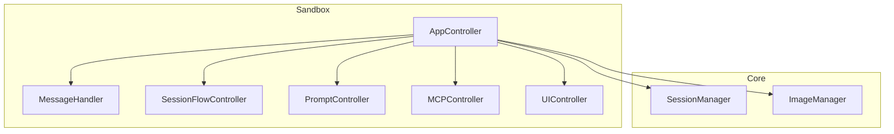
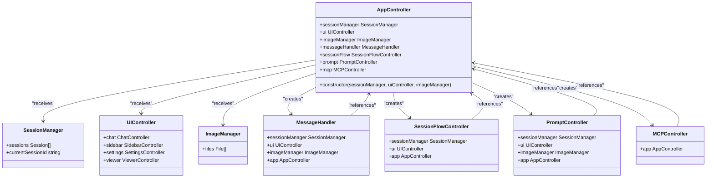
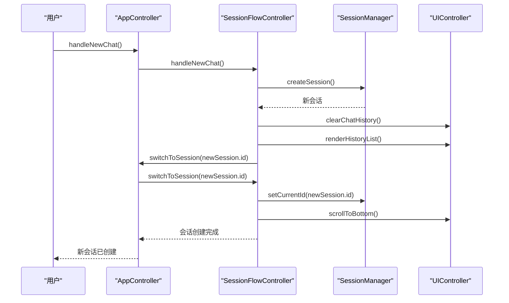
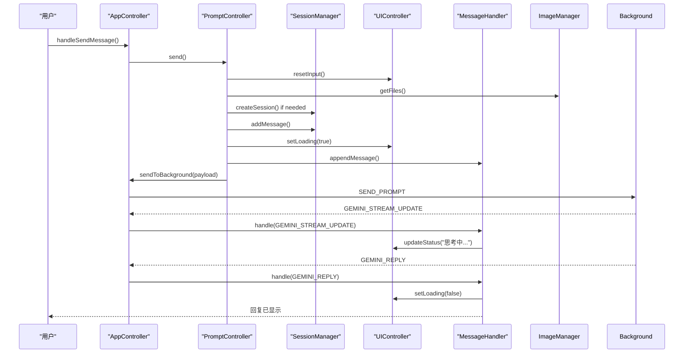
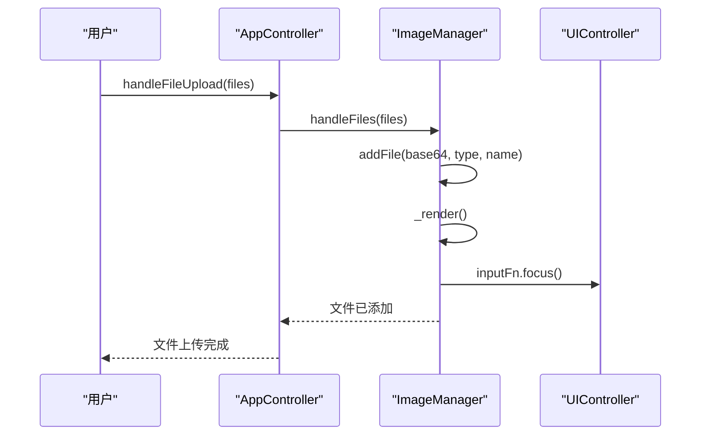
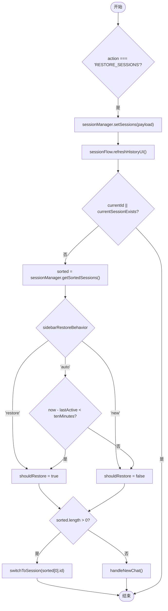
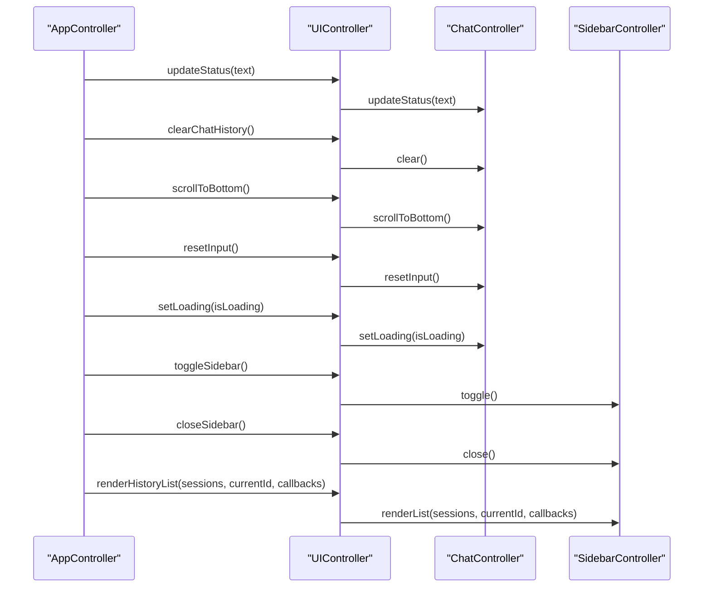
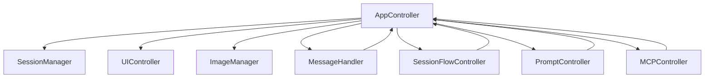

# 应用控制器

<cite>
**本文档中引用的文件**  
- [app_controller.js](file://sandbox/controllers/app_controller.js)
- [message_handler.js](file://sandbox/controllers/message_handler.js)
- [session_flow.js](file://sandbox/controllers/session_flow.js)
- [prompt.js](file://sandbox/controllers/prompt.js)
- [mcp_controller.js](file://sandbox/controllers/mcp_controller.js)
- [ui_controller.js](file://sandbox/ui/ui_controller.js)
- [session_manager.js](file://sandbox/core/session_manager.js)
- [image_manager.js](file://sandbox/core/image_manager.js)
- [app.js](file://sandbox/boot/app.js)
- [messaging.js](file://lib/messaging.js)
</cite>

## 目录
1. [简介](#简介)
2. [项目结构](#项目结构)
3. [核心组件](#核心组件)
4. [架构概述](#架构概述)
5. [详细组件分析](#详细组件分析)
6. [依赖分析](#依赖分析)
7. [性能考虑](#性能考虑)
8. [故障排除指南](#故障排除指南)
9. [结论](#结论)

## 简介
`AppController` 是沙箱环境中的核心业务逻辑协调者，负责协调会话管理、用户输入处理、状态切换和文件上传等关键功能。它通过依赖注入模式接收 `SessionManager`、`UIController` 和 `ImageManager` 实例，并据此初始化多个子控制器，如 `MessageHandler`、`SessionFlowController`、`PromptController` 和 `MCPController`。作为中央调度器，`AppController` 处理来自用户界面和后台脚本的事件，确保整个应用的状态一致性和功能完整性。

## 项目结构
项目结构清晰地划分了不同功能模块，主要包括 `background`（后台处理）、`content`（内容脚本）、`sandbox`（沙箱环境）、`services`（服务接口）等目录。`sandbox` 目录下的 `controllers` 子目录包含了 `AppController` 及其相关子控制器的实现。



**图示来源**
- [app_controller.js](file://sandbox/controllers/app_controller.js#L11-L36)
- [ui_controller.js](file://sandbox/ui/ui_controller.js#L8-L23)
- [session_manager.js](file://sandbox/core/session_manager.js#L5-L9)
- [image_manager.js](file://sandbox/core/image_manager.js#L4-L15)

**章节来源**
- [app_controller.js](file://sandbox/controllers/app_controller.js#L1-L207)
- [project_structure](file://project_structure#L1-L100)

## 核心组件
`AppController` 的核心在于其作为中央协调者的角色，通过构造函数接收依赖并初始化子控制器，体现了依赖注入设计模式。它负责处理会话管理、用户输入、状态切换和文件上传等关键操作。

**章节来源**
- [app_controller.js](file://sandbox/controllers/app_controller.js#L10-L36)
- [app.js](file://sandbox/boot/app.js#L78-L87)

## 架构概述
`AppController` 作为沙箱环境的核心，通过依赖注入模式整合了多个管理器和控制器，形成了一个层次分明的架构。它不仅协调了UI与后台之间的通信，还管理了会话、提示、MCP工具等复杂业务逻辑。

```mermaid
classDiagram
class AppController {
+sessionManager SessionManager
+ui UIController
+imageManager ImageManager
+messageHandler MessageHandler
+sessionFlow SessionFlowController
+prompt PromptController
+mcp MCPController
+constructor(sessionManager, uiController, imageManager)
+handleNewChat()
+switchToSession(sessionId)
+handleSendMessage()
+handleCancel()
+handleIncomingMessage(event)
+handleFileUpload(files)
}
class SessionManager {
+sessions Session[]
+currentSessionId string
+createSession()
+setSessions(sessions)
+getCurrentSession()
+getSortedSessions()
+setCurrentId(id)
+deleteSession(id)
+updateTitle(id, text)
+renameSession(id, newTitle)
+addMessage(id, role, text, attachment, thoughts, model)
+updateContext(id, context)
}
class UIController {
+chat ChatController
+sidebar SidebarController
+settings SettingsController
+viewer ViewerController
+inputFn HTMLInputElement
+historyDiv HTMLDivElement
+sendBtn HTMLButtonElement
+modelSelect HTMLSelectElement
+constructor(elements)
+updateStatus(text)
+clearChatHistory()
+scrollToBottom()
+resetInput()
+setLoading(isLoading)
+toggleSidebar()
+closeSidebar()
+renderHistoryList(sessions, currentId, callbacks)
+updateShortcuts(payload)
+updateTheme(theme)
+updateLanguage(lang)
}
class ImageManager {
+imageInput HTMLInputElement
+imagePreview HTMLDivElement
+inputWrapper HTMLElement
+inputFn HTMLInputElement
+files File[]
+constructor(elements, callbacks)
+initListeners()
+handleFile(file)
+setFile(base64, type, name)
+addFile(base64, type, name)
+removeFile(index)
+clearFile()
+getFiles()
+getFileData()
+_render()
}
class MessageHandler {
+sessionManager SessionManager
+ui UIController
+imageManager ImageManager
+app AppController
+streamingBubble MessageBubble
+constructor(sessionManager, uiController, imageManager, appController)
+handle(request)
+handleStreamUpdate(request)
+handleGeminiReply(request)
+handleImageResult(request)
+handleGeneratedImageResult(request)
+handleCropResult(request)
+handleSelectionResult(request)
+resetStream()
}
class SessionFlowController {
+sessionManager SessionManager
+ui UIController
+app AppController
+constructor(sessionManager, uiController, appController)
+handleNewChat()
+switchToSession(sessionId)
+refreshHistoryUI()
+handleRenameSession(sessionId, newTitle)
+handleDeleteSession(sessionId)
}
class PromptController {
+sessionManager SessionManager
+ui UIController
+imageManager ImageManager
+app AppController
+constructor(sessionManager, uiController, imageManager, appController)
+send()
+executePrompt(text, files, options)
+cancel()
}
class MCPController {
+app AppController
+selectedMcpIds Set~string~
+mcpServers Map~string, ServerInfo~
+mcpPicker HTMLElement
+mcpServerList HTMLElement
+mcpTagsContainer HTMLElement
+actionMcpBtn HTMLElement
+actionMenu HTMLElement
+constructor(appController)
+initElements()
+initListeners()
+togglePicker()
+openPicker()
+closePicker()
+requestMcpStatus()
+handleMcpStatus(servers)
+renderServerList()
+toggleMcpSelection(mcpId)
+selectMcp(mcpId)
+deselectMcp(mcpId)
+updateTagsUI()
+getSelectedMcpIds()
+hasMcpSelected()
+clearSelections()
+escapeHtml(text)
}
AppController --> SessionManager : "uses"
AppController --> UIController : "uses"
AppController --> ImageManager : "uses"
AppController --> MessageHandler : "creates"
AppController --> SessionFlowController : "creates"
AppController --> PromptController : "creates"
AppController --> MCPController : "creates"
MessageHandler --> AppController : "references"
SessionFlowController --> AppController : "references"
PromptController --> AppController : "references"
MCPController --> AppController : "references"
```



**图示来源**
- [app_controller.js](file://sandbox/controllers/app_controller.js#L10-L36)
- [session_manager.js](file://sandbox/core/session_manager.js#L5-L105)
- [ui_controller.js](file://sandbox/ui/ui_controller.js#L8-L66)
- [image_manager.js](file://sandbox/core/image_manager.js#L4-L281)
- [message_handler.js](file://sandbox/controllers/message_handler.js#L8-L365)
- [session_flow.js](file://sandbox/controllers/session_flow.js#L7-L96)
- [prompt.js](file://sandbox/controllers/prompt.js#L7-L117)
- [mcp_controller.js](file://sandbox/controllers/mcp_controller.js#L5-L221)

**章节来源**
- [app_controller.js](file://sandbox/controllers/app_controller.js#L1-L207)
- [session_manager.js](file://sandbox/core/session_manager.js#L1-L105)
- [ui_controller.js](file://sandbox/ui/ui_controller.js#L1-L66)
- [image_manager.js](file://sandbox/core/image_manager.js#L1-L281)

## 详细组件分析

### AppController 分析
`AppController` 是沙箱环境的核心业务逻辑协调者，负责初始化和协调多个子控制器，处理用户交互和系统事件。

#### 构造函数与依赖注入
`AppController` 的构造函数接收 `SessionManager`、`UIController` 和 `ImageManager` 三个依赖实例，并据此初始化 `MessageHandler`、`SessionFlowController`、`PromptController` 和 `MCPController` 四个子控制器。这种设计模式体现了依赖注入，使得组件之间的耦合度降低，便于测试和维护。



**图示来源**
- [app_controller.js](file://sandbox/controllers/app_controller.js#L11-L36)

**章节来源**
- [app_controller.js](file://sandbox/controllers/app_controller.js#L10-L36)

#### 中央调度职责
`AppController` 作为中央调度器，承担了多项关键职责，包括会话管理、用户输入处理、状态切换和文件上传。

##### 会话管理
`AppController` 通过 `handleNewChat` 和 `switchToSession` 方法管理会话的创建和切换。这些方法委托给 `SessionFlowController` 进行具体实现。



**图示来源**
- [app_controller.js](file://sandbox/controllers/app_controller.js#L77-L83)
- [session_flow.js](file://sandbox/controllers/session_flow.js#L14-L22)

**章节来源**
- [app_controller.js](file://sandbox/controllers/app_controller.js#L77-L83)
- [session_flow.js](file://sandbox/controllers/session_flow.js#L14-L22)

##### 用户输入处理
`AppController` 通过 `handleSendMessage` 和 `handleCancel` 方法处理用户的发送和取消操作。这些方法委托给 `PromptController` 进行具体实现。



**图示来源**
- [app_controller.js](file://sandbox/controllers/app_controller.js#L123-L125)
- [prompt.js](file://sandbox/controllers/prompt.js#L15-L117)

**章节来源**
- [app_controller.js](file://sandbox/controllers/app_controller.js#L123-L125)
- [prompt.js](file://sandbox/controllers/prompt.js#L15-L117)

##### 状态切换
`AppController` 通过 `togglePageContext` 和 `toggleBrowserControl` 方法管理页面上下文和浏览器控制的状态切换。

```mermaid
flowchart TD
Start([开始]) --> TogglePageContext["togglePageContext()"]
TogglePageContext --> UpdatePageContextActive["pageContextActive = !pageContextActive"]
UpdatePageContextActive --> UpdateUI["ui.chat.togglePageContext(pageContextActive)"]
UpdateUI --> CheckPageContextActive{"pageContextActive?"}
CheckPageContextActive --> |是| UpdateStatus["ui.updateStatus(t('pageContextEnabled'))"]
UpdateStatus --> SetTimeout["setTimeout(() => { if (!isGenerating) ui.updateStatus(""); }, 2000)"]
SetTimeout --> End([结束])
CheckPageContextActive --> |否| End
```

**图示来源**
- [app_controller.js](file://sandbox/controllers/app_controller.js#L42-L50)

**章节来源**
- [app_controller.js](file://sandbox/controllers/app_controller.js#L42-L50)

##### 文件上传
`AppController` 通过 `handleFileUpload` 方法处理文件上传，该方法委托给 `ImageManager` 进行具体实现。



**图示来源**
- [app_controller.js](file://sandbox/controllers/app_controller.js#L200-L202)
- [image_manager.js](file://sandbox/core/image_manager.js#L206-L214)

**章节来源**
- [app_controller.js](file://sandbox/controllers/app_controller.js#L200-L202)
- [image_manager.js](file://sandbox/core/image_manager.js#L206-L214)

### 事件处理器分析
`AppController` 的 `handleIncomingMessage` 方法是处理跨上下文消息的核心，特别是会话自动恢复逻辑的实现。

#### 会话自动恢复逻辑
`handleIncomingMessage` 方法处理 `RESTORE_SESSIONS` 和 `BACKGROUND_MESSAGE` 等跨上下文消息，特别是会话自动恢复逻辑（auto/restore/new行为模式）的实现细节。



**图示来源**
- [app_controller.js](file://sandbox/controllers/app_controller.js#L139-L174)

**章节来源**
- [app_controller.js](file://sandbox/controllers/app_controller.js#L139-L174)

#### 与UIController的协作关系
`AppController` 通过 `this.ui` 访问UI状态和触发UI更新，与 `UIController` 密切协作。



**图示来源**
- [app_controller.js](file://sandbox/controllers/app_controller.js#L44-L48)
- [ui_controller.js](file://sandbox/ui/ui_controller.js#L48-L65)

**章节来源**
- [app_controller.js](file://sandbox/controllers/app_controller.js#L44-L48)
- [ui_controller.js](file://sandbox/ui/ui_controller.js#L48-L65)

## 依赖分析
`AppController` 依赖于 `SessionManager`、`UIController` 和 `ImageManager`，并通过这些依赖初始化多个子控制器。这种设计模式降低了组件间的耦合度，提高了代码的可维护性和可测试性。



**图示来源**
- [app_controller.js](file://sandbox/controllers/app_controller.js#L11-L36)
- [message_handler.js](file://sandbox/controllers/message_handler.js#L9-L13)
- [session_flow.js](file://sandbox/controllers/session_flow.js#L8-L12)
- [prompt.js](file://sandbox/controllers/prompt.js#L8-L13)
- [mcp_controller.js](file://sandbox/controllers/mcp_controller.js#L6-L8)

**章节来源**
- [app_controller.js](file://sandbox/controllers/app_controller.js#L1-L207)
- [message_handler.js](file://sandbox/controllers/message_handler.js#L1-L365)
- [session_flow.js](file://sandbox/controllers/session_flow.js#L1-L96)
- [prompt.js](file://sandbox/controllers/prompt.js#L1-L117)
- [mcp_controller.js](file://sandbox/controllers/mcp_controller.js#L1-L221)

## 性能考虑
`AppController` 在处理大量会话和消息时，应考虑性能优化，如使用虚拟滚动、懒加载和缓存机制。此外，避免不必要的DOM操作和事件监听器，以提高响应速度和用户体验。

## 故障排除指南
当 `AppController` 出现问题时，可以检查以下几点：
- 确保所有依赖项已正确注入。
- 检查事件监听器是否正常工作。
- 验证会话和消息数据的完整性。
- 查看控制台日志以获取错误信息。

**章节来源**
- [app_controller.js](file://sandbox/controllers/app_controller.js#L1-L207)
- [message_handler.js](file://sandbox/controllers/message_handler.js#L1-L365)
- [session_flow.js](file://sandbox/controllers/session_flow.js#L1-L96)
- [prompt.js](file://sandbox/controllers/prompt.js#L1-L117)
- [mcp_controller.js](file://sandbox/controllers/mcp_controller.js#L1-L221)

## 结论
`AppController` 作为沙箱环境的核心业务逻辑协调者，通过依赖注入模式整合了多个管理器和控制器，实现了高效的会话管理、用户输入处理、状态切换和文件上传等功能。其设计模式和架构为系统的可维护性和可扩展性提供了坚实的基础。