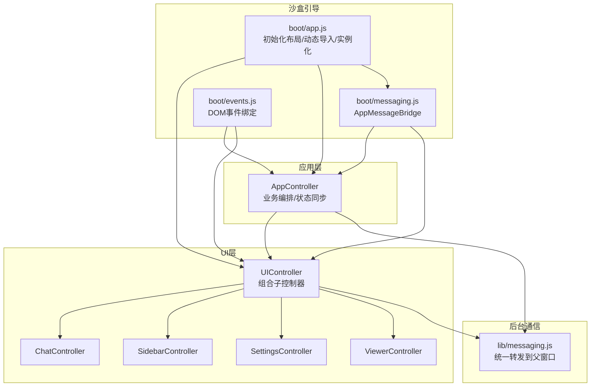
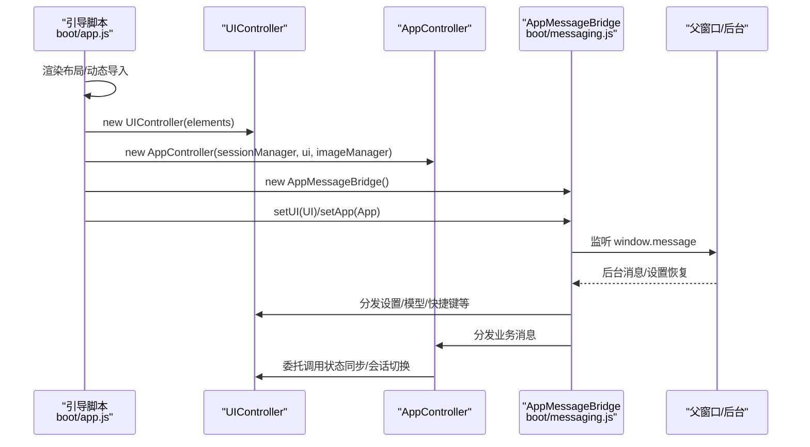
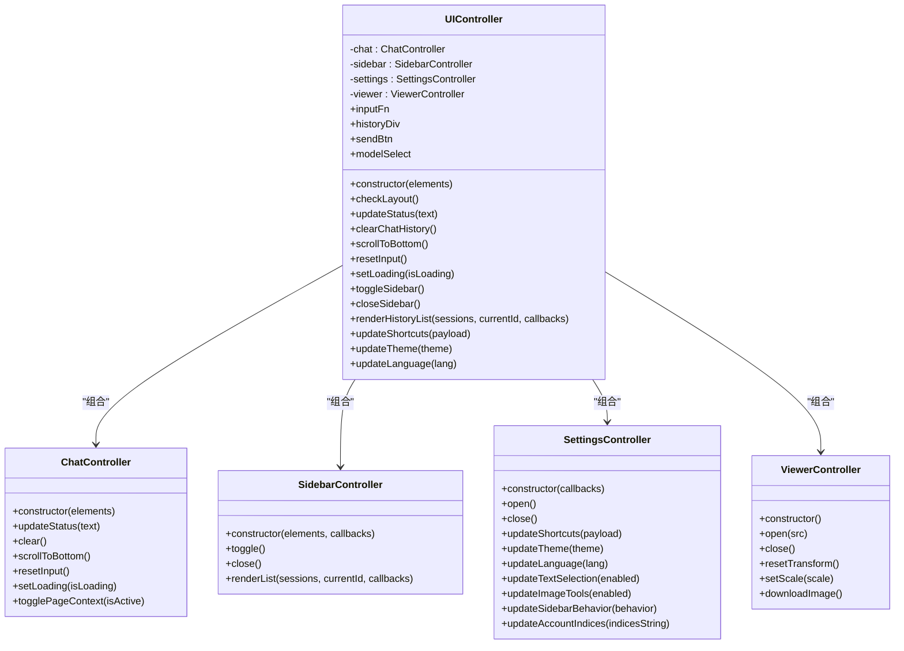
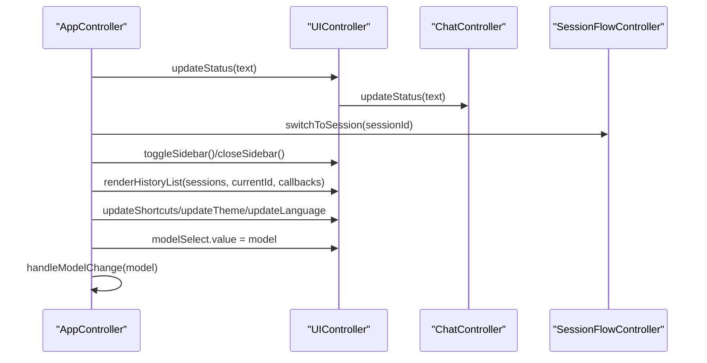
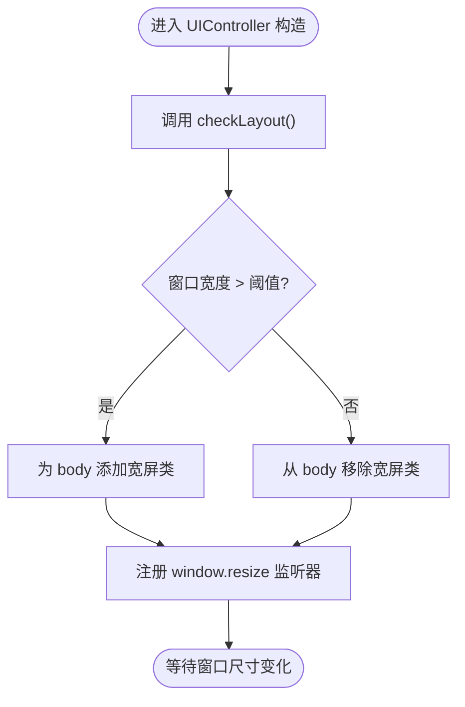
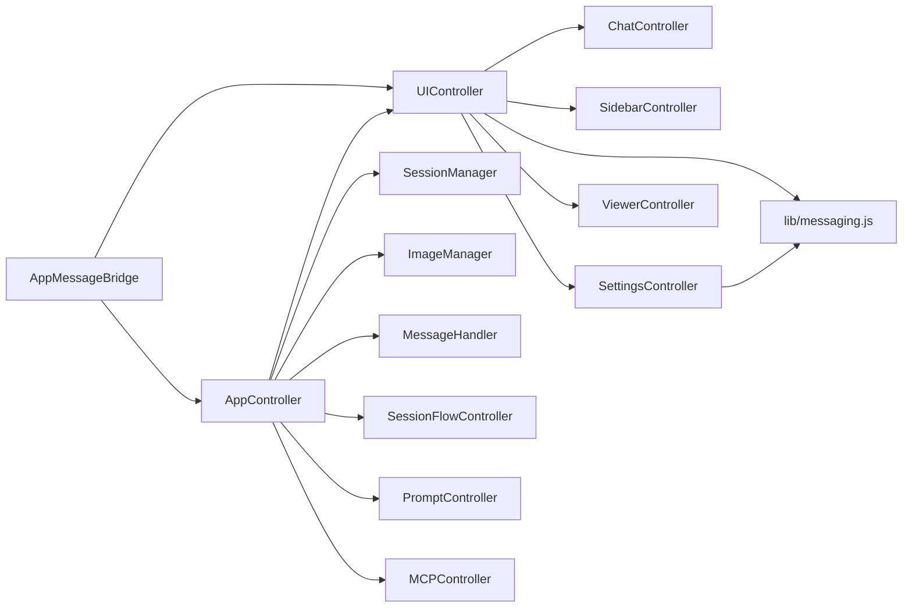

# 核心控制器

<cite>
**本文引用的文件**
- [sandbox/ui/ui_controller.js](file://sandbox/ui/ui_controller.js)
- [sandbox/controllers/app_controller.js](file://sandbox/controllers/app_controller.js)
- [sandbox/ui/chat.js](file://sandbox/ui/chat.js)
- [sandbox/ui/sidebar.js](file://sandbox/ui/sidebar.js)
- [sandbox/ui/settings.js](file://sandbox/ui/settings.js)
- [sandbox/ui/viewer.js](file://sandbox/ui/viewer.js)
- [sandbox/boot/app.js](file://sandbox/boot/app.js)
- [sandbox/boot/events.js](file://sandbox/boot/events.js)
- [sandbox/boot/messaging.js](file://sandbox/boot/messaging.js)
- [lib/messaging.js](file://lib/messaging.js)
</cite>

## 目录
1. [简介](#简介)
2. [项目结构](#项目结构)
3. [核心组件](#核心组件)
4. [架构总览](#架构总览)
5. [详细组件分析](#详细组件分析)
6. [依赖分析](#依赖分析)
7. [性能考量](#性能考量)
8. [故障排查指南](#故障排查指南)
9. [结论](#结论)
10. [附录](#附录)

## 简介
本文件聚焦于两个核心控制器：UIController 与 AppController 的架构关系与职责划分。我们将详细说明 UIController 如何通过构造函数初始化 ChatController、SidebarController、SettingsController、ViewerController 等子控制器，并管理它们之间的交互协调；同时阐述 AppController 如何持有 UIController 实例并调用其方法实现状态同步（如模型选择更新、会话切换通知等）。此外，我们还将分析 UIController 的 checkLayout() 自动检测机制与事件监听注册模式，并提供控制器间通信的最佳实践与内存泄漏防范建议。

## 项目结构
该模块位于沙盒渲染层，负责 UI 控制器的组装与事件桥接，以及与后台通信的消息转发。关键文件如下：
- UI 控制器：UIController 及其子控制器 ChatController、SidebarController、SettingsController、ViewerController
- 应用控制器：AppController，负责业务流程编排与状态同步
- 引导与桥接：boot/app.js 负责布局渲染、动态导入与实例化；boot/messaging.js 提供消息桥接；boot/events.js 绑定 DOM 事件
- 通用消息：lib/messaging.js 将设置与存储操作统一转发至父窗口（后台）

图表来源
- [sandbox/boot/app.js](file://sandbox/boot/app.js#L11-L89)
- [sandbox/ui/ui_controller.js](file://sandbox/ui/ui_controller.js#L8-L33)
- [sandbox/controllers/app_controller.js](file://sandbox/controllers/app_controller.js#L10-L36)
- [sandbox/boot/messaging.js](file://sandbox/boot/messaging.js#L4-L90)
- [lib/messaging.js](file://lib/messaging.js#L4-L96)

章节来源
- [sandbox/boot/app.js](file://sandbox/boot/app.js#L11-L89)
- [sandbox/ui/ui_controller.js](file://sandbox/ui/ui_controller.js#L8-L33)
- [sandbox/controllers/app_controller.js](file://sandbox/controllers/app_controller.js#L10-L36)
- [sandbox/boot/messaging.js](file://sandbox/boot/messaging.js#L4-L90)
- [lib/messaging.js](file://lib/messaging.js#L4-L96)

## 核心组件
- UIController：作为 UI 层的聚合控制器，负责子控制器的初始化、属性暴露与布局检测；对外提供统一的 UI 状态委托方法。
- AppController：应用层编排者，持有 UIController 实例，负责业务流程（会话、提示词、MCP 等），并通过消息桥接与后台通信。
- 子控制器：
  - ChatController：聊天输入、历史、状态与加载态控制
  - SidebarController：侧边栏显示/隐藏、历史列表渲染、搜索与回调
  - SettingsController：设置面板视图与状态同步、快捷键、主题、语言、文本选择、图像工具、侧栏行为、账户索引、Gem ID、日志下载、MCP 配置
  - ViewerController：图片查看器缩放/平移/重置/下载/关闭

章节来源
- [sandbox/ui/ui_controller.js](file://sandbox/ui/ui_controller.js#L8-L65)
- [sandbox/ui/chat.js](file://sandbox/ui/chat.js#L6-L120)
- [sandbox/ui/sidebar.js](file://sandbox/ui/sidebar.js#L5-L249)
- [sandbox/ui/settings.js](file://sandbox/ui/settings.js#L8-L249)
- [sandbox/ui/viewer.js](file://sandbox/ui/viewer.js#L4-L171)
- [sandbox/controllers/app_controller.js](file://sandbox/controllers/app_controller.js#L10-L36)

## 架构总览
UIController 与 AppController 的协作关系如下：
- 引导阶段：boot/app.js 渲染布局后，动态导入 UIController 与 AppController，分别实例化 UIController（传入 DOM 元素集合）与 AppController（传入 SessionManager、UIController、ImageManager）
- 事件桥接：boot/messaging.js 提供 AppMessageBridge，负责将父窗口消息分发给 UIController 或 AppController；同时支持队列缓存，确保在实例未就绪时也能接收消息
- 业务编排：AppController 通过 UIController 的委托方法进行状态同步（如更新状态、滚动到底部、切换侧边栏、更新设置等）

图表来源
- [sandbox/boot/app.js](file://sandbox/boot/app.js#L35-L87)
- [sandbox/boot/messaging.js](file://sandbox/boot/messaging.js#L4-L90)
- [sandbox/ui/ui_controller.js](file://sandbox/ui/ui_controller.js#L8-L33)
- [sandbox/controllers/app_controller.js](file://sandbox/controllers/app_controller.js#L10-L36)

## 详细组件分析

### UIController：构造与子控制器装配
- 子控制器初始化
  - ChatController：接收元素集合，内部完成输入框自适应高度、复制代码块反馈、状态与加载态切换等
  - SidebarController：接收元素集合与回调，支持侧边栏开关、遮罩点击回调、搜索与列表渲染
  - SettingsController：独立管理 DOM，提供打开/关闭、快捷键、主题、语言、文本选择、图像工具、侧栏行为、账户索引、Gem ID、日志下载、MCP 配置等
  - ViewerController：独立管理图片查看器状态与交互
- 外部暴露属性
  - 输入函数、历史容器、发送按钮、模型选择下拉框等，供 AppController 与消息桥接使用
- 布局检测与事件注册
  - 初始化时执行一次 checkLayout()，随后监听 window.resize 事件，动态切换 body 的类名以适配宽屏布局

图表来源
- [sandbox/ui/ui_controller.js](file://sandbox/ui/ui_controller.js#L8-L65)
- [sandbox/ui/chat.js](file://sandbox/ui/chat.js#L6-L120)
- [sandbox/ui/sidebar.js](file://sandbox/ui/sidebar.js#L5-L249)
- [sandbox/ui/settings.js](file://sandbox/ui/settings.js#L8-L249)
- [sandbox/ui/viewer.js](file://sandbox/ui/viewer.js#L4-L171)

章节来源
- [sandbox/ui/ui_controller.js](file://sandbox/ui/ui_controller.js#L8-L65)
- [sandbox/ui/chat.js](file://sandbox/ui/chat.js#L6-L120)
- [sandbox/ui/sidebar.js](file://sandbox/ui/sidebar.js#L5-L249)
- [sandbox/ui/settings.js](file://sandbox/ui/settings.js#L8-L249)
- [sandbox/ui/viewer.js](file://sandbox/ui/viewer.js#L4-L171)

### AppController：持有 UIController 并实现状态同步
- 实例化与依赖注入
  - 接收 SessionManager、UIController、ImageManager，创建 MessageHandler、SessionFlowController、PromptController、MCPController
- 状态同步与委托
  - 通过 UIController 的委托方法实现状态同步，例如：切换页面上下文时调用 UI 的 ChatController 与 UI 的状态更新；会话切换时调用 SessionFlowController
- 消息处理
  - handleIncomingMessage：处理来自父窗口的消息，包括恢复侧栏行为、恢复会话、切换会话、获取活动标签信息等；并将通用消息转发给 MessageHandler
- 便捷方法
  - handleSendMessage、handleCancel、handleNewChat、switchToSession、rerender、getSelectedModel、handleModelChange、handleDeleteSession、handleFileUpload 等

图表来源
- [sandbox/controllers/app_controller.js](file://sandbox/controllers/app_controller.js#L10-L36)
- [sandbox/controllers/app_controller.js](file://sandbox/controllers/app_controller.js#L77-L90)
- [sandbox/controllers/app_controller.js](file://sandbox/controllers/app_controller.js#L96-L98)
- [sandbox/ui/ui_controller.js](file://sandbox/ui/ui_controller.js#L47-L64)

章节来源
- [sandbox/controllers/app_controller.js](file://sandbox/controllers/app_controller.js#L10-L36)
- [sandbox/controllers/app_controller.js](file://sandbox/controllers/app_controller.js#L77-L90)
- [sandbox/controllers/app_controller.js](file://sandbox/controllers/app_controller.js#L96-L98)
- [sandbox/ui/ui_controller.js](file://sandbox/ui/ui_controller.js#L47-L64)

### checkLayout() 自动检测机制与事件监听注册模式
- 自动检测
  - 在 UIController 构造函数中调用一次 checkLayout()，根据窗口宽度阈值（例如 800）为 document.body 添加或移除特定类名，用于切换宽屏布局样式
- 事件监听
  - 注册 window.resize 监听器，每次窗口尺寸变化时重新计算布局状态，保证 UI 在不同屏幕尺寸下的适配性
- 与消息桥接的配合
  - 当父窗口恢复设置（如模型选择）时，可通过消息桥接触发 resize 回调，使模型选择下拉框宽度自适应

图表来源
- [sandbox/ui/ui_controller.js](file://sandbox/ui/ui_controller.js#L35-L43)
- [sandbox/ui/ui_controller.js](file://sandbox/ui/ui_controller.js#L30-L33)
- [sandbox/boot/messaging.js](file://sandbox/boot/messaging.js#L25-L27)
- [sandbox/boot/messaging.js](file://sandbox/boot/messaging.js#L62-L67)

章节来源
- [sandbox/ui/ui_controller.js](file://sandbox/ui/ui_controller.js#L35-L43)
- [sandbox/ui/ui_controller.js](file://sandbox/ui/ui_controller.js#L30-L33)
- [sandbox/boot/messaging.js](file://sandbox/boot/messaging.js#L25-L27)
- [sandbox/boot/messaging.js](file://sandbox/boot/messaging.js#L62-L67)

### 控制器间通信最佳实践与内存泄漏防范
- 最佳实践
  - 使用委托方法：UIController 对外暴露简洁的委托方法，AppController 仅通过这些方法与 UIController 交互，避免直接访问子控制器内部状态
  - 事件桥接：通过 AppMessageBridge 统一接收父窗口消息，按 action 分发到 UIController 或 AppController，必要时使用队列缓存，确保实例未就绪时也能接收消息
  - 单向依赖：AppController 持有 UIController 引用，但 UIController 不持有 AppController 引用，降低耦合度
  - 统一消息通道：设置与存储操作通过 lib/messaging.js 统一转发到父窗口，避免分散的跨域通信点
- 内存泄漏防范
  - 事件监听注册与释放：UIController 在构造时注册 window.resize 监听器；若需要销毁，应在 UIController 生命周期结束时移除监听，防止闭包持有 UIController 实例导致无法回收
  - 设置面板与视图：SettingsController 内部注册 window.message 监听器；同样应在销毁时移除，避免长期持有父窗口消息处理器
  - 图片查看器：ViewerController 注册多个全局事件（鼠标/键盘/全局事件）；销毁时应移除所有监听器并清理状态，避免内存泄漏
  - 会话与历史：SidebarController 维护 Fuse 搜索索引；当数据变更时需重置索引，避免重复初始化造成资源浪费

章节来源
- [sandbox/ui/ui_controller.js](file://sandbox/ui/ui_controller.js#L30-L33)
- [sandbox/ui/settings.js](file://sandbox/ui/settings.js#L46-L79)
- [sandbox/ui/viewer.js](file://sandbox/ui/viewer.js#L35-L71)
- [sandbox/ui/sidebar.js](file://sandbox/ui/sidebar.js#L62-L83)

## 依赖分析
- UIController 依赖
  - ChatController：负责聊天输入与历史渲染
  - SidebarController：负责侧边栏与历史列表
  - SettingsController：负责设置面板与状态同步
  - ViewerController：负责图片查看器
- AppController 依赖
  - SessionManager：会话管理
  - UIController：UI 状态委托
  - ImageManager：图片处理
  - MessageHandler、SessionFlowController、PromptController、MCPController：业务编排
- 消息与桥接
  - AppMessageBridge：统一接收父窗口消息并分发
  - lib/messaging.js：统一转发设置与存储请求到父窗口

图表来源
- [sandbox/ui/ui_controller.js](file://sandbox/ui/ui_controller.js#L8-L33)
- [sandbox/controllers/app_controller.js](file://sandbox/controllers/app_controller.js#L10-L36)
- [sandbox/boot/messaging.js](file://sandbox/boot/messaging.js#L4-L90)
- [lib/messaging.js](file://lib/messaging.js#L4-L96)

章节来源
- [sandbox/ui/ui_controller.js](file://sandbox/ui/ui_controller.js#L8-L33)
- [sandbox/controllers/app_controller.js](file://sandbox/controllers/app_controller.js#L10-L36)
- [sandbox/boot/messaging.js](file://sandbox/boot/messaging.js#L4-L90)
- [lib/messaging.js](file://lib/messaging.js#L4-L96)

## 性能考量
- 布局检测
  - checkLayout() 仅做类名切换，开销极低；建议在高频 resize 场景下结合节流/防抖，避免频繁 DOM 操作
- 搜索与渲染
  - SidebarController 使用 Fuse 进行搜索，首次初始化时构建索引；当数据变化时重置索引，避免重复构建
- 图片查看器
  - ViewerController 使用 transform 缩放与平移，避免频繁重排；注意在关闭时重置状态，减少不必要的计算
- 事件绑定
  - 所有控制器均在构造时注册事件监听；在销毁时务必移除，避免重复绑定导致性能下降

[本节为通用指导，不直接分析具体文件]

## 故障排查指南
- 模型选择宽度不自适应
  - 确认消息桥接是否正确设置 resize 函数引用，并在收到模型恢复消息后调用该函数
- 设置面板无法打开或状态不同步
  - 检查 SettingsController 的 window.message 监听是否注册；确认 AppMessageBridge 是否已 setUI
- 侧边栏点击遮罩无响应
  - 检查 SidebarController 的遮罩点击回调是否正确传递到 UIController 的 SettingsController
- 页面上下文按钮状态异常
  - 确认 AppController 在切换页面上下文时调用了 UIController 的 ChatController 的 togglePageContext 方法
- 会话切换无效
  - 检查 AppController 的 handleIncomingMessage 中 RESTORE_SESSIONS 分支与 switchToSession 调用链

章节来源
- [sandbox/boot/messaging.js](file://sandbox/boot/messaging.js#L25-L27)
- [sandbox/boot/messaging.js](file://sandbox/boot/messaging.js#L62-L67)
- [sandbox/ui/sidebar.js](file://sandbox/ui/sidebar.js#L34-L41)
- [sandbox/controllers/app_controller.js](file://sandbox/controllers/app_controller.js#L42-L50)
- [sandbox/controllers/app_controller.js](file://sandbox/controllers/app_controller.js#L139-L176)

## 结论
UIController 与 AppController 在该沙盒应用中形成了清晰的分层：UIController 聚合子控制器并提供统一的 UI 委托接口，AppController 负责业务编排并通过 UIController 实现状态同步。checkLayout() 的自动检测与事件监听注册模式保证了 UI 在不同布局下的自适应能力。通过 AppMessageBridge 与 lib/messaging.js 的统一消息通道，实现了设置与存储的集中管理。遵循委托方法、事件监听的注册与释放、以及搜索与渲染的索引管理等最佳实践，可有效提升系统稳定性与性能。

[本节为总结性内容，不直接分析具体文件]

## 附录
- 引导与实例化流程参考：[sandbox/boot/app.js](file://sandbox/boot/app.js#L35-L87)
- UI 控制器委托方法参考：[sandbox/ui/ui_controller.js](file://sandbox/ui/ui_controller.js#L47-L64)
- App 控制器状态同步与消息处理参考：[sandbox/controllers/app_controller.js](file://sandbox/controllers/app_controller.js#L77-L192)
- 设置与存储消息转发参考：[lib/messaging.js](file://lib/messaging.js#L4-L96)