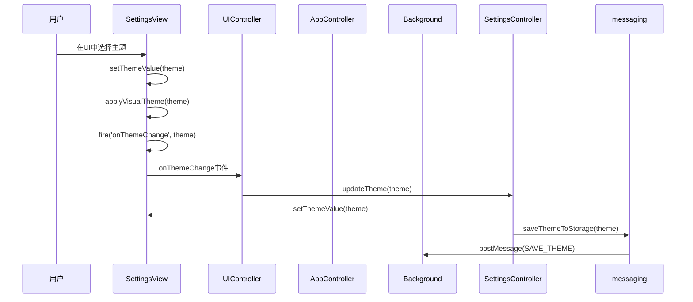
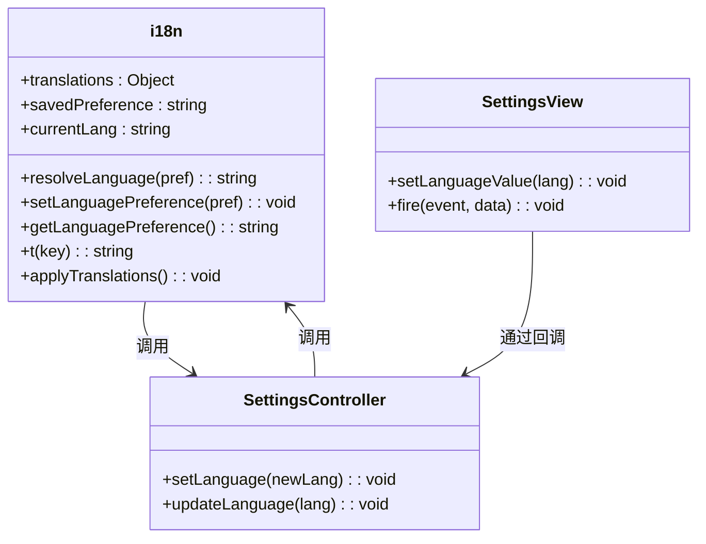
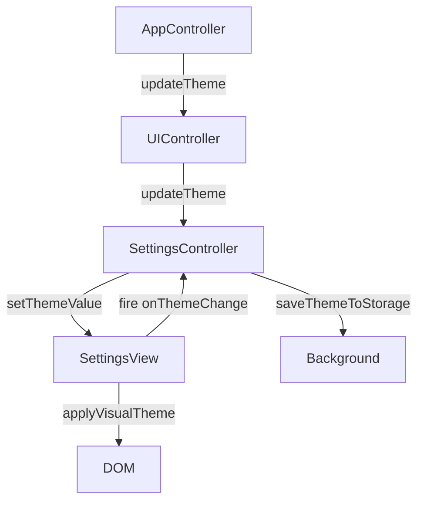
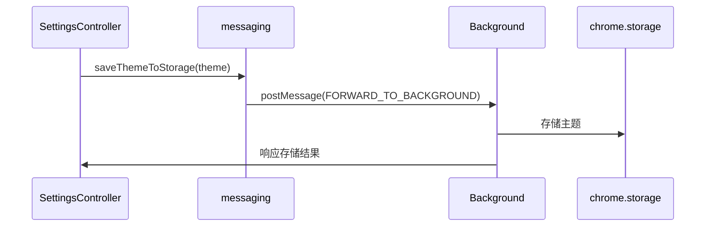
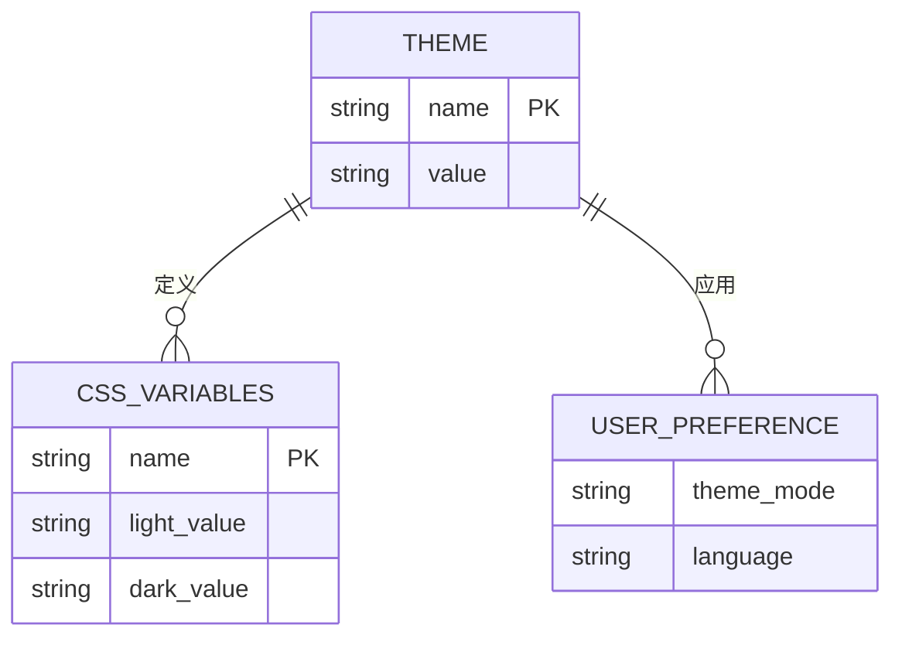

# 主题与语言

<cite>
**本文档引用的文件**
- [settings/view.js](file://sandbox/ui/settings/view.js)
- [ui_controller.js](file://sandbox/ui/ui_controller.js)
- [app_controller.js](file://sandbox/controllers/app_controller.js)
- [i18n.js](file://sandbox/core/i18n.js)
- [settings.js](file://sandbox/ui/settings.js)
- [messaging.js](file://lib/messaging.js)
- [base.css](file://css/base.css)
- [theme_init.js](file://sandbox/theme_init.js)
</cite>

## 目录
1. [简介](#简介)
2. [主题切换机制](#主题切换机制)
3. [语言本地化实现](#语言本地化实现)
4. [UI控制器与状态同步](#ui控制器与状态同步)
5. [配置持久化与后台通信](#配置持久化与后台通信)
6. [主题视觉效果与系统适配](#主题视觉效果与系统适配)
7. [i18n资源加载与多语言调试](#i18n资源加载与多语言调试)

## 简介
本文档详细说明了Gemini Nexus扩展中主题切换与语言本地化的完整实现机制。系统通过分层架构实现了用户界面的动态外观调整与多语言支持，涵盖了从UI控件状态更新、事件回调、控制器逻辑处理到后台持久化存储的完整流程。

## 主题切换机制

`SettingsView` 类负责管理设置界面的UI控件状态。其 `setThemeValue` 方法接收主题值（"light"、"dark" 或 "system"），将其设置为下拉选择框的当前值，并调用 `applyVisualTheme` 方法应用视觉主题。

`applyVisualTheme` 方法是主题应用的核心逻辑。当主题为 "system" 时，它会查询 `window.matchMedia('(prefers-color-scheme: dark)')` 的匹配状态，根据系统暗色模式偏好动态决定应用 "dark" 或 "light" 主题，并通过 `document.documentElement.setAttribute('data-theme', applied)` 设置根元素的 `data-theme` 属性。

系统还监听了 `window.matchMedia` 的变化事件，当用户的系统主题偏好发生改变时，如果当前设置为 "system" 模式，会自动重新应用正确的视觉主题，实现无缝的系统级暗色模式适配。

**Diagram sources**
- [settings/view.js](file://sandbox/ui/settings/view.js#L176-L217)
- [ui_controller.js](file://sandbox/ui/ui_controller.js#L63)
- [settings.js](file://sandbox/ui/settings.js#L171-L174)

**Section sources**
- [settings/view.js](file://sandbox/ui/settings/view.js#L176-L217)
- [settings.js](file://sandbox/ui/settings.js#L171-L174)

## 语言本地化实现

语言本地化由 `sandbox/core/i18n.js` 文件中的模块统一管理。该模块定义了 `en` 和 `zh` 两个语言包，包含所有用户界面的文本映射。

`SettingsView` 的 `setLanguageValue` 方法负责更新语言选择控件的状态，将传入的语言代码（如 "zh"）设置为下拉框的选中值。

`SettingsController` 中的 `setLanguage` 方法是语言变更的核心处理逻辑。它调用 `setLanguagePreference(newLang)` 更新内部状态，并通过 `document.documentElement.lang = currentLang` 设置HTML根元素的语言属性，同时触发 `gemini-language-changed` 自定义事件，通知其他模块进行响应。

`applyTranslations` 函数负责遍历整个DOM，根据元素上的 `data-i18n`、`data-i18n-placeholder` 和 `data-i18n-title` 属性，从当前语言包中查找对应的翻译文本并更新元素内容、占位符或标题。

**Diagram sources**
- [i18n.js](file://sandbox/core/i18n.js#L4-L250)
- [settings/view.js](file://sandbox/ui/settings/view.js#L181-L183)
- [settings.js](file://sandbox/ui/settings.js#L180-L190)

**Section sources**
- [i18n.js](file://sandbox/core/i18n.js#L4-L250)
- [settings/view.js](file://sandbox/ui/settings/view.js#L181-L183)
- [settings.js](file://sandbox/ui/settings.js#L180-L190)

## UI控制器与状态同步

`UIController` 作为UI的中央控制器，提供了 `updateTheme` 和 `updateLanguage` 方法作为外部接口。当 `AppController` 或其他模块需要更新界面主题或语言时，会调用这些方法。

`updateTheme` 方法会将新的主题值传递给其内部的 `SettingsController` 实例，后者再调用 `SettingsView` 的 `setThemeValue` 方法，形成一个从高层控制器到具体视图的单向数据流。

这种分层设计确保了状态管理的清晰性：`SettingsView` 只负责UI渲染和用户输入，`SettingsController` 负责业务逻辑和状态同步，而 `UIController` 则作为统一的门面，为 `AppController` 等上层模块提供简洁的API。

**Diagram sources**
- [ui_controller.js](file://sandbox/ui/ui_controller.js#L63-L64)
- [settings.js](file://sandbox/ui/settings.js#L176-L178)
- [settings/view.js](file://sandbox/ui/settings/view.js#L176-L178)

**Section sources**
- [ui_controller.js](file://sandbox/ui/ui_controller.js#L63-L64)
- [settings.js](file://sandbox/ui/settings.js#L176-L178)

## 配置持久化与后台通信

当用户在设置界面更改主题或语言时，`SettingsController` 会通过 `lib/messaging.js` 中的 `saveThemeToStorage` 和 `saveLanguageToStorage` 函数，使用 `window.parent.postMessage` 将配置变更消息发送到 background context。

在 background context 中，`messages.js` 文件监听这些消息，并将配置数据持久化存储到 `chrome.storage.sync` 中。这样，用户的偏好设置可以在不同设备间同步，并在浏览器重启后依然保留。

`AppController` 在初始化时，会从 background context 请求当前的配置状态（如 `GET_THEME`、`GET_LANGUAGE`），并将这些状态同步到UI，确保界面与存储的配置保持一致。

**Diagram sources**
- [settings.js](file://sandbox/ui/settings.js#L173)
- [messaging.js](file://lib/messaging.js#L29-L34)
- [app_controller.js](file://sandbox/controllers/app_controller.js)

**Section sources**
- [settings.js](file://sandbox/ui/settings.js#L173)
- [messaging.js](file://lib/messaging.js#L29-L34)

## 主题视觉效果与系统适配

主题的视觉效果通过CSS变量实现。`css/base.css` 文件定义了 `:root` 和 `[data-theme="dark"]` 两个选择器，分别包含浅色和深色主题的所有CSS变量。

当 `data-theme` 属性被设置时，CSS引擎会自动应用对应的主题变量，实现整个界面的即时换肤。例如，`--bg-body` 定义了页面背景色，在浅色主题下为白色，在深色主题下为深灰色。

系统级适配通过 `window.matchMedia('(prefers-color-scheme: dark)')` API 实现。当用户选择 "system" 模式时，应用会查询此API的 `matches` 属性来决定初始主题。同时，通过监听其 `change` 事件，可以实时响应系统主题的切换。

**Diagram sources**
- [base.css](file://css/base.css#L2-L106)
- [theme_init.js](file://sandbox/theme_init.js#L8-L12)
- [settings/view.js](file://sandbox/ui/settings/view.js#L100-L104)

**Section sources**
- [base.css](file://css/base.css#L2-L106)
- [theme_init.js](file://sandbox/theme_init.js#L8-L12)

## i18n资源加载与多语言调试

i18n资源在 `sandbox/core/i18n.js` 中以JavaScript对象的形式静态定义。`t(key)` 函数是获取翻译文本的主要接口，它根据当前语言返回对应的字符串。

`applyTranslations` 函数在语言变更或页面加载时被调用，它会扫描所有带有特定 `data-i18n` 属性的元素，并用翻译文本更新它们。这包括 `textContent`、`placeholder` 和 `title` 属性。

为了调试多语言功能，可以：
1. 在设置界面中切换语言，观察UI文本是否正确更新。
2. 检查 `document.documentElement.lang` 属性是否与选择的语言一致。
3. 在控制台调用 `t('some_key')` 来测试特定键的翻译。
4. 确保所有需要翻译的UI元素都正确添加了 `data-i18n` 等属性。

**Section sources**
- [i18n.js](file://sandbox/core/i18n.js#L221-L250)
- [settings.js](file://sandbox/ui/settings.js#L180-L190)