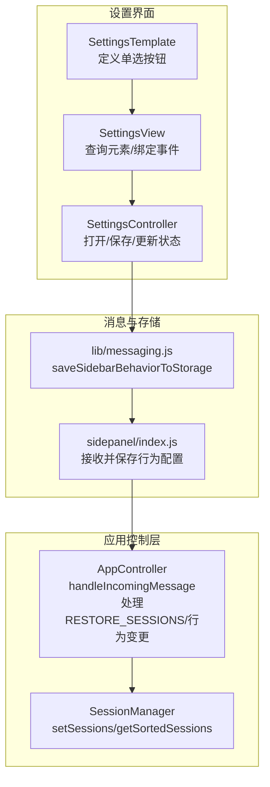
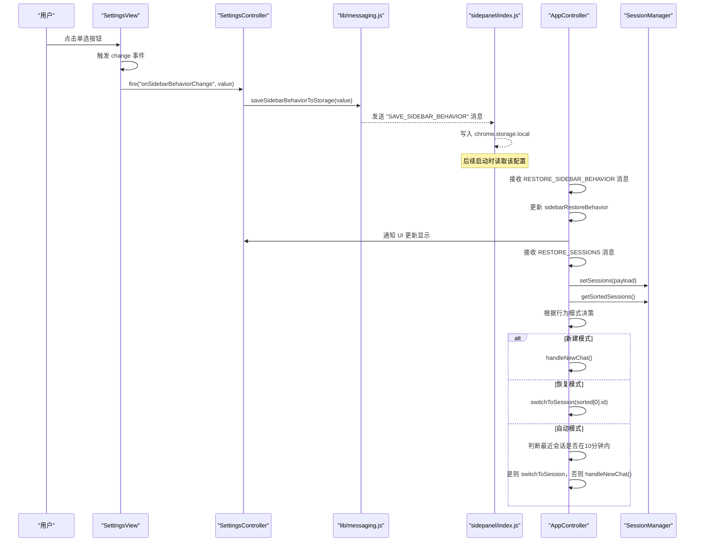
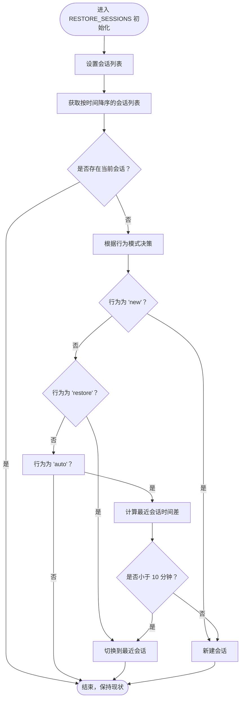
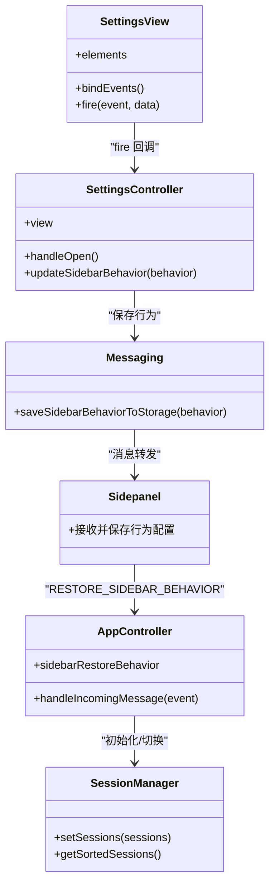

# 会话恢复策略

<cite>
**本文引用的文件**
- [sandbox/ui/settings/view.js](file://sandbox/ui/settings/view.js)
- [sandbox/ui/settings.js](file://sandbox/ui/settings.js)
- [sandbox/ui/templates/settings.js](file://sandbox/ui/templates/settings.js)
- [sandbox/controllers/app_controller.js](file://sandbox/controllers/app_controller.js)
- [sandbox/core/session_manager.js](file://sandbox/core/session_manager.js)
- [lib/messaging.js](file://lib/messaging.js)
- [sidepanel/index.js](file://sidepanel/index.js)
</cite>

## 目录
1. [简介](#简介)
2. [项目结构](#项目结构)
3. [核心组件](#核心组件)
4. [架构总览](#架构总览)
5. [详细组件分析](#详细组件分析)
6. [依赖关系分析](#依赖关系分析)
7. [性能考量](#性能考量)
8. [故障排查指南](#故障排查指南)
9. [结论](#结论)

## 简介
本文件系统化阐述 sidebarRestoreBehavior 配置项的三种模式（auto/restore/new）的设计理念与实现逻辑，解释 SettingsView 中 sidebarRadios 单选按钮组如何绑定 onSidebarBehaviorChange 事件并将用户选择传递至 AppController；详细描述 AppController 在 handleIncomingMessage 中处理 RESTORE_SIDEBAR_BEHAVIOR 消息时如何更新 sidebarRestoreBehavior 状态；重点分析 RESTORE_SESSIONS 消息处理流程中，根据当前行为模式决定初始化动作的算法：'new' 模式强制新建会话，'restore' 模式恢复最近会话，'auto' 模式基于时间阈值（10 分钟）智能判断。同时提供各模式适用场景及在侧边栏初始化过程中的具体应用示例。

## 项目结构
本功能涉及前端设置界面、控制器、会话管理以及消息通信等模块：
- 设置界面与视图层：负责渲染单选按钮、绑定事件、同步状态
- 控制器层：接收消息、解析行为模式、驱动会话切换或新建
- 会话管理层：维护会话列表、排序、当前会话标识
- 消息通信层：跨 iframe/页面的持久化与状态同步

图表来源
- [sandbox/ui/templates/settings.js](file://sandbox/ui/templates/settings.js#L38-L60)
- [sandbox/ui/settings/view.js](file://sandbox/ui/settings/view.js#L41-L93)
- [sandbox/ui/settings.js](file://sandbox/ui/settings.js#L22-L35)
- [lib/messaging.js](file://lib/messaging.js#L69-L74)
- [sidepanel/index.js](file://sidepanel/index.js#L323-L326)
- [sandbox/controllers/app_controller.js](file://sandbox/controllers/app_controller.js#L129-L192)
- [sandbox/core/session_manager.js](file://sandbox/core/session_manager.js#L25-L35)

章节来源
- [sandbox/ui/templates/settings.js](file://sandbox/ui/templates/settings.js#L38-L60)
- [sandbox/ui/settings/view.js](file://sandbox/ui/settings/view.js#L41-L93)
- [sandbox/ui/settings.js](file://sandbox/ui/settings.js#L22-L35)
- [lib/messaging.js](file://lib/messaging.js#L69-L74)
- [sidepanel/index.js](file://sidepanel/index.js#L323-L326)
- [sandbox/controllers/app_controller.js](file://sandbox/controllers/app_controller.js#L129-L192)
- [sandbox/core/session_manager.js](file://sandbox/core/session_manager.js#L25-L35)

## 核心组件
- SettingsView：查询 DOM 元素，绑定 sidebarRadios 的 change 事件，触发回调 onSidebarBehaviorChange，并通过 fire 将用户选择传递给上层控制器
- SettingsController：接收 onSidebarBehaviorChange 回调，调用 saveSidebarBehaviorToStorage 将行为写入父页面
- AppController：监听窗口消息，处理 RESTORE_SIDEBAR_BEHAVIOR 更新行为状态，并在 RESTORE_SESSIONS 初始化阶段按模式决策是否恢复最近会话
- SessionManager：提供 setSessions 和 getSortedSessions，用于初始化会话列表与按时间排序
- messaging：封装 saveSidebarBehaviorToStorage，向父页面发送保存行为配置的消息
- sidepanel：接收父页面消息，将行为配置写入本地存储，供后续加载使用

章节来源
- [sandbox/ui/settings/view.js](file://sandbox/ui/settings/view.js#L41-L93)
- [sandbox/ui/settings.js](file://sandbox/ui/settings.js#L22-L35)
- [sandbox/controllers/app_controller.js](file://sandbox/controllers/app_controller.js#L129-L192)
- [sandbox/core/session_manager.js](file://sandbox/core/session_manager.js#L25-L35)
- [lib/messaging.js](file://lib/messaging.js#L69-L74)
- [sidepanel/index.js](file://sidepanel/index.js#L323-L326)

## 架构总览
下图展示从用户在设置面板选择行为到应用层执行初始化决策的完整流程。

图表来源
- [sandbox/ui/settings/view.js](file://sandbox/ui/settings/view.js#L87-L93)
- [sandbox/ui/settings.js](file://sandbox/ui/settings.js#L32)
- [lib/messaging.js](file://lib/messaging.js#L69-L74)
- [sidepanel/index.js](file://sidepanel/index.js#L323-L326)
- [sandbox/controllers/app_controller.js](file://sandbox/controllers/app_controller.js#L129-L192)
- [sandbox/core/session_manager.js](file://sandbox/core/session_manager.js#L25-L35)

## 详细组件分析

### SettingsView：单选按钮与事件绑定
- 查询元素：通过 name="sidebar-behavior" 获取所有单选按钮
- 绑定事件：遍历每个 radio，监听 change 事件，当目标被选中时，通过 fire('onSidebarBehaviorChange', value) 将值向上抛出
- 作用：将用户在设置面板的选择转化为可被上层控制器处理的事件

章节来源
- [sandbox/ui/settings/view.js](file://sandbox/ui/settings/view.js#L41-L93)

### SettingsController：行为配置的保存与同步
- 接收回调：onSidebarBehaviorChange 调用 saveSidebarBehaviorToStorage，将用户选择写入父页面
- UI 同步：updateSidebarBehavior 调用 view.setSidebarBehavior，确保设置面板显示与存储一致
- 作用：作为设置面板与消息层之间的桥梁，完成行为配置的持久化与回显

章节来源
- [sandbox/ui/settings.js](file://sandbox/ui/settings.js#L22-L35)
- [sandbox/ui/settings.js](file://sandbox/ui/settings.js#L209-L211)

### AppController：RESTORE_SIDEBAR_BEHAVIOR 与 RESTORE_SESSIONS 处理
- RESTORE_SIDEBAR_BEHAVIOR：直接更新 sidebarRestoreBehavior 并通知 UI 设置面板更新显示
- RESTORE_SESSIONS：
  - 初始化会话列表并刷新历史 UI
  - 当处于初始化阶段（无 currentSessionId 或当前会话不存在）时，依据行为模式进行决策
  - 'new'：不恢复，直接新建
  - 'restore'：总是恢复最近会话
  - 'auto'：若最近会话在 10 分钟内，则恢复，否则新建

章节来源
- [sandbox/controllers/app_controller.js](file://sandbox/controllers/app_controller.js#L129-L192)

### SessionManager：会话数据与排序
- setSessions：批量设置会话列表
- getSortedSessions：返回按时间戳降序排列的会话数组，用于自动模式的时间阈值判断

章节来源
- [sandbox/core/session_manager.js](file://sandbox/core/session_manager.js#L25-L35)

### 消息与存储：行为配置的持久化
- saveSidebarBehaviorToStorage：向父页面发送 "SAVE_SIDEBAR_BEHAVIOR" 消息，携带用户选择
- sidepanel 接收并写入 chrome.storage.local，保证下次启动时能读取到最新配置

章节来源
- [lib/messaging.js](file://lib/messaging.js#L69-L74)
- [sidepanel/index.js](file://sidepanel/index.js#L323-L326)

### SettingsTemplate：单选按钮定义与文案
- 定义三个单选按钮：auto/restore/new
- 提供对应的文案说明，其中 auto 模式说明了“10 分钟内恢复”的阈值

章节来源
- [sandbox/ui/templates/settings.js](file://sandbox/ui/templates/settings.js#L38-L60)

### 自动模式决策算法流程图

图表来源
- [sandbox/controllers/app_controller.js](file://sandbox/controllers/app_controller.js#L139-L176)
- [sandbox/core/session_manager.js](file://sandbox/core/session_manager.js#L33-L35)

## 依赖关系分析
- SettingsView 依赖 SettingsController 的回调接口，将用户交互转化为高层可处理的事件
- SettingsController 依赖 messaging 层进行配置持久化
- AppController 依赖 SessionManager 进行会话状态管理，并依赖 SettingsController 的 UI 更新能力
- sidepanel 作为父页面，负责接收并持久化行为配置，供后续启动时读取

图表来源
- [sandbox/ui/settings/view.js](file://sandbox/ui/settings/view.js#L41-L93)
- [sandbox/ui/settings.js](file://sandbox/ui/settings.js#L22-L35)
- [lib/messaging.js](file://lib/messaging.js#L69-L74)
- [sidepanel/index.js](file://sidepanel/index.js#L323-L326)
- [sandbox/controllers/app_controller.js](file://sandbox/controllers/app_controller.js#L129-L192)
- [sandbox/core/session_manager.js](file://sandbox/core/session_manager.js#L25-L35)

## 性能考量
- 自动模式的时间阈值为 10 分钟，避免频繁恢复导致的 UI 抖动与不必要的网络开销
- getSortedSessions 使用原数组拷贝后排序，避免修改原始数据，时间复杂度 O(n log n)，在会话数量合理范围内可接受
- 仅在初始化阶段进行恢复决策，避免重复计算

## 故障排查指南
- 用户选择未生效
  - 检查 SettingsView 是否正确绑定 radio 的 change 事件
  - 确认 SettingsController 的 onSidebarBehaviorChange 回调已调用 saveSidebarBehaviorToStorage
  - 核对 sidepanel 是否收到并保存了 "SAVE_SIDEBAR_BEHAVIOR" 消息
- 自动模式未按预期恢复
  - 确认最近会话的 timestamp 是否正确更新
  - 检查 RESTORE_SESSIONS 消息到达时机与初始化条件
- 新建模式仍恢复会话
  - 确认 AppController 的行为模式分支逻辑未被其他条件覆盖

章节来源
- [sandbox/ui/settings/view.js](file://sandbox/ui/settings/view.js#L87-L93)
- [sandbox/ui/settings.js](file://sandbox/ui/settings.js#L32)
- [sidepanel/index.js](file://sidepanel/index.js#L323-L326)
- [sandbox/controllers/app_controller.js](file://sandbox/controllers/app_controller.js#L139-L176)
- [sandbox/core/session_manager.js](file://sandbox/core/session_manager.js#L33-L35)

## 结论
sidebarRestoreBehavior 的三种模式分别面向不同使用场景：
- new：适合需要每次重新开始的场景，如隐私敏感对话或临时任务
- restore：适合需要连续上下文的场景，如长篇写作或深度讨论
- auto：在大多数日常使用中提供最佳平衡，既保留近期上下文，又避免过期会话干扰

通过 SettingsView 的事件绑定、SettingsController 的持久化桥接、AppController 的初始化决策与 SessionManager 的数据支持，形成了清晰、可维护且可扩展的会话恢复策略体系。