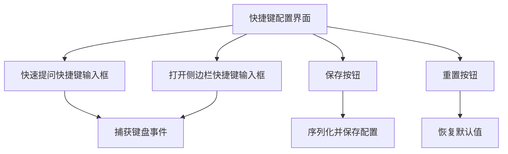
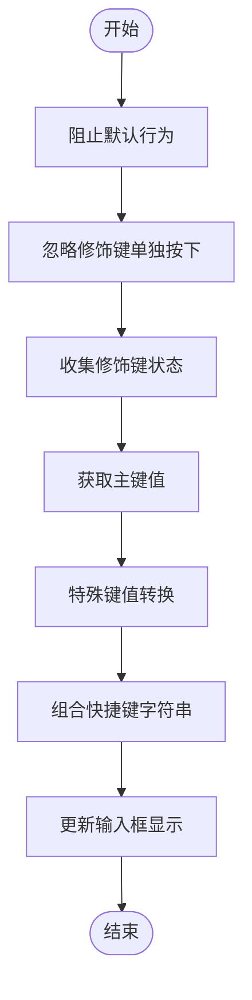
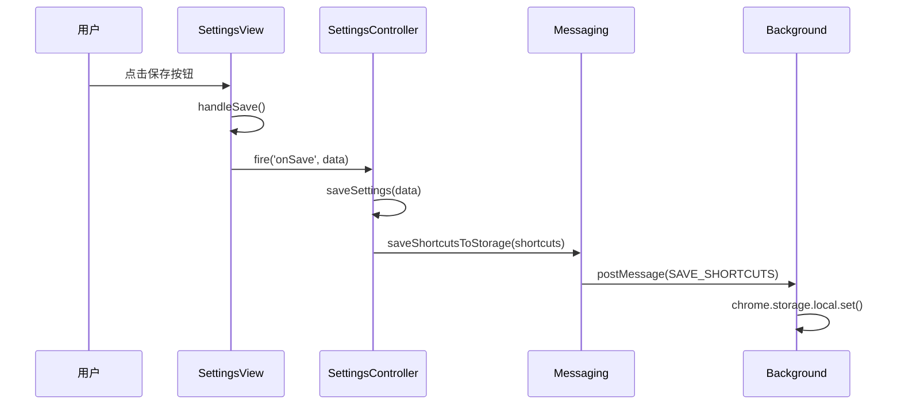
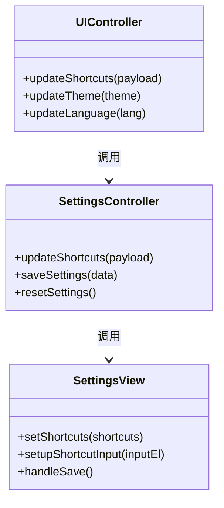
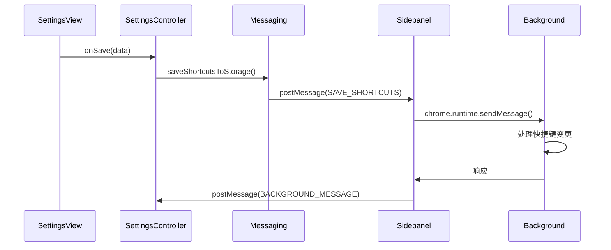
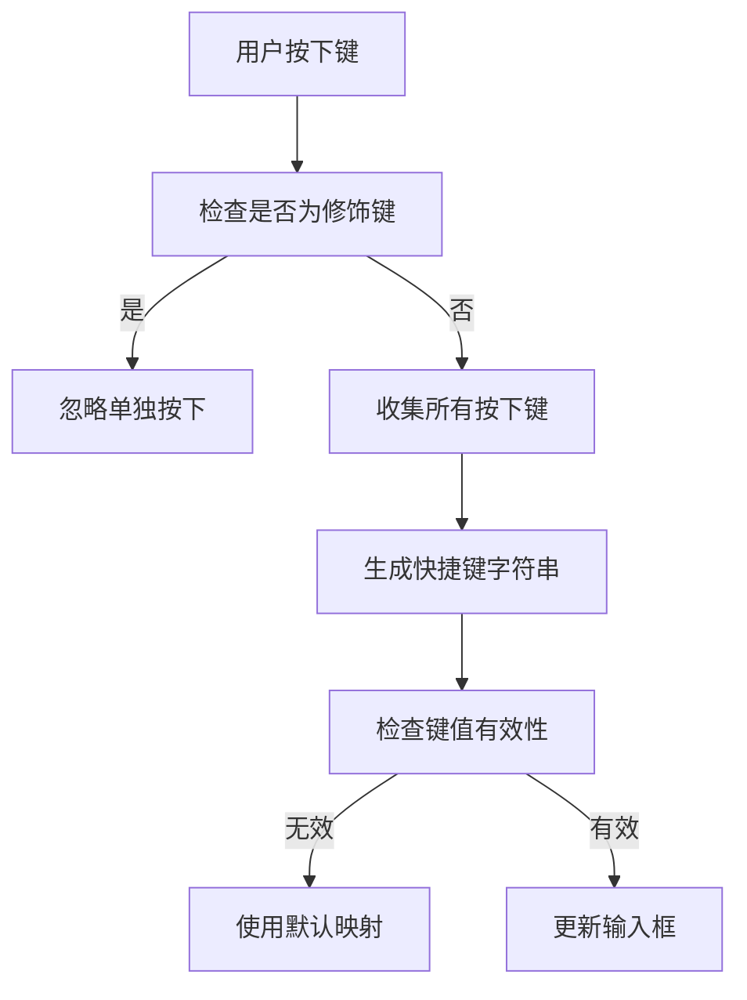

# 快捷键管理

<cite>
**本文档引用的文件**
- [view.js](file://sandbox/ui/settings/view.js)
- [ui_controller.js](file://sandbox/ui/ui_controller.js)
- [app_controller.js](file://sandbox/controllers/app_controller.js)
- [settings.js](file://sandbox/ui/settings.js)
- [keyboard.js](file://background/control/actions/input/keyboard.js)
- [quick_ask_handler.js](file://background/handlers/session/quick_ask_handler.js)
- [messages.js](file://background/messages.js)
- [messaging.js](file://lib/messaging.js)
- [sidepanel/index.js](file://sidepanel/index.js)
- [constants.js](file://lib/constants.js)
</cite>

## 目录
1. [简介](#简介)
2. [快捷键配置界面](#快捷键配置界面)
3. [快捷键输入处理](#快捷键输入处理)
4. [快捷键保存与序列化](#快捷键保存与序列化)
5. [快捷键应用与更新](#快捷键应用与更新)
6. [全局快捷键同步机制](#全局快捷键同步机制)
7. [默认值重置功能](#默认值重置功能)
8. [自定义快捷键验证规则](#自定义快捷键验证规则)
9. [常见配置错误排查](#常见配置错误排查)
10. [结论](#结论)

## 简介
本文档深入解析快捷键配置系统的实现原理，涵盖从用户界面交互到后台全局监听器更新的完整流程。系统允许用户自定义"快速提问"和"打开侧边栏"等核心功能的快捷键，并通过消息机制确保配置在应用上下文间同步。文档详细说明了键盘事件拦截、快捷键序列化、UI更新、后台同步以及冲突检测等关键机制。

## 快捷键配置界面
快捷键配置界面由`SettingsView`类实现，提供直观的输入框供用户设置快捷键。界面包含两个主要输入框：一个用于"快速提问"功能，另一个用于"打开侧边栏"功能。用户点击输入框后，系统会进入快捷键捕获模式，等待用户按下新的组合键。



**Diagram sources**
- [view.js](file://sandbox/ui/settings/view.js#L28-L32)
- [settings.js](file://sandbox/ui/settings.js#L109-L121)

**Section sources**
- [view.js](file://sandbox/ui/settings/view.js#L4-L241)
- [settings.js](file://sandbox/ui/settings.js#L8-L249)

## 快捷键输入处理
`SettingsView`类中的`setupShortcutInput`方法负责拦截键盘事件并生成标准格式的快捷键组合。当用户点击快捷键输入框时，该方法为输入框注册`keydown`事件监听器。



**Diagram sources**
- [view.js](file://sandbox/ui/settings/view.js#L136-L154)

**Section sources**
- [view.js](file://sandbox/ui/settings/view.js#L136-L154)

### 事件拦截与处理
`setupShortcutInput`方法通过调用`preventDefault()`和`stopPropagation()`阻止键盘事件的默认行为和冒泡，确保快捷键配置不会触发其他功能。系统会忽略单独按下的`Control`、`Alt`、`Shift`和`Meta`等修饰键，只在用户按下完整组合时进行处理。

### 快捷键组合生成
系统通过检查`e.ctrlKey`、`e.altKey`、`e.shiftKey`和`e.metaKey`属性来确定哪些修饰键被按下，并将对应的`Ctrl`、`Alt`、`Shift`、`Meta`添加到数组中。主键值通过`e.key`获取并转换为大写，空格键被特殊处理为`Space`。最终使用`join('+')`方法将数组元素用加号连接，生成如`Ctrl+Shift+X`格式的快捷键字符串。

## 快捷键保存与序列化
`handleSave`方法负责序列化用户配置的快捷键并提交保存。该方法收集输入框中的值，构建包含快捷键和其他设置的数据对象，并通过回调函数通知上层控制器。



**Diagram sources**
- [view.js](file://sandbox/ui/settings/view.js#L114-L130)
- [settings.js](file://sandbox/ui/settings.js#L113-L136)
- [messaging.js](file://lib/messaging.js#L18-L23)

**Section sources**
- [view.js](file://sandbox/ui/settings/view.js#L114-L130)
- [settings.js](file://sandbox/ui/settings.js#L113-L136)

### 数据结构
`handleSave`方法创建的数据对象包含`shortcuts`属性，该属性又包含`quickAsk`和`openPanel`两个子属性，分别存储对应的快捷键字符串。其他设置如文本选择、图片工具等也一并序列化。

### 存储机制
序列化后的快捷键数据通过`saveShortcutsToStorage`函数发送到后台脚本，最终使用`chrome.storage.local.set`方法持久化存储，确保配置在浏览器重启后仍然有效。

## 快捷键应用与更新
`UIController`的`updateShortcuts`方法负责接收并应用新的快捷键映射。该方法作为快捷键更新的入口点，将新的配置传递给`SettingsController`进行处理。



**Diagram sources**
- [ui_controller.js](file://sandbox/ui/ui_controller.js#L62)
- [settings.js](file://sandbox/ui/settings.js#L192-L197)
- [view.js](file://sandbox/ui/settings/view.js#L171-L174)

**Section sources**
- [ui_controller.js](file://sandbox/ui/ui_controller.js#L8-L66)
- [settings.js](file://sandbox/ui/settings.js#L192-L197)

### 更新流程
当`updateShortcuts`方法被调用时，它会将新的快捷键配置传递给`SettingsController`的同名方法。`SettingsController`首先更新内部状态，然后调用`SettingsView`的`setShortcuts`方法，将新的快捷键值显示在配置界面的输入框中，完成UI的同步更新。

## 全局快捷键同步机制
`AppController`通过消息机制将快捷键变更同步至后台上下文，以更新全局监听器。这一过程涉及多个组件间的协作，确保快捷键配置在整个扩展中保持一致。



**Diagram sources**
- [app_controller.js](file://sandbox/controllers/app_controller.js#L25-L30)
- [messages.js](file://background/messages.js#L22-L80)
- [sidepanel/index.js](file://sidepanel/index.js#L295-L302)

**Section sources**
- [app_controller.js](file://sandbox/controllers/app_controller.js#L1-L207)
- [messages.js](file://background/messages.js#L1-L82)

### 消息传递链
快捷键变更通过`postMessage`机制从沙箱环境传递到侧边栏，再由侧边栏通过`chrome.runtime.sendMessage`转发到后台脚本。后台脚本接收到消息后，会更新其内部状态并可能重新注册全局快捷键监听器，确保新的配置立即生效。

### 跨上下文通信
系统使用`window.parent.postMessage`进行沙箱与侧边栏之间的通信，利用`chrome.runtime.sendMessage`进行侧边栏与后台脚本之间的通信。这种分层的消息传递机制确保了不同安全上下文间的有效隔离与安全通信。

## 默认值重置功能
`handleReset`方法实现了快捷键配置的默认值重置功能。该方法通过触发`onReset`事件，通知上层控制器恢复默认设置。

```mermaid
flowchart TD
A[用户点击重置按钮] --> B[触发handleReset]
B --> C[fire('onReset')]
C --> D[SettingsController处理]
D --> E[恢复默认快捷键]
E --> F[更新UI显示]
```

**Diagram sources**
- [view.js](file://sandbox/ui/settings/view.js#L132-L134)
- [settings.js](file://sandbox/ui/settings.js#L138-L141)

**Section sources**
- [view.js](file://sandbox/ui/settings/view.js#L132-L134)
- [settings.js](file://sandbox/ui/settings.js#L138-L141)

### 默认值定义
默认快捷键在`lib/constants.js`文件中定义，`DEFAULT_SHORTCUTS`常量包含`quickAsk: "Ctrl+G"`和`openPanel: "Alt+S"`两个预设值。这些默认值在`SettingsController`初始化时被复制到实例变量中，作为重置操作的目标。

### 重置流程
当用户点击重置按钮时，`handleReset`方法被调用，触发`onReset`事件。`SettingsController`监听到该事件后，调用`resetSettings`方法，将内部快捷键状态恢复为默认值，并通过`setShortcuts`方法更新UI，完成整个重置过程。

## 自定义快捷键验证规则
系统对自定义快捷键的验证主要通过前端逻辑实现，确保用户输入的快捷键符合预期格式。虽然没有复杂的后端验证，但前端拦截机制本身提供了一定程度的输入规范。



**Diagram sources**
- [view.js](file://sandbox/ui/settings/view.js#L139-L152)
- [keyboard.js](file://background/control/actions/input/keyboard.js#L76-L115)

**Section sources**
- [view.js](file://sandbox/ui/settings/view.js#L136-L154)
- [keyboard.js](file://background/control/actions/input/keyboard.js#L76-L115)

### 输入规范
系统要求快捷键必须包含至少一个非修饰键（如字母、数字或特殊字符）与一个或多个修饰键的组合。单独的修饰键不会被记录，防止用户配置无效的快捷键。

### 特殊键处理
系统对空格键进行特殊处理，将其显示为`Space`而非空字符串，提高可读性。其他特殊键如`Enter`、`Backspace`等在`keyboard.js`中有明确的虚拟键码映射，确保后台能够正确识别和处理。

## 常见配置错误排查
本节提供常见快捷键配置错误的排查方法，帮助用户解决配置过程中可能遇到的问题。

### 快捷键不生效
- **检查存储状态**：确认快捷键已成功保存到`chrome.storage.local`
- **验证消息传递**：确保`SAVE_SHORTCUTS`消息正确传递到后台脚本
- **检查监听器**：确认后台脚本已根据新配置更新全局键盘监听器

### 快捷键冲突
- **系统级冲突**：检查是否与操作系统或其他应用程序的快捷键冲突
- **浏览器级冲突**：确认是否与Chrome浏览器自身的快捷键（如`Ctrl+T`新建标签页）冲突
- **扩展间冲突**：排查是否与其他已安装扩展的快捷键重复

### 配置未持久化
- **检查存储权限**：确认扩展具有`storage`权限
- **验证存储API调用**：确保`chrome.storage.local.set`被正确调用
- **检查错误处理**：查看是否有存储操作失败的错误信息

**Section sources**
- [sidepanel/index.js](file://sidepanel/index.js#L295-L302)
- [messages.js](file://background/messages.js#L22-L80)

## 结论
快捷键管理系统通过精心设计的组件协作，实现了从用户界面到后台服务的完整配置流程。`SettingsView`负责捕获和显示快捷键，`SettingsController`管理配置状态，`UIController`协调UI更新，而`AppController`和后台脚本确保配置的全局同步。系统通过消息传递机制跨越不同的执行上下文，保持了良好的模块化和安全性。默认值重置和前端验证规则为用户提供了友好的配置体验，而清晰的错误排查指南则帮助用户解决常见问题。整个系统体现了现代浏览器扩展开发中组件化、消息驱动的设计理念。