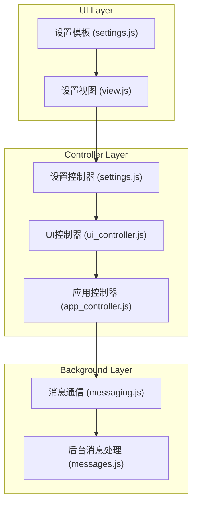
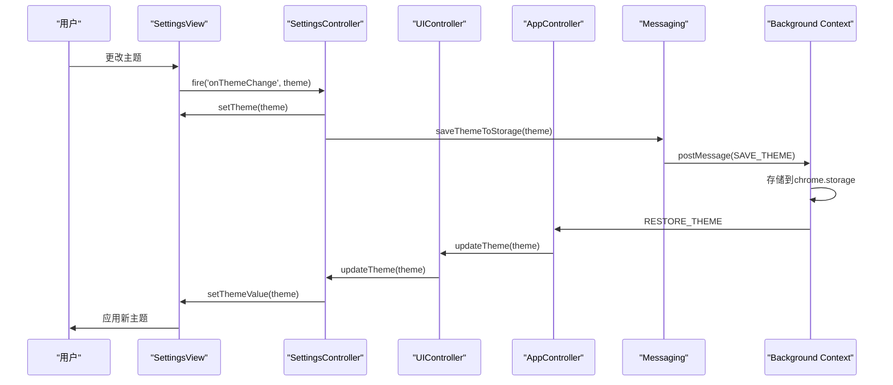
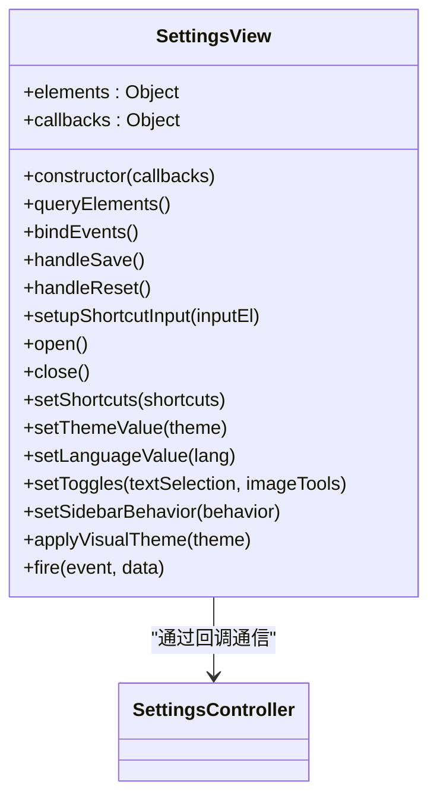
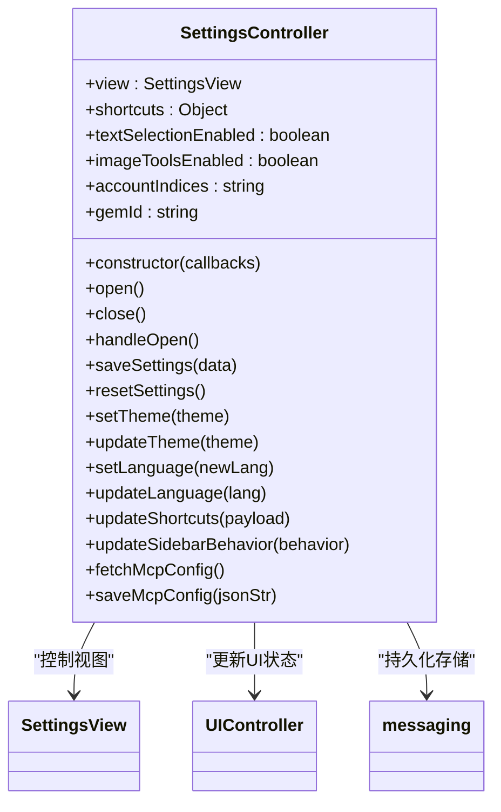
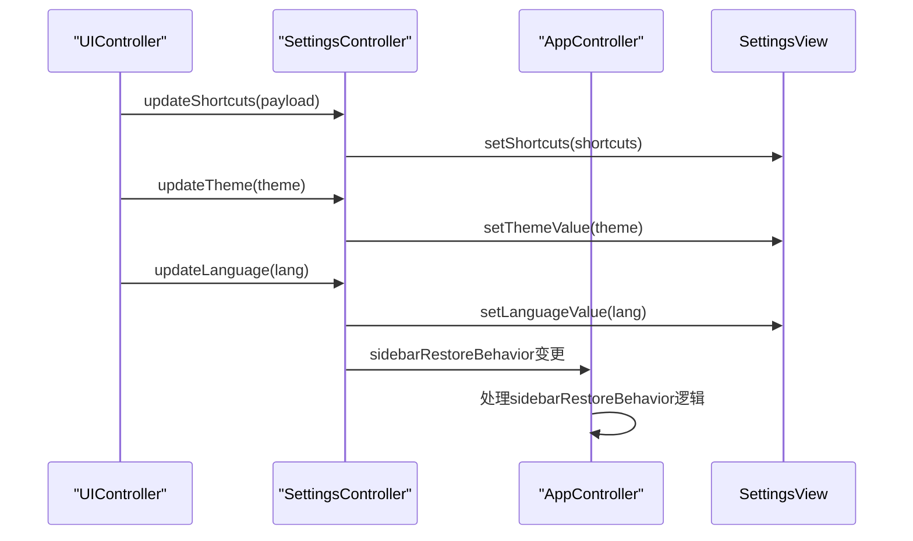
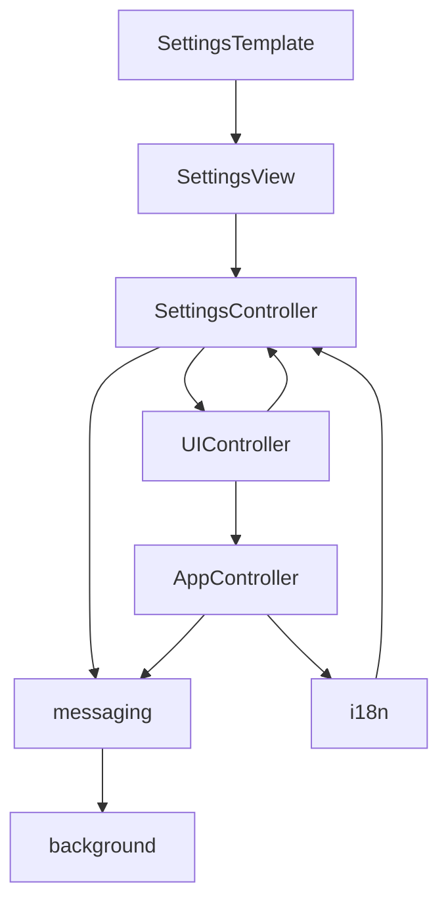

# 设置管理

<cite>
**本文档引用的文件**
- [settings.js](file://sandbox/ui/settings.js)
- [settings/view.js](file://sandbox/ui/settings/view.js)
- [ui_controller.js](file://sandbox/ui/ui_controller.js)
- [app_controller.js](file://sandbox/controllers/app_controller.js)
- [messaging.js](file://lib/messaging.js)
- [messages.js](file://background/messages.js)
- [i18n.js](file://sandbox/core/i18n.js)
- [constants.js](file://lib/constants.js)
- [settings.js](file://sandbox/ui/templates/settings.js)
</cite>

## 目录
1. [简介](#简介)
2. [项目结构](#项目结构)
3. [核心组件](#核心组件)
4. [架构概述](#架构概述)
5. [详细组件分析](#详细组件分析)
6. [依赖分析](#依赖分析)
7. [性能考虑](#性能考虑)
8. [故障排除指南](#故障排除指南)
9. [结论](#结论)

## 简介
本文档系统化描述了设置管理模块的架构设计与实现细节，重点说明了UIController如何通过updateShortcuts、updateTheme、updateLanguage等方法与SettingsController通信。阐述了AppController接收到设置变更后如何通过postMessage机制同步到background context。解释了sidebarRestoreBehavior配置项的三种模式（auto/restore/new）及其在侧边栏初始化时的应用逻辑。提供了主题切换、语言本地化、快捷键自定义等功能的完整配置流程和调试方法。

## 项目结构
设置管理模块主要由UI层、控制器层和后台消息处理层组成。UI层包含设置视图和模板，控制器层负责状态管理和用户交互，后台层处理跨上下文通信和持久化存储。

**图表来源**
- [settings.js](file://sandbox/ui/settings.js)
- [settings/view.js](file://sandbox/ui/settings/view.js)
- [ui_controller.js](file://sandbox/ui/ui_controller.js)
- [app_controller.js](file://sandbox/controllers/app_controller.js)
- [messaging.js](file://lib/messaging.js)
- [messages.js](file://background/messages.js)

**章节来源**
- [settings.js](file://sandbox/ui/settings.js)
- [settings/view.js](file://sandbox/ui/settings/view.js)

## 核心组件
设置管理模块的核心组件包括SettingsView、SettingsController、UIController和AppController。这些组件通过事件驱动的方式协同工作，实现了用户界面与后台逻辑的解耦。

**章节来源**
- [settings.js](file://sandbox/ui/settings.js)
- [ui_controller.js](file://sandbox/ui/ui_controller.js)
- [app_controller.js](file://sandbox/controllers/app_controller.js)

## 架构概述
设置管理模块采用分层架构设计，从UI层到后台层形成了清晰的通信链路。当用户在设置界面进行操作时，事件流经多个组件最终到达后台持久化存储。

**图表来源**
- [settings.js](file://sandbox/ui/settings.js)
- [settings/view.js](file://sandbox/ui/settings/view.js)
- [ui_controller.js](file://sandbox/ui/ui_controller.js)
- [app_controller.js](file://sandbox/controllers/app_controller.js)
- [messaging.js](file://lib/messaging.js)

## 详细组件分析
### SettingsView 分析
SettingsView类负责管理设置界面的DOM元素和用户交互事件。它通过回调函数与SettingsController通信，实现了视图与逻辑的分离。

**图表来源**
- [settings/view.js](file://sandbox/ui/settings/view.js)

**章节来源**
- [settings/view.js](file://sandbox/ui/settings/view.js)

### SettingsController 分析
SettingsController是设置管理的核心逻辑组件，负责维护设置状态、处理用户输入和与后台通信。

**图表来源**
- [settings.js](file://sandbox/ui/settings.js)

**章节来源**
- [settings.js](file://sandbox/ui/settings.js)

### UIController 与 AppController 通信分析
UIController作为UI层的协调者，通过delegation方法将设置变更传递给AppController，实现了跨组件通信。

**图表来源**
- [ui_controller.js](file://sandbox/ui/ui_controller.js)
- [app_controller.js](file://sandbox/controllers/app_controller.js)

**章节来源**
- [ui_controller.js](file://sandbox/ui/ui_controller.js)
- [app_controller.js](file://sandbox/controllers/app_controller.js)

## 依赖分析
设置管理模块的依赖关系清晰，各组件之间通过明确的接口进行通信，避免了紧耦合。

**图表来源**
- [settings.js](file://sandbox/ui/settings.js)
- [settings/view.js](file://sandbox/ui/settings/view.js)
- [ui_controller.js](file://sandbox/ui/ui_controller.js)
- [app_controller.js](file://sandbox/controllers/app_controller.js)
- [messaging.js](file://lib/messaging.js)
- [i18n.js](file://sandbox/core/i18n.js)

**章节来源**
- [settings.js](file://sandbox/ui/settings.js)
- [ui_controller.js](file://sandbox/ui/ui_controller.js)
- [app_controller.js](file://sandbox/controllers/app_controller.js)
- [messaging.js](file://lib/messaging.js)

## 性能考虑
设置管理模块在性能方面进行了优化，避免了不必要的重渲染和频繁的存储操作。主题切换和语言变更采用批量更新策略，减少了DOM操作次数。

## 故障排除指南
当设置功能出现异常时，可以按照以下步骤进行排查：
1. 检查浏览器控制台是否有JavaScript错误
2. 验证chrome.storage API是否正常工作
3. 确认postMessage通信是否被正确触发和处理
4. 检查事件监听器是否正确绑定

**章节来源**
- [messaging.js](file://lib/messaging.js)
- [messages.js](file://background/messages.js)

## 结论
设置管理模块通过分层架构和事件驱动的设计，实现了灵活、可维护的配置管理系统。UIController与SettingsController的通信机制清晰，AppController对sidebarRestoreBehavior的处理逻辑完善，为用户提供了一致的设置体验。