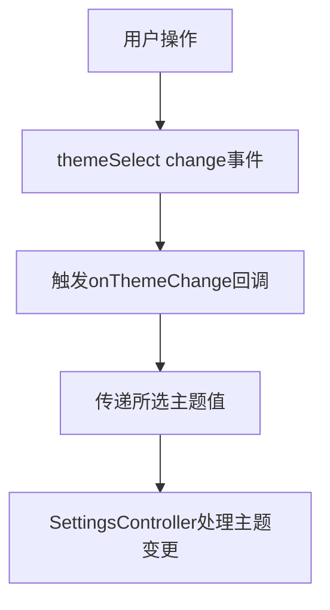
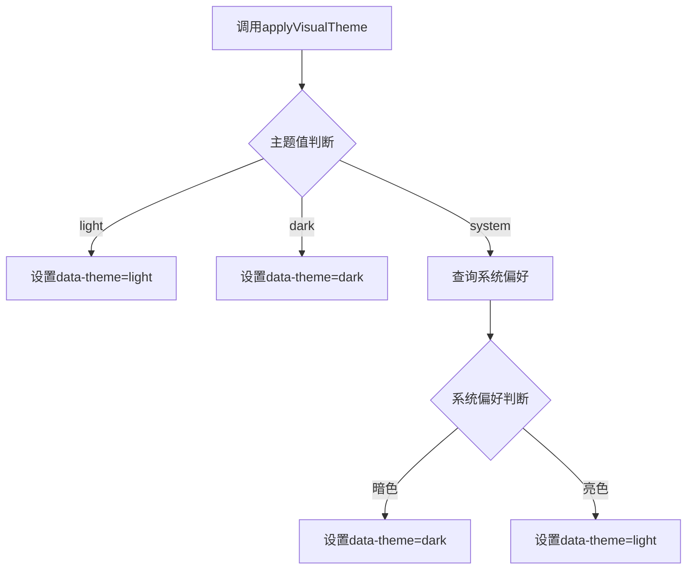
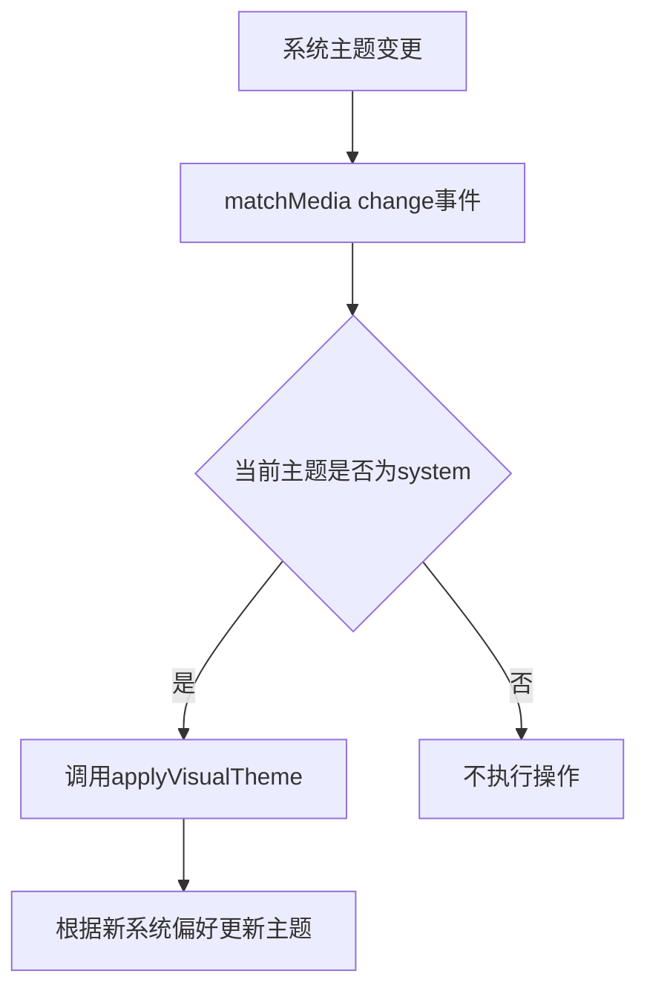
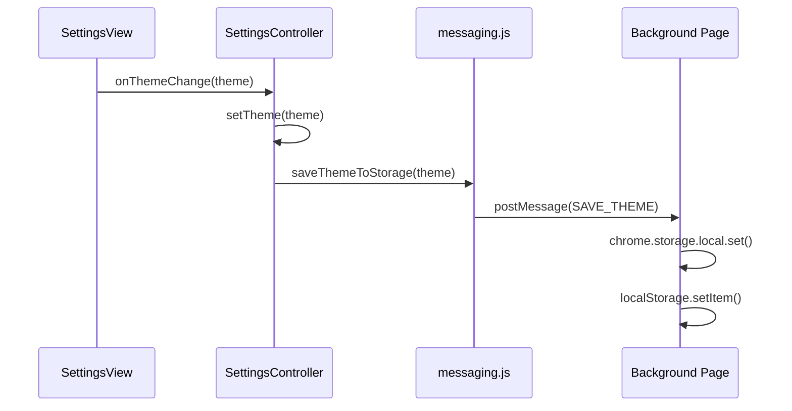
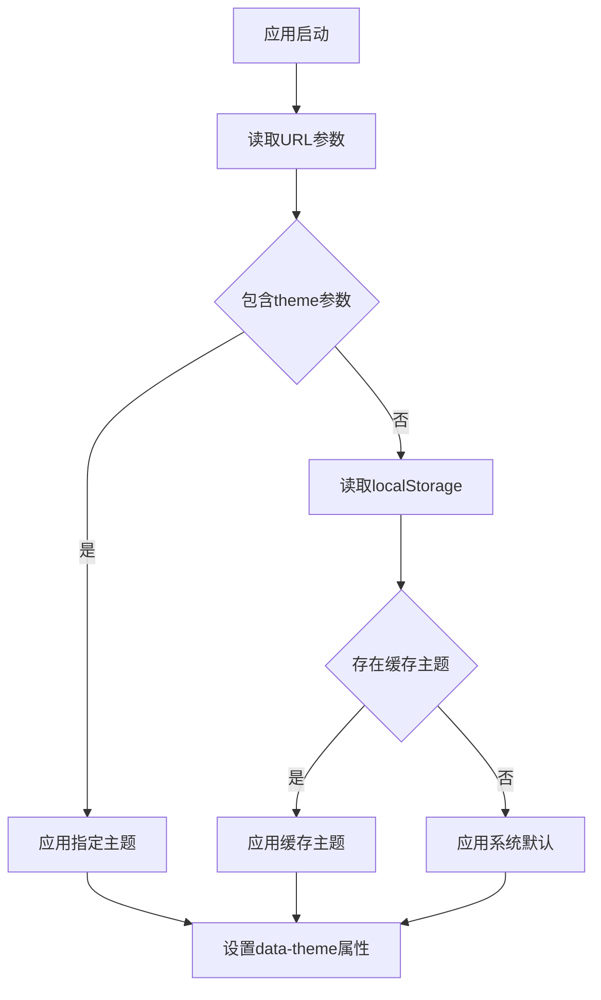

# 主题切换机制

<cite>
**本文档引用的文件**   
- [view.js](file://sandbox/ui/settings/view.js)
- [settings.js](file://sandbox/ui/settings.js)
- [base.css](file://css/base.css)
- [theme_init.js](file://sandbox/theme_init.js)
- [messaging.js](file://lib/messaging.js)
- [index.js](file://sidepanel/index.js)
- [settings.js](file://sandbox/ui/templates/settings.js)
</cite>

## 目录
1. [主题切换功能概述](#主题切换功能概述)
2. [SettingsView类中的事件监听逻辑](#settingsview类中的事件监听逻辑)
3. [applyVisualTheme方法实现机制](#applyvisualtheme方法实现机制)
4. [系统偏好主题的响应式设计](#系统偏好主题的响应式设计)
5. [CSS变量与主题联动机制](#css变量与主题联动机制)
6. [主题状态持久化流程](#主题状态持久化流程)
7. [主题初始化与恢复流程](#主题初始化与恢复流程)
8. [完整主题切换流程图](#完整主题切换流程图)

## 主题切换功能概述

主题切换功能允许用户在浅色、深色和系统默认三种模式之间进行选择。该功能通过SettingsView类实现UI交互，结合CSS变量实现视觉样式切换，并通过window.matchMedia API实现对系统偏好设置的响应式同步。主题状态通过chrome.storage.local进行持久化存储，确保跨会话的一致性。

## SettingsView类中的事件监听逻辑

SettingsView类负责管理设置界面的UI元素和事件处理。在bindEvents方法中，为themeSelect下拉框注册了change事件监听器，当用户选择不同的主题选项时触发onThemeChange回调。



**Diagram sources**
- [view.js](file://sandbox/ui/settings/view.js#L73-L75)

**Section sources**
- [view.js](file://sandbox/ui/settings/view.js#L73-L75)
- [settings.js](file://sandbox/ui/settings.js#L27)

## applyVisualTheme方法实现机制

applyVisualTheme方法是主题切换的核心实现，负责根据用户选择更新documentElement的data-theme属性。该方法处理三种主题模式：light、dark和system。在system模式下，方法会查询系统的颜色偏好设置来决定实际应用的主题。



**Diagram sources**
- [view.js](file://sandbox/ui/settings/view.js#L211-L217)

**Section sources**
- [view.js](file://sandbox/ui/settings/view.js#L211-L217)

## 系统偏好主题的响应式设计

系统偏好主题的响应式设计通过window.matchMedia API实现。在SettingsView的bindEvents方法中，注册了对(prefers-color-scheme: dark)媒体查询的监听，当系统主题发生变化时自动更新应用主题。



**Diagram sources**
- [view.js](file://sandbox/ui/settings/view.js#L100-L104)

**Section sources**
- [view.js](file://sandbox/ui/settings/view.js#L100-L104)

## CSS变量与主题联动机制

主题切换功能与base.css中的CSS变量紧密联动。通过data-theme属性控制CSS变量的定义，实现不同主题下的样式切换。:root定义了浅色主题的默认变量值，而[data-theme="dark"]则覆盖这些变量以实现深色主题。

```mermaid
classDiagram
: root {
--bg-body : #ffffff
--text-primary : #1f1f1f
--primary : #0b57d0
}
[data-theme="dark"] {
--bg-body : #131314
--text-primary : #e3e3e3
--primary : #4a90e2
}
body {
background : var(--bg-body)
color : var(--text-primary)
}
```

**Diagram sources**
- [base.css](file://css/base.css#L2-L106)

**Section sources**
- [base.css](file://css/base.css#L2-L106)

## 主题状态持久化流程

主题状态通过消息传递机制进行持久化存储。当用户选择新主题时，通过postMessage将主题值发送到背景页，由背景页使用chrome.storage.local进行存储，同时在localStorage中缓存以实现快速加载。



**Diagram sources**
- [messaging.js](file://lib/messaging.js#L29-L34)
- [index.js](file://sidepanel/index.js#L307-L310)

**Section sources**
- [messaging.js](file://lib/messaging.js#L29-L34)
- [index.js](file://sidepanel/index.js#L307-L310)

## 主题初始化与恢复流程

主题初始化在应用启动时通过theme_init.js完成。该脚本从URL参数读取主题设置，并根据系统偏好应用相应的主题。同时，sidepanel/index.js在加载时从localStorage读取缓存的主题设置，确保快速渲染正确的主题。



**Diagram sources**
- [theme_init.js](file://sandbox/theme_init.js#L3-L11)
- [index.js](file://sidepanel/index.js#L10-L14)

**Section sources**
- [theme_init.js](file://sandbox/theme_init.js#L3-L11)
- [index.js](file://sidepanel/index.js#L10-L14)

## 完整主题切换流程图

```mermaid
flowchart TD
subgraph "UI层"
A[用户选择主题] --> B[themeSelect change事件]
B --> C[触发onThemeChange回调]
end
subgraph "控制层"
C --> D[SettingsController.setTheme]
D --> E[调用applyVisualTheme]
E --> F[更新data-theme属性]
D --> G[调用saveThemeToStorage]
end
subgraph "持久化层"
G --> H[postMessage到背景页]
H --> I[chrome.storage.local.set]
H --> J[localStorage.setItem]
end
subgraph "初始化层"
K[应用启动] --> L[读取URL参数]
L --> M[读取localStorage]
M --> N[应用主题]
end
subgraph "响应式层"
O[系统主题变更] --> P[matchMedia change事件]
P --> Q{当前为system模式}
Q --> |是| R[调用applyVisualTheme]
end
F --> S[CSS变量生效]
S --> T[界面样式更新]
style subgraph fill:#f9f9f9,stroke:#ccc
```

**Diagram sources**
- [view.js](file://sandbox/ui/settings/view.js#L73-L75)
- [settings.js](file://sandbox/ui/settings.js#L27)
- [view.js](file://sandbox/ui/settings/view.js#L211-L217)
- [messaging.js](file://lib/messaging.js#L29-L34)
- [index.js](file://sidepanel/index.js#L307-L310)
- [theme_init.js](file://sandbox/theme_init.js#L3-L11)

**Section sources**
- [view.js](file://sandbox/ui/settings/view.js#L73-L75)
- [settings.js](file://sandbox/ui/settings.js#L27)
- [view.js](file://sandbox/ui/settings/view.js#L211-L217)
- [messaging.js](file://lib/messaging.js#L29-L34)
- [index.js](file://sidepanel/index.js#L307-L310)
- [theme_init.js](file://sandbox/theme_init.js#L3-L11)