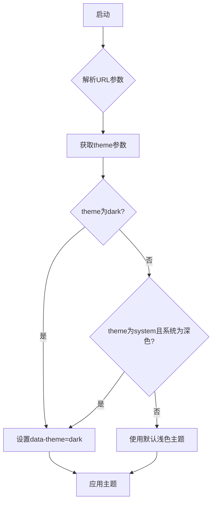

# 最佳实践与调试

<cite>
**本文档引用的文件**  
- [base.css](file://css/base.css)
- [components.css](file://css/components.css)
- [header.css](file://css/header.css)
- [input.css](file://css/input.css)
- [theme_init.js](file://sandbox/theme_init.js)
- [core.js](file://content/toolbar/styles/core.js)
- [widget.js](file://content/toolbar/styles/widget.js)
- [markdown.js](file://content/toolbar/styles/markdown.js)
- [index.js](file://content/toolbar/styles/index.js)
- [panel/index.js](file://content/toolbar/styles/panel/index.js)
- [overlay.js](file://content/overlay.js)
</cite>

## 目录
1. [引言](#引言)
2. [CSS变量与主题系统](#css变量与主题系统)
3. [样式隔离与动态注入](#样式隔离与动态注入)
4. [性能优化建议](#性能优化建议)
5. [常见问题排查](#常见问题排查)
6. [总结](#总结)

## 引言
本文档旨在提供关于Gemini Nexus扩展中样式系统的设计原则、开发与调试的最佳实践指南。文档涵盖CSS变量的命名规范与作用域管理、通过动态注入实现的样式隔离策略、性能优化建议以及常见问题的排查步骤和解决方案。

## CSS变量与主题系统

Gemini Nexus采用基于CSS自定义属性（CSS变量）的现代化主题系统，通过`:root`选择器定义全局变量，并利用`[data-theme]`属性切换深色和浅色主题。这种设计实现了高效的主题切换和样式管理。

在`base.css`文件中，`:root`选择器定义了浅色主题的默认变量，而`[data-theme="dark"]`选择器则覆盖了深色主题的变量值。所有组件样式通过`var(--variable-name)`引用这些变量，确保主题切换时整个界面的一致性变化。

主题的初始化由`sandbox/theme_init.js`文件中的立即执行函数完成。该脚本通过解析URL参数中的`theme`值来决定应用哪种主题。如果`theme`参数为`dark`，或者为`system`且系统偏好为深色模式，则在`documentElement`上设置`data-theme="dark"`属性。



**图示来源**  
- [base.css](file://css/base.css#L2-L106)
- [theme_init.js](file://sandbox/theme_init.js#L7-L11)

**本节来源**  
- [base.css](file://css/base.css#L2-L106)
- [theme_init.js](file://sandbox/theme_init.js#L1-L22)

## 样式隔离与动态注入

为了防止样式污染并确保扩展样式与页面原生样式隔离，Gemini Nexus采用了一种独特的动态样式注入策略。样式并非通过传统的CSS文件链接，而是作为JavaScript字符串动态注入到页面中。

核心机制位于`content/toolbar/styles/`目录下的多个JavaScript文件中。每个文件（如`core.js`、`widget.js`、`markdown.js`）都定义了一个立即执行函数，该函数将CSS代码作为模板字符串赋值给`window.GeminiStyles`对象的特定属性。

`content/toolbar/styles/index.js`文件负责将这些分散的样式模块组合成一个完整的样式字符串，并将其赋值给`window.GeminiToolbarStyles`。这种模块化的设计使得样式可以按需加载和组合。

`overlay.js`文件中的`SelectionOverlay`类在创建DOM元素时，直接将CSS样式通过`style.cssText`属性内联到元素上。这种方式确保了覆盖层的样式完全独立于页面的任何CSS规则，避免了样式冲突。

```mermaid
classDiagram
class GeminiStyles {
+Core : string
+Widget : string
+Markdown : string
+Panel : string
}
class StylesIndex {
+window.GeminiToolbarStyles : string
}
class Overlay {
+createDOM() : void
+attachListeners() : void
}
StylesIndex --> GeminiStyles : "组合"
Overlay --> "style.cssText" : "内联注入"
```

**图示来源**  
- [core.js](file://content/toolbar/styles/core.js#L1-L29)
- [widget.js](file://content/toolbar/styles/widget.js#L1-L225)
- [index.js](file://content/toolbar/styles/index.js#L1-L5)
- [overlay.js](file://content/overlay.js#L32-L37)

**本节来源**  
- [core.js](file://content/toolbar/styles/core.js#L1-L29)
- [widget.js](file://content/toolbar/styles/widget.js#L1-L225)
- [markdown.js](file://content/toolbar/styles/markdown.js#L1-L191)
- [index.js](file://content/toolbar/styles/index.js#L1-L5)
- [overlay.js](file://content/overlay.js#L29-L75)

## 性能优化建议

Gemini Nexus的样式系统在设计时充分考虑了性能因素，采用了多种优化策略。

首先，避免使用昂贵的CSS属性。例如，在`components.css`中，`.icon-btn`类使用了`backdrop-filter: blur(8px)`，这是一种性能开销较大的滤镜效果。虽然它提供了美观的毛玻璃效果，但在低端设备上可能会影响性能。建议在非关键路径或用户交互不频繁的区域谨慎使用此类效果。

其次，充分利用CSS变量实现高效的主题切换。由于主题切换仅通过更改`data-theme`属性来实现，浏览器只需重新计算受影响的变量值，而无需重新解析和应用整个样式表，这大大提升了切换效率。

再者，通过减少重排（reflow）和重绘（repaint）来优化性能。在`input.css`中，`.input-wrapper`的`transition`属性被精确地应用在`background`、`border-color`和`box-shadow`上，而不是使用`all`，这可以避免不必要的属性动画。同时，`will-change: transform`属性被用于`.viewer-content`，提前告知浏览器该元素将发生变换，以便进行优化。

最后，合理使用`pointer-events`属性。在`header.css`中，`.header`的`pointer-events: none`允许点击事件穿透到下方元素，而其子元素`.header-left`和`.header-right`则通过`pointer-events: auto`重新启用交互，这种精确的控制避免了不必要的事件监听。

**本节来源**  
- [components.css](file://css/components.css#L2-L17)
- [base.css](file://css/base.css#L119)
- [input.css](file://css/input.css#L53)
- [header.css](file://css/header.css#L16-L17)

## 常见问题排查

### 样式未生效

当样式未生效时，应首先检查选择器的优先级。Gemini Nexus的样式通过动态注入，其优先级取决于注入的顺序和选择器的特异性。例如，`[data-theme="dark"]`选择器的优先级高于`:root`，因此可以覆盖变量。

其次，检查样式的注入时机。`manifest.json`中`content_scripts`的`run_at`被设置为`document_end`，这意味着脚本在DOM解析完成后执行。如果样式依赖于某个特定的DOM元素，而该元素在脚本执行时尚未创建，则样式可能无法正确应用。

### 主题切换延迟

主题切换延迟通常与事件绑定有关。`theme_init.js`中的主题初始化是同步执行的，但如果存在异步操作（如从存储中读取用户偏好），则可能导致延迟。确保主题切换逻辑在页面加载的早期阶段完成，并避免不必要的异步等待。

### 覆盖层无法显示

`overlay.js`中的`SelectionOverlay`类负责创建覆盖层。如果覆盖层无法显示，应检查`z-index`值。该类使用了极高的`z-index: 2147483647`，以确保覆盖层位于所有元素之上。如果页面存在更高`z-index`的元素，可能需要调整此值。

**本节来源**  
- [base.css](file://css/base.css#L58-L106)
- [theme_init.js](file://sandbox/theme_init.js#L1-L22)
- [overlay.js](file://content/overlay.js#L31-L37)
- [manifest.json](file://manifest.json#L80)

## 总结
Gemini Nexus的样式系统通过CSS变量、动态注入和精心设计的架构，实现了主题化、隔离性和高性能。开发者应遵循其设计原则，利用CSS变量进行主题管理，理解动态注入的机制，并注意性能优化和常见问题的排查，以确保扩展的稳定和高效运行。