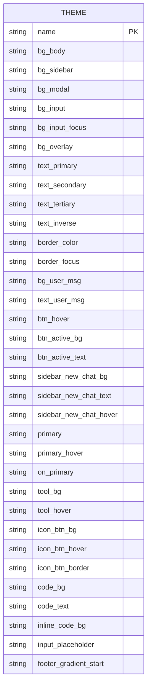
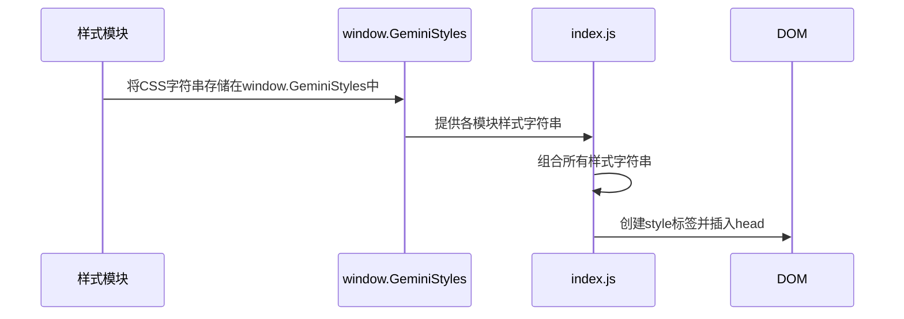
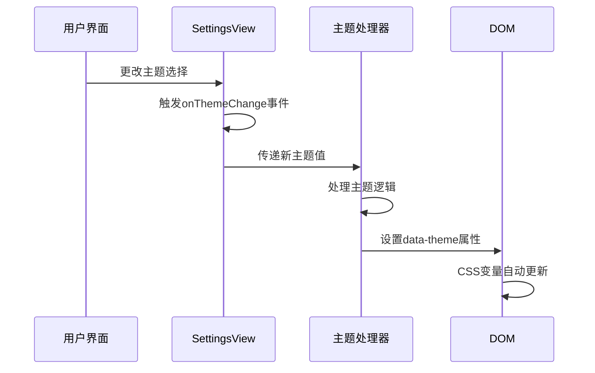
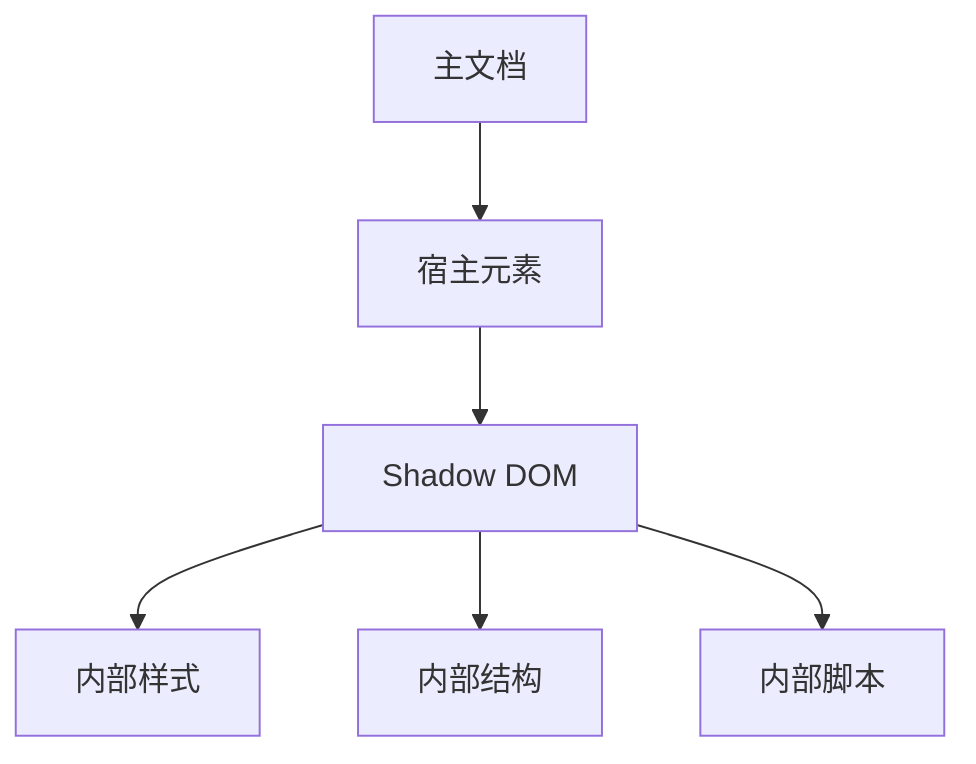

# 样式系统与主题

<cite>
**本文档中引用的文件**  
- [base.css](file://css/base.css)
- [widget.js](file://content/toolbar/styles/widget.js)
- [core.js](file://content/toolbar/styles/core.js)
- [markdown.js](file://content/toolbar/styles/markdown.js)
- [panel/layout.js](file://content/toolbar/styles/panel/layout.js)
- [panel/header.js](file://content/toolbar/styles/panel/header.js)
- [panel/body.js](file://content/toolbar/styles/panel/body.js)
- [panel/footer.js](file://content/toolbar/styles/panel/footer.js)
- [index.js](file://content/toolbar/styles/index.js)
- [panel/index.js](file://content/toolbar/styles/panel/index.js)
- [view.js](file://sandbox/ui/settings/view.js)
- [theme_init.js](file://sandbox/theme_init.js)
- [chat.css](file://css/chat.css)
- [sidebar.css](file://css/sidebar.css)
- [components.css](file://css/components.css)
</cite>

## 目录
1. [全局样式规范](#全局样式规范)
2. [组件类名约定](#组件类名约定)
3. [CSS变量定义](#css变量定义)
4. [模块化样式组织](#模块化样式组织)
5. [动态注入机制](#动态注入机制)
6. [主题切换功能](#主题切换功能)
7. [自定义主题开发指南](#自定义主题开发指南)
8. [样式隔离策略](#样式隔离策略)
9. [Shadow DOM应用实践](#shadow-dom应用实践)
10. [浏览器兼容性处理](#浏览器兼容性处理)
11. [常见问题调试](#常见问题调试)
12. [性能优化建议](#性能优化建议)

## 全局样式规范

全局样式规范主要定义在`base.css`文件中，通过CSS自定义属性（CSS Variables）实现主题化设计。该文件使用`:root`选择器定义了默认的浅色主题变量，并通过`[data-theme="dark"]`选择器覆盖深色主题的变量值。这种设计模式允许在运行时通过切换`data-theme`属性来实现主题切换。

基础样式重置包括`box-sizing: border-box`、字体族设置、页面布局和过渡效果。页面主体使用Flexbox布局，确保应用在不同屏幕尺寸下的适应性。所有颜色值都通过CSS变量引用，确保主题一致性。

**Section sources**
- [base.css](file://css/base.css#L1-L130)

## 组件类名约定

组件类名遵循语义化命名约定，采用BEM（Block Element Modifier）模式的简化形式。主要组件类名包括：
- `.toolbar`：浮动工具栏容器
- `.ask-window`：主窗口容器
- `.result-area`：结果区域
- `.window-body`：窗口主体
- `.window-footer`：窗口底部

修饰类名使用`-`连接，如`.visible`、`.hidden`、`.loading`等状态类。组件内部元素使用`-`分隔，如`.code-header`、`.copy-code-btn`等。这种命名约定提高了样式的可读性和维护性。

**Section sources**
- [widget.js](file://content/toolbar/styles/widget.js#L1-L225)
- [layout.js](file://content/toolbar/styles/panel/layout.js#L1-L108)
- [markdown.js](file://content/toolbar/styles/markdown.js#L1-L191)

## CSS变量定义

CSS变量定义在`base.css`文件中，分为浅色主题和深色主题两组。变量命名遵循语义化原则，前缀表示用途：

- `--bg-*`：背景颜色
- `--text-*`：文本颜色
- `--border-*`：边框颜色
- `--primary-*`：主色调
- `--btn-*`：按钮状态
- `--tool-*`：工具栏相关

变量值采用十六进制颜色码或RGBA值，确保在不同主题下的视觉一致性。例如，`--bg-body`在浅色主题下为`#ffffff`，在深色主题下为`#131314`。这种设计使得主题切换只需更改一个属性即可。



**Diagram sources**
- [base.css](file://css/base.css#L2-L106)

## 模块化样式组织

样式系统采用模块化组织方式，位于`content/toolbar/styles`目录下。该目录包含四个主要模块：
- `core`：核心样式，包含共享重置和基本布局
- `widget`：浮动工具栏样式
- `panel`：主窗口样式
- `markdown`：Markdown渲染样式

每个模块都有独立的JavaScript文件，通过IIFE（立即执行函数表达式）将CSS字符串注入到`window.GeminiStyles`对象中。这种组织方式实现了样式的逻辑分离和按需加载。

**Section sources**
- [core.js](file://content/toolbar/styles/core.js#L1-L29)
- [widget.js](file://content/toolbar/styles/widget.js#L1-L225)
- [markdown.js](file://content/toolbar/styles/markdown.js#L1-L191)
- [panel/index.js](file://content/toolbar/styles/panel/index.js#L1-L10)

## 动态注入机制

样式动态注入机制通过JavaScript实现。每个样式模块将CSS代码作为字符串存储在`window.GeminiStyles`对象中，然后通过`index.js`文件组合这些样式并注入到页面中。

注入过程在`content/toolbar/styles/index.js`中定义，将`Core`、`Widget`、`Panel`和`Markdown`模块的样式字符串连接，赋值给`window.GeminiToolbarStyles`。这个变量随后被用于创建样式标签并插入到DOM中。



**Diagram sources**
- [index.js](file://content/toolbar/styles/index.js#L1-L5)
- [panel/index.js](file://content/toolbar/styles/panel/index.js#L1-L10)

## 主题切换功能

主题切换功能在`settings/view.js`文件中实现。`SettingsView`类通过监听主题选择器的`change`事件，触发`onThemeChange`回调。该回调将新的主题值传递给外部处理函数。

实际的主题应用在`theme_init.js`文件中完成。该脚本读取URL参数中的`theme`值，根据值设置`document.documentElement`的`data-theme`属性。当主题为`system`时，使用`window.matchMedia`检测系统偏好设置。



**Diagram sources**
- [view.js](file://sandbox/ui/settings/view.js#L73-L75)
- [theme_init.js](file://sandbox/theme_init.js#L7-L11)

## 自定义主题开发指南

### CSS变量覆盖

要创建自定义主题，可以通过扩展`[data-theme]`选择器来覆盖现有变量。例如，创建一个名为`custom`的主题：

```css
[data-theme="custom"] {
    --bg-body: #f8f9fa;
    --text-primary: #212529;
    --primary: #0d6efd;
}
```

### 深色模式适配

深色模式适配需要确保足够的对比度和视觉舒适度。建议遵循WCAG 2.1标准，文本与背景的对比度至少为4.5:1。使用`prefers-color-scheme`媒体查询可以检测用户的系统偏好：

```css
@media (prefers-color-scheme: dark) {
    :root {
        --bg-body: #121212;
        --text-primary: #e0e0e0;
    }
}
```

### 响应式断点调整

响应式设计使用媒体查询处理不同屏幕尺寸。主要断点设置在600px，用于区分移动设备和桌面设备：

```css
@media (max-width: 600px) {
    .ask-window {
        width: 96vw;
        height: 60vh;
    }
}
```

**Section sources**
- [base.css](file://css/base.css#L58-L106)
- [theme_init.js](file://sandbox/theme_init.js#L8-L11)
- [layout.js](file://content/toolbar/styles/panel/layout.js#L92-L105)

## 样式隔离策略

样式隔离通过多种策略实现，防止样式污染和冲突。主要策略包括：

1. **命名空间前缀**：所有类名使用`gemini-`或特定组件前缀
2. **Shadow DOM**：使用Shadow DOM封装组件样式
3. **CSS变量作用域**：通过`:root`和`[data-theme]`实现变量作用域
4. **特定选择器**：使用ID和特定类名组合提高选择器特异性

这些策略确保了样式的作用域限制在预期范围内，避免影响页面其他部分。

**Section sources**
- [dom.js](file://content/toolbar/view/dom.js#L20)
- [widget.js](file://content/toolbar/styles/widget.js#L10-L25)

## Shadow DOM应用实践

Shadow DOM在`content/toolbar/view/dom.js`文件中实现。通过创建一个`div`元素作为宿主，并使用`attachShadow`方法创建封闭的Shadow DOM：

```javascript
this.host = document.createElement('div');
this.host.id = 'gemini-nexus-toolbar-host';
this.shadow = this.host.attachShadow({ mode: 'closed' });
```

封闭模式（`closed`）确保外部JavaScript无法访问Shadow DOM内部，提高了封装性和安全性。在Shadow DOM中，可以安全地注入样式和脚本，而不会影响主文档。



**Diagram sources**
- [dom.js](file://content/toolbar/view/dom.js#L20)

## 浏览器兼容性处理

浏览器兼容性通过多种技术处理：

1. **CSS前缀**：使用`-webkit-appearance`等前缀处理Webkit浏览器
2. **渐进增强**：基础功能在所有浏览器工作，高级功能在支持的浏览器中增强
3. **特性检测**：使用`@supports`规则检测CSS特性支持
4. **优雅降级**：当特性不支持时提供替代方案

例如，滚动条样式使用Webkit特定的伪元素，同时提供标准的`scrollbar-width`和`scrollbar-color`属性：

```css
/* Webkit */
::-webkit-scrollbar { width: 6px; }
::-webkit-scrollbar-thumb { background: var(--border-color); }

/* 标准 */
* {
    scrollbar-width: thin;
    scrollbar-color: var(--border-color) transparent;
}
```

**Section sources**
- [components.css](file://css/components.css#L241-L266)
- [sidebar.css](file://css/sidebar.css#L136-L141)

## 常见问题调试

### 样式不生效

检查选择器特异性是否足够，确保没有被其他样式覆盖。使用浏览器开发者工具检查计算样式。

### 主题切换失败

验证`data-theme`属性是否正确设置，检查CSS变量定义是否完整，确保没有语法错误。

### 响应式布局问题

检查媒体查询断点设置，验证视口元标签是否正确：

```html
<meta name="viewport" content="width=device-width, initial-scale=1">
```

### Shadow DOM访问问题

由于使用了`closed`模式，外部JavaScript无法访问Shadow DOM内部。需要通过公开的API进行交互。

**Section sources**
- [base.css](file://css/base.css#L108-L130)
- [dom.js](file://content/toolbar/view/dom.js#L20)

## 性能优化建议

### 样式计算优化

减少复杂选择器的使用，避免使用通配符选择器。将频繁变化的样式属性（如`transform`和`opacity`）与布局属性分离。

### 渲染性能

使用`transform`和`opacity`进行动画，这些属性可以由GPU加速。避免触发布局重排：

```css
/* 推荐 */
.element {
    transform: translateX(10px);
    opacity: 0.5;
}

/* 避免 */
.element {
    left: 10px;
    visibility: hidden;
}
```

### 资源加载

将非关键CSS内联，关键CSS尽早加载。使用`preload`提示预加载重要资源：

```html
<link rel="preload" href="critical.css" as="style">
```

### 缓存策略

利用浏览器缓存，为静态资源设置适当的缓存头。使用内容哈希确保缓存更新。

**Section sources**
- [base.css](file://css/base.css#L119)
- [widget.js](file://content/toolbar/styles/widget.js#L21-L22)