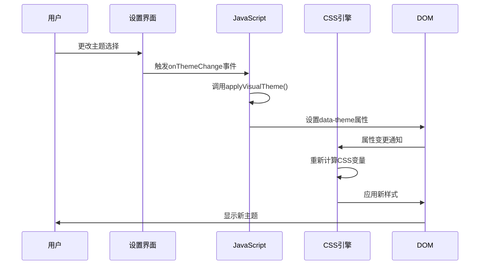

# 核心样式规范

<cite>
**本文档中引用的文件**  
- [base.css](file://css/base.css)
- [theme_init.js](file://sandbox/theme_init.js)
- [settings/view.js](file://sandbox/ui/settings/view.js)
- [index.html](file://sandbox/index.html)
- [components.css](file://css/components.css)
- [chat.css](file://css/chat.css)
</cite>

## 目录
1. [引言](#引言)
2. [CSS变量与双主题体系](#css变量与双主题体系)
3. [根元素与主题定义](#根元素与主题定义)
4. [重置样式与基础布局](#重置样式与基础布局)
5. [主题切换机制](#主题切换机制)
6. [过渡动画与用户体验](#过渡动画与用户体验)
7. [扩展与自定义](#扩展与自定义)
8. [结论](#结论)

## 引言

本项目采用基于CSS自定义属性（CSS Variables）的现代化样式架构，实现了完整的明暗双主题支持。通过`:root`选择器定义全局变量，并利用`[data-theme="dark"]`选择器进行主题覆盖，构建了一套灵活、可维护的样式系统。该系统不仅涵盖了颜色、间距、字体等基础设计语言，还通过JavaScript实现了动态主题切换功能，为用户提供流畅的视觉体验。

## CSS变量与双主题体系

项目中的`base.css`文件定义了完整的颜色体系和设计令牌（Design Tokens），这些变量构成了整个应用的视觉基础。系统采用明暗双主题设计，以适应不同用户的视觉偏好和使用环境。

### 颜色体系

颜色变量被组织为逻辑分组，包括背景色、文本色、边框色、交互元素色等。每个主题都定义了完整的调色板：

- **背景色**：`--bg-body`、`--bg-sidebar`、`--bg-modal`等
- **文本色**：`--text-primary`、`--text-secondary`、`--text-tertiary`等
- **交互色**：`--primary`、`--primary-hover`、`--btn-hover`等
- **特殊用途色**：`--code-bg`、`--inline-code-bg`、`--bg-overlay`等

**Section sources**
- [base.css](file://css/base.css#L4-L56)
- [base.css](file://css/base.css#L60-L106)

### 间距与字体

系统定义了统一的间距和字体栈，确保跨组件的一致性：

- **字体栈**：`'Segoe UI', Roboto, 'Helvetica Neue', Arial, sans-serif`
- **代码字体栈**：`'SFMono-Regular', Consolas, 'Liberation Mono', Menlo, monospace`

这些基础样式在`body`选择器中统一应用，为整个应用提供了协调的视觉语言。

**Section sources**
- [base.css](file://css/base.css#L111)
- [chat.css](file://css/chat.css#L276)

## 根元素与主题定义

`:root`选择器是CSS变量的全局定义位置，它为整个文档树提供了默认的样式值。在本项目中，`:root`定义了明亮主题的所有变量，作为系统的默认外观。

### 默认主题（明亮模式）

`:root`选择器下的变量定义了明亮主题的完整调色板。例如，`--bg-body: #ffffff`定义了页面背景为纯白，`--text-primary: #1f1f1f`定义了主要文本为深灰色。这些变量构成了应用的基础视觉风格。

### 暗色主题覆盖

`[data-theme="dark"]`选择器通过属性选择器机制，当HTML根元素具有`data-theme="dark"`属性时，会覆盖`:root`中定义的所有变量。这种设计模式允许在不改变HTML结构的情况下，通过切换一个属性来实现整个应用的视觉转换。

暗色主题并非简单地将明亮主题反色，而是经过精心设计的独立调色板。例如，`--primary`主色从明亮模式的`#0b57d0`调整为`#4a90e2`，以适应暗背景下的视觉平衡。

```mermaid
classDiagram
class ThemeVariables {
+--bg-body
+--bg-sidebar
+--bg-modal
+--text-primary
+--text-secondary
+--primary
+--primary-hover
}
ThemeVariables <|-- LightTheme
ThemeVariables <|-- DarkTheme
LightTheme : --bg-body : #ffffff
LightTheme : --text-primary : #1f1f1f
LightTheme : --primary : #0b57d0
DarkTheme : --bg-body : #131314
DarkTheme : --text-primary : #e3e3e3
DarkTheme : --primary : #4a90e2
```

**Diagram sources**
- [base.css](file://css/base.css#L2-L56)
- [base.css](file://css/base.css#L58-L106)

**Section sources**
- [base.css](file://css/base.css#L2-L106)

## 重置样式与基础布局

除了CSS变量，`base.css`还定义了关键的重置样式和基础布局规则，确保跨浏览器的一致性。

### body选择器

`body`选择器应用了全局的布局和视觉样式：
- 使用Flexbox布局，`display: flex; flex-direction: column; height: 100vh;`
- 应用CSS变量作为背景和文本颜色
- 设置字体栈和抗锯齿
- 定义了`overflow: hidden`以控制滚动行为

这些样式为应用提供了稳定的基础布局框架。

### 通用选择器重置

`* { box-sizing: border-box; }`规则是现代CSS重置的关键部分。它改变了CSS的盒模型计算方式，使得元素的`width`和`height`包含`padding`和`border`，大大简化了布局计算，避免了常见的尺寸计算错误。

**Section sources**
- [base.css](file://css/base.css#L108-L130)

## 主题切换机制

项目的主题切换功能通过HTML属性与JavaScript的协同工作实现，提供了一种高效且可扩展的解决方案。

### 初始化逻辑

`theme_init.js`文件在页面加载时立即执行，负责根据URL参数或系统偏好设置初始主题。它通过`document.documentElement.setAttribute('data-theme', 'dark')`直接操作HTML根元素的属性，触发CSS的重新计算。

### 用户界面控制

在`settings/view.js`中，主题选择器的变更事件会调用`applyVisualTheme`方法，该方法根据当前选择的主题值（light、dark或system）来设置`data-theme`属性。对于"system"选项，它会查询`window.matchMedia('(prefers-color-scheme: dark)')`来获取用户的系统偏好。

### 动态切换

JavaScript通过直接修改`data-theme`属性来实现主题的即时切换。由于所有样式都基于CSS变量，这一操作会自动触发整个应用样式的重新计算，无需重新加载页面或执行复杂的DOM操作。



**Diagram sources**
- [theme_init.js](file://sandbox/theme_init.js#L8-L11)
- [settings/view.js](file://sandbox/ui/settings/view.js#L211-L217)
- [base.css](file://css/base.css#L2-L106)

**Section sources**
- [theme_init.js](file://sandbox/theme_init.js#L1-L22)
- [settings/view.js](file://sandbox/ui/settings/view.js#L211-L217)

## 过渡动画与用户体验

为了提升主题切换的用户体验，系统在`body`选择器中定义了平滑的过渡效果。

### 过渡属性

`body`选择器中的`transition: background-color 0.2s ease, color 0.2s ease`规则为背景色和文本色的变化添加了0.2秒的缓动过渡。这使得主题切换不再是突兀的颜色跳跃，而是柔和的渐变过程，减少了视觉冲击。

### 性能考虑

选择`background-color`和`color`而非`background`和`all`进行过渡，是出于性能的考虑。这两个属性通常可以由CSS合成器（Compositor）独立处理，避免触发重排（reflow）和重绘（repaint），从而确保动画的流畅性。

**Section sources**
- [base.css](file://css/base.css#L119)

## 扩展与自定义

该样式系统设计为可扩展的，允许在不破坏现有主题的情况下添加新的设计变量。

### 扩展方法

要添加新的主题变量，应在`:root`和`[data-theme="dark"]`选择器中同时定义。例如，要添加一个新的成功状态色，可以这样扩展：

```css
:root {
    --success: #28a745;
    /* ... 其他变量 */
}

[data-theme="dark"] {
    --success: #3fb950;
    /* ... 其他变量 */
}
```

### 注意事项

- **变量命名**：应采用一致的命名约定，如`--component-state-property`模式
- **颜色选择**：暗色主题的颜色不应是明亮主题的简单反色，而应考虑对比度和可访问性
- **性能**：避免在`transition`属性中使用`all`，应明确指定需要动画的属性
- **继承**：确保关键的文本样式在`body`上正确设置，以便子元素继承

**Section sources**
- [base.css](file://css/base.css#L2-L106)

## 结论

本项目通过精心设计的CSS变量系统，实现了高效、可维护的明暗双主题支持。`:root`选择器提供了全局的样式定义，`[data-theme="dark"]`选择器实现了主题覆盖，而JavaScript则提供了动态切换的能力。`body`和`*`选择器的重置样式确保了布局的一致性，而`transition`属性则提升了用户体验。这一架构不仅满足了当前的需求，还为未来的样式扩展提供了坚实的基础。