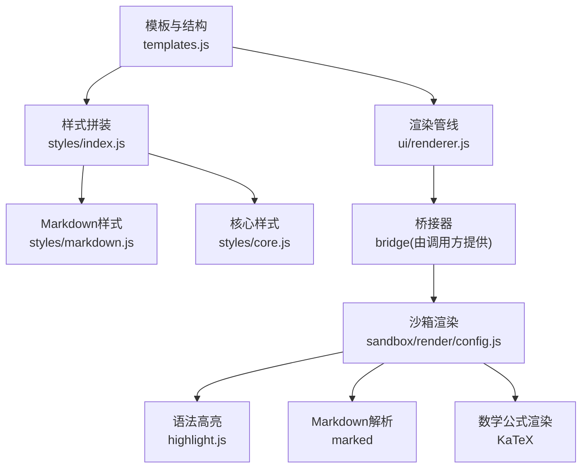
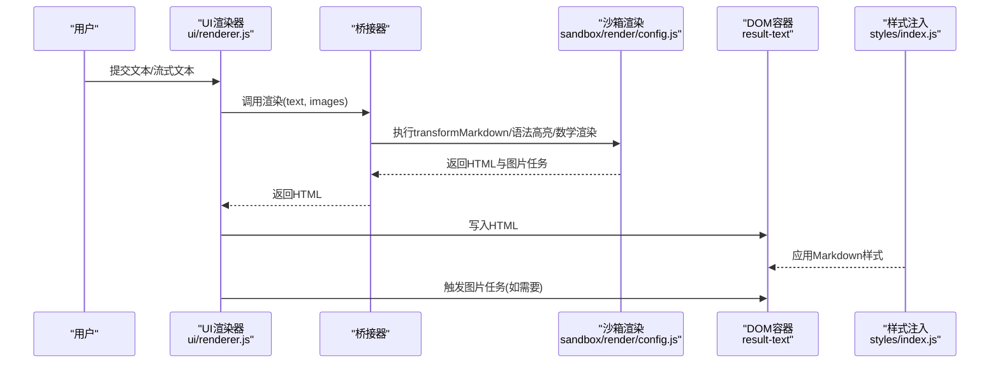
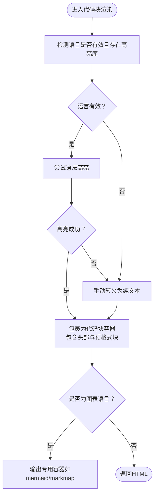
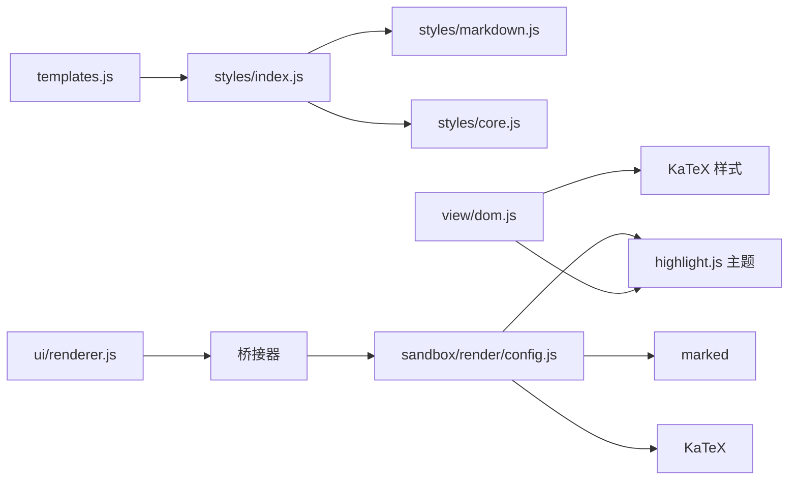

# Markdown内容样式

<cite>
**本文引用的文件**
- [content/toolbar/styles/markdown.js](file://content/toolbar/styles/markdown.js)
- [content/toolbar/styles/core.js](file://content/toolbar/styles/core.js)
- [content/toolbar/styles/index.js](file://content/toolbar/styles/index.js)
- [content/toolbar/templates.js](file://content/toolbar/templates.js)
- [content/toolbar/view/dom.js](file://content/toolbar/view/dom.js)
- [content/toolbar/ui/renderer.js](file://content/toolbar/ui/renderer.js)
- [sandbox/render/config.js](file://sandbox/render/config.js)
- [sandbox/render/content.js](file://sandbox/render/content.js)
</cite>

## 目录
1. [简介](#简介)
2. [项目结构](#项目结构)
3. [核心组件](#核心组件)
4. [架构总览](#架构总览)
5. [详细组件分析](#详细组件分析)
6. [依赖关系分析](#依赖关系分析)
7. [性能考量](#性能考量)
8. [故障排查指南](#故障排查指南)
9. [结论](#结论)
10. [附录：自定义配置示例](#附录自定义配置示例)

## 简介
本文件聚焦于工具栏渲染区域中“AI生成内容”的Markdown排版规则与样式实现，系统性说明标题层级（h1–h6）的字号与间距、代码块的语法高亮与背景色、列表（ul/ol）的缩进与项目符号、引用块（blockquote）的边框与内边距等关键样式，解释它们如何提升可读性与美观性，并与整体工具栏风格保持一致。同时提供可操作的自定义建议，帮助在不破坏整体风格的前提下调整代码块字体、列表符号样式或引用块颜色。

## 项目结构
工具栏渲染采用“模板注入 + 样式拼装 + 渲染管线”的分层设计：
- 模板层：通过模板字符串生成主结构，注入合并后的CSS样式。
- 样式层：将核心样式、面板样式、小部件样式与Markdown样式按顺序拼接，形成最终样式表。
- 渲染层：在沙箱环境中使用marked + highlight.js进行Markdown解析与语法高亮；在工具栏侧通过桥接器将结果注入DOM。

图表来源
- [content/toolbar/templates.js](file://content/toolbar/templates.js#L116-L124)
- [content/toolbar/styles/index.js](file://content/toolbar/styles/index.js#L1-L5)
- [content/toolbar/styles/markdown.js](file://content/toolbar/styles/markdown.js#L1-L191)
- [content/toolbar/styles/core.js](file://content/toolbar/styles/core.js#L1-L29)
- [content/toolbar/ui/renderer.js](file://content/toolbar/ui/renderer.js#L1-L87)
- [sandbox/render/config.js](file://sandbox/render/config.js#L1-L79)

章节来源
- [content/toolbar/templates.js](file://content/toolbar/templates.js#L1-L124)
- [content/toolbar/styles/index.js](file://content/toolbar/styles/index.js#L1-L5)
- [content/toolbar/styles/markdown.js](file://content/toolbar/styles/markdown.js#L1-L191)
- [content/toolbar/styles/core.js](file://content/toolbar/styles/core.js#L1-L29)
- [content/toolbar/ui/renderer.js](file://content/toolbar/ui/renderer.js#L1-L87)
- [sandbox/render/config.js](file://sandbox/render/config.js#L1-L79)

## 核心组件
- Markdown样式模块：定义标题、段落、列表、代码块、表格、链接、图片、引用块等元素的排版与配色。
- 核心样式模块：提供通用重置、布局与加载动画等基础样式。
- 模板与样式拼装：将各模块样式合并注入到Shadow DOM中，供工具栏使用。
- 渲染器：负责将文本转换为HTML并注入到结果区域，支持图片异步加载与错误回退。
- 沙箱渲染：在隔离环境中完成Markdown解析、语法高亮与数学公式渲染。

章节来源
- [content/toolbar/styles/markdown.js](file://content/toolbar/styles/markdown.js#L1-L191)
- [content/toolbar/styles/core.js](file://content/toolbar/styles/core.js#L1-L29)
- [content/toolbar/styles/index.js](file://content/toolbar/styles/index.js#L1-L5)
- [content/toolbar/templates.js](file://content/toolbar/templates.js#L116-L124)
- [content/toolbar/ui/renderer.js](file://content/toolbar/ui/renderer.js#L1-L87)
- [sandbox/render/config.js](file://sandbox/render/config.js#L1-L79)

## 架构总览
下图展示从输入文本到最终渲染的端到端流程，以及样式与渲染的关键交互点。

图表来源
- [content/toolbar/ui/renderer.js](file://content/toolbar/ui/renderer.js#L18-L44)
- [sandbox/render/config.js](file://sandbox/render/config.js#L19-L65)
- [content/toolbar/styles/index.js](file://content/toolbar/styles/index.js#L1-L5)

章节来源
- [content/toolbar/ui/renderer.js](file://content/toolbar/ui/renderer.js#L1-L87)
- [sandbox/render/config.js](file://sandbox/render/config.js#L1-L79)
- [content/toolbar/styles/index.js](file://content/toolbar/styles/index.js#L1-L5)

## 详细组件分析

### 标题层级（h1–h6）排版规则
- 字号与权重
  - h1：字号较大并带底部边框，强调层级起点。
  - h2：中等字号，用于二级标题。
  - h3：较小字号，用于三级标题。
  - h1–h3均设置统一的顶部/底部外边距，保证层次清晰且间距一致。
- 颜色与粗细
  - 统一使用深色文字，加粗权重，确保对比度与可读性。
- 间距策略
  - 顶部外边距大于底部外边距，避免标题紧贴正文，营造呼吸感。
  - 段落末尾无底部外边距，避免重复留白。

章节来源
- [content/toolbar/styles/markdown.js](file://content/toolbar/styles/markdown.js#L26-L29)

### 列表（ul/ol）排版规则
- 缩进与间距
  - 统一左侧内边距用于指示层级，列表项之间有轻微底部间距，避免拥挤。
- 项目符号
  - 默认使用浏览器原生符号，简洁自然；若需自定义，可在不破坏整体风格的前提下引入自定义符号样式（见附录）。

章节来源
- [content/toolbar/styles/markdown.js](file://content/toolbar/styles/markdown.js#L31-L32)

### 代码块（Code Block）排版规则
- 结构与背景
  - 外层容器具备圆角、边框与浅灰背景，提供视觉隔离与层次感。
  - 容器内含头部区（语言标识与复制按钮），便于识别与交互。
- 语法高亮
  - 使用highlight.js主题（one-dark），对注释、关键字、字符串、类型等进行分类着色，增强可读性。
  - 若高亮失败，自动降级为纯文本转义输出，保证安全与可用性。
- 字体与内边距
  - 行内代码使用等宽字体与微小内边距；块级代码容器提供充足内边距以提升阅读体验。
- 复制交互
  - 复制按钮悬停时有轻微背景变化，反馈明确。

图表来源
- [sandbox/render/config.js](file://sandbox/render/config.js#L19-L65)

章节来源
- [content/toolbar/styles/markdown.js](file://content/toolbar/styles/markdown.js#L34-L100)
- [sandbox/render/config.js](file://sandbox/render/config.js#L19-L65)
- [content/toolbar/view/dom.js](file://content/toolbar/view/dom.js#L41-L44)

### 引用块（blockquote）排版规则
- 边框与内边距
  - 左侧细长蓝色边框，右侧与底部圆角，配合内边距形成清晰的引用提示。
- 背景色与文字色
  - 轻量背景色与中性文字色，避免喧宾夺主，突出引用语境。
- 间距策略
  - 上下外边距统一，确保与正文的层次关系清晰。

章节来源
- [content/toolbar/styles/markdown.js](file://content/toolbar/styles/markdown.js#L175-L183)

### 其他关键样式要点
- 段落与行高
  - 段落底部留白，最后一段无底部外边距，避免多余空白。
- 链接
  - 默认蓝色无装饰，悬停下划线，符合常见阅读习惯。
- 表格
  - 合并边框、交替行背景，保证数据可读性。
- 图片
  - 标准图片与生成图片网格布局，统一圆角与边框，生成图片在加载态有占位与半透明效果。

章节来源
- [content/toolbar/styles/markdown.js](file://content/toolbar/styles/markdown.js#L23-L24)
- [content/toolbar/styles/markdown.js](file://content/toolbar/styles/markdown.js#L134-L141)
- [content/toolbar/styles/markdown.js](file://content/toolbar/styles/markdown.js#L114-L132)
- [content/toolbar/styles/markdown.js](file://content/toolbar/styles/markdown.js#L143-L149)
- [content/toolbar/styles/markdown.js](file://content/toolbar/styles/markdown.js#L151-L173)

## 依赖关系分析
- 样式依赖
  - 模板通过样式拼装入口将核心样式、Markdown样式等合并注入。
  - DOM加载阶段额外注入highlight.js主题与KaTeX样式，确保渲染一致性。
- 渲染依赖
  - 渲染器通过桥接器调用沙箱渲染，沙箱内部使用marked与highlight.js，数学公式由KaTeX处理。
- 交互依赖
  - 生成图片的异步加载通过消息机制触发，完成后替换占位图或显示错误提示。

图表来源
- [content/toolbar/styles/index.js](file://content/toolbar/styles/index.js#L1-L5)
- [content/toolbar/styles/markdown.js](file://content/toolbar/styles/markdown.js#L1-L191)
- [content/toolbar/styles/core.js](file://content/toolbar/styles/core.js#L1-L29)
- [content/toolbar/templates.js](file://content/toolbar/templates.js#L116-L124)
- [content/toolbar/view/dom.js](file://content/toolbar/view/dom.js#L41-L44)
- [content/toolbar/ui/renderer.js](file://content/toolbar/ui/renderer.js#L26-L43)
- [sandbox/render/config.js](file://sandbox/render/config.js#L19-L65)

章节来源
- [content/toolbar/styles/index.js](file://content/toolbar/styles/index.js#L1-L5)
- [content/toolbar/view/dom.js](file://content/toolbar/view/dom.js#L1-L50)
- [content/toolbar/ui/renderer.js](file://content/toolbar/ui/renderer.js#L1-L87)
- [sandbox/render/config.js](file://sandbox/render/config.js#L1-L79)

## 性能考量
- 语法高亮降级
  - 当高亮库不可用或语言无效时，自动降级为纯文本转义，避免阻塞渲染。
- 滚动条优化
  - 结果区域滚动条宽度与颜色与整体风格一致，减少视觉跳变。
- 数学公式渲染
  - 仅在AI响应场景启用KaTeX自动渲染，避免对用户输入造成额外开销。
- 图片异步加载
  - 生成图片采用占位与延迟加载策略，减少首屏压力。

章节来源
- [sandbox/render/config.js](file://sandbox/render/config.js#L29-L42)
- [content/toolbar/styles/markdown.js](file://content/toolbar/styles/markdown.js#L17-L19)
- [sandbox/render/content.js](file://sandbox/render/content.js#L14-L26)
- [content/toolbar/ui/renderer.js](file://content/toolbar/ui/renderer.js#L46-L78)

## 故障排查指南
- 代码块未高亮
  - 检查高亮库是否正确注入（模板加载阶段会注入主题样式）。
  - 确认语言标识是否有效，无效语言将降级为纯文本。
- 语法高亮异常
  - 若高亮抛错，将自动转义为纯文本；检查控制台是否有异常日志。
- 引用块颜色不协调
  - 可通过覆盖对应CSS变量或类名进行微调，但建议保持与工具栏整体色调一致。
- 列表符号样式不一致
  - 默认使用浏览器原生符号；如需自定义，建议在不改变层级缩进的前提下引入自定义符号样式。

章节来源
- [content/toolbar/view/dom.js](file://content/toolbar/view/dom.js#L41-L44)
- [sandbox/render/config.js](file://sandbox/render/config.js#L29-L42)
- [content/toolbar/styles/markdown.js](file://content/toolbar/styles/markdown.js#L102-L112)

## 结论
该Markdown样式体系围绕“可读性优先”与“工具栏风格统一”两大目标展开：标题层级清晰、列表缩进合理、代码块具备语法高亮与复制交互、引用块具备明确边界与柔和背景。通过沙箱渲染与桥接器协作，既保证了安全性与稳定性，又提升了AI生成内容的呈现质量。在不破坏整体风格的前提下，可按附录建议进行有限度的定制化调整。

## 附录：自定义配置示例
以下为可操作的自定义建议，帮助在现有样式基础上进行微调，确保与工具栏风格协调。

- 自定义代码块字体
  - 方案：修改等宽字体族与字号，保持与整体一致的阅读节奏。
  - 参考路径：[等宽字体与字号定义](file://content/toolbar/styles/markdown.js#L86-L99)
  - 注意：避免过细或过粗的字体，以免影响可读性。

- 自定义列表符号样式
  - 方案：通过伪元素或自定义符号图片替换默认符号，保持缩进与间距不变。
  - 参考路径：[列表缩进与间距](file://content/toolbar/styles/markdown.js#L31-L32)
  - 注意：尽量使用矢量图标或简单几何形状，避免与工具栏图标冲突。

- 自定义引用块颜色
  - 方案：调整左侧边框色、背景色与文字色，确保对比度与可读性。
  - 参考路径：[引用块边框与背景](file://content/toolbar/styles/markdown.js#L175-L183)
  - 注意：建议采用工具栏主题色系中的辅助色，避免过于鲜艳。

- 自定义代码块主题
  - 方案：在DOM加载阶段切换highlight.js主题链接，或在沙箱渲染中选择不同主题。
  - 参考路径：[主题注入位置](file://content/toolbar/view/dom.js#L41-L44)、[高亮降级逻辑](file://sandbox/render/config.js#L29-L42)

- 自定义标题层级样式
  - 方案：按需调整h1–h3的字号、边框与内边距，保持层级递减与间距一致。
  - 参考路径：[标题层级样式](file://content/toolbar/styles/markdown.js#L26-L29)