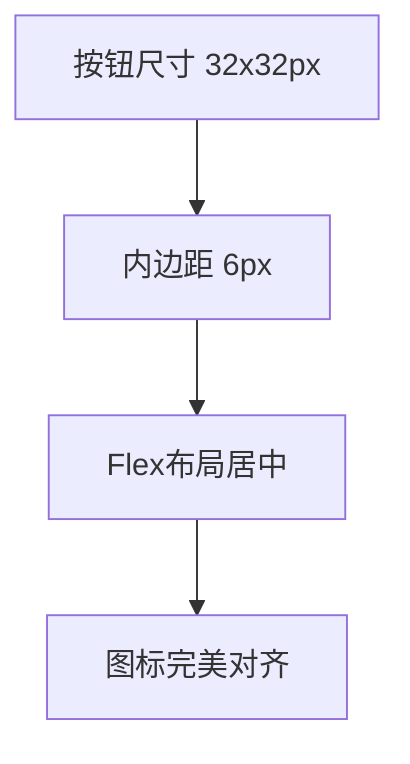
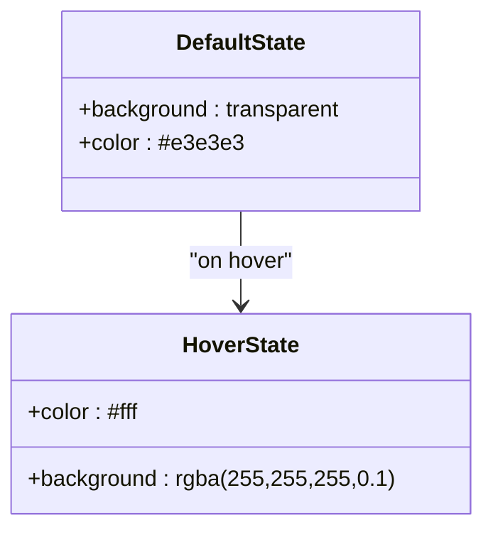
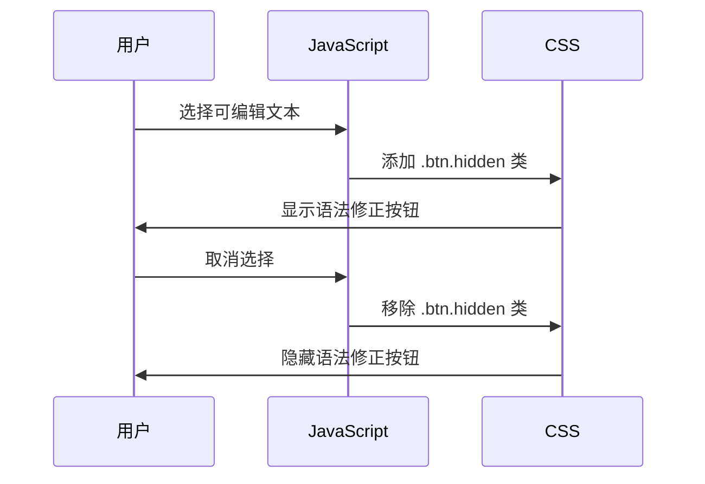

# 工具图标样式

<cite>
**本文档引用的文件**   
- [widget.js](file://content/toolbar/styles/widget.js)
- [actions_delegate.js](file://content/toolbar/ui/actions_delegate.js)
- [icons.js](file://content/toolbar/icons.js)
- [templates.js](file://content/toolbar/templates.js)
- [manager.js](file://content/toolbar/ui/manager.js)
- [controller.js](file://content/toolbar/controller.js)
</cite>

## 目录
1. [简介](#简介)
2. [工具按钮视觉设计](#工具按钮视觉设计)
3. [图标样式分类与状态管理](#图标样式分类与状态管理)
4. [用户交互与样式状态变化](#用户交互与样式状态变化)
5. [自定义开发指导](#自定义开发指导)
6. [结论](#结论)

## 简介
本文档深入分析Gemini Nexus扩展中工具按钮（.gemini-tool-btn）的视觉设计和交互机制。重点分析位于`content/toolbar/styles/widget.js`中的CSS样式定义，包括尺寸、圆角、图标对齐、颜色主题及过渡动画。同时，结合`content/toolbar/ui/actions_delegate.js`等文件，解释用户交互如何触发按钮状态变化，并提供自定义按钮主题的开发指导。

## 工具按钮视觉设计

### 尺寸与布局
工具按钮采用统一的尺寸标准，确保视觉一致性。主工具栏中的按钮（`.btn`）定义了精确的尺寸和布局属性：
- **尺寸**：固定为32px × 32px的正方形。
- **内边距**：6px，提供舒适的点击区域。
- **布局**：使用`display: flex`进行居中对齐，确保图标在按钮内水平和垂直居中。
- **间距**：工具栏（`.toolbar`）内的按钮通过`gap: 4px`保持4px的间距。



**Diagram sources**
- [widget.js](file://content/toolbar/styles/widget.js#L46-L48)

### 圆角设计
按钮的圆角设计遵循现代UI美学，提供柔和的视觉体验：
- **主按钮**：`.btn`类定义了`border-radius: 6px`，形成轻微的圆角。
- **工具栏容器**：整个工具栏（`.toolbar`）具有更大的圆角`border-radius: 8px`，作为视觉容器。
- **拖拽手柄**：拖拽手柄（`.toolbar-drag-handle`）也保持一致的圆角设计。

这种分层的圆角策略（6px按钮 + 8px容器）增强了界面的层次感和精致度。

**Section sources**
- [widget.js](file://content/toolbar/styles/widget.js#L40)
- [widget.js](file://content/toolbar/styles/widget.js#L17)

### 颜色主题与状态
工具按钮的颜色主题设计精良，通过不同状态提供清晰的视觉反馈：

#### 默认状态
- **背景**：`background: transparent`，保持透明，不遮挡底层内容。
- **文字/图标颜色**：`color: #e3e3e3`，一种柔和的浅灰色，确保在深色背景上的可读性。

#### 悬停状态
- **背景**：`background: rgba(255, 255, 255, 0.1)`，添加10%透明度的白色遮罩，产生明显的悬停效果。
- **文字/图标颜色**：`color: #fff`，变为纯白色，增强对比度。

#### 激活状态
虽然`.btn`本身没有定义`:active`状态，但其父级工具栏在拖拽时会应用`cursor: grabbing`，提供间接的激活反馈。



**Diagram sources**
- [widget.js](file://content/toolbar/styles/widget.js#L36-L38)
- [widget.js](file://content/toolbar/styles/widget.js#L49-L52)

### 过渡动画
过渡动画是提升用户体验的关键。工具按钮的过渡设计如下：
- **属性**：`transition: background 0.15s`，仅对背景颜色应用过渡。
- **时机**：0.15秒的持续时间既不会过快而难以察觉，也不会过慢而显得迟钝。
- **缓动函数**：未指定，使用默认的`ease`函数。

这种简洁的过渡专注于最重要的视觉变化（背景），避免了不必要的动画干扰。

**Section sources**
- [widget.js](file://content/toolbar/styles/widget.js#L44)

## 图标样式分类与状态管理

### 图标样式分类
工具图标根据功能分为不同的类别，其样式在`icons.js`中定义：

#### 核心功能图标
- **询问 (ASK)**：对话气泡图标，代表与Gemini AI交互。
- **翻译 (TRANSLATE)**：翻译箭头图标，表示语言转换功能。
- **解释 (EXPLAIN)**：双文档图标，用于解释选中内容。
- **总结 (SUMMARIZE)**：三行文本图标，用于内容摘要。

#### 图像处理图标
- **移除背景 (REMOVE_BG)**：带删除线的矩形。
- **文字移除 (REMOVE_TEXT)**：带删除线的头像。
- **画质提升 (UPSCALE)**：对角线放大图标。
- **扩图 (EXPAND)**：四角扩展图标。

这些图标通过统一的14x14或16x16的`viewBox`和`currentColor`填充，确保在不同状态下颜色能正确继承。

**Section sources**
- [icons.js](file://content/toolbar/icons.js#L13-L42)

### 状态管理机制
按钮的状态管理通过CSS类和JavaScript协同工作：

#### 隐藏状态
- **CSS**：`.btn.hidden`类通过`display: none`隐藏按钮。
- **JS**：`templates.js`在构建HTML时，为不总是显示的按钮（如语法修正）预设`hidden`类。

#### 激活/禁用状态
系统通过动态添加/移除CSS类来管理状态。例如，语法修正按钮的显示由`manager.js`根据上下文动态控制。



**Diagram sources**
- [widget.js](file://content/toolbar/styles/widget.js#L53-L55)
- [manager.js](file://content/toolbar/ui/manager.js#L201-L202)

## 用户交互与样式状态变化

### 事件绑定机制
用户交互通过`events.js`中的事件监听器与样式状态变化关联：

- **事件类型**：使用`mousedown`而非`click`，提供更快的响应速度。
- **事件委托**：`ToolbarEvents`类将事件绑定到具体的按钮元素。

```javascript
// 伪代码示例
this._add(buttons.translate, 'mousedown', (e) => {
    this.controller.actions.triggerAction(e, 'translate');
});
```

**Section sources**
- [events.js](file://content/toolbar/events.js#L18)

### 交互流程
当用户与工具按钮交互时，完整的流程如下：

1.  **用户点击**：用户点击翻译按钮。
2.  **事件捕获**：`events.js`捕获`mousedown`事件。
3.  **动作触发**：调用`actions_delegate.js`中的`triggerAction`方法。
4.  **状态变化**：`controller.js`处理动作，可能改变UI状态。
5.  **视觉反馈**：CSS的`:hover`和`:active`伪类自动提供视觉反馈。

`actions_delegate.js`中的`triggerAction`方法是核心枢纽，它阻止默认事件并触发回调，确保交互的原子性和一致性。

**Section sources**
- [actions_delegate.js](file://content/toolbar/ui/actions_delegate.js#L15-L18)
- [controller.js](file://content/toolbar/controller.js#L223-L233)

## 自定义开发指导

### 自定义主题色
要自定义按钮主题色，建议通过覆盖CSS变量或直接修改CSS类：

```css
/* 推荐：通过CSS变量覆盖 */
.gemini-tool-btn:hover {
    background: rgba(0, 120, 212, 0.15) !important; /* 蓝色主题 */
    color: #0078d4 !important;
}
```

**注意**：避免修改原始文件，应在用户样式表中进行覆盖。

### 调整图标大小
图标大小由SVG的`width`和`height`属性控制。在`icons.js`中，大多数图标设置为14px或16px。要统一调整，可以修改这些值。

### 交互反馈效果
系统已内置了良好的反馈效果。如需增强，可扩展`transition`属性：

```css
.btn {
    transition: background 0.15s, transform 0.1s;
}
.btn:hover {
    transform: scale(1.05);
}
```

这将为悬停状态添加轻微的放大效果，提升交互感。

**Section sources**
- [icons.js](file://content/toolbar/icons.js#L13)
- [widget.js](file://content/toolbar/styles/widget.js#L44)

## 结论
Gemini Nexus的工具按钮设计体现了现代UI设计的最佳实践：统一的尺寸、柔和的圆角、清晰的状态反馈和流畅的过渡动画。通过CSS和JavaScript的紧密结合，实现了功能与美学的平衡。开发者在进行自定义时，应遵循现有设计系统，通过非侵入式的方式（如CSS覆盖）进行扩展，以保持整体体验的一致性。