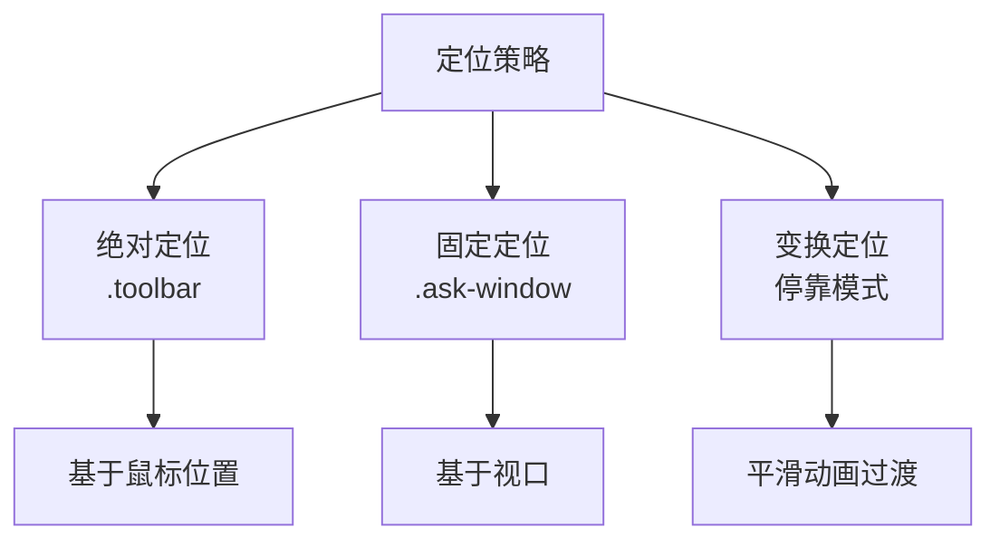
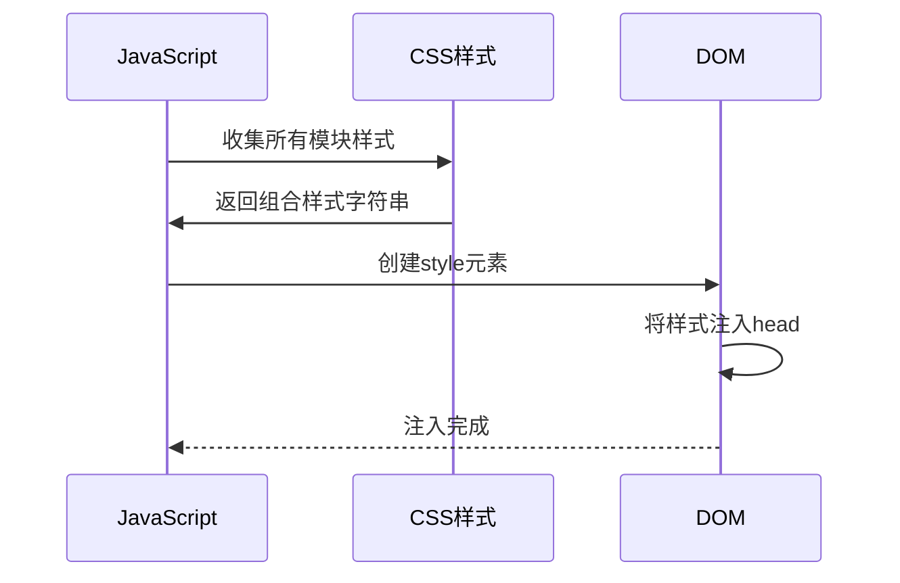
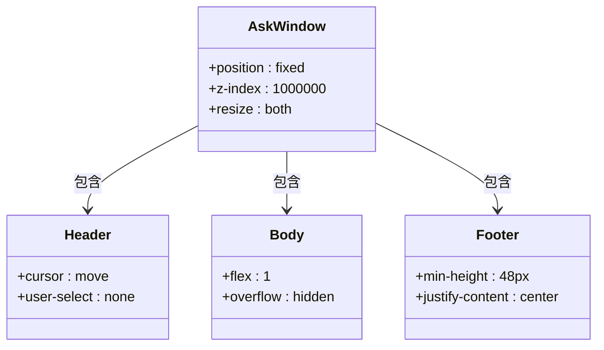
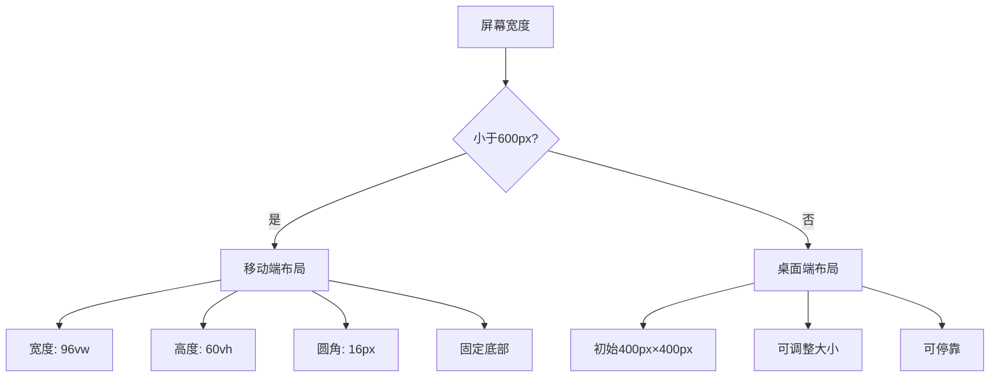

# 核心布局样式

<cite>
**本文档中引用的文件**   
- [core.js](file://content/toolbar/styles/core.js)
- [widget.js](file://content/toolbar/styles/widget.js)
- [index.js](file://content/toolbar/styles/index.js)
- [panel/layout.js](file://content/toolbar/styles/panel/layout.js)
- [panel/header.js](file://content/toolbar/styles/panel/header.js)
- [panel/body.js](file://content/toolbar/styles/panel/body.js)
- [panel/footer.js](file://content/toolbar/styles/panel/footer.js)
- [panel/index.js](file://content/toolbar/styles/panel/index.js)
- [view/index.js](file://content/toolbar/view/index.js)
</cite>

## 目录
1. [简介](#简介)
2. [核心CSS类名与盒模型分析](#核心css类名与盒模型分析)
3. [定位与层叠上下文](#定位与层叠上下文)
4. [样式模块化与注入机制](#样式模块化与注入机制)
5. [DOM结构与样式配合](#dom结构与样式配合)
6. [响应式布局与断点](#响应式布局与断点)
7. [自定义配置示例](#自定义配置示例)

## 简介
本文档详细解析Gemini工具栏的核心CSS样式系统，重点分析`core.js`中定义的基础类名及其布局规则。文档将阐述这些样式如何与JavaScript组件协同工作，构建出完整的用户界面框架，并通过动态样式注入实现作用域隔离。

## 核心CSS类名与盒模型分析

### 基础重置与共享样式
`core.js`文件定义了基础的样式重置规则和共享类名，为整个工具栏提供一致的视觉基础。`.view`类采用Flexbox布局，设置为垂直方向的列式排列，并通过`gap: 12px`创建统一的间距系统。`.view.hidden`类通过`display: none`实现元素的隐藏，这是组件可见性控制的基础机制。

### 工具栏容器盒模型
`.toolbar`类定义了浮动工具栏的核心盒模型：
- **定位**: `position: absolute`使其脱离文档流，可自由定位
- **尺寸**: 无固定宽高，由内容自适应
- **内边距**: `padding: 4px`提供内部空间
- **边框**: `border-radius: 8px`创建圆角外观
- **背景**: 深色背景`#1e1e1e`提供现代感
- **阴影**: 双层阴影增强立体感

### 询问窗口盒模型
`.ask-window`类定义了主窗口的盒模型：
- **定位**: `position: fixed`固定在视口
- **尺寸**: 初始`400px × 400px`，支持用户调整
- **约束**: `max-width: 90vw`和`max-height: 90vh`防止溢出
- **调整**: `resize: both`允许用户拖拽调整大小
- **溢出**: `overflow: hidden`确保调整功能正常工作

**Section sources**
- [core.js](file://content/toolbar/styles/core.js#L7-L8)
- [widget.js](file://content/toolbar/styles/widget.js#L10-L25)
- [panel/layout.js](file://content/toolbar/styles/panel/layout.js#L5-L32)

## 定位与层叠上下文

### 层叠上下文与z-index
样式系统通过精心设计的z-index值创建清晰的层叠关系：
- `.toolbar`使用`z-index: 999999`确保始终位于页面内容之上
- `.image-btn`使用`z-index: 1000000`确保图像工具按钮在工具栏之上
- `.ask-window`使用`z-index: 1000000`确保询问窗口在所有元素之上

这种分层设计避免了UI元素之间的视觉冲突，确保用户交互的优先级。

### 定位策略
系统采用多种定位策略满足不同场景需求：
- **浮动工具栏**: 使用`absolute`定位，根据鼠标位置动态显示
- **询问窗口**: 使用`fixed`定位，相对于视口固定
- **停靠模式**: 通过`transform`和`translateX`实现平滑的停靠动画

停靠功能特别设计了视觉反馈：当窗口停靠在左侧或右侧时，会显示一个蓝色的指示条（通过`::after`伪元素实现），并在悬停时隐藏，提供直观的交互提示。



**Diagram sources**
- [widget.js](file://content/toolbar/styles/widget.js#L11-L25)
- [panel/layout.js](file://content/toolbar/styles/panel/layout.js#L6-L58)

**Section sources**
- [widget.js](file://content/toolbar/styles/widget.js#L11-L25)
- [panel/layout.js](file://content/toolbar/styles/panel/layout.js#L6-L90)

## 样式模块化与注入机制

### 模块化样式架构
样式系统采用模块化设计，将不同功能的CSS分离到独立文件中：
- `core.js`: 基础重置和共享样式
- `widget.js`: 浮动工具栏样式
- `panel/*.js`: 询问窗口各部分样式
- `markdown.js`: 结果区域的Markdown渲染样式

这种分离提高了代码的可维护性和可扩展性。

### 动态注入与作用域隔离
样式通过JavaScript动态注入，确保与页面原有样式隔离：



**Diagram sources**
- [index.js](file://content/toolbar/styles/index.js#L2-L5)
- [panel/index.js](file://content/toolbar/styles/panel/index.js#L6-L9)

`styles/index.js`文件负责将所有模块样式组合成一个完整的样式字符串`window.GeminiToolbarStyles`，然后在运行时注入到页面中。这种方式避免了样式冲突，确保了组件的独立性。

**Section sources**
- [index.js](file://content/toolbar/styles/index.js#L2-L5)
- [panel/index.js](file://content/toolbar/styles/panel/index.js#L6-L9)

## DOM结构与样式配合

### 工具栏DOM结构
浮动工具栏的DOM结构与样式紧密配合：
- `.toolbar`: 主容器，包含所有按钮
- `.toolbar-drag-handle`: 拖拽手柄，提供移动功能
- `.btn`: 通用按钮样式
- `.ai-tool-trigger`: AI工具触发按钮

### 询问窗口DOM结构
询问窗口采用标准的对话框结构：
- `.ask-window`: 外层容器，处理定位和大小
- `.ask-header`: 标题栏，包含标题和操作按钮
- `.window-body`: 内容区域，包含输入和结果
- `.window-footer`: 底部栏，包含操作按钮



**Diagram sources**
- [panel/layout.js](file://content/toolbar/styles/panel/layout.js#L5-L32)
- [panel/header.js](file://content/toolbar/styles/panel/header.js#L6-L15)
- [panel/body.js](file://content/toolbar/styles/panel/body.js#L6-L15)
- [panel/footer.js](file://content/toolbar/styles/panel/footer.js#L6-L15)

`view/index.js`文件中的`ToolbarView`类负责管理这些DOM元素的引用和状态更新，通过`cacheElements`方法预先获取所有关键元素的引用，提高运行时性能。

**Section sources**
- [panel/layout.js](file://content/toolbar/styles/panel/layout.js#L5-L32)
- [panel/header.js](file://content/toolbar/styles/panel/header.js#L6-L82)
- [panel/body.js](file://content/toolbar/styles/panel/body.js#L6-L63)
- [panel/footer.js](file://content/toolbar/styles/panel/footer.js#L6-L103)
- [view/index.js](file://content/toolbar/view/index.js#L25-L74)

## 响应式布局与断点

### 移动端适配
系统通过媒体查询实现响应式设计，在小屏幕设备上自动调整布局：



**Diagram sources**
- [panel/layout.js](file://content/toolbar/styles/panel/layout.js#L92-L105)

当屏幕宽度小于600px时，询问窗口自动切换到移动端布局：宽度占视口的96%，高度为视口的60%，固定在页面底部，圆角增大到16px，提供更好的触摸体验。同时禁用调整大小和停靠功能，简化移动设备上的交互。

**Section sources**
- [panel/layout.js](file://content/toolbar/styles/panel/layout.js#L92-L105)

## 自定义配置示例

### 修改容器尺寸
可以通过覆盖CSS变量或直接修改样式来调整工具栏尺寸：

```css
/* 自定义工具栏尺寸 */
.toolbar {
    width: 200px !important;
    height: 40px !important;
}

/* 自定义询问窗口尺寸 */
.ask-window {
    width: 500px !important;
    height: 600px !important;
}
```

### 调整位置
可以修改定位属性来改变元素位置：

```css
/* 将工具栏固定在页面顶部 */
.toolbar {
    position: fixed !important;
    top: 20px !important;
    left: 50% !important;
    transform: translateX(-50%) !important;
}

/* 将询问窗口默认停靠在左侧 */
.ask-window {
    left: 0 !important;
    right: auto !important;
    transform: translateX(calc(-100% + 8px)) !important;
}
```

### 修改响应式断点
可以调整媒体查询的断点值以适应不同需求：

```css
/* 修改响应式断点为800px */
@media (max-width: 800px) {
    .ask-window {
        width: 96vw !important;
        height: 60vh !important;
        left: 2vw !important;
        right: 2vw !important;
        bottom: 12px !important;
        border-radius: 16px;
        transform: none !important;
    }
}
```

这些自定义配置可以在不修改核心代码的情况下，灵活调整工具栏的外观和行为，满足不同用户的个性化需求。

**Section sources**
- [panel/layout.js](file://content/toolbar/styles/panel/layout.js#L92-L105)
- [widget.js](file://content/toolbar/styles/widget.js#L10-L25)