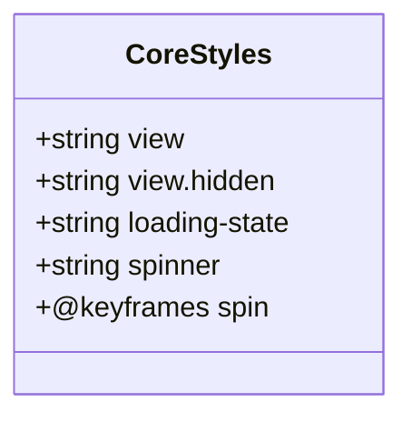
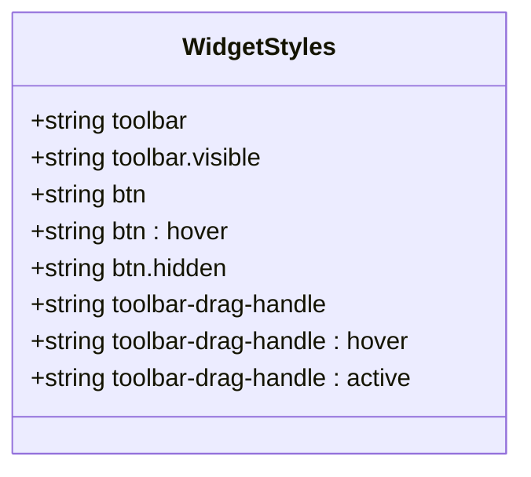
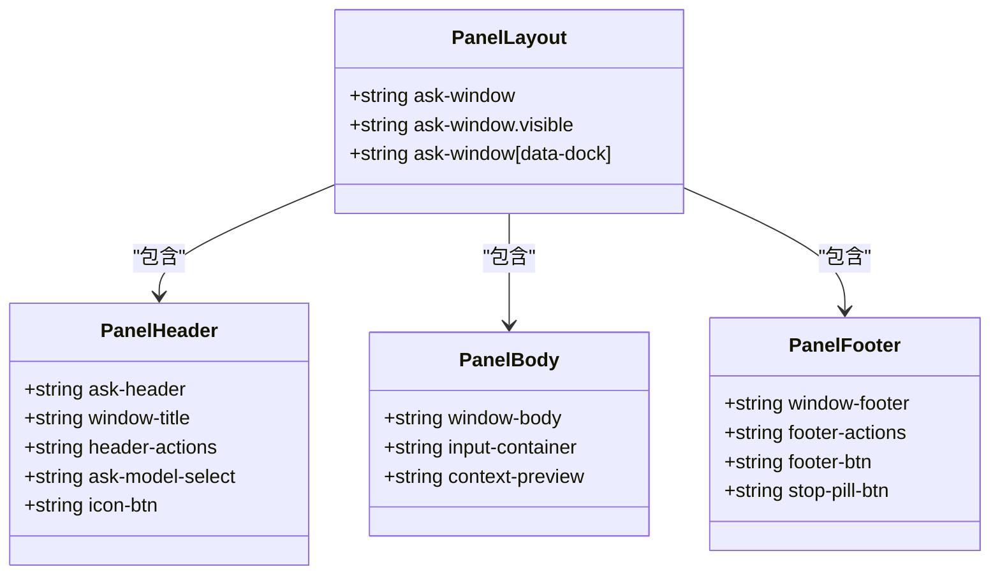
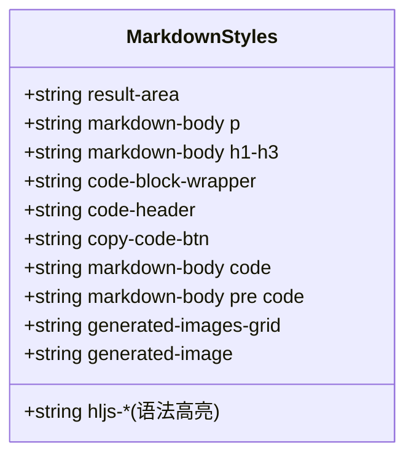
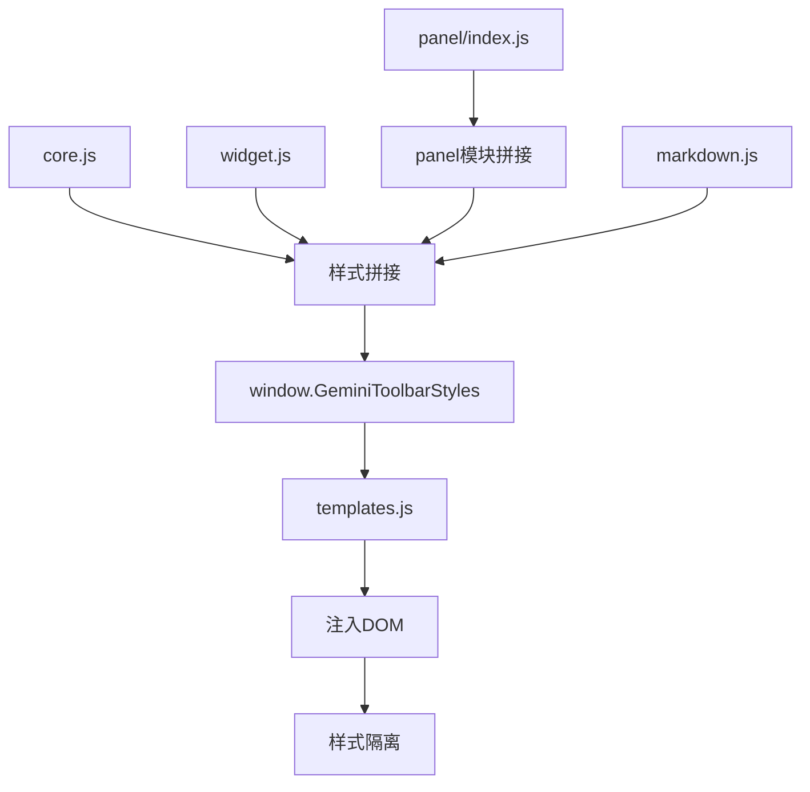

# 组件样式定制

<cite>
**本文档引用的文件**  
- [core.js](file://content/toolbar/styles/core.js)
- [widget.js](file://content/toolbar/styles/widget.js)
- [markdown.js](file://content/toolbar/styles/markdown.js)
- [index.js](file://content/toolbar/styles/index.js)
- [panel/layout.js](file://content/toolbar/styles/panel/layout.js)
- [panel/header.js](file://content/toolbar/styles/panel/header.js)
- [panel/body.js](file://content/toolbar/styles/panel/body.js)
- [panel/footer.js](file://content/toolbar/styles/panel/footer.js)
- [panel/index.js](file://content/toolbar/styles/panel/index.js)
- [templates.js](file://content/toolbar/templates.js)
- [controller.js](file://content/toolbar/controller.js)
</cite>

## 目录
1. [简介](#简介)
2. [核心样式组织结构](#核心样式组织结构)
3. [工具栏基础样式分析](#工具栏基础样式分析)
4. [工具图标按钮的视觉与交互样式](#工具图标按钮的视觉与交互样式)
5. [面板布局与间距设计](#面板布局与间距设计)
6. [内容排版样式定制](#内容排版样式定制)
7. [样式动态拼接与注入机制](#样式动态拼接与注入机制)
8. [自定义组件样式开发示例](#自定义组件样式开发示例)
9. [总结](#总结)

## 简介
本文档详细阐述了Gemini工具栏各模块的样式组织结构，包括核心类名定义、工具图标按钮的视觉样式与交互状态、面板布局设计、内容排版规则以及样式动态注入机制。通过分析相关样式文件，为开发者提供自定义工具栏组件样式的指导。

## 核心样式组织结构

工具栏的样式系统采用模块化设计，将不同功能区域的样式分离到独立的JavaScript文件中，通过命名空间`window.GeminiStyles`进行组织管理。这种设计实现了样式的逻辑分离和可维护性。

主要样式模块包括：
- `core.js`：定义全局重置样式和基础类
- `widget.js`：定义工具栏和工具图标的样式
- `panel/`目录：包含面板头部、主体、底部的布局样式
- `markdown.js`：定义生成内容的排版样式
- `index.js`：负责样式模块的动态拼接

这种模块化结构使得样式管理更加清晰，便于团队协作和后期维护。

**Section sources**
- [core.js](file://content/toolbar/styles/core.js)
- [widget.js](file://content/toolbar/styles/widget.js)
- [markdown.js](file://content/toolbar/styles/markdown.js)

## 工具栏基础样式分析

`core.js`文件定义了工具栏的基础类名和共享样式，其中`.gemini-toolbar`（在代码中体现为`.view`）是核心布局容器。



**Diagram sources**
- [core.js](file://content/toolbar/styles/core.js#L7-L27)

`.view`类采用Flex布局，设置主轴方向为垂直排列，并定义了12px的项目间距。当元素需要隐藏时，通过`.view.hidden`类将其`display`属性设置为`none`。

加载状态样式`.loading-state`同样使用Flex布局居中对齐内容，包含一个旋转的`.spinner`元素，通过CSS动画实现持续旋转效果。这些基础样式为整个工具栏提供了统一的视觉基调和交互反馈。

**Section sources**
- [core.js](file://content/toolbar/styles/core.js#L7-L28)

## 工具图标按钮的视觉与交互样式

`widget.js`文件定义了工具栏及其图标按钮的完整视觉样式和交互状态。



**Diagram sources**
- [widget.js](file://content/toolbar/styles/widget.js#L10-L84)

工具栏`.toolbar`采用绝对定位，背景色为深灰色（#1e1e1e），圆角8px，配有阴影效果增强层次感。默认状态下透明度为0且不可交互，通过`.visible`类激活时，使用缓动过渡动画实现平滑的显示效果。

工具按钮`.btn`设置为32×32px的正方形，背景透明，文字颜色为浅灰色（#e3e3e3）。悬停状态（`:hover`）下背景变为10%透明度的白色，文字变为纯白，提供清晰的视觉反馈。激活状态（`:active`）通过缩放变换增强点击感。

拖拽手柄`.toolbar-drag-handle`设计为窄条形，鼠标悬停时颜色变亮，激活时显示为纯白，明确指示其可拖拽功能。

**Section sources**
- [widget.js](file://content/toolbar/styles/widget.js#L10-L84)

## 面板布局与间距设计

面板样式分布在`panel/`目录下，通过多个文件分别定义布局、头部、主体和底部的样式。



**Diagram sources**
- [panel/layout.js](file://content/toolbar/styles/panel/layout.js#L5-L107)
- [panel/header.js](file://content/toolbar/styles/panel/header.js#L6-L81)
- [panel/body.js](file://content/toolbar/styles/panel/body.js#L6-L62)
- [panel/footer.js](file://content/toolbar/styles/panel/footer.js#L6-L102)

### 面板整体布局
`.ask-window`作为主容器，采用固定定位，尺寸为400×400px，最小尺寸限制为320×250px，最大尺寸不超过视口的90%。支持双向调整大小（`resize: both`），配有12px圆角和阴影效果。

### 头部设计
`.ask-header`使用Flex布局，包含窗口标题`.window-title`和操作按钮组`.header-actions`。模型选择器`.ask-model-select`设计为胶囊形状，悬停时背景变亮，提供良好的交互体验。

### 主体设计
`.window-body`作为内容主体，采用Flex布局填充剩余空间，内边距为8px 16px 16px 16px。输入容器`.input-container`下方有12px间距，上下文预览`.context-preview`也保持12px底部间距。

### 底部设计
`.window-footer`高度固定为48px，包含操作按钮组和停止按钮。按钮组分为左右两部分，通过`.footer-btn`类定义基础样式，主按钮采用蓝色填充，提供明确的视觉层次。

**Section sources**
- [panel/layout.js](file://content/toolbar/styles/panel/layout.js#L5-L107)
- [panel/header.js](file://content/toolbar/styles/panel/header.js#L6-L81)
- [panel/body.js](file://content/toolbar/styles/panel/body.js#L6-L62)
- [panel/footer.js](file://content/toolbar/styles/panel/footer.js#L6-L102)

## 内容排版样式定制

`markdown.js`文件定义了生成内容的排版样式，确保输出内容的可读性和美观性。



**Diagram sources**
- [markdown.js](file://content/toolbar/styles/markdown.js#L6-L188)

### 基础排版
`.result-area`作为结果区域容器，行高设置为1.6，文字颜色为深灰色（#1f1f1f）。段落之间保持12px间距，标题根据级别设置不同的字号和间距。

### 代码块样式
代码块通过`.code-block-wrapper`容器实现，背景为浅灰色（#f4f6f8），边框为#e1e3e1，圆角8px。代码头部`.code-header`包含语言标识和复制按钮，采用Flex布局。

内联代码使用`.markdown-body code`类，背景为5%透明度的黑色，圆角4px。代码块内的代码则去除背景，保持清晰可读。

### 语法高亮
通过一系列`.hljs-*`类实现语法高亮，为注释、关键字、字符串等不同语法元素分配特定颜色，提升代码的可读性。

### 图片布局
生成的图片采用`.generated-images-grid`网格布局，自动适应容器宽度，最小项目宽度180px，间距8px。单个图片`.generated-image`保持1:1比例，圆角8px，边框为#e0e0e0。

**Section sources**
- [markdown.js](file://content/toolbar/styles/markdown.js#L6-L188)

## 样式动态拼接与注入机制

样式系统通过`index.js`文件实现动态拼接和注入，确保样式隔离和按需加载。



**Diagram sources**
- [index.js](file://content/toolbar/styles/index.js#L4)
- [panel/index.js](file://content/toolbar/styles/panel/index.js#L6-L9)
- [templates.js](file://content/toolbar/templates.js#L118)

### 样式拼接流程
1. `panel/index.js`首先将面板各部分样式（header、body、footer、layout）拼接为`window.GeminiStyles.Panel`
2. `index.js`将核心样式、工具栏样式、面板样式和Markdown样式拼接为`window.GeminiToolbarStyles`
3. `templates.js`在创建DOM结构时，将`window.GeminiToolbarStyles`注入到`<style>`标签中

### 样式隔离实现
通过以下机制实现样式隔离：
- 使用特定类名避免全局污染
- 在模板中内联样式，确保作用域限制在工具栏组件内
- 通过JavaScript动态注入，避免与页面原有样式冲突

这种设计确保了工具栏样式不会影响页面原有内容，同时保持了良好的性能和可维护性。

**Section sources**
- [index.js](file://content/toolbar/styles/index.js#L4)
- [panel/index.js](file://content/toolbar/styles/panel/index.js#L6-L9)
- [templates.js](file://content/toolbar/templates.js#L7-L118)

## 自定义组件样式开发示例

要自定义工具栏组件样式，开发者可以遵循以下模式：

```javascript
// 自定义样式注入示例
(function() {
    // 扩展现有样式系统
    window.GeminiStyles = window.GeminiStyles || {};
    
    // 添加自定义样式
    window.GeminiStyles.Custom = `
        /* 自定义按钮样式 */
        .custom-btn {
            background: linear-gradient(135deg, #667eea 0%, #764ba2 100%);
            border: none;
            color: white;
            padding: 8px 16px;
            border-radius: 20px;
            font-weight: 500;
            cursor: pointer;
            box-shadow: 0 4px 15px rgba(102, 126, 234, 0.3);
            transition: all 0.3s ease;
        }
        
        .custom-btn:hover {
            transform: translateY(-2px);
            box-shadow: 0 7px 20px rgba(102, 126, 234, 0.4);
        }
        
        /* 自定义面板标题 */
        .custom-title {
            font-family: 'Georgia', serif;
            font-style: italic;
            color: #2c3e50;
            text-shadow: 1px 1px 2px rgba(0,0,0,0.1);
        }
    `;
    
    // 更新主样式字符串
    if (window.GeminiToolbarStyles) {
        window.GeminiToolbarStyles += window.GeminiStyles.Custom;
    }
})();
```

开发建议：
1. 遵循现有命名规范，使用语义化的类名
2. 保持样式模块化，避免全局污染
3. 充分利用CSS变量和继承，提高可维护性
4. 测试在不同主题下的显示效果
5. 考虑响应式设计，确保在移动设备上的可用性

**Section sources**
- [index.js](file://content/toolbar/styles/index.js)
- [templates.js](file://content/toolbar/templates.js)

## 总结
本文档详细分析了Gemini工具栏的样式组织结构和实现机制。通过模块化的样式设计、清晰的布局结构、精细的视觉样式和动态的注入机制，构建了一个可维护、可扩展的UI系统。开发者可以基于此架构进行自定义开发，同时保持系统的整体一致性和性能表现。