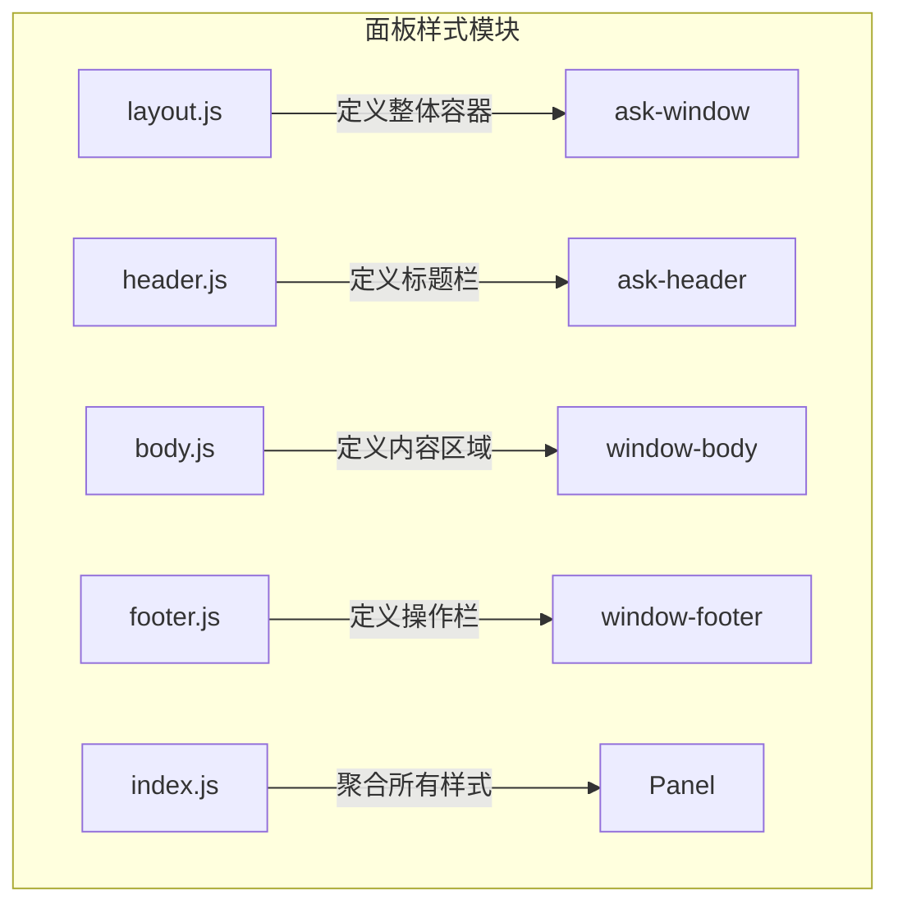
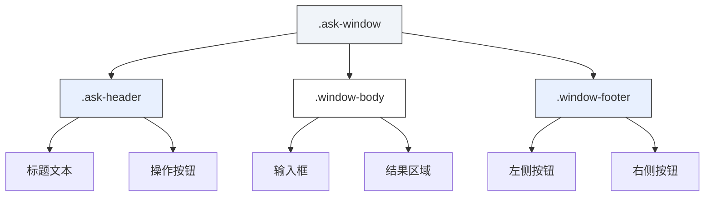
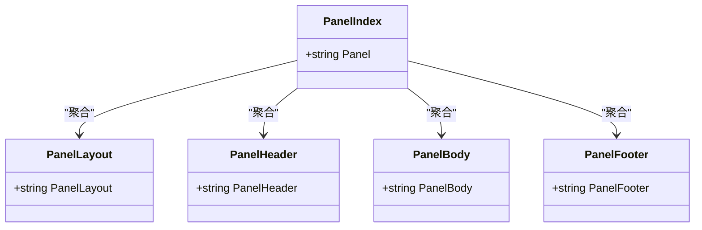
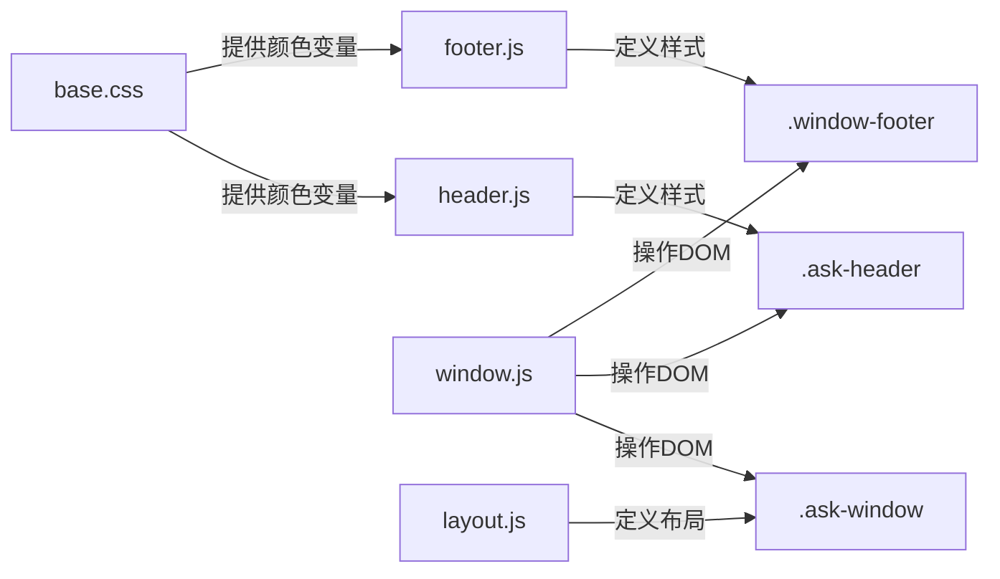

# 面板结构样式

<cite>
**本文档中引用的文件**  
- [header.js](file://content/toolbar/styles/panel/header.js)
- [body.js](file://content/toolbar/styles/panel/body.js)
- [footer.js](file://content/toolbar/styles/panel/footer.js)
- [layout.js](file://content/toolbar/styles/panel/layout.js)
- [index.js](file://content/toolbar/styles/panel/index.js)
- [base.css](file://css/base.css)
- [window.js](file://content/toolbar/view/window.js)
</cite>

## 目录
1. [项目结构](#项目结构)
2. [核心组件](#核心组件)
3. [架构概述](#架构概述)
4. [详细组件分析](#详细组件分析)
5. [依赖分析](#依赖分析)
6. [性能考虑](#性能考虑)
7. [故障排除指南](#故障排除指南)
8. [结论](#结论)

## 项目结构

面板样式模块采用模块化设计，位于 `content/toolbar/styles/panel/` 目录下，通过独立的 JavaScript 文件分别管理头部、主体、底部和布局样式，并通过聚合文件统一注入。



**Diagram sources**
- [layout.js](file://content/toolbar/styles/panel/layout.js#L4-L32)
- [header.js](file://content/toolbar/styles/panel/header.js#L6-L15)
- [body.js](file://content/toolbar/styles/panel/body.js#L6-L15)
- [footer.js](file://content/toolbar/styles/panel/footer.js#L6-L15)
- [index.js](file://content/toolbar/styles/panel/index.js#L6-L9)

**Section sources**
- [layout.js](file://content/toolbar/styles/panel/layout.js)
- [header.js](file://content/toolbar/styles/panel/header.js)
- [body.js](file://content/toolbar/styles/panel/body.js)
- [footer.js](file://content/toolbar/styles/panel/footer.js)
- [index.js](file://content/toolbar/styles/panel/index.js)

## 核心组件

面板的样式设计由四个核心文件构成：`header.js` 负责标题栏的布局与交互，`body.js` 管理内容区域的滚动与内边距，`footer.js` 控制操作按钮的对齐与状态，`layout.js` 定义了整个面板的弹性布局与空间约束。这些模块通过 `index.js` 进行聚合，确保样式的一致性。

**Section sources**
- [header.js](file://content/toolbar/styles/panel/header.js)
- [body.js](file://content/toolbar/styles/panel/body.js)
- [footer.js](file://content/toolbar/styles/panel/footer.js)
- [layout.js](file://content/toolbar/styles/panel/layout.js)
- [index.js](file://content/toolbar/styles/panel/index.js)

## 架构概述

面板采用基于 Flexbox 的弹性布局架构，`layout.js` 中的 `.ask-window` 容器作为根元素，通过 `flex-direction: column` 将其子组件（头部、主体、底部）垂直堆叠。各部分通过 `flex-shrink: 0` 固定头部和底部高度，主体部分使用 `flex: 1` 占据剩余所有空间，实现动态内容加载时的自适应布局。



**Diagram sources**
- [layout.js](file://content/toolbar/styles/panel/layout.js#L5-L23)
- [header.js](file://content/toolbar/styles/panel/header.js#L6-L15)
- [body.js](file://content/toolbar/styles/panel/body.js#L6-L15)
- [footer.js](file://content/toolbar/styles/panel/footer.js#L6-L15)

## 详细组件分析

### 头部样式分析

`header.js` 文件定义了面板的标题栏。`.ask-header` 类使用 Flexbox 布局，`justify-content: space-between` 实现标题与操作按钮的左右分离，`align-items: center` 确保垂直居中。`padding: 8px 16px` 提供了适当的内边距。`.window-title` 定义了标题的字体样式，而 `.header-actions` 则通过 `gap: 8px` 为内部按钮提供间距。在移动端（`max-width: 600px`），光标样式被禁用以优化触摸体验。

**Section sources**
- [header.js](file://content/toolbar/styles/panel/header.js)

### 主体样式分析

`body.js` 文件管理面板的内容区域。`.window-body` 的核心是 `flex: 1`，使其能填充父容器的剩余空间。`overflow: hidden` 结合内部 `.result-area` 的 `overflow-y: auto`，实现了内容区域的独立滚动。`padding: 8px 16px 16px 16px` 为内容提供了呼吸空间，避免与边缘紧贴。`.input-container` 和 `.context-preview` 组件通过 `flex-shrink: 0` 防止在空间不足时被压缩，保证了输入体验的稳定性。

**Section sources**
- [body.js](file://content/toolbar/styles/panel/body.js)

### 底部样式分析

`footer.js` 文件负责操作栏的样式。`.window-footer` 同样使用 `flex-shrink: 0` 固定高度（`min-height: 48px`），并默认将内容居中对齐（`justify-content: center`）。`.footer-actions` 容器则通过 `justify-content: space-between` 将左右两组按钮分开。`.footer-btn` 提供了基础按钮样式，而 `.stop-pill-btn` 则是用于“停止”操作的特殊胶囊按钮，具有圆角和阴影，增强视觉反馈。按钮组通过 `gap: 8px` 保持间距。

**Section sources**
- [footer.js](file://content/toolbar/styles/panel/footer.js)

### 布局系统分析

`layout.js` 是整个面板的布局核心。`.ask-window` 使用 `position: fixed` 将其固定在视口，`resize: both` 允许用户拖拽调整大小。其 `flex-direction: column` 建立了垂直的主轴。通过 `max-width: 90vw` 和 `max-height: 90vh` 确保面板不会超出视口。`box-shadow` 和 `border-radius` 提供了现代的视觉外观。该文件还定义了独特的停靠（Docking）机制，当面板被拖拽至屏幕边缘时，会自动吸附并隐藏大部分边框，仅保留一个指示条。

```mermaid
flowchart TD
Start[面板初始化] --> A[应用基础布局]
A --> B[设置flex-direction: column]
B --> C[头部: flex-shrink: 0]
C --> D[主体: flex: 1 (填充剩余空间)]
D --> E[底部: flex-shrink: 0]
E --> F[内容区域独立滚动]
F --> End[完成]
```

**Diagram sources**
- [layout.js](file://content/toolbar/styles/panel/layout.js#L5-L23)

**Section sources**
- [layout.js](file://content/toolbar/styles/panel/layout.js)

### 样式聚合机制

`index.js` 文件是样式模块化的关键。它不定义具体样式，而是将 `PanelLayout`、`PanelHeader`、`PanelBody` 和 `PanelFooter` 四个模块的 CSS 字符串拼接起来，最终赋值给 `window.GeminiStyles.Panel`。这种设计实现了关注点分离，同时确保了所有样式能作为一个整体被注入到页面中，保证了动态内容加载时的样式一致性。



**Diagram sources**
- [index.js](file://content/toolbar/styles/panel/index.js#L6-L9)

**Section sources**
- [index.js](file://content/toolbar/styles/panel/index.js)

## 依赖分析

面板样式模块依赖于全局的 CSS 变量和基础样式。`base.css` 文件定义了 `:root` 中的颜色变量（如 `--primary: #0b57d0`），这些变量被 `header.js`、`footer.js` 等文件中的具体颜色值所引用，确保了主题的一致性。`window.js` 文件中的视图控制器直接操作由这些 CSS 类定义的 DOM 元素，实现了样式与行为的紧密结合。



**Diagram sources**
- [base.css](file://css/base.css#L2-L90)
- [window.js](file://content/toolbar/view/window.js)

**Section sources**
- [base.css](file://css/base.css)
- [window.js](file://content/toolbar/view/window.js)

## 性能考虑

该样式系统在性能上表现良好。所有样式均通过 JavaScript 字符串一次性注入，减少了 HTTP 请求。Flexbox 布局是现代浏览器高度优化的特性，渲染效率高。`overflow: hidden` 在 `.window-body` 上的使用，有助于浏览器优化滚动区域的渲染。停靠（Docking）效果通过 CSS `transform` 和 `transition` 实现，利用了硬件加速，保证了动画的流畅性。

## 故障排除指南

如果面板样式未正确应用，请检查以下几点：
1.  确认 `window.GeminiStyles.Panel` 是否已正确生成，可通过浏览器控制台检查 `window.GeminiStyles` 对象。
2.  检查 `index.js` 是否已执行，确保所有子模块的样式字符串已被加载。
3.  验证 DOM 元素的 class 名称是否与 CSS 定义完全匹配（如 `.ask-window`, `.ask-header`）。
4.  查看是否有其他全局 CSS 规则覆盖了面板的样式。

**Section sources**
- [index.js](file://content/toolbar/styles/panel/index.js)
- [layout.js](file://content/toolbar/styles/panel/layout.js)

## 结论

该面板的样式设计体现了模块化、响应式和高性能的特点。通过将布局、头部、主体和底部分离到独立文件，实现了高内聚低耦合。利用 Flexbox 弹性布局，轻松协调了各部分的空间分配。`index.js` 的聚合模式确保了样式的统一注入。整体设计不仅美观，而且在不同设备和交互场景下（如调整大小、停靠）都能提供流畅的用户体验。